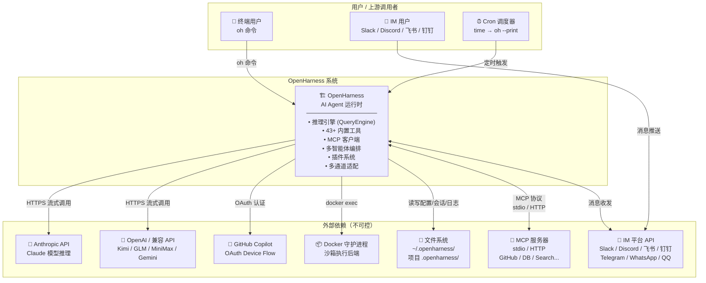
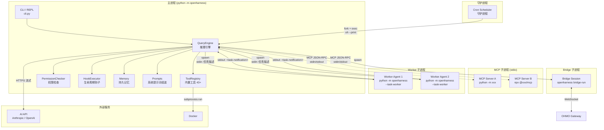
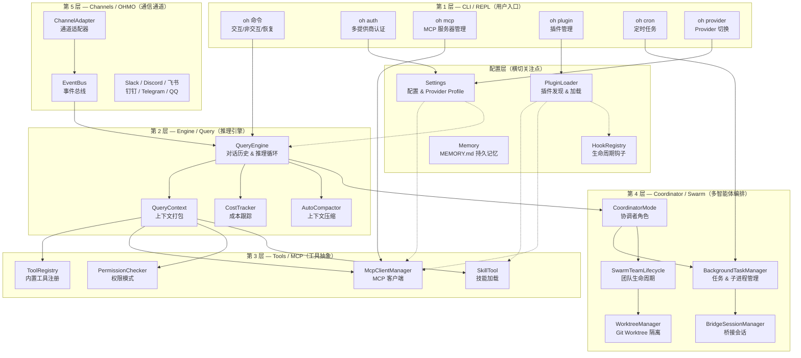
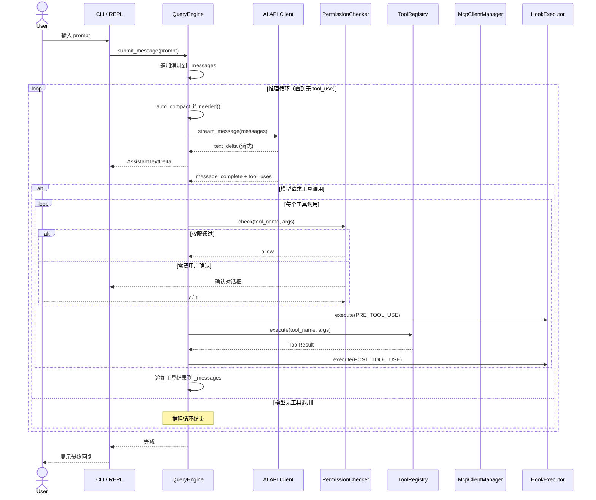
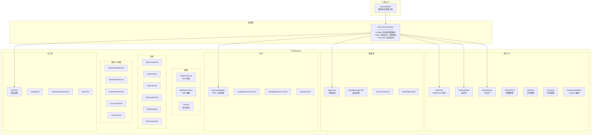
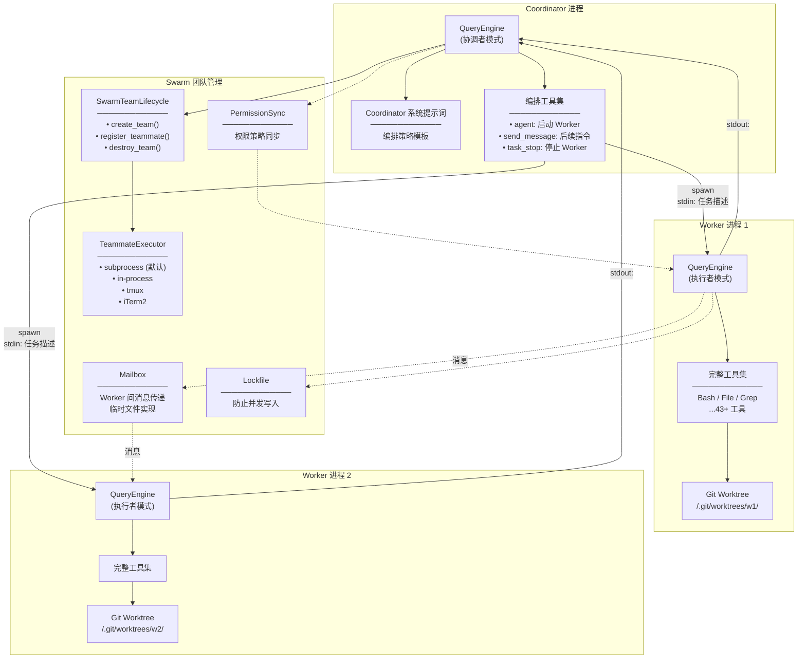
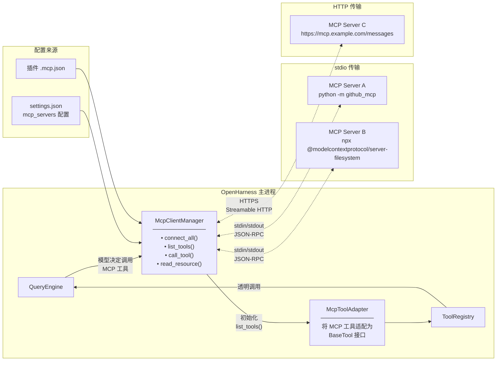
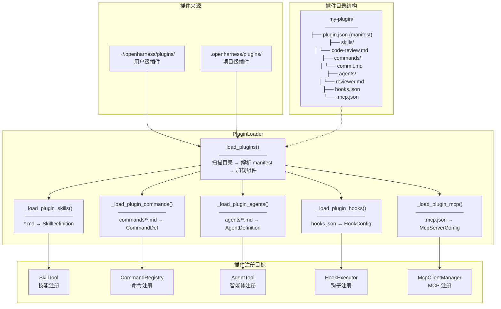
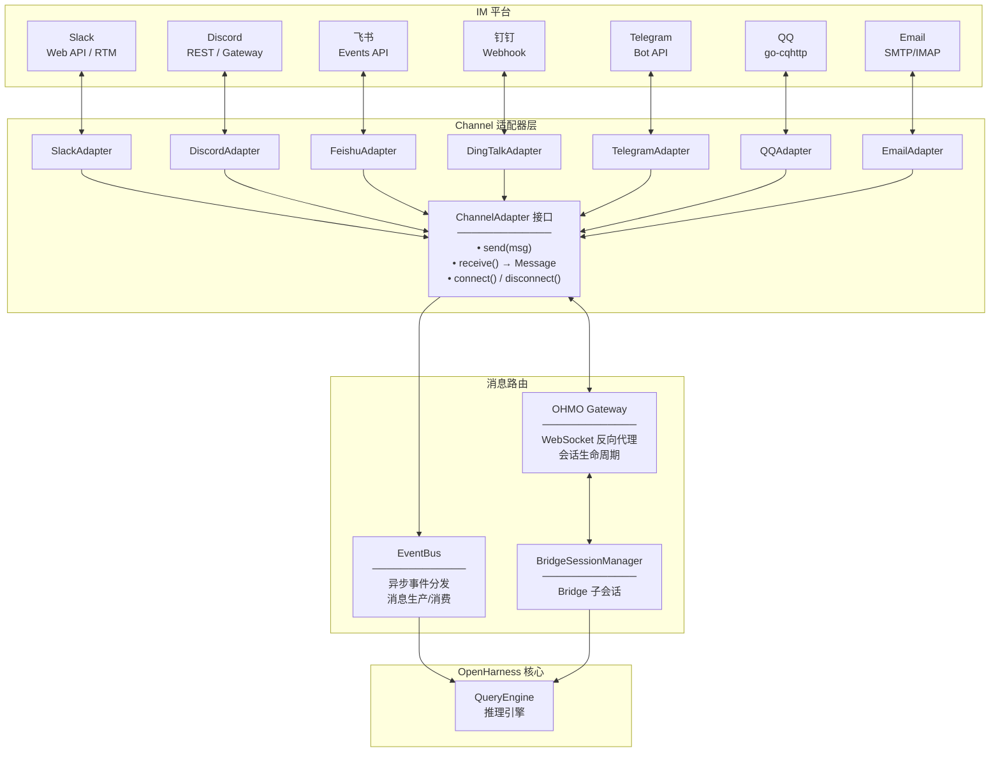
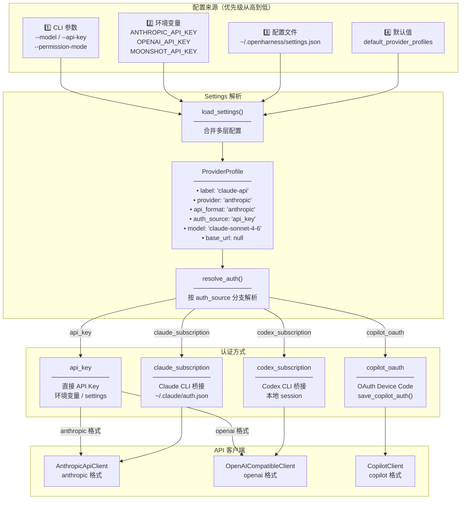

# OpenHarness 架构图集

## 1. 系统上下文图（C4 Level 1）

展示 OpenHarness 在运行时与外部系统的边界和交互关系。

---

## 2. 容器/进程视图（C4 Level 2）

展示 OpenHarness 运行时的进程边界与通信方式。

---

## 3. 五层逻辑架构图

展示 OpenHarness 从用户触达到外部系统的五层逻辑分层。

---

## 4. 核心推理循环时序图

展示用户输入到最终输出的完整调用链路。

---

## 5. 工具体系架构图

展示 43+ 内置工具的分类与注册机制。

---

## 6. 多智能体编排架构图

展示 Coordinator → Worker → Swarm 的多智能体编排机制。

---

## 7. MCP 集成架构图

展示 MCP 客户端如何发现和调用外部 MCP 工具。

---

## 8. 插件系统架构图

展示插件的发现、加载与注册机制。

---

## 9. 通道/OHMO 集成架构图

展示多 IM 平台的接入与消息路由机制。

---

## 10. 配置 & 认证流程图

展示 Settings 的多层优先级与 Provider 认证解析。

