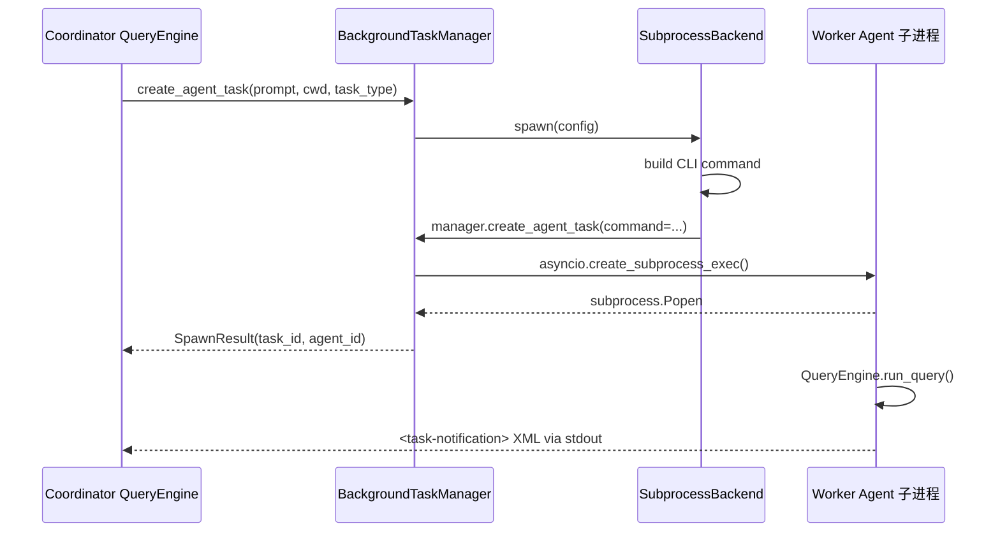

# 容器视图

## 摘要

OpenHarness 在运行时涉及多个操作系统进程：主 CLI 进程、MCP 服务器子进程、Worker Agent 子进程、Bridge Session 子进程、Cron Scheduler 守护进程，以及可选的 Docker 沙箱容器。本文档详细描述这些进程之间的边界关系、进程间通信方式，以及进程生命周期的管理机制。

## 你将了解

- OpenHarness 的主进程与子进程边界
- Bridge Session 的会话管理机制
- Swarm 中 Teammate 的 spawn 流程
- MCP 服务器的 stdio 子进程管理
- Cron Scheduler 守护进程的进程模型
- 各进程之间的通信方式

## 范围

本文档涵盖 OpenHarness 主进程在典型使用场景下启动的所有子进程类型，包括后台守护进程。Docker 容器作为可选的沙箱后端也纳入讨论范围。

---

## 进程边界概览

```
┌──────────────────────────────────────────────────────────────────┐
│  宿主机（macOS / Linux）                                          │
│                                                                   │
│  ┌────────────────────────────────────────────────────────────┐   │
│  │  进程 1：OpenHarness 主进程（oh）                           │   │
│  │  python -m openharness [--task-worker]                     │   │
│  │                                                            │   │
│  │  子模块：                                                   │   │
│  │  - QueryEngine（主推理循环）                                 │   │
│  │  - McpClientManager（管理多个 MCP Session）                  │   │
│  │  - BackgroundTaskManager（管理 agent/shell 任务）            │   │
│  │  - BridgeSessionManager（管理 Bridge 子进程）                │   │
│  │  - CoordinatorMode（协调者角色状态）                         │   │
│  │  - Swarm TeamLifecycle（团队状态）                           │   │
│  └──────────────┬───────────────────┬────────────────────────┘   │
│                 │                    │                              │
│     ┌───────────┼───────────┐   ┌───┴────────────────┐            │
│     │           │           │   │                    │            │
│  ┌──▼──┐  ┌───▼───┐  ┌───▼──┐ │ ┌────▼────┐  ┌──────▼─────┐      │
│  │MCP  │  │Worker │  │Bridge│ │ │ Cron    │  │ Docker     │      │
│  │svr  │  │Agent  │  │Runner│ │ │Scheduler│  │ Container  │      │
│  │子进程│  │子进程  │  │子进程 │ │ │守护进程  │  │（可选沙箱） │      │
│  └──┬──┘  └───┬───┘  └──┬───┘ │ └────┬────┘  └──────┬─────┘      │
│     │         │          │     │      │              │            │
│  stdio  stdin/stdout  pipe  │  fork   │        docker API        │
│  JSON-RPC                   │ Daemon   │                        │
│                              │          │                        │
│                         BridgeManager                     │
│                                                                    │
└──────────────────────────────────────────────────────────────────┘
```

---

## 主进程与子进程关系

### OpenHarness 主进程

主进程由 `cli.py` 的 `main()` 函数启动，根据调用参数进入不同的工作模式：

- **REPL 模式**（`run_repl`）：启动交互式终端会话，`QueryEngine` 在主事件循环中持续接收用户输入
- **Print 模式**（`run_print_mode`）：单次推理调用后退出，进程生命周期短
- **Task Worker 模式**（`--task-worker`）：作为 Swarm Worker 运行，从 stdin 读取任务描述，输出 `<task-notification>` 后退出
- **Bridge 子进程**（`bridge-run` 子命令）：由 `BridgeSessionManager` spawn，充当 OHMO Gateway 与主引擎之间的管道

主进程的关键模块以协程（`async def`）形式运行在 Python 的 `asyncio` 事件循环中，但不跨进程共享。

**代码证据：** `src/openharness/cli.py` → `main()` — 根据 `print_mode`、`task_worker`、`ctx.invoked_subcommand` 分发到不同执行路径。

### 进程继承关系

```
PID=1  oh 主进程（用户直接启动）
  ├─ MCP 服务器子进程（多个，由 McpClientManager 管理）
  │    stdio JSON-RPC
  ├─ Worker Agent 子进程（由 Coordinator spawn，数量 = n 个 Worker）
  │    stdin/stdout 消息传递
  ├─ Bridge Session 子进程（由 BridgeSessionManager spawn，数量 = n 个 Bridge）
  │    pipe + 文件
  └─ Cron Scheduler 守护进程（由 `oh cron start` fork，数量 ≤ 1）
       ├─ Cron Worker 子进程（定时 spawn，数量 = n 个 cron job）
```

---

## Bridge Session 管理

### 架构

`BridgeSessionManager`（`src/openharness/bridge/manager.py`）是主进程中管理 Bridge 子会话的模块。每个 Bridge Session 对应一个子进程，运行 `openharness bridge-run` 命令，将 OHMO Gateway 的 WebSocket 消息转发给 OpenHarness 引擎：

```
OHMO Gateway（WebSocket）
  ↕ WebSocket
BridgeSessionRunner 子进程（openharness bridge-run）
  ↕ stdin/stdout pipe
BridgeSessionManager（主进程）
  ↕
QueryEngine（主进程）
```

### Spawn 流程

1. OHMO Gateway 发起 Bridge Session 创建请求
2. `BridgeSessionManager.spawn(session_id, command, cwd)` 被调用
3. `spawn_session(session_id, command, cwd)` 创建子进程：
   - 通过 `asyncio.create_subprocess_exec` 启动 `openharness bridge-run --session-id <id>`
   - 设置 `stdin=PIPE`、`stdout=PIPE`、`stderr=STDOUT`
4. 子进程的 stdout/stderr 通过 `asyncio.create_task` 异步复制到 `~/.openharness/data/bridge/<session_id>.log`
5. `SessionHandle`（包含进程引用和元数据）存入 `BridgeSessionManager._sessions`

**代码证据：** `src/openharness/bridge/manager.py` → `BridgeSessionManager.spawn`：

```python
async def spawn(self, *, session_id: str, command: str, cwd: str | Path) -> SessionHandle:
    handle = await spawn_session(session_id=session_id, command=command, cwd=cwd)
    self._sessions[session_id] = handle
    output_path = output_dir / f"{session_id}.log"
    self._copy_tasks[session_id] = asyncio.create_task(self._copy_output(session_id, handle))
    return handle
```

### 输出捕获

每个 Bridge Session 的输出被实时写入日志文件（`~/.openharness/data/bridge/<session_id>.log`），主进程可以通过 `BridgeSessionManager.read_output(session_id)` 读取最近 12KB 的输出内容。这使得 Bridge Session 的行为对调试和监控完全透明。

### Session 生命周期

- **Running**：进程 `returncode is None`
- **Completed**：进程以 `returncode == 0` 退出
- **Failed**：进程以非零 `returncode` 退出

`list_sessions()` 返回所有 Bridge Session 的快照（`BridgeSessionRecord`），包括 `session_id`、`command`、`pid`、`status`、`started_at`。

---

## Swarm 子进程管理

### Teammate Spawn 流程

Swarm 中的每个 Teammate 由 `SubprocessBackend`（`src/openharness/swarm/subprocess_backend.py`）通过 `BackgroundTaskManager` 启动：



### 命令行构建

Worker 的启动命令通过 `get_teammate_command()` 和 `build_inherited_cli_flags()` 构建：

```python
# 推断 teammate 使用的可执行文件
teammate_cmd = get_teammate_command()  # sys.executable 或 'oh'

# 构建继承的 CLI 参数（model、plan_mode 等）
flags = build_inherited_cli_flags(model=config.model, plan_mode_required=config.plan_mode_required)

# 构建继承的环境变量（API_KEY、OPENHARNESS_BASE_URL 等）
extra_env = build_inherited_env_vars()

# 最终命令
command = f"ANTHROPIC_API_KEY='...' MOONSHOT_API_KEY='...' python -m openharness --task-worker --model sonnet"
```

**代码证据：** `src/openharness/swarm/subprocess_backend.py` → `SubprocessBackend.spawn` — 完整的命令行构建逻辑。

### TeammateExecutor 后端类型

`TeammateExecutor` 协议定义了四种执行后端：

| 后端 | 可用性 | 进程模型 | 可视化 | 代码证据 |
|------|--------|---------|--------|---------|
| `subprocess` | 始终可用 | 每个 Teammate 一个子进程 | 无 | `SubprocessBackend` |
| `in_process` | 始终可用 | 在主进程协程中运行 | 无 | `InProcessBackend` |
| `tmux` | 仅在 tmux 环境中可用 | 每个 Teammate 一个 tmux pane | tmux pane | `TmuxBackend` |
| `iterm2` | 仅在 iTerm2 环境中可用 | 每个 Teammate 一个 iTerm2 tab/split | iTerm2 splits | `ITerm2Backend` |

`PaneBackend` 协议（tmux / iTerm2）还支持 pane 边框颜色设置（`set_pane_border_color`）、标题设置（`set_pane_title`）和动态重平衡（`rebalance_panes`），实现了 Swarm 的多窗口可视化。

### 进程间通信（IPC）

**Worker → Coordinator**：Worker 通过 stdout 输出结构化的 `<task-notification>` XML 文本。Coordinator 使用正则表达式（`parse_task_notification`）解析 XML，提取 `task_id`、`status`、`summary`、`result`、`usage` 字段。

**Coordinator → Worker**：Coordinator 通过 `BackgroundTaskManager.write_to_task(task_id, message)` 向 Worker 的 stdin 写入文本消息。Worker 在 `--task-worker` 模式下监听 stdin，按行读取指令。

**断线重连**：如果 Worker 进程异常退出（例如被操作系统杀死），`BackgroundTaskManager._watch_process` 检测到 `process.wait()` 返回后，会将任务状态标记为 `failed`。Coordinator 可以通过再次调用 `agent` 工具启动新的 Worker 来重试。

**自动重启**：`BackgroundTaskManager._restart_agent_task` 支持对 Agent 类型的任务进行自动重启。当 `write_to_task` 发现 stdin pipe 已断开（`BrokenPipeError` / `ConnectionResetError`）且任务类型为 `local_agent` / `remote_agent` / `in_process_teammate` 时，会自动重新 spawn 一个新进程并重发之前的输入。

### Mailbox 和 Lockfile

Swarm Team 成员之间通过命名临时文件（Mailbox）传递消息，通过 lockfile 防止并发写入：

- **Mailbox**（`src/openharness/swarm/mailbox.py`）：每个 Teammate 有自己的 mailbox 文件（`~/.openharness/data/swarm/<team>/<agent_id>.mb`），Coordinator 通过向目标 Agent 的 mailbox 写入消息来触发后续任务
- **Lockfile**（`src/openharness/swarm/lockfile.py`）：在 mailbox 文件写入时使用 `fcntl.flock`（Unix）或 `msvcrt.locking`（Windows）实现排他锁，确保并发写入不会破坏消息完整性

### Worktree 隔离

每个 Teammate 可以通过 `WorktreeManager` 分配独立的 Git Worktree，实现文件系统级隔离：

- Worktree 路径：`~/.git/worktrees/<teammate_name>/` 或项目内的 `.openharness/worktrees/<teammate_name>/`
- 每个 Teammate 在自己的 Worktree 中执行文件操作，避免与其他 Teammate 的修改冲突
- `WorktreeManager` 在 spawn 前调用 `git worktree add`，在 Teammate 退出后调用 `git worktree prune` 清理孤立 Worktree

**代码证据：** `src/openharness/swarm/worktree.py` → `WorktreeManager.allocate_worktree`。

---

## MCP 服务器进程

### stdio 子进程模型

每个 MCP 服务器作为独立子进程运行，通过 stdio 进行 JSON-RPC 通信：

```
McpClientManager（主进程）
  ↕ AsyncExitStack 管理生命周期
    ↕ stdio_client（asyncio 流）
      ↕ stdin / stdout
        MCP 服务器子进程（python -m <server> / 其他可执行文件）
```

**启动参数：** `StdioServerParameters(command, args, env, cwd)` — MCP 服务器的命令、参数、环境变量和工作目录均可通过 MCP 配置指定。

**生命周期管理：** `AsyncExitStack` 确保 MCP 服务器子进程在以下情况下被正确关闭：

1. OpenHarness 会话正常退出（`McpClientManager.close()`）
2. MCP 服务器抛出异常（`_connect_stdio` 的异常处理分支）
3. OpenHarness 收到 SIGTERM / SIGINT

**代码证据：** `src/openharness/mcp/client.py` → `McpClientManager._connect_stdio`：

```python
async def _connect_stdio(self, name: str, config: McpStdioServerConfig) -> None:
    stack = AsyncExitStack()
    try:
        read_stream, write_stream = await stack.enter_async_context(
            stdio_client(StdioServerParameters(
                command=config.command,
                args=config.args,
                env=config.env,
                cwd=config.cwd,
            ))
        )
        await self._register_connected_session(name, config, stack, ...)
    except Exception as exc:
        await stack.aclose()
        self._statuses[name] = McpConnectionStatus(state="failed", detail=str(exc))
```

### HTTP Streamable 模式

对于远程 MCP 服务器，`McpClientManager` 使用 `streamable_http_client` 建立长连接：

```python
http_client = await stack.enter_async_context(httpx.AsyncClient(headers=config.headers or None))
read_stream, write_stream, _get_session_id = await stack.enter_async_context(
    streamable_http_client(config.url, http_client=http_client)
)
```

HTTP 模式的优势是无需在宿主机上安装 MCP 服务器二进制文件，适合云端部署的 MCP 服务。

### 工具和资源发现

在 MCP 服务器连接后，`McpClientManager._register_connected_session` 执行以下发现步骤：

1. 调用 `session.initialize()` 初始化会话
2. 调用 `session.list_tools()` 获取工具列表，转换为 `McpToolInfo`
3. 调用 `session.list_resources()` 获取资源列表，转换为 `McpResourceInfo`
4. 将工具和资源注册到 `McpConnectionStatus`，对 `QueryEngine` 透明

---

## Cron Scheduler 守护进程

### 进程模型

`oh cron start` 使用 `os.fork()` 将调度器脱离终端，成为后台守护进程：

```
主进程（用户终端）
  → os.fork()
    ├─ 子进程：Cron Scheduler 守护进程（继续运行）
    └─ 父进程：立即退出（允许终端继续使用）
```

调度器通过 PID 文件（`~/.openharness/data/cron/scheduler.pid`）跟踪自身进程，允许多个 `oh cron` 子命令通过读取 PID 文件判断调度器状态。

### 定时任务执行

调度器按 cron 表达式（`*.openharness/cron/jobs.json`）定时触发任务：

- 每个任务通过 `python -m openharness --print "<prompt>"` 执行单次推理调用
- 任务执行结果写入 `~/.openharness/data/cron/history/<job_name>_<timestamp>.json`
- 调度器日志写入 `~/.openharness/data/cron/cron_scheduler.log`

### 进程间状态

Cron Scheduler 作为独立进程运行，与 OpenHarness 主进程完全解耦。这意味着：

- 主会话退出不会影响调度器的定时触发
- 调度器无法直接访问主会话的 `QueryEngine` 状态，每次触发都是独立的 `--print` 调用
- 如果 API 凭据在主会话中被刷新（`oh auth login`），调度器在下一次任务触发时会自动使用更新后的凭据

---

## 进程间通信方式汇总

| 通信路径 | 通信方式 | 数据格式 | 代码证据 |
|---------|---------|---------|---------|
| 主进程 ↔ Worker | stdin/stdout pipe | 文本行（`<task-notification>` XML / 指令） | `BackgroundTaskManager.write_to_task` |
| 主进程 ↔ MCP 服务器（stdio） | stdin/stdout pipe | JSON-RPC | `McpClientManager._connect_stdio` |
| 主进程 ↔ MCP 服务器（HTTP） | HTTP WebSocket | JSON-RPC | `McpClientManager._connect_http` |
| 主进程 ↔ Bridge Session | stdin/stdout pipe | 文本消息 | `BridgeSessionManager.spawn` |
| 主进程 ↔ Cron Scheduler | 文件系统 | JSON 配置文件 + PID 文件 | `cron_scheduler.py` |
| Cron Scheduler → 定时任务 | 进程 spawn | `python -m openharness --print` | `cron_scheduler.py` |
| Coordinator ↔ Teammate Mailbox | 文件系统 | 文本消息文件 | `Mailbox.write` |
| Coordinator ↔ Teammate Lockfile | 文件系统 | `fcntl.flock` | `Lockfile.acquire` |
| Teammate ↔ Teammate | 文件系统 Mailbox | 文本消息 | `Mailbox` |

---

## Docker 沙箱容器（可选）

当使用 Docker 作为沙箱后端时，主进程通过 `sandbox-runtime` CLI 工具与 Docker 守护进程通信：

```
QueryEngine（工具调用：Bash / 文件读写）
  → ToolExecutor
    → SandboxRuntime（python sandbox-runtime ...）
      → Docker API（docker run / exec / logs）
        → 容器内的隔离进程
```

**隔离能力：**
- 容器使用 `openharness-sandbox:latest` 镜像（可配置 `DockerSandboxSettings.image`）
- 网络限制通过 `--network` 参数和 `allowed_domains` / `denied_domains` 规则实现
- 文件系统限制通过 Docker volume mount 和 `--read-only` 标志实现
- 资源限制通过 `--memory`、`--cpus` 标志实现

**代码证据：** `src/openharness/config/settings.py` → `DockerSandboxSettings`（`image`、`cpu_limit`、`memory_limit`、`extra_mounts`、`extra_env`）。
