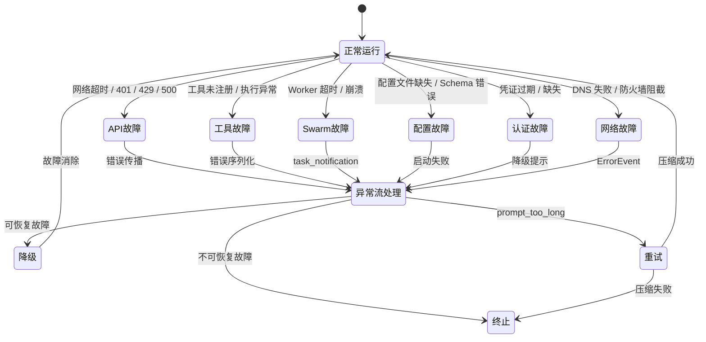
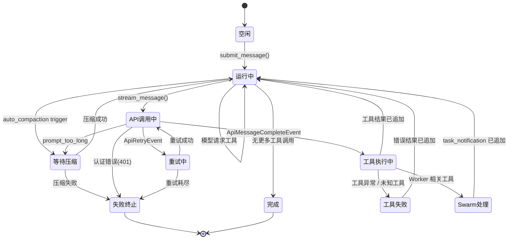

# 失败模型

## 摘要

OpenHarness 在运行时面临多种类型的故障——从上游 API 的临时不可用到工具执行错误、从沙箱容器崩溃到认证过期。本页系统性地分析各类失败的发生条件、传播路径、降级策略与恢复动作，帮助开发者理解系统在故障下的行为边界。

## 你将了解

- 六大故障类型的分类与特征
- 每类故障的触发条件、传播路径、降级策略与恢复动作
- 故障如何在各层之间传播
- 当关键组件不可用时的降级策略
- 两条异常流的逐跳解析
- 系统整体的风险敞口

## 范围

本文档覆盖 OpenHarness 核心引擎层、API 客户端层、工具执行层、MCP 集成层和沙箱层。不覆盖上游 API 提供商（Anthropic 等）的内部故障处理机制。

---

## 故障分类总览



**图后解释**：状态图展示了六类故障的触发来源及其在系统中的处理路径。核心决策点是"可恢复 vs. 不可恢复"——API 的重试类错误和压缩类错误可恢复，认证失败和配置错误通常不可恢复，工具/沙箱错误部分可恢复。

---

## 1. API 故障

### 触发条件

- **网络超时**：HTTP 请求未在配置时间内收到响应
- **401 / 403**：凭证无效或权限不足
- **429 Too Many Requests**：API 速率限制
- **500 / 502 / 503**：上游服务器错误
- **上下文窗口超限**：`prompt too long` 系列错误

### 传播路径

```
上游 API
  ↓ HTTP 错误响应或超时
ApiClient.stream_message() (抛出异常或返回 ApiRetryEvent)
  ↓
run_query() 第 470-508 行捕获异常
  ↓
ErrorEvent / StatusEvent 发射
  ↓
若为 prompt_too_long：触发响应式压缩 → 重试
否则：返回给上层 → TUI 显示错误
```

### 降级策略

| 错误类型 | 降级策略 | 效果 |
|---------|---------|------|
| 429 速率限制 | `ApiRetryEvent` 内部后退等待 | 自动重试，最多重试 N 次 |
| 500/502/503 | 同上重试策略 | 自动重试 |
| 401/403 | 返回 `ErrorEvent`，不重试 | 提示用户检查凭证 |
| 网络超时 | `ApiRetryEvent` | 自动重试 |
| prompt_too_long | 响应式压缩（`reactive_compaction`） | LLM 压缩历史后重试 |

### 恢复动作

- **自动重试**：API 客户端内置重试逻辑，通过 `ApiRetryEvent` 通知上层
- **压缩重试**：第 496-503 行，当检测到 `prompt too long` 时强制执行完整压缩
- **凭证刷新**：用户手动更新认证配置后重新执行

### 证据引用

`src/openharness/engine/query.py` -> API 异常捕获 (第 494-508 行)
`src/openharness/engine/query.py` -> `_is_prompt_too_long_error` (第 54-67 行)
`src/openharness/engine/query.py` -> `ApiRetryEvent` 处理 (第 482-489 行)

---

## 2. 工具故障

### 触发条件

- **工具未注册**：`ToolRegistry.get()` 返回 `None`
- **输入验证失败**：Pydantic 模型验证异常（`tool.input_model.model_validate(tool_input)` 第 595 行）
- **执行时异常**：工具的 `execute()` 方法抛出未捕获异常
- **沙箱不可用**：Docker 容器未启动或已停止

### 传播路径

```
工具执行 _execute_tool_call() (第 565-676 行)
  ↓
工具未找到 → ToolResultBlock(is_error=True, "Unknown tool: ...")
  ↓ 输入验证失败 → ToolResultBlock(is_error=True, "Invalid input for ...")
  ↓ 执行异常 → 异常被捕获 → ToolResultBlock(is_error=True, 异常信息)
  ↓ 沙箱错误 → SandboxUnavailableError → ToolResultBlock(is_error=True, ...)
  ↓
messages.append(ConversationMessage(role="user", content=tool_results))
  ↓
下一轮 run_query() 将错误结果发给模型
  ↓
模型可选择：调整参数重试 / 报告用户 / 终止
```

### 降级策略

| 故障场景 | 降级策略 | 效果 |
|---------|---------|------|
| 工具未注册 | 返回错误信息给模型 | 模型尝试其他工具或报告用户 |
| 输入验证失败 | 返回验证错误详情 | 模型可据此调整参数重试 |
| 执行异常 | 错误序列化为 ToolResultBlock | 模型收到错误结果，决定下一步 |
| 沙箱不可用 | 检查 `sandbox.docker.auto_build_image` | 可能自动构建镜像，否则降级 |

### 恢复动作

- **工具重定向**：模型收到 "Unknown tool" 错误后可能改用其他工具
- **参数调整**：输入验证错误信息包含具体字段，模型可据此修正
- **沙箱重建**：`ensure_image_available()` 可自动构建镜像（`docker_backend.py` 第 130-137 行）

### 证据引用

`src/openharness/engine/query.py` -> `_execute_tool_call` (第 565-676 行)
`src/openharness/engine/query.py` -> 工具未找到处理 (第 586-592 行)
`src/openharness/engine/query.py` -> 输入验证异常处理 (第 594-602 行)
`src/openharness/sandbox/docker_backend.py` -> `ensure_image_available` (第 130-137 行)

---

## 3. Swarm 故障（协调者/Worker 模式）

### 触发条件

- **Worker 超时**：长时间无响应
- **Worker 崩溃**：进程异常退出
- **Worker 报告失败**：通过 `<task-notification>` XML 传递 `status="failed"`
- **Worker 被终止**：`task_stop` 被调用

### 传播路径

```
协调者模式 Coordinator Agent
  ↓ agent 工具调用 spawn worker
  ↓ worker 异步执行任务
  ↓ worker 完成或失败 → <task-notification> 消息
    [src/openharness/coordinator/coordinator_mode.py 第 108-125 行]
  ↓
<task-notification> 作为用户消息到达协调者
  [coordinator_mode.py 第 294-295 行说明]
  ↓
协调者解析 XML：parse_task_notification()
  [coordinator_mode.py 第 128-155 行]
  ↓
提取 status: completed / failed / killed
  ↓
处理策略分支：
  - failed: send_message 继续该 worker 并传递修正指令
  - killed: 评估是否需要新 worker
  - completed: 汇总结果或继续
```

### 降级策略

- **Worker 失败**：`send_message` 继续同一 worker（具有完整错误上下文）
- **Worker 崩溃**：尝试不同方法或上报用户
- **并发限制**：协调者管理 Worker 并发数量，避免资源耗尽

### 恢复动作

`coordinator_mode.py` 第 382-384 行建议：当 worker 报告失败时，使用 `send_message` 继续该 worker 并传递修正指令，而非重新启动。

### 证据引用

`src/openharness/coordinator/coordinator_mode.py` -> `format_task_notification` (第 108-125 行)
`src/openharness/coordinator/coordinator_mode.py` -> `parse_task_notification` (第 128-155 行)
`src/openharness/coordinator/coordinator_mode.py` -> `get_coordinator_tools` (第 215-217 行)
`src/openharness/coordinator/coordinator_mode.py` -> Worker 失败处理 (第 380-384 行)

---

## 4. 配置故障

### 触发条件

- **配置文件缺失**：`Settings` 初始化时找不到配置文件
- **Schema 错误**：配置项类型或值不符合 Pydantic Schema
- **无效模型名称**：指定的 `--model` 不在支持列表中
- **无效提供商**：API 提供商配置错误

### 传播路径

```
Settings 初始化
  ↓ Pydantic 验证失败
ValidationError 向上传播
  ↓
cli.py 启动时捕获
  ↓
输出友好错误信息并退出
```

### 降级策略

- **部分配置缺失**：使用默认值（如 `max_tokens=4096`、`max_turns=200`）
- **沙箱后端不可用**：`get_docker_availability()` 返回 `available=False`，降级到非沙箱执行或本地工具执行

### 证据引用

`src/openharness/sandbox/docker_backend.py` -> `get_docker_availability` (第 19-58 行)
`src/openharness/engine/query_engine.py` -> `QueryEngine.__init__` 默认值 (第 22-55 行)

---

## 5. 认证故障

### 触发条件

- **凭证缺失**：环境变量中无 `ANTHROPIC_API_KEY` 或类似变量
- **凭证过期**：API 返回 401
- **凭证格式错误**：密钥格式不符合提供商要求

### 传播路径

```
认证模块获取凭证
  ↓ 凭证缺失或无效
API 请求返回 401
  ↓
run_query() 捕获异常
  ↓
ErrorEvent(message="API error: ...")
  ↓
TUI 显示认证错误
```

### 降级策略

- 认证错误不会自动重试（避免重复无效请求）
- 提供友好的错误提示，指导用户配置凭证

### 证据引用

`src/openharness/engine/query.py` -> API 异常处理 (第 494-508 行)

---

## 6. 网络故障

### 触发条件

- **DNS 解析失败**：无法解析 API 主机名
- **连接超时**：TCP 连接超时
- **防火墙阻截**：特定端口或域名被阻止
- **代理配置错误**：HTTP(S) 代理设置不正确

### 传播路径

```
httpx / 标准库网络请求
  ↓ 连接错误
asyncio.TimeoutError / OSError
  ↓
run_query() 异常捕获 (第 504-505 行)
  ↓
ErrorEvent(message="Network error: {error_msg}")
  ↓
TUI 显示网络错误，提示检查连接
```

### 降级策略

- `ApiRetryEvent` 内部重试（若为临时网络抖动）
- 提供 `ErrorEvent` 通知用户手动检查网络

### 证据引用

`src/openharness/engine/query.py` -> 网络错误识别与处理 (第 504-505 行)

---

## 失败传播链

各层故障的上下游影响关系如下：

```
认证层 (凭证缺失/过期)
  → 影响 → API 客户端层 (所有请求返回 401)
    → 影响 → run_query (无法完成 API 调用)
      → 影响 → QueryEngine (无法推进对话)
        → 影响 → 用户体验层 (无响应)

配置层 (无效模型/沙箱配置)
  → 影响 → 工具执行层 (沙箱后端不可用)
    → 影响 → 工具执行 (SandboxUnavailableError)
      → 影响 → run_query (返回错误结果给模型)

API 层 (429/500/prompt_too_long)
  → 影响 → run_query (触发重试或压缩)
    → 若恢复成功 → 继续正常流程
    → 若压缩失败 → 终止对话，返回错误

MCP 层 (服务器连接中断)
  → 影响 → 工具执行 (McpServerNotConnectedError)
    → 影响 → run_query (工具结果标记为错误)
      → 影响 → 模型决策 (可能重试或报告用户)

Swarm 层 (Worker 失败)
  → 影响 → 协调者决策
    → send_message 继续 worker (推荐)
    → 重新 spawn 新 worker (降级)
```

---

## 降级策略总表

| 故障组件 | 降级策略 | 触发条件 | 恢复机制 |
|---------|---------|---------|---------|
| API 429/500 | 自动重试 + 后退等待 | `ApiRetryEvent` | 指数后退，最多重试 N 次 |
| API 401 | 不重试，返回错误 | 凭证无效 | 手动更新凭证 |
| prompt_too_long | 响应式压缩 | `_is_prompt_too_long_error` | 压缩后重试；若失败则终止 |
| Docker 不可用 | 降级到本地工具执行 | `get_docker_availability` | 提示安装 Docker 或手动重连 |
| MCP 连接中断 | 返回错误结果 | `McpServerNotConnectedError` | `reconnect_all()` 手动重连 |
| 工具未注册 | 返回错误给模型 | `ToolRegistry.get()` | 模型尝试其他工具 |
| 输入验证失败 | 返回验证错误 | Pydantic 异常 | 模型调整参数重试 |
| Worker 失败 | send_message 继续 | `status="failed"` | 传递修正指令继续 |
| 沙箱容器崩溃 | 重建容器 | `exec_command()` 异常 | 重启 `DockerSandboxSession` |

---

## 异常流逐跳解析

### 异常流 1：Docker 沙箱容器中途崩溃

```
用户请求执行需要沙箱保护的 bash 命令
  ↓
ToolExecutionStarted 发射
  ↓
DockerSandboxSession.exec_command() (docker_backend.py 第 193-227 行)
  ↓
容器已停止（_running=False）
  ↓
抛出 SandboxUnavailableError("Docker sandbox session is not running")
  [docker_backend.py 第 209 行]
  ↓
_execute_tool_call() 捕获异常
  ↓
返回 ToolResultBlock(is_error=True, content="Docker sandbox unavailable: ...")
  ↓
ToolExecutionCompleted 发射 (is_error=True)
  ↓
模型收到错误结果，可选择报告用户或尝试非沙箱方式
```

**降级路径**：若沙箱不可用，但工具为只读操作（如 file_read），可降级为本地执行（权限检查层允许）。

---

### 异常流 2：长对话中 prompt_too_long + 压缩也失败

```
长对话（已触发过自动压缩但仍不足）
  ↓
用户提交新请求
  ↓
run_query() turn 1: auto_compaction check → 微压缩不足
  ↓
stream_message() 发送请求
  ↓
API 返回 "prompt too long" 错误
  ↓
_is_prompt_too_long_error 返回 True
  ↓
reactive_compact_attempted = True
  ↓
_stream_compaction(trigger="reactive", force=True)
  ↓
压缩过程中：API 调用再次失败（可能因为上下文仍太长）
  [auto_compact_if_needed 内部]
  ↓
压缩失败：was_compacted = False
  ↓
continue 跳过后，不再重试
  [run_query.py 第 501-503 行]
  ↓
ErrorEvent 发射
  ↓
返回给用户：提示对话已太长，建议开启新会话
```

---

## 状态图



**图后解释**：此状态图覆盖了从 `submit_message()` 到完成的完整状态空间。关键决策节点位于"API调用中"：可走向工具执行、重试、压缩或终止。"工具执行中"的分支决定了错误是否进入对话历史（可恢复）还是直接终止（不可恢复）。

---

## 风险

### 风险 1：沙箱容器资源泄漏

**描述**：`DockerSandboxSession.stop()` 使用优雅停止（`docker stop -t 5`），若容器内进程阻塞，`stop()` 可能超时导致容器被强制杀死（`docker stop -t 3` 在 `stop_sync` 中）。但若进程完全无响应，可能留下僵尸容器占用系统资源。

**缓解**：
- `stop_sync()` 在 `atexit` 处理器中调用，保证退出时清理
- 资源限制（CPU、内存）在 `_build_run_argv()` 中设置

**证据引用**：`src/openharness/sandbox/docker_backend.py` -> `stop_sync` (第 177-191 行)

---

### 风险 2：并发工具执行中一个失败影响全部结果

**描述**：`asyncio.gather()` 在多工具并发执行时（第 548 行），即使部分工具成功、部分失败，`gather()` 仍会返回所有结果。失败的异常不会中断成功的结果，但如果某个工具的异常传播到 `gather()` 外，可能导致消息序列不一致。

**缓解**：
- `_run()` 函数内已捕获工具执行异常，返回 `ToolResultBlock`
- `gather()` 默认传播第一个异常；此处通过返回结果而非异常来避免

**证据引用**：`src/openharness/engine/query.py` -> 并发执行逻辑 (第 540-556 行)

---

### 风险 3：自动压缩不可中断导致长时间无响应

**描述**：`auto_compact_if_needed()` 调用 LLM 进行压缩，这是一个耗时操作（可能数十秒），在此期间用户界面无响应，直到 `_stream_compaction` 开始产出事件（第 446-447 行的 `progress_queue.get()` 超时 0.05 秒）。

**缓解**：
- 压缩过程通过 `CompactProgressEvent` 实时通知前端（`hooks_start`、`compact_start` 等阶段）
- 用户可通过 TUI 看到压缩进度

**证据引用**：`src/openharness/engine/stream_events.py` -> `CompactProgressEvent` (第 60-78 行)

---

### 风险 4：MCP 服务器状态与服务端不同步

**描述**：`McpClientManager._sessions` 和 `_statuses` 在内存中维护状态，若 MCP 服务器进程被外部杀死（不在 `close()` 管理范围内），客户端状态仍显示 "connected"，但实际连接已断开。`call_tool()` 会抛出异常，但原因诊断困难。

**缓解**：
- `call_tool()` 捕获异常后抛出 `McpServerNotConnectedError` 并附带 `detail`
- 建议用户使用 `reconnect_all()` 重新建立连接

**证据引用**：`src/openharness/mcp/client.py` -> `call_tool` 异常处理 (第 104-129 行)

---

### 风险 5：权限拒绝后模型陷入循环

**描述**：若用户反复拒绝权限请求，模型收到 `Permission denied` 错误结果后可能再次尝试调用相同工具，形成短循环（直到 `max_turns` 耗尽）。

**缓解**：
- `max_turns` 限制（默认 200 turn）保证不会无限循环
- `MaxTurnsExceeded` 异常在达到限制时终止循环

**证据引用**：`src/openharness/engine/query.py` -> `MaxTurnsExceeded` (第 70-75 行) 及循环终止条件 (第 560-561 行)

---

## 证据索引

1. `src/openharness/engine/query.py` -> API 异常捕获 (第 494-508 行)
2. `src/openharness/engine/query.py` -> `_is_prompt_too_long_error` (第 54-67 行)
3. `src/openharness/engine/query.py` -> `ApiRetryEvent` 处理 (第 482-489 行)
4. `src/openharness/engine/query.py` -> `_execute_tool_call` (第 565-676 行)
5. `src/openharness/engine/query.py` -> 工具未找到处理 (第 586-592 行)
6. `src/openharness/engine/query.py` -> 输入验证异常处理 (第 594-602 行)
7. `src/openharness/engine/query.py` -> `MaxTurnsExceeded` (第 70-75 行)
8. `src/openharness/engine/query.py` -> 并发执行逻辑 (第 540-556 行)
9. `src/openharness/sandbox/docker_backend.py` -> `get_docker_availability` (第 19-58 行)
10. `src/openharness/sandbox/docker_backend.py` -> `DockerSandboxSession.exec_command` (第 193-227 行)
11. `src/openharness/sandbox/docker_backend.py` -> `stop_sync` (第 177-191 行)
12. `src/openharness/mcp/client.py` -> `McpServerNotConnectedError` 及 `call_tool` (第 104-129 行)
13. `src/openharness/mcp/client.py` -> `reconnect_all` (第 61-68 行)
14. `src/openharness/coordinator/coordinator_mode.py` -> `parse_task_notification` (第 128-155 行)
15. `src/openharness/engine/stream_events.py` -> `CompactProgressEvent` (第 60-78 行)
