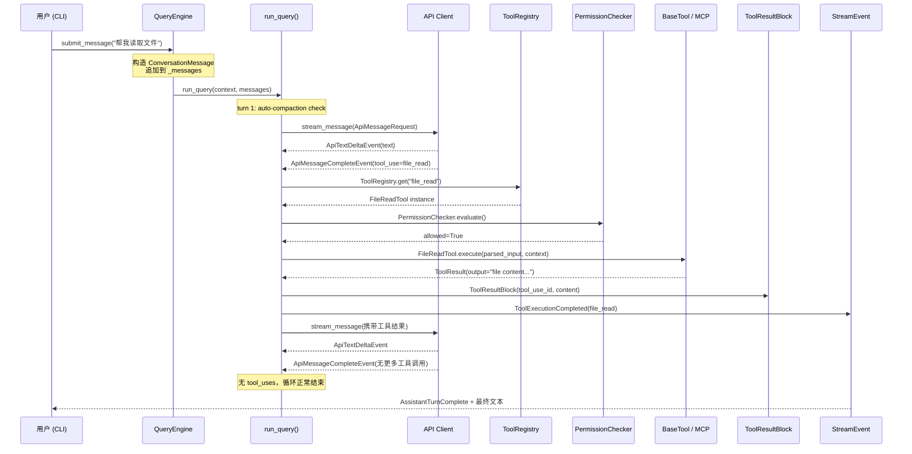

# 请求生命周期

## 摘要

本文档深入剖析 OpenHarness 处理一条用户消息的完整技术链路，从 CLI 入口经过 9 跳以上的调用最终返回结果。通过逐跳解析正常流与异常流的执行路径，帮助开发者理解系统内部的数据流向、状态变更及潜在风险点。

## 你将了解

- 用户消息从 CLI 入口到结果输出的完整调用链（9 跳以上）
- 每跳的调用点、被调用点、输入、输出、副作用、失败模式与恢复策略
- 消息序列化路径：user message → API format → API response → stream events → ToolResult
- 正常流逐跳解析
- 异常流逐跳解析
- 设计取舍分析
- 关键风险点

## 范围

本文档覆盖的调用链起点为用户通过 CLI/TUI 输入消息，终点为最终结果展示给用户。不涉及 MCP 服务器内部逻辑、沙箱容器镜像构建细节及认证凭证的获取流程。

---

## 完整调用链概览

一条用户消息在 OpenHarness 内部的完整路径如下：

```
CLI 入口 (CLI/TUI)
  ↓
cli.py (命令入口与 REPL/TUI 初始化)
  ↓
QueryEngine.submit_message() (会话管理层)
  ↓
Query Loop - run_query() (查询循环与自动压缩)
  ↓
Tool Registry - ToolRegistry.get() (工具名称查找)
  ↓
Permission Checker (权限校验)
  ↓
BaseTool.execute() / DockerSandboxSession.exec_command() (工具执行)
  ↓
结果序列化 - ToolResultBlock (结果标准化)
  ↓
Stream Event 发射 (AssistantTurnComplete 等)
  ↓
输出格式化 - TUI / CLI 输出 (终端渲染)
```

以下逐跳进行详细解析。

---

## 逐跳详解

### 第 1 跳：CLI 入口 → cli.py

**调用点**：用户在终端输入消息，CLI 进程接收。

**被调用点**：`cli.py` 中的命令处理函数（`oh run` 或交互式 REPL）。

**输入**：原始用户文本字符串，可能包含多模态内容（文本 + 图片路径）。

**输出**：将输入传递给 `QueryEngine.submit_message()` 调用。

**副作用**：
- 若为首次输入，初始化 `QueryEngine` 实例
- 初始化 `ToolRegistry`、`PermissionChecker`、`ApiClient` 等组件
- 可能触发 MCP 服务器连接（`McpClientManager.connect_all()`）

**失败模式**：
- CLI 参数解析失败（无效的 `--model` 或 `--provider` 参数）
- 配置文件加载失败（`Settings` 初始化异常）
- MCP 服务器连接失败（`connect_all()` 抛出异常，但不影响主流程继续）

**恢复策略**：
- 配置错误：输出友好提示并退出
- MCP 连接失败：降级为不包含 MCP 工具的工作状态，继续执行

**证据引用**：
`src/openharness/mcp/client.py` -> `McpClientManager.connect_all` (第 45-59 行)

---

### 第 2 跳：cli.py → QueryEngine.submit_message()

**调用点**：`cli.py` 中的 `submit_message()` 调用。

**被调用点**：`src/openharness/engine/query_engine.py` -> `QueryEngine.submit_message()` (第 147-182 行)。

**输入**：
- `prompt: str | ConversationMessage` — 用户输入文本或已构建的消息对象
- `QueryContext` — 包含 `api_client`、`tool_registry`、`permission_checker`、`cwd`、`model` 等运行时上下文

**输出**：`AsyncIterator[StreamEvent]` — 一个异步流，产出 `AssistantTextDelta`、`ToolExecutionStarted`、`ToolExecutionCompleted` 等事件。

**副作用**：
- 将用户消息追加到 `self._messages` 列表（第 156 行）
- 调用 `remember_user_goal()` 将用户目标摘要存入 `tool_metadata`（第 155 行）
- 若处于协调者模式，追加协调者上下文消息（第 174-176 行）
- 触发 `CostTracker` 记录用量（第 181 行）

**失败模式**：
- `ConversationMessage` 构建失败（无效的多模态内容）
- `QueryContext` 必要字段缺失

**恢复策略**：
- 消息构建失败：返回 `ErrorEvent`，用户看到友好错误信息

**证据引用**：
`src/openharness/engine/query_engine.py` -> `QueryEngine.submit_message` (第 147-182 行)
`src/openharness/engine/query.py` -> `remember_user_goal` (第 144-155 行)

---

### 第 3 跳：QueryEngine → run_query() — 查询循环

**调用点**：`QueryEngine.submit_message()` 内部第 177 行：`async for event, usage in run_query(context, query_messages)`。

**被调用点**：`src/openharness/engine/query.py` -> `run_query()` (第 396-562 行)。

**输入**：
- `context: QueryContext` — 包含 API 客户端、工具注册表、权限检查器、工作目录、模型配置
- `messages: list[ConversationMessage]` — 对话历史

**输出**：`AsyncIterator[tuple[StreamEvent, UsageSnapshot | None]]`

**副作用**：
- **自动压缩**（第 460-463 行）：在每个 turn 开始前检查 token 数量是否超过阈值，若超过则触发上下文压缩
- 流式文本增量输出（`AssistantTextDelta`）
- 工具调用事件发射（`ToolExecutionStarted`、`ToolExecutionCompleted`）
- 对话历史追加（`messages.append(final_message)`）

**失败模式**：
- API 调用超时或网络错误（第 504-505 行）
- 模型返回 `prompt too long` 相关错误（第 496 行），触发响应式压缩
- `max_turns` 超出限制（第 560-561 行，抛出 `MaxTurnsExceeded`）
- 流式消息不完整（第 510-511 行）

**恢复策略**：
- 网络错误：发射 `ErrorEvent` 并返回
- `prompt too long`（首次）：触发响应式压缩（`reactive_compaction`），成功后重试
- `max_turns` 超出：抛出 `MaxTurnsExceeded`，由上层处理
- API 重试（`ApiRetryEvent`）：在循环中等待并继续

**证据引用**：
`src/openharness/engine/query.py` -> `run_query` (第 396-562 行)
`src/openharness/engine/query.py` -> `_is_prompt_too_long_error` (第 54-67 行)
`src/openharness/engine/stream_events.py` -> `StreamEvent` 联合类型定义 (第 81-89 行)

---

### 第 4 跳：API 调用 — stream_message()

**调用点**：`run_query()` 内部第 470 行。

**被调用点**：`src/openharness/api/client.py` 中的 `stream_message()` 方法（`SupportsStreamingMessages` 接口）。

**输入**：`ApiMessageRequest(model, messages, system_prompt, max_tokens, tools)`

**输出**：
- `ApiTextDeltaEvent` — 文本增量片段
- `ApiRetryEvent` — 重试提示（内部重试逻辑触发）
- `ApiMessageCompleteEvent` — 最终消息与用量快照

**副作用**：
- HTTP 请求发送到上游 API 提供商
- 消费 API 额度
- 实时流式输出文本

**失败模式**：
- 网络连接失败（抛出异常，由第 504-505 行捕获）
- API 返回错误（401 未授权、429 速率限制、500 服务器错误）
- 超时

**恢复策略**：
- API 重试由 `ApiRetryEvent` 内部处理
- 连接错误：发射 `ErrorEvent`，用户可重试
- 401/403：认证故障，需重新配置凭证
- 429：等待后退策略

**证据引用**：
`src/openharness/engine/query.py` -> `stream_message` 调用 (第 470-478 行)
`src/openharness/engine/query.py` -> `ApiRetryEvent` 处理 (第 482-489 行)

---

### 第 5 跳：工具名称查找 — ToolRegistry.get()

**调用点**：`run_query()` 内部 `_execute_tool_call()` 函数第 585 行。

**被调用点**：`src/openharness/tools/base.py` -> `ToolRegistry.get()` (第 65-67 行)。

**输入**：`tool_name: str` — 模型请求的工具名称

**输出**：返回 `BaseTool | None` — 若未找到返回 None

**副作用**：
- 查找到的工具实例被用于后续的参数解析和执行

**失败模式**：
- 工具名称不在注册表中（例如模型请求了一个未注册的工具）
- 返回 None 后触发错误结果（第 586-592 行）

**恢复策略**：
- 返回 `ToolResultBlock` 内容为 "Unknown tool: {tool_name}"，`is_error=True`
- 模型收到错误结果后可调整策略

**证据引用**：
`src/openharness/tools/base.py` -> `ToolRegistry.get` (第 65-67 行)
`src/openharness/engine/query.py` -> `ToolRegistry.get` 调用 (第 585-592 行)

---

### 第 6 跳：权限校验 — PermissionChecker.evaluate()

**调用点**：`_execute_tool_call()` 第 611 行。

**被调用点**：权限检查模块中的 `evaluate()` 方法。

**输入**：
- `tool_name` — 工具名称
- `is_read_only` — 是否为只读操作
- `file_path` — 涉及的文件路径（由 `_resolve_permission_file_path()` 解析，第 679-700 行）
- `command` — 涉及的命令（由 `_extract_permission_command()` 提取，第 703-715 行）

**输出**：权限决策对象（是否允许、需要确认等）

**副作用**：
- 若需要用户确认，调用 `permission_prompt` 回调（第 618-627 行）
- 阻止未经授权的操作执行

**失败模式**：
- 用户拒绝权限请求
- 权限检查器策略规则拒绝操作
- `permission_prompt` 回调不存在且操作被阻止

**恢复策略**：
- 用户拒绝：返回 `ToolResultBlock` 内容为 "Permission denied for {tool_name}"，`is_error=True`
- 策略拒绝：返回拒绝原因给模型，模型可调整请求

**证据引用**：
`src/openharness/engine/query.py` -> `PermissionChecker.evaluate` 调用 (第 611-634 行)
`src/openharness/engine/query.py` -> `_resolve_permission_file_path` (第 679-700 行)
`src/openharness/engine/query.py` -> `_extract_permission_command` (第 703-715 行)

---

### 第 7 跳：工具执行 — BaseTool.execute() / DockerSandboxSession.exec_command()

**调用点**：`_execute_tool_call()` 第 638 行。

**被调用点**：
- 内置工具：`BaseTool.execute()` 的具体实现
- 沙箱工具：`src/openharness/sandbox/docker_backend.py` -> `DockerSandboxSession.exec_command()` (第 193-227 行)

**输入**：
- `parsed_input: BaseModel` — 经过验证的工具输入参数
- `ToolExecutionContext(cwd, metadata)` — 执行上下文

**输出**：`ToolResult(output: str, is_error: bool, metadata: dict)`

**副作用**：
- **沙箱容器**：启动 Docker 容器、执行命令、停止容器
- **文件系统**：读写项目文件
- **外部服务**：调用 MCP 工具通过网络或 stdio 与外部进程通信
- **Hook 执行**：执行 `POST_TOOL_USE` 钩子（第 665-675 行）
- **元数据记录**：将操作记录到 `tool_metadata`（`_record_tool_carryover()` 第 657-664 行），包括读取文件、工具调用、异步 agent 活动等

**失败模式**：
- **沙箱失败**：`SandboxUnavailableError`（容器未启动、Docker 不可用）
- **命令执行失败**：bash 工具返回非零退出码
- **MCP 调用失败**：`McpServerNotConnectedError`（服务器未连接或连接中断）
- **输入验证失败**：Pydantic 模型验证异常
- **超时**：命令执行时间超过配置阈值

**恢复策略**：
- MCP 连接失败：返回 "MCP server '{server_name}' is not connected: {detail}"，模型可重试
- Docker 不可用：降级到本地执行（若工具支持）
- 输入验证失败：返回验证错误详情，模型可调整参数

**证据引用**：
`src/openharness/tools/base.py` -> `BaseTool.execute` (第 37-38 行)
`src/openharness/tools/base.py` -> `ToolResult` (第 21-27 行)
`src/openharness/sandbox/docker_backend.py` -> `DockerSandboxSession.exec_command` (第 193-227 行)
`src/openharness/mcp/client.py` -> `McpClientManager.call_tool` (第 104-129 行)
`src/openharness/engine/query.py` -> `_record_tool_carryover` (第 286-394 行)

---

### 第 8 跳：结果序列化 — ToolResultBlock 构建

**调用点**：`_execute_tool_call()` 第 652-656 行。

**被调用点**：`src/openharness/engine/messages.py` -> `ToolResultBlock` (第 49-55 行)。

**输入**：`ToolResult(output, is_error, metadata)`

**输出**：`ToolResultBlock(tool_use_id, content, is_error)`

**副作用**：
- 将结果添加到对话历史（`messages.append(ConversationMessage(role="user", content=tool_results))`）
- 进入下一轮模型调用

**失败模式**：
- 空结果：`"(no output)"` 作为默认内容（`mcp/client.py` 第 128 行）

**证据引用**：
`src/openharness/engine/messages.py` -> `ToolResultBlock` (第 49-55 行)
`src/openharness/mcp/client.py` -> `call_tool` 空结果处理 (第 127-128 行)

---

### 第 9 跳：Stream Event 发射与循环继续

**调用点**：`run_query()` 第 519-558 行。

**被调用点**：多种事件类型的构建与发射。

**输出**：
- `AssistantTurnComplete(message, usage)` — 当前轮次完成（第 519 行）
- `ToolExecutionStarted(tool_name, tool_input)` — 工具开始执行（第 532/543 行）
- `ToolExecutionCompleted(tool_name, output, is_error)` — 工具执行完成（第 534-538/551-556 行）
- 最终回到第 3 跳继续循环，或若没有工具调用则结束

**副作用**：
- TUI/CLI 实时显示事件内容（文本增量、工具执行状态）
- 对话历史持续增长

**失败模式**：
- 循环达到 `max_turns` 限制：抛出 `MaxTurnsExceeded`
- 模型决定不调用工具（`not final_message.tool_uses`）→ 正常退出

**证据引用**：
`src/openharness/engine/query.py` -> `run_query` 工具循环逻辑 (第 524-558 行)
`src/openharness/engine/stream_events.py` -> 所有事件类型定义

---

### 第 10 跳：输出格式化 — TUI / CLI 输出

**调用点**：事件流被消费并渲染到终端。

**被调用点**：TUI 渲染模块或 CLI 输出格式化器。

**输入**：流式事件序列（`AssistantTextDelta`、`ToolExecutionCompleted` 等）

**输出**：用户在终端看到的格式化文本输出

**副作用**：
- 终端界面更新（打字机效果、进度显示）
- 可能触发会话持久化

---

## 消息序列化路径

用户消息在系统内的完整序列化过程如下：

```
1. 用户文本输入 (str)
      ↓
2. ConversationMessage.from_user_text() 构造
   -> TextBlock(type="text", text=用户文本)
   -> ConversationMessage(role="user", content=[TextBlock])
      [src/openharness/engine/messages.py 第 71-73 行]

3. submit_message() 将消息追加到 self._messages
   [src/openharness/engine/query_engine.py 第 156 行]

4. run_query() 将消息转换为 API 参数
   -> ConversationMessage.to_api_param()
   -> serialize_content_block() 将 TextBlock 序列化为
      {"type": "text", "text": "..."}
      [src/openharness/engine/messages.py 第 92-97 行, 第 100-128 行]

5. API 请求发送到上游
   -> messages=[..., {"role": "user", "content": [{"type": "text", "text": "..."}]}]

6. API 流式响应
   -> ApiTextDeltaEvent 文本增量
   -> assistant_message_from_api() 将 API 响应反序列化为
      ConversationMessage(role="assistant", content=[ToolUseBlock(...), ...])
      [src/openharness/engine/messages.py 第 131-148 行]

7. 工具调用结果
   -> ToolResultBlock(tool_use_id, content, is_error)
   -> 序列化为 {"type": "tool_result", "tool_use_id": "...", "content": "...", "is_error": false}

8. 下一轮 API 请求携带工具结果
   -> messages=[..., assistant_msg, {"role": "user", "content": [{"type": "tool_result", ...}]}]

9. 最终结果
   -> AssistantTurnComplete 事件
   -> StreamEvent 流传输给前端渲染
```

---

## 正常流逐跳解析

以下是一条"读取文件并搜索关键词"请求的完整正常流程：

1. **CLI 接收**：`oh run` 交互式会话，用户输入"帮我读取 src/auth/validate.ts 并搜索 null pointer"
2. **submit_message()**：构造 `ConversationMessage`，追加到 `_messages`
3. **run_query() 第 1 轮**：
   - 自动压缩检查（token 数未超阈值，跳过）
   - `stream_message()` 发送 API 请求
   - 模型响应包含 `ToolUseBlock(name="file_read", input={"file_path": "src/auth/validate.ts"})`
   - 发射 `ToolExecutionStarted`
4. **权限检查**：`file_read` 为只读操作，权限检查通过
5. **工具执行**：`FileReadTool.execute()` 读取文件内容
6. **结果序列化**：`ToolResultBlock(content=文件内容)` 追加到 `_messages`
7. **run_query() 第 2 轮**：
   - `stream_message()` 携带文件内容发送请求
   - 模型响应包含 `ToolUseBlock(name="grep", input={"pattern": "null"})`
   - 发射 `ToolExecutionStarted`
8. **权限检查 + 执行**：`grep` 只读操作，检查通过，执行
9. **结果序列化**：搜索结果追加到 `_messages`
10. **run_query() 第 3 轮**：
    - 模型不再请求工具，返回最终文本
    - 发射 `AssistantTurnComplete`
    - 无更多工具调用，正常结束
11. **TUI 渲染**：`AssistantTextDelta` 打字机效果展示最终回答

---

## 异常流逐跳解析

### 异常流 1：MCP 服务器连接中断

```
用户输入"使用 GitHub 工具搜索最新 PR"
  ↓
submit_message() -> run_query()
  ↓
模型请求 ToolUseBlock(name="github_search_repos", ...)
  ↓
ToolRegistry.get("github_search_repos") -> 找到 MCP 工具代理
  ↓
McpClientManager.call_tool("github-server", "search_repos", {...})
  ↓
session.call_tool() 抛出异常
  ↓
McpServerNotConnectedError 被捕获
  [src/openharness/mcp/client.py 第 115-118 行]
  ↓
返回 ToolResultBlock(is_error=True, content="MCP server 'github-server' call failed: connection lost")
  ↓
模型收到错误结果，可能请求重连或报告用户
```

**降级策略**：用户可执行 `mcp reconnect` 命令调用 `McpClientManager.reconnect_all()` 重新建立连接。

---

### 异常流 2：Prompt 过长触发响应式压缩

```
长对话累积到临界点，用户输入新请求
  ↓
run_query() 第 460 行 auto-compaction 检查
  ↓
auto_compact_if_needed() 返回 was_compacted = False（微压缩不足）
  ↓
stream_message() 发送请求
  ↓
API 返回 "prompt too long" 错误
  [src/openharness/engine/query.py 第 494-495 行]
  ↓
_is_prompt_too_long_error(exc) 返回 True
  ↓
reactive_compact_attempted = True，发送 StatusEvent
  [src/openharness/engine/query.py 第 496-498 行]
  ↓
_stream_compaction(trigger="reactive", force=True) 执行完整 LLM 压缩
  ↓
压缩成功，was_compacted = True
  ↓
continue 继续循环，发送压缩后的上下文
  [src/openharness/engine/query.py 第 499-503 行]
```

---

## 时序图



**图后解释**：时序图展示了第 1 跳到第 9 跳的核心交互。关键路径为：`submit_message()` → `run_query()` → `stream_message()` → 权限检查 → 工具执行 → 结果序列化 → Stream Event 发射。循环的核心控制点在 `final_message.tool_uses` 判断（第 524 行），当模型不再请求工具时循环终止。

---

## 设计取舍

### 取舍 1：同步 API 调用 vs. 流式 API 调用

**决策**：采用流式 API（`stream_message()`），逐块接收文本。

**利**：
- 用户体验：打字机效果，响应即时可见
- 工具调用可在部分文本输出后立即开始（单工具场景）
- 支持实时错误通知（`ApiRetryEvent`）

**弊**：
- 实现复杂度增加（需处理增量事件和完成事件的组合）
- 错误处理需在事件循环中而非单独的 HTTP 响应处理中

**证据引用**：`src/openharness/engine/query.py` -> 流式循环（第 469-508 行）

---

### 取舍 2：单工具串行 vs. 多工具并发

**决策**：单工具立即流式输出（第 529-539 行），多工具并发执行（第 540-556 行）。

**利**：
- 单工具场景：用户尽快看到工具开始执行
- 多工具场景：并行执行节省时间（`asyncio.gather()`）

**弊**：
- 多工具并发时，所有工具完成后才发射结果事件，用户无法看到中间状态
- 工具间存在依赖时可能浪费计算

**证据引用**：`src/openharness/engine/query.py` -> 工具并发逻辑（第 529-556 行）

---

### 取舍 3：工具元数据持久化 vs. 仅保留结果

**决策**：通过 `_record_tool_carryover()` 将工具执行细节（读取的文件路径、调用过的技能、异步 agent 活动等）记录到 `tool_metadata` 字典中，供后续 turn 使用。

**利**：
- 模型在后续轮次中可以知道之前读取过哪些文件（`read_file_state`）
- 支持"验证过的工作"追踪（`_remember_verified_work`）
- 实现 enter_plan_mode / exit_plan_mode 的上下文保持

**弊**：
- `tool_metadata` 随对话增长无限膨胀（受限于上限常量，如 `MAX_TRACKED_READ_FILES=6`）
- 大量记录影响内存占用

**证据引用**：`src/openharness/engine/query.py` -> `_record_tool_carryover` (第 286-394 行) 及各子函数

---

## 风险

### 风险 1：对话历史无限膨胀导致内存耗尽

**描述**：`self._messages` 列表随对话持续增长。每个用户消息和助手消息都追加到此列表，且工具结果内容（可能是大文件读取或命令输出）也完整存储。

**缓解**：
- `auto_compact_if_needed()` 自动压缩机制在 token 超过阈值时触发
- `_record_tool_carryover()` 通过固定上限（如 `MAX_TRACKED_READ_FILES=6`）限制元数据条目数量
- 用户可手动触发 compaction

**证据引用**：`src/openharness/engine/query.py` -> `run_query` 自动压缩检查（第 460-463 行）

---

### 风险 2：权限检查绕过的潜在安全风险

**描述**：`_resolve_permission_file_path()` 在 `raw_input` 中查找路径字段（第 684-690 行），如果工具的 `parsed_input` 属性与 `raw_input` 中的字段名不一致，可能导致权限检查使用的路径与实际执行路径不一致。

**缓解**：
- 代码同时检查 `raw_input` 和 `parsed_input` 两处来源
- 提供 `is_read_only` 标记辅助决策

**证据引用**：`src/openharness/engine/query.py` -> `_resolve_permission_file_path` (第 679-700 行)

---

### 风险 3：MCP 服务器状态不一致

**描述**：`McpClientManager._sessions` 和 `_statuses` 分别维护会话和状态，若外部进程崩溃导致 stdio 连接断开，`ClientSession` 对象仍存在于字典中，`call_tool()` 会遇到 `McpServerNotConnectedError`（第 115-118 行），但不会自动重连。

**缓解**：
- 提供 `reconnect_all()` 方法供用户手动重连
- `list_statuses()` 可以查询各服务器连接状态

**证据引用**：`src/openharness/mcp/client.py` -> `reconnect_all` (第 61-68 行)

---

## 证据索引

1. `src/openharness/engine/query.py` -> `run_query` (第 396-562 行)
2. `src/openharness/engine/query_engine.py` -> `QueryEngine.submit_message` (第 147-182 行)
3. `src/openharness/engine/query.py` -> `_execute_tool_call` (第 565-676 行)
4. `src/openharness/engine/messages.py` -> `ConversationMessage` 及 `serialize_content_block` (第 64-128 行)
5. `src/openharness/engine/messages.py` -> `assistant_message_from_api` (第 131-148 行)
6. `src/openharness/engine/stream_events.py` -> `StreamEvent` 联合类型 (第 81-89 行)
7. `src/openharness/engine/query.py` -> `_is_prompt_too_long_error` (第 54-67 行)
8. `src/openharness/tools/base.py` -> `ToolRegistry` 及 `ToolResult` (第 21-76 行)
9. `src/openharness/sandbox/docker_backend.py` -> `DockerSandboxSession.exec_command` (第 193-227 行)
10. `src/openharness/mcp/client.py` -> `McpClientManager.call_tool` (第 104-129 行)
11. `src/openharness/mcp/client.py` -> `McpClientManager.reconnect_all` (第 61-68 行)
12. `src/openharness/engine/query.py` -> `_record_tool_carryover` (第 286-394 行)
