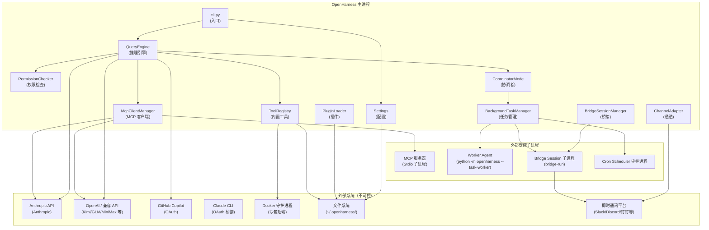

# 系统上下文

## 摘要

OpenHarness 在运行时与多个外部系统存在依赖关系和交互关系。本文档定义系统的边界，明确什么属于 OpenHarness 本身、什么属于外部依赖，并说明上游调用者和下游被调用者的角色与交互方式。

## 你将了解

- OpenHarness 的系统边界划定
- 所有外部依赖（API 提供商、Docker、文件系统等）的角色和使用方式
- 谁在调用 OpenHarness（CLI 用户、OHMO Gateway、Bridge）
- OpenHarness 在运行时调用哪些下游系统
- 关键模块在系统上下文中的位置

## 范围

本文档聚焦于 OpenHarness 主进程（`openharness` CLI）在典型使用场景下的外部交互关系，不包括 OHMO 独立 Gateway 服务的内部架构（参见 `docs/dev/ohmo/`）。

---

## 系统边界

系统边界将 OpenHarness 运行时分为三个部分：

- **内部**：OpenHarness 主进程内部运行的代码，包括所有 `src/openharness/` 下的模块
- **外部受控**：OpenHarness 直接管理的子进程和配置文件（如 MCP 服务器子进程、Worker Agent 子进程）
- **外部不可控**：OpenHarness 依赖但无法直接控制的第三方服务

```
┌────────────────────────────────────────────────────────────────┐
│  OpenHarness 内部                                                │
│  src/openharness/engine/   — 推理引擎                            │
│  src/openharness/coordinator/ — 协调者                           │
│  src/openharness/swarm/    — Swarm 团队编排                      │
│  src/openharness/tools/    — 内置工具                            │
│  src/openharness/mcp/      — MCP 客户端                         │
│  src/openharness/plugins/   — 插件系统                           │
│  src/openharness/channels/ — 通道适配器                          │
│  src/openharness/bridge/   — Bridge 会话                        │
│  src/openharness/tasks/    — 后台任务管理                        │
│  src/openharness/config/   — 配置和 Settings                    │
│  src/openharness/auth/     — 认证管理                            │
└────────────────────────────────────────────────────────────────┘
            ↕ stdin/stdout 消息传递
  ┌─────────────────────────────────────────────────────┐
  │  外部受控子进程                                        │
  │  - MCP 服务器（stdio 子进程）                         │
  │  - Worker Agent（python -m openharness --task-worker）│
  │  - Bridge Session 子进程                              │
  │  - Cron Scheduler 守护进程                            │
  └─────────────────────────────────────────────────────┘
            ↕ 网络 / 文件系统
  ┌─────────────────────────────────────────────────────┐
  │  外部不可控服务                                       │
  │  - Anthropic API                                     │
  │  - OpenAI / 兼容 API                                 │
  │  - GitHub Copilot OAuth                               │
  │  - Docker 守护进程（当 sandbox.backend=docker 时）     │
  │  - 即时通讯平台（Slack、Discord 等）                    │
  │  - 文件系统（~/.openharness/、项目 .openharness/）    │
  └─────────────────────────────────────────────────────┘
```

---

## 外部依赖

### AI API 提供商

OpenHarness 通过统一的 `ApiClient` 抽象层调用多个 AI 提供商，所有调用都经过 `src/openharness/api/` 下的客户端实现：

| Provider | API 格式 | 认证方式 | 配置字段 | 代码证据 |
|----------|---------|---------|---------|---------|
| Anthropic（直接） | `anthropic` | `ANTHROPIC_API_KEY` 环境变量或 settings.json | `model`、`base_url` | `src/openharness/config/settings.py` → `resolve_auth` |
| Claude 订阅 | `anthropic` | Claude CLI OAuth 桥接（`claude-login`） | 通过 `load_external_binding` 读取 `~/.claude/auth.json` | `src/openharness/config/settings.py` → `resolve_auth` 分支 |
| OpenAI 兼容 | `openai` | `OPENAI_API_KEY` | `base_url`（可自定义） | 同上 |
| Kimi（Moonshot） | `openai` | `MOONSHOT_API_KEY` | `base_url=https://api.moonshot.cn/v1` | `src/openharness/config/settings.py` → `default_provider_profiles` |
| GLM（智谱） | `openai` | API Key | `base_url`（用户配置） | 同上 |
| MiniMax | `openai` | API Key | `base_url`（用户配置） | 同上 |
| DashScope | `openai` | `DASHSCOPE_API_KEY` | `base_url`（用户配置） | 同上 |
| Bedrock | `openai` | AWS 凭证 | `base_url` | 同上 |
| Vertex | `openai` | GCP 凭证 | `base_url` | 同上 |
| Gemini | `openai` | `GEMINI_API_KEY` | `base_url=https://generativelanguage.googleapis.com/v1beta/openai` | 同上 |
| GitHub Copilot | `copilot` | OAuth Device Code Flow | 无需 API Key，OAuth token 由 `save_copilot_auth` 管理 | `src/openharness/cli.py` → `_run_copilot_login` |
| OpenAI Codex | `openai` | Codex CLI OAuth 桥接（`codex-login`） | 绑定本地 Codex CLI session | `src/openharness/cli.py` → `_bind_external_provider` |

**调用链路：**

```
QueryEngine.submit_message()
  → QueryContext.api_client（ApiClient 实例）
    → api/anthropic_client.py / api/openai_client.py / api/copilot_client.py
      → httpx.AsyncClient 发送 HTTP 请求
        → Anthropic / OpenAI / Copilot API 端点
```

### Docker 守护进程

当 `Settings.sandbox.enabled=True` 且 `Settings.sandbox.backend="docker"` 时，OpenHarness 通过 `sandbox-runtime` 工具与 Docker 守护进程交互：

- 使用 `docker pull` / `docker run` 管理沙箱容器镜像
- 通过 `docker exec` 在容器内执行工具命令
- 通过 `docker logs` 捕获容器输出
- 资源限制通过 Docker 的 `--memory`、`--cpus` 参数实现

**代码证据：** `src/openharness/config/settings.py` → `DockerSandboxSettings`（`image`、`cpu_limit`、`memory_limit`、`extra_mounts`）。

### 文件系统

OpenHarness 在本地文件系统中管理以下数据：

| 路径 | 内容 | 证据 |
|------|------|------|
| `~/.openharness/settings.json` | 用户配置和 Provider Profile | `src/openharness/config/settings.py` → `load_settings` |
| `~/.openharness/plugins/` | 用户级插件目录 | `src/openharness/plugins/loader.py` → `get_user_plugins_dir` |
| `~/.openharness/data/tasks/*.log` | 任务输出日志 | `src/openharness/tasks/manager.py` → `BackgroundTaskManager._copy_output` |
| `~/.openharness/data/bridge/*.log` | Bridge 会话输出 | `src/openharness/bridge/manager.py` → `BridgeSessionManager.spawn` |
| `~/.openharness/data/cron/` | Cron 执行历史 | `src/openharness/services/cron_scheduler.py` |
| `~/.claude/auth.json` | Claude CLI OAuth token（外部依赖） | `src/openharness/auth/external.py` |
| `./.openharness/plugins/` | 项目级插件目录 | `src/openharness/plugins/loader.py` → `get_project_plugins_dir` |
| `./.openharness/sessions/` | 会话快照 | `src/openharness/services/session_storage.py` |
| `./.git/worktrees/<teammate>/` | Swarm Team Member 的 Worktree | `src/openharness/swarm/worktree.py` |

### 即时通讯平台

`Channels` 层通过各平台官方 SDK 或 Webhook API 与外部 IM 系统通信：

- **Slack**：Web API (`slack_sdk.web`) 或 RTM WebSocket
- **Discord**：Discord REST API (`requests` 或 `discord.py`)
- **钉钉**：钉钉机器人 Webhook（POST 请求）
- **飞书**：飞书 Webhook 和 Events API
- **Telegram**：Bot API（Polling 或 Webhook）
- **WhatsApp**：`whatsapp-web.js`（基于 Puppeteer 的非官方方案）
- **Matrix**：Matrix Client-Server API
- **QQ**：基于 go-cqhttp 的正向 WebSocket 或 OneBot 协议
- **MoChat**：MoChat 企业微信 SDK

每个通道通过 `ChannelAdapter` 接口统一抽象，对 `EventBus` 暴露相同的 `send()` / `receive()` 接口。

### MCP 服务器

MCP 服务器是 OpenHarness 通过 MCP 协议调用的外部工具提供者。服务器作为 stdio 子进程运行（或通过 HTTP 远程连接），提供标准化的工具和资源列表：

- **stdio 模式**：`python -m <server_module>` 或其他可执行文件作为子进程，通过 stdin/stdout 交换 JSON-RPC 消息
- **HTTP 模式**：通过 `httpx.AsyncClient` 向远程 MCP 服务器的 `/messages/stream` 端点发送请求

**代码证据：** `src/openharness/mcp/client.py` → `McpClientManager._connect_stdio`（stdio 子进程）和 `_connect_http`（HTTP Streamable）。

---

## 上游调用者

OpenHarness 的主进程作为服务器运行时，接受以下来源的调用：

### CLI 用户

直接通过终端调用 `oh` 命令的用户是最主要的上游调用者。CLI 入口在 `cli.py` 的 `main` 函数中通过 `run_repl`（交互模式）或 `run_print_mode`（非交互模式）启动会话。

典型调用路径：

```
用户终端
  → oh [--model sonnet] [--continue] [--print "prompt"]
    → cli.main()
      → run_repl() / run_print_mode()
        → QueryEngine.submit_message()
          → API 调用 → 工具执行 → 响应回显
```

### OHMO Gateway

当 OpenHarness 通过 OHMO（OpenHarness Messaging Orchestration）模式运行时，OHMO Gateway 作为反向代理将外部通道（Slack、Discord 等）的消息转发给 OpenHarness：

```
Slack / Discord / 钉钉 ...
  → OHMO Gateway（WebSocket）
    → OpenHarness 主进程（Bridge Session）
      → BridgeSessionManager.spawn()
        → BridgeSessionRunner（子进程）
          → QueryEngine
```

Bridge Session 通过 `openharness bridge-run` 子命令启动，在 OHMO Gateway 和 OpenHarness 主进程之间建立管道。

**代码证据：** `src/openharness/bridge/manager.py` → `BridgeSessionManager` 和 `src/openharness/bridge/session_runner.py` → `spawn_session`。

### cron 调度器（定时触发）

`oh cron start` 启动的后台调度器守护进程会定时触发 OpenHarness 会话。调度器读取 `~/.openharness/cron/jobs.json` 中的任务定义，按照 cron 表达式执行：

```
Cron Scheduler 守护进程（python -m openharness cron start）
  → 定时触发
    → python -m openharness --print "<cron_prompt>"
      → QueryEngine（单次调用模式）
```

### 外部 MCP 客户端

当 OpenHarness 以 MCP 服务器模式对外暴露工具时（`oh mcp serve` 模式），外部 MCP 客户端（如 Claude Desktop）可以通过 MCP 协议调用 OpenHarness 暴露的工具。

---

## 下游被调用者

OpenHarness 在推理循环中作为调用方，向以下下游系统发起调用：

### 工具执行

`ToolRegistry` 中的内置工具通过 `ToolExecutor` 执行系统命令或文件操作：

- **Bash 工具**：通过 `subprocess.run` 执行 shell 命令（通过 `BackgroundTaskManager` 封装为异步子进程）
- **文件读写**：直接操作 `pathlib.Path`
- **Glob / Grep**：文件系统搜索操作
- **Web Fetch / Search**：通过 `httpx` 发起 HTTP 请求
- **Task 管理**：通过 `BackgroundTaskManager` 管理会话内任务

### MCP 工具

通过 `McpClientManager` 调用的外部 MCP 工具：

```
QueryEngine（模型决定调用 MCP 工具）
  → McpClientManager.call_tool(server_name, tool_name, arguments)
    → ClientSession.call_tool()（通过 stdio 或 HTTP）
      → MCP 服务器子进程 / 远程服务
```

### Swarm Worker

Coordinator 通过 `BackgroundTaskManager` 启动 Worker Agent 子进程：

```
Coordinator QueryEngine（模型调用 agent 工具）
  → BackgroundTaskManager.create_agent_task(prompt=..., task_type="local_agent")
    → python -m openharness --task-worker（子进程）
      → Worker QueryEngine（独立推理循环）
        → Worker 完成任务后通过 stdout 输出 <task-notification> XML
          → Coordinator 的正则解析器提取结果
```

---

## 关键模块在上下文中的位置

以下 Mermaid 图展示了核心模块与外部系统的交互关系：



**图解说明：**

- **实线箭头**表示直接函数调用或数据传递
- **MC → MCP_SERVER** 表示 `McpClientManager` 通过 stdio 管道启动/通信 MCP 服务器子进程
- **CM → TM → WORKER** 表示 Coordinator 通过 `BackgroundTaskManager` spawn Worker Agent 子进程
- **BS → BRIDGE_RUNNER → IM_PLATFORMS** 表示 Bridge Session 子进程与外部 IM 平台通信
- **QE → ANTHROPIC / OPENAI** 表示 `QueryEngine` 通过 API 客户端向 AI 提供商发起 HTTP 请求
- **CH → IM_PLATFORMS** 表示 Channel 适配器作为消息生产者向外部 IM 平台推送消息
- `Settings` 和 `PluginLoader` 同时依赖文件系统（`~/.openharness/`），体现了配置持久化和插件热加载的设计
