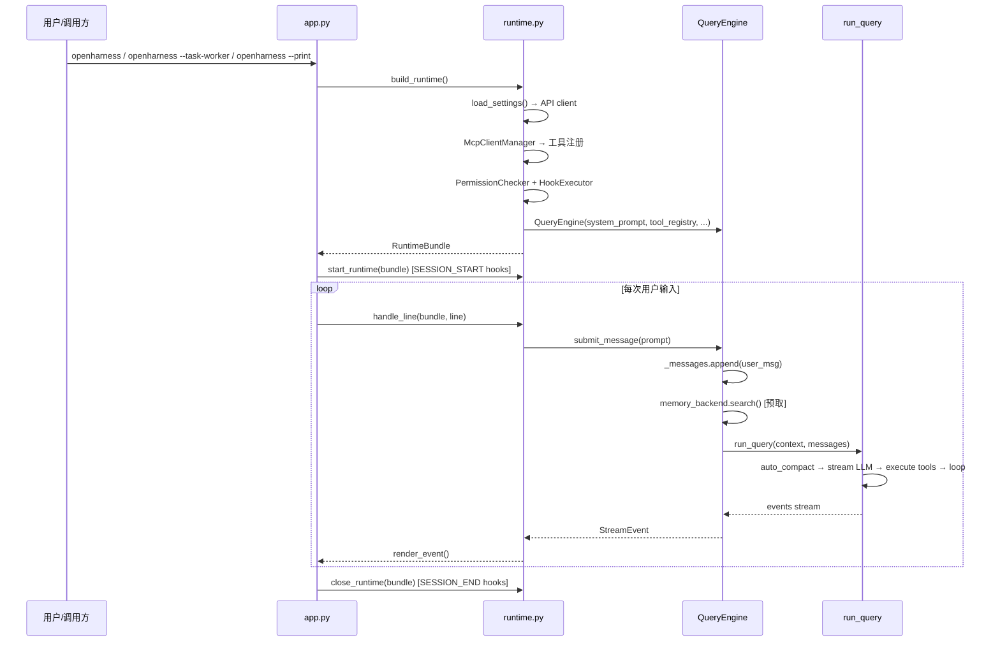
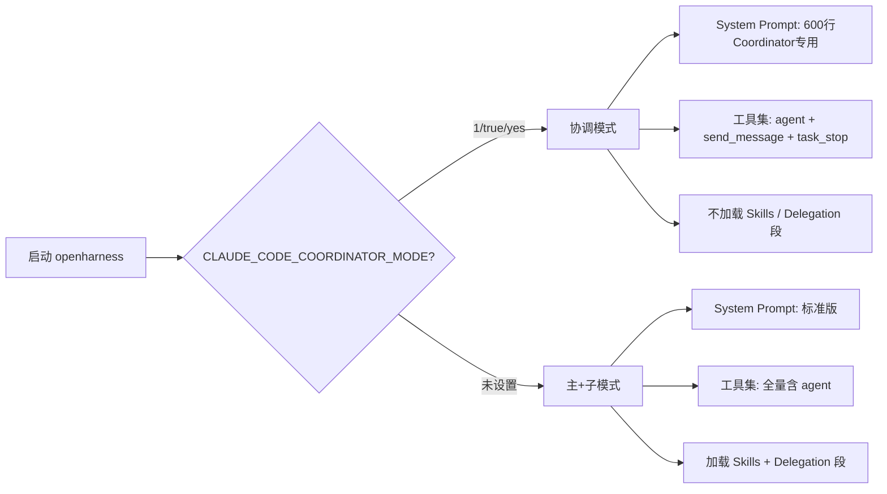
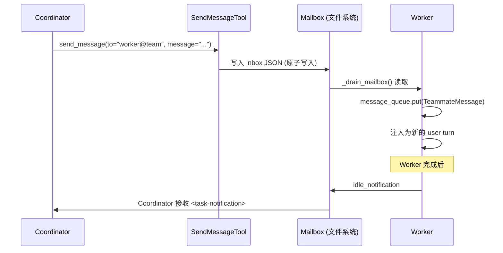
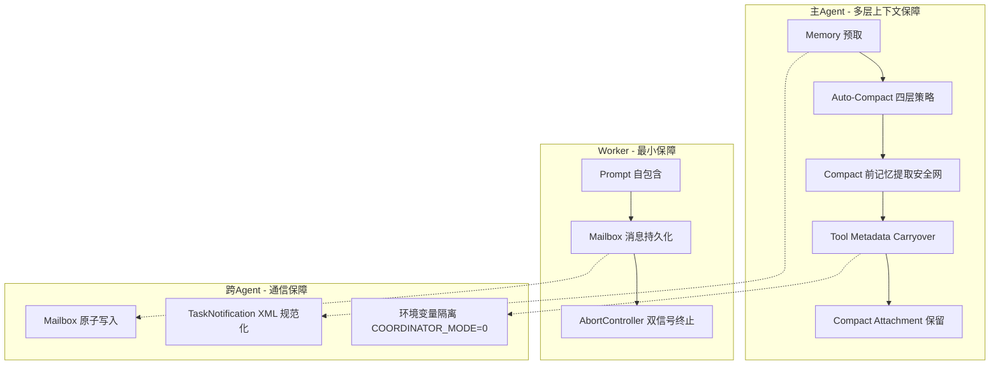
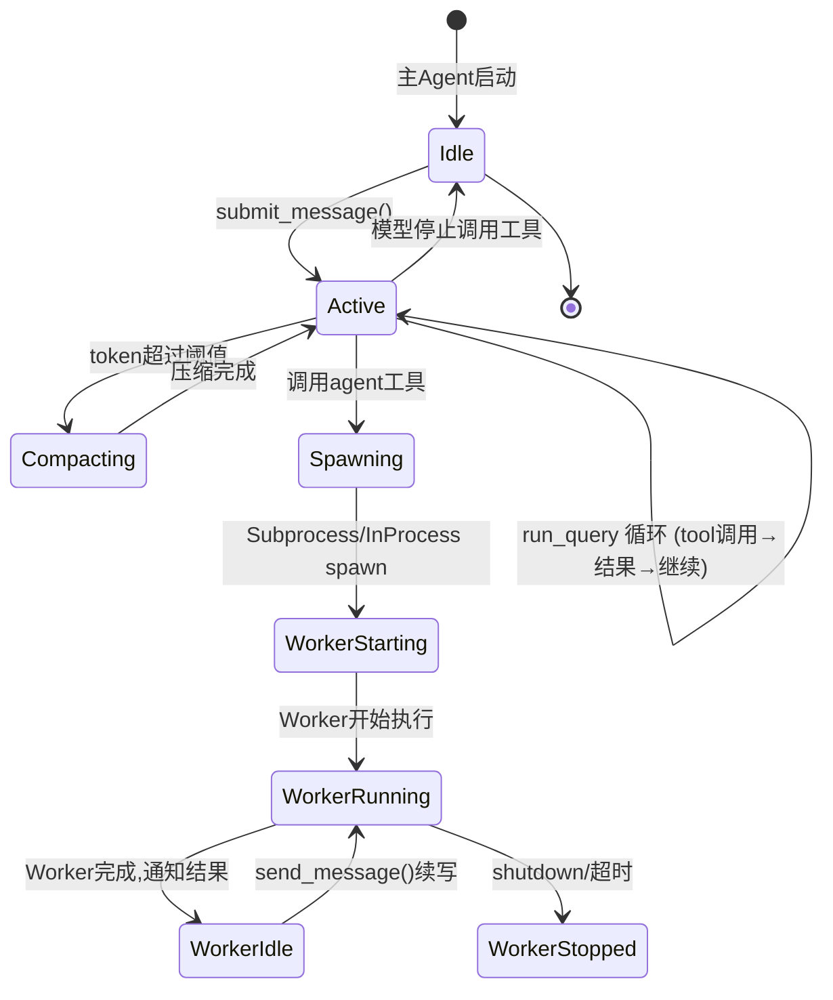

# OpenHarness Agent 上下文管理深度分析

## 目录

- [一、概述](#一概述)
- [二、核心问题](#二核心问题)
- [三、整体架构与流程](#三整体架构与流程)
- [四、编排模式决策](#四编排模式决策)
- [五、任务拆分与并发控制](#五任务拆分与并发控制)
- [六、上下文分层管理](#六上下文分层管理)
- [七、Agent 间通信](#七agent-间通信)
- [八、子 Agent 上下文压缩](#八子-agent-上下文压缩)
- [九、关键技术机制](#九关键技术机制)
- [十、质量保障体系](#十质量保障体系)
- [十一、对比分析](#十一对比分析)
- [十二、相关文件索引](#十二相关文件索引)
- [十三、总结](#十三总结)

---

## 一、概述

OpenHarness 实现了两套多 Agent 编排模式——**主+子模式**（Primary+Sub）和**协调模式**（Coordinator Mode），两者共享同一个 `run_query` 引擎循环，但在 system prompt 构建、工具集分配、上下文隔离方式和消息传递路径上存在系统性差异。

本文围绕以下核心问题展开深度分析：

1. 整体流程与架构分层
2. UI 模式（CLI / TUI）
3. 是否根据计算复杂度自动选择执行模式
4. 如何决定走哪套编排模式
5. 主 Agent 如何拆分任务
6. 如何解决 Agent 写冲突
7. 上下文分层管理
8. Agent 间通信方式
9. 子 Agent 上下文压缩

### 核心文件关系

```
coordinator_mode.py ──→ context.py ──→ query_engine.py ──→ query.py
       │                                       │                │
       ├── system prompt 分支                   │                └── run_query 循环
       ├── 工具集裁剪                           │                    │
       └── TaskNotification XML               ┌── QueryContext ────┘
                                            │
agent_tool.py ──→ spawn_utils.py ──→ subprocess_backend.py
       │                                      │
       └── TeammateSpawnConfig               └── 环境变量继承
                                              └── CLAUDE_CODE_COORDINATOR_MODE=0

in_process.py ──→ TeammateContext (ContextVar)
       │
       └── message_queue (asyncio.Queue)
       └── mailbox (文件系统)

app.py ──→ runtime.py ──→ QueryEngine
  │            │
  ├── run_repl (TUI)    ├── build_runtime (组装)
  ├── run_task_worker    ├── handle_line (命令分发)
  └── run_print_mode     └── start_runtime / close_runtime
```

---

## 二、核心问题

| 核心问题 | 直接回答 | 关键证据 |
|---------|---------|---------|
| **主 Agent 和 Worker 的上下文管理是否存在本质区别？** | 是。主 Agent 拥有完整的会话历史、全量工具集、auto-compact 和 memory 提取能力；Worker 以零上下文启动，工具集受限，无 auto-compact，无 memory 集成。 | 主 Agent 通过 `QueryEngine._messages` 累积完整对话（`query_engine.py:62`），Worker 仅以 `config.prompt` 作为初始消息（`in_process.py:353-354`） |
| **两套编排模式在上下文隔离与共享上如何权衡？** | 主+子模式：主 Agent 保留完整上下文，Worker 完全隔离，结果通过 `ToolResult` 内联返回。协调模式：Coordinator 自身也走完整 query 循环，Worker 结果以 `<task-notification>` XML 注入 Coordinator 的消息流，支持通过 `send_message` 续写 Worker 上下文。 | 协调模式 Worker 结果在 `query.py:632-634` 被识别为 `user` 角色消息；`send_message_tool.py` 通过 mailbox 向 Worker 注入新 turn |
| **模式选择是否自动化？** | 不是。完全由环境变量 `CLAUDE_CODE_COORDINATOR_MODE` 决定，无任务复杂度评估。 | `coordinator_mode.py:186-189` |
| **写冲突如何解决？** | Prompt 层面的约束（串行化写操作）+ 可选 worktree 隔离 + scratchpad 共享目录。无代码级锁。 | `coordinator_mode.py:366-370` |

---

## 三、整体架构与流程

### 3.1 架构分层

```
┌─────────────────────────────────────────────────┐
│  UI Layer (app.py)                              │
│  run_repl() / run_task_worker() / run_print_mode│
│  三种运行模式：TUI交互 / Headless Worker / 打印  │
├─────────────────────────────────────────────────┤
│  Runtime Layer (runtime.py)                     │
│  build_runtime() → RuntimeBundle                │
│  handle_line() → 命令分发 / engine.submit_message│
│  组装：API client + MCP + 工具注册 + Hook + 引擎│
├─────────────────────────────────────────────────┤
│  Engine Layer                                   │
│  QueryEngine (query_engine.py) ── 持有 _messages│
│  run_query (query.py) ── 循环: LLM→tool→LLM    │
│  compact (services/compact/) ── 上下文压缩      │
│  messages (engine/messages.py) ── 消息模型      │
├─────────────────────────────────────────────────┤
│  Orchestration Layer                            │
│  coordinator_mode.py ── 模式检测+prompt+工具集  │
│  agent_definitions.py ── 7种内置Agent定义       │
│  agent_tool.py ── spawn 子Agent                 │
│  send_message_tool.py ── 续写Worker             │
├─────────────────────────────────────────────────┤
│  Swarm Layer                                    │
│  subprocess_backend.py / in_process.py          │
│  mailbox.py / spawn_utils.py / types.py         │
│  registry.py ── 后端选择 (in_process→tmux→sub) │
│  team_lifecycle.py ── 团队生命周期管理          │
├─────────────────────────────────────────────────┤
│  Infrastructure Layer                           │
│  api/client.py ── LLM API (Anthropic/OpenAI)   │
│  tools/ ── 工具注册 (bash, file, glob, grep…)  │
│  permissions/ ── 权限检查                       │
│  hooks/ ── Hook执行器                           │
│  tasks/manager.py ── 后台任务管理               │
│  memory/ ── 持久化记忆后端                      │
│  mcp_runtime/ ── MCP 客户端管理                 │
└─────────────────────────────────────────────────┘
```

### 3.2 启动流程



### 3.3 UI 模式

OpenHarness 支持 **三种运行模式**（`app.py`），均为 CLI 入口：

| 模式 | 入口函数 | UI 实现 | 适用场景 |
|------|---------|--------|---------|
| **TUI 交互** | `run_repl()` → `launch_react_tui()` | React Ink 终端 UI | 用户直接交互（`openharness` 命令） |
| **Task Worker** | `run_task_worker()` | stdin/stdout 纯文本，无 TTY 依赖 | Subprocess Worker（`openharness --task-worker`） |
| **Print 模式** | `run_print_mode()` | stdout 流式输出（text/stream-json） | 非交互式 `--print` / API 集成 |

Task Worker 是关键模式——Worker 作为子进程启动时不需要 TTY，直接读 stdin（JSON 或纯文本）、写 stdout。权限请求自动批准（`_noop_permission`，`app.py:300-301`），因为 Worker 没有用户可以交互。

---

## 四、编排模式决策

### 4.1 模式选择机制

**模式选择完全由用户通过环境变量显式设置，代码中没有任何自动决策逻辑：**

```python
# coordinator_mode.py:186-189
def is_coordinator_mode() -> bool:
    val = os.environ.get("CLAUDE_CODE_COORDINATOR_MODE", "")
    return val.lower() in {"1", "true", "yes"}
```



**不存在计算复杂度评估。** 代码中没有任务分析、token 预估、子任务计数等逻辑来决定是否切换模式。模式完全是启动时的静态配置。

### 4.2 Worker 的模式隔离

Worker 启动时被**强制覆盖**为非协调模式（`spawn_utils.py:198`）：

```python
env: dict[str, str] = {
    "OPENHARNESS_AGENT_TEAMS": "1",
    "CLAUDE_CODE_COORDINATOR_MODE": "0",  # 防止递归协调
}
```

没有这个安全阀，Worker 会继承 Coordinator 的 `CLAUDE_CODE_COORDINATOR_MODE=1`，尝试以协调器模式启动，导致无限递归 spawn。

### 4.3 两套模式的本质差异

| 维度 | 主+子模式 | 协调模式 |
|------|---------|---------|
| **主 Agent 角色** | 直接执行 + 偶尔委派 | 纯协调，不直接执行 |
| **Worker 交互** | `agent` 工具 spawn，结果内联返回 | `agent` + `send_message` + `task_stop` 三件套 |
| **结果传递** | `ToolResult`（直接内嵌到 `_messages`） | `<task-notification>` XML（user 角色消息） |
| **Worker 续写** | 不支持（每次 spawn 是新实例） | `send_message` 续写已有 Worker 的上下文 |
| **上下文策略** | 主 Agent 保留一切，Worker 无状态 | Coordinator 保留协调上下文，Worker 可累积上下文 |
| **并发控制** | 主 Agent 串行调度 | Coordinator 并行调度多个 Worker |
| **System Prompt** | 标准版（含 Delegation 段） | Coordinator 专用版（含编排指令 + 决策矩阵） |
| **适用场景** | 简单委派、单次研究 | 复杂多步任务、并行研究+实现+验证 |

**核心差异在于"续写能力"**——协调模式通过 `send_message` + Mailbox 实现了 Worker 上下文的续写，这是主+子模式不具备的。

---

## 五、任务拆分与并发控制

### 5.1 主 Agent 如何拆分任务

**纯 LLM 驱动，无代码级编排逻辑。** 两种模式的拆分策略都在 system prompt 中指导：

**主+子模式**（`context.py:51-70`，简短的 delegation 段）：

> "Use it when the user explicitly asks for a subagent, background worker, or parallel investigation, or when the task clearly benefits from splitting off a focused worker. Prefer a normal direct answer for simple tasks."

**协调模式**（`coordinator_mode.py:352-444`，详细的四阶段 + 决策矩阵）：

| 阶段 | 执行者 | 目的 |
|------|--------|------|
| Research | Workers（并行） | 调查代码库、找文件、理解问题 |
| Synthesis | **Coordinator 自己** | 读研究结果、理解问题、撰写实现规格 |
| Implementation | Workers | 按规格做精准修改 |
| Verification | Workers | 测试修改是否生效 |

Coordinator 的 system prompt 强调"**你必须先理解再委派**"（`coordinator_mode.py:407-411`）：

> Never write "based on your findings" or "based on the research." These phrases delegate understanding to the worker instead of doing it yourself.

### 5.2 续写决策矩阵

Coordinator 的 system prompt 定义了 **Continue vs Spawn Fresh 决策框架**（`coordinator_mode.py:436-445`）：

| 情境 | 机制 | 原因 |
|------|------|------|
| 研究恰好覆盖了待编辑的文件 | **Continue**（`send_message`） | Worker 已有文件上下文，再加清晰计划 |
| 研究广泛但实现窄 | **Spawn fresh**（`agent`） | 避免拖入探索噪声；聚焦上下文更干净 |
| 修正失败或扩展近期工作 | **Continue** | Worker 有错误上下文，知道刚才尝试了什么 |
| 验证不同 Worker 刚写的代码 | **Spawn fresh** | 验证者应全新视角，不带实现假设 |
| 首次实现用了完全错误的方法 | **Spawn fresh** | 错误方法上下文污染重试；干净上下文避免锚定 |
| 完全无关的任务 | **Spawn fresh** | 无有用上下文可复用 |

**设计哲学：** "高重叠 → Continue，低重叠 → Spawn fresh"。

### 5.3 写冲突解决

**协调模式的 system prompt 中有明确并发控制规则**（`coordinator_mode.py:366-370`）：

> - **Read-only tasks** (research) — run in parallel freely
> - **Write-heavy tasks** (implementation) — **one at a time per set of files**
> - **Verification** can sometimes run alongside implementation on different file areas

这是 **prompt 层面的约束，不是代码层面的锁**。具体防护手段：

| 防护手段 | 机制 | 代码位置 |
|---------|------|---------|
| **串行化写操作** | Coordinator 不同时给两个 Worker 分配修改同一组文件的任务 | prompt 约束 |
| **Worktree 隔离** | `TeammateSpawnConfig.worktree_path` 分配独立 git worktree | `types.py:303-304` |
| **Scratchpad 目录** | 共享目录用于跨 Worker 交换信息，不改代码 | `coordinator_mode.py:242-248` |
| **工具集裁剪** | Worker 不能 spawn 子 Agent（无 `agent` 工具），防止意外并发 | `coordinator_mode.py:167-183` |

**主+子模式**中写冲突问题更小——主 Agent 通常串行 spawn 子 Agent，子 Agent 结果内联返回后才继续，天然串行。

**残留风险**：如果 Coordinator 违反 prompt 约束（LLM 不遵守），或两个 Worker 通过 bash 命令间接修改同一文件，代码层面没有锁来阻止。

---

## 六、上下文分层管理

### 6.1 四层上下文架构

```
┌───────────────────────────────────────────────────────┐
│ Layer 4: Memory (持久化)                               │
│ memory_backend.search() / extract_and_store()          │
│ 跨会话持久化，仅在主Agent可用                           │
│ 证据: query_engine.py:59-108, query.py:466-508         │
├───────────────────────────────────────────────────────┤
│ Layer 3: Tool Metadata Carryover (跨turn)              │
│ task_focus_state / read_file_state / async_agent_tasks │
│ 跨turn累积，跨compact保留为CompactAttachment           │
│ 仅主Agent可用                                          │
│ 证据: query.py:97-101, compact/__init__.py:457-507     │
├───────────────────────────────────────────────────────┤
│ Layer 2: Conversation History (_messages)              │
│ 完整对话历史，由auto-compact四层策略管理                │
│ 主Agent: 持久化 + compact                              │
│ Worker: 单次prompt开始，短生命周期                      │
│ 证据: query_engine.py:62, in_process.py:353-354        │
├───────────────────────────────────────────────────────┤
│ Layer 1: System Prompt (每次turn重建)                   │
│ build_runtime_system_prompt() → 基础prompt + Skills    │
│ + CLAUDE.md + Memory + LocalRules                      │
│ Coordinator: 专用600行prompt                           │
│ Worker: 标准prompt + AgentDefinition.system_prompt     │
│ 证据: context.py:73-159                                │
└───────────────────────────────────────────────────────┘
```

**关键差异：Worker 只有 Layer 1 和短暂的 Layer 2，没有 Layer 3 和 Layer 4。**

### 6.2 主 Agent vs Worker 上下文能力对比

| 维度 | 主 Agent | Worker (Subprocess) | Worker (InProcess) |
|------|---------|---------------------|---------------------|
| **初始上下文** | 完整会话历史 `_messages` | 仅 `config.prompt` | 仅 `config.prompt` |
| **System Prompt** | 全量（含 Skills、Delegation、Memory） | 标准（含 Skills、CLAUDE.md） | 标准 |
| **工具集** | 全量（含 agent、send_message、task_stop） | 受限（`_WORKER_TOOLS` 14个 或 `_SIMPLE_WORKER_TOOLS` 3个） | 同 Subprocess |
| **Auto-Compact** | 有（四层递降） | 代码路径存在，但生命周期短几乎不触发 | 取决于传入的 QueryContext |
| **Memory** | 有（搜索 + 提取 + 压缩安全网） | 无（无 memory_backend 传递） | 无 |
| **Tool Metadata** | 有（跨 turn 累积，跨 compact 保留） | 无（独立实例，进程销毁后丢失） | 无 |
| **消息持久化** | `_messages` 列表（会话级） | 进程内（进程退出即销毁） | `message_queue`（Task 生命周期） |
| **上下文增长** | 线性增长 + compact 控制 | 短生命周期，通常不超 200K tokens | 短生命周期 |
| **隔离级别** | N/A | 进程级（最强） | ContextVar（协程级） |
| **通信方式** | 直接接收用户消息 | TaskNotification XML → 主 Agent | idle_notification → 主 Agent |

### 6.3 System Prompt 分支细节

`build_runtime_system_prompt()` 根据 `is_coordinator_mode()` 选择完全不同的构建路径（`context.py:83-159`）：

| 维度 | 主 Agent | Coordinator | Worker |
|------|---------|-------------|--------|
| **Base Prompt** | `build_system_prompt()` | `get_coordinator_system_prompt()` | `build_system_prompt()`（标准） |
| **Skills 列表** | 包含 | 不包含 | 包含 |
| **Delegation 段** | 包含 | 不包含 | 不包含 |
| **CLAUDE.md** | 包含 | 包含 | 包含 |
| **Local Rules** | 包含 | 包含 | 包含 |
| **Memory Section** | 包含 | 包含 | 取决于 Settings |
| **Coordinator Context** | 不包含 | 包含 `workerToolsContext` | 不包含 |

关键设计：Coordinator 不加载 Skills 列表和 Delegation 段，因为 Coordinator 不直接执行 skill，而是委派给 Worker。Worker 不加载 Delegation 段，因为 Worker 不应该再嵌套委派。

---

## 七、Agent 间通信

### 7.1 通信方式总览

| 通信方式 | 方向 | 机制 | 代码位置 | 适用模式 |
|---------|------|------|---------|---------|
| **ToolResult 内联** | Sub → 主 | 子Agent结果直接作为 tool_result 返回 | `agent_tool.py:130-141` | 主+子 |
| **TaskNotification XML** | Worker → Coordinator | `<task-notification>` 作为 user 角色消息注入 Coordinator 的 `_messages` | `app.py:109-135` | 协调 |
| **Mailbox 文件** | Coordinator → Worker | `~/.openharness/teams/<team>/agents/<id>/inbox/` 原子写入 JSON | `mailbox.py:126-151` | 协调 |
| **stdin pipe** | Coordinator → Subprocess Worker | JSON 行通过 stdin 写入 | `subprocess_backend.py:127-128` | 协调 |
| **message_queue** | Coordinator → InProcess Worker | `asyncio.Queue` 直接入队 | `in_process.py:383-393` | 协调 |
| **idle_notification** | Worker → Coordinator | Worker 完成后写 leader mailbox | `in_process.py:279-285` | 协调 |

**Worker 之间不能直接通信**——必须经 Coordinator 中转。

### 7.2 消息传递时序



**图解：** 消息传递是单向的——Coordinator 通过 `send_message` → Mailbox → Worker `message_queue` 向下传递；Worker 通过 `idle_notification` / `TaskNotification` XML 向上回报。

### 7.3 上下文隔离机制

| 机制 | 实现位置 | 隔离粒度 | 适用场景 |
|------|---------|---------|---------|
| **进程边界** | `subprocess_backend.py:47-105` | 完全隔离（独立地址空间） | Subprocess Worker |
| **ContextVar** | `in_process.py:173-188` | Task 级隔离（协程安全） | InProcess Worker |
| **环境变量清除** | `spawn_utils.py:198` `CLAUDE_CODE_COORDINATOR_MODE=0` | 防止递归协调 | 所有 Worker |
| **工具集裁剪** | `coordinator_mode.py:167-183` | 限制可用工具 | 协调模式 Worker |

**进程边界**是最强的隔离——Subprocess Worker 拥有独立的 Python 解释器、独立的 `QueryEngine` 实例、独立的 `_messages` 列表。

**ContextVar** 是轻量级隔离——InProcess Worker 与主 Agent 共享同一进程，但每个 `asyncio.Task` 拥有独立的 `TeammateContext` 副本。隔离依赖 Python `contextvars` copy-on-create 语义。

---

## 八、子 Agent 上下文压缩

### 8.1 主 Agent 的 Auto-Compact

主 Agent 的 auto-compact 在 `run_query` 每轮 turn 开始时触发（`query.py:576-578`），采用**四层递降策略**：

```
1. Microcompact  — 清除旧 tool_result 内容，零 LLM 调用，节省 ~30-60% token
2. Context Collapse — 截断过长文本块（>2400字符），确定性操作
3. Session Memory  — 确定性摘要，将旧消息压缩为单条摘要消息
4. Full Compact  — 调用 LLM 生成结构化摘要，最贵但最保真
```

### 8.2 子 Agent 的 Compact 状态

| Agent 类型 | Auto-Compact | Memory 提取 | 实际情况 |
|-----------|-------------|------------|---------|
| **主 Agent** | 有（四层递降） | 有（搜索+提取+安全网） | 正常工作 |
| **Sub Agent (主+子)** | 代码路径存在但**几乎不触发** | 无 | 生命周期短（单次执行），通常不超过 compact 阈值 |
| **Worker (Subprocess)** | 代码路径存在但**几乎不触发** | 无 | 同上，短生命周期 |
| **Worker (InProcess)** | 取决于传入的 QueryContext | 无 | 通常不配置 compact 参数 |
| **Coordinator** | 有（走标准主Agent路径） | 有 | 与主Agent相同 |

**关键证据**：Worker 在 `run_task_worker()` 中启动（`app.py:341-359`），只读一行 stdin 执行一次就退出。InProcess Worker 的 `_run_query_loop`（`in_process.py:335-395`）虽然走 `run_query`，但初始消息仅为 `config.prompt`，除非任务极长，token 数不会超过 ~167K 的 compact 阈值。

**如果 Worker 确实超长**——compact 会触发，但产生的 CompactAttachment 不回传给主 Agent，压缩后的信息仅存在于 Worker 进程内部，Worker 退出后即丢失。

---

## 九、关键技术机制

### 9.1 主 Agent 上下文构建

主 Agent 的上下文构建发生在 `QueryEngine.submit_message()` 中（`query_engine.py:165-219`）：

1. **用户消息追加**：`self._messages.append(user_message)` — 持久化到会话历史
2. **Memory 预取**：`memory_backend.search(user_message.text)` — 搜索相关记忆
3. **QueryContext 构建**：包含 `api_client`、`tool_registry`、`permission_checker`、`system_prompt`、`tool_metadata`、`memory_backend` 等
4. **Coordinator 上下文注入**：如果是协调模式，额外注入 `# Coordinator User Context` 消息
5. **run_query 调用**：传入 `query_messages`（`_messages` 的副本 + coordinator context）

关键点：`QueryEngine._messages` 是**可变列表**，`run_query` 对其就地修改（压缩、追加），`AssistantTurnComplete` 事件后同步回写：`self._messages = list(query_messages)`（`query_engine.py:216`）。

### 9.2 Worker 上下文构建

**Subprocess 后端**（默认）：`SubprocessBackend.spawn()` → 子进程执行 `openharness --task-worker`

- 环境变量继承：30+ 个关键变量，但**强制 `CLAUDE_CODE_COORDINATOR_MODE=0`**
- CLI 标志传播：model、system_prompt、permission_mode、settings_path、plugin_dirs
- 初始消息：仅 `config.prompt` 通过 stdin
- System Prompt：子进程独立构建，走标准版（非 Coordinator 版）

**InProcess 后端**：`InProcessBackend.spawn()` → `asyncio.create_task(start_in_process_teammate())`

- ContextVar 隔离：`TeammateContext` 绑定到 asyncio.Task 上下文
- 初始消息：仅 `config.prompt`
- 后续消息：通过 `message_queue` 注入

### 9.3 Memory 集成机制

主 Agent 在 `QueryEngine` 中集成了 Memory 后端（`query_engine.py:59-108`）：

- **搜索**：每次 `submit_message` 时 `memory_backend.search()` 预取相关记忆
- **提取**：`_maybe_extract_memories()` 在每轮 assistant 响应后检查是否需要提取新记忆（`query.py:466-490`）
- **压缩安全网**：`_extract_before_compact()` 在 compact 前强制提取，防止信息丢失（`query.py:493-508`）

**Worker 的 Memory 状态**：`TeammateSpawnConfig` 中没有 `memory_backend` 字段，InProcess Worker 也不接收 memory 参数。**Worker 不具备主 Agent 级别的记忆搜索和提取能力**。

### 9.4 工具元数据传递 (Tool Metadata Carryover)

主 Agent 通过 `QueryContext.tool_metadata` 维护跨 turn 的状态（`query.py:97-101`），包括：

- `task_focus_state`：用户目标、活跃产物、验证状态
- `read_file_state`：最近读取的文件及预览（最多 6 个）
- `invoked_skills`：已调用的 skill 列表（最多 8 个）
- `async_agent_state`：异步 Agent 活动记录（最多 8 条）
- `async_agent_tasks`：活跃 Worker 的 task_id 映射（最多 12 个）
- `recent_work_log`：最近工作日志（最多 10 条）
- `compact_checkpoints`：压缩检查点

这些元数据在 compact 时被提取为 `CompactAttachment`，跨压缩边界保留。**Worker 没有等价的 tool_metadata 传递机制**——每个 Worker 的 `QueryContext.tool_metadata` 是独立的，Worker 完成后元数据随进程销毁。

### 9.5 Worker 工具集裁剪

协调模式下 Worker 的工具集被**覆盖裁剪**（`coordinator_mode.py:167-183`）：

| 模式 | 工具集 | 数量 |
|------|--------|------|
| **_WORKER_TOOLS** | bash, file_read, file_edit, file_write, glob, grep, web_fetch, web_search, task_create, task_get, task_list, task_output, skill | 14 |
| **_SIMPLE_WORKER_TOOLS** | bash, file_read, file_edit | 3 |
| **Coordinator 专属** | agent, send_message, task_stop | 3 |

Coordinator 专属的 3 个工具**不分配给 Worker**，防止 Worker 嵌套委派。

---

## 十、质量保障体系



**图解：** 主 Agent 拥有五层上下文保障（从 Memory 预取到 Compact Attachment 保留），确保长会话中信息不丢失。Worker 仅依赖 Prompt 自包含和 Mailbox 持久化。跨 Agent 的通信保障确保结果可靠传递且不递归。

---

## 十一、对比分析

### 11.1 Subagent 与 Worker 的区别

所有通过 `agent` 工具 spawn 出来的 agent 都是 **subagent**（子代理）。`subagent_type` 字段支持 7 种内置类型（`agent_definitions.py:510-620`）：

| subagent_type | 角色 | 工具集 | 模式 |
|---|---|---|---|
| `general-purpose` | 通用研究+多步任务 | 全量 `["*"]` | 读写 |
| `Explore` | 快速代码搜索 | 只读（禁 edit/write/agent） | 只读 |
| `Plan` | 架构规划 | 只读（禁 edit/write/agent） | 只读 |
| **`worker`** | **实现编码** | **全量 → 协调模式下被裁剪为 14 个** | **读写** |
| `verification` | 验证测试 | 只读（禁 edit/write/agent） | 只读+临时文件 |
| `statusline-setup` | 状态栏配置 | `["Read", "Edit"]` | 读写 |
| `claude-code-guide` | 文档问答 | `["Glob","Grep","Read","WebFetch","WebSearch"]` | 只读 |

**Worker 是 subagent 的一种**，但有**两层特殊处理**：

1. **AgentDefinition 层面**：System prompt 为实现导向（`"Execute the assigned task precisely and efficiently. Write clean, well-structured code...run relevant tests and typecheck, then commit"`），工具集 `tools=None`（全量）
2. **协调模式层面**：Coordinator 的 system prompt **强制要求**使用 `subagent_type="worker"` 来派发任务，且 Worker 工具集被**覆盖裁剪**为 `_WORKER_TOOLS`（14 个），**去掉了 agent、send_message、task_stop**——防止 Worker 嵌套委派

**一句话：所有 worker 都是 subagent，但不是所有 subagent 都是 worker。Worker 是协调模式下专门用于实现任务的受限 subagent。**

### 11.2 完整生命周期



**图解：** 主 Agent 的上下文是持久化的——从 `Idle` 到 `Active` 再回到 `Idle`，`_messages` 列表始终保留。Worker 的上下文是瞬态的——从 `WorkerStarting` 到 `WorkerIdle`，其消息列表仅在 `run_query` 执行期间存在，Worker 完成后上下文即销毁（除非被 `send_message` 续写）。

---

## 十二、相关文件索引

| 文件路径 | 职责 |
|---------|------|
| `src/openharness/ui/app.py` | 入口：TUI / Task Worker / Print 三种运行模式 |
| `src/openharness/ui/runtime.py` | Runtime 组装、命令分发、QueryEngine 构建 |
| `src/openharness/engine/query.py` | 核心查询循环、auto-compact 触发、tool metadata 记录 |
| `src/openharness/engine/query_engine.py` | 高级引擎，持有 `_messages` 会话历史，构建 QueryContext |
| `src/openharness/engine/messages.py` | ConversationMessage、ContentBlock 消息模型 |
| `src/openharness/prompts/context.py` | 运行时 system prompt 组装，协调模式分支 |
| `src/openharness/prompts/system_prompt.py` | 基础 system prompt 构建 |
| `src/openharness/coordinator/coordinator_mode.py` | 协调模式检测、system prompt、工具集定义、TaskNotification XML |
| `src/openharness/coordinator/agent_definitions.py` | 7 种内置 Agent 定义（工具、prompt、model、max_turns 等） |
| `src/openharness/tools/agent_tool.py` | `agent` 工具，spawn Worker |
| `src/openharness/tools/send_message_tool.py` | `send_message` 工具，续写 Worker |
| `src/openharness/swarm/types.py` | TeammateSpawnConfig、SpawnResult、TeammateMessage 类型定义 |
| `src/openharness/swarm/in_process.py` | InProcess 后端、TeammateContext（ContextVar 隔离）、消息队列 |
| `src/openharness/swarm/subprocess_backend.py` | Subprocess 后端，通过 BackgroundTaskManager 管理 |
| `src/openharness/swarm/spawn_utils.py` | 环境变量继承、CLI 标志传播 |
| `src/openharness/swarm/mailbox.py` | 文件系统邮箱，跨 Agent 消息持久化 |
| `src/openharness/swarm/registry.py` | 后端注册表，自动检测优先级（in_process→tmux→subprocess） |
| `src/openharness/services/compact/__init__.py` | Auto-compact 四层策略实现 |
| `src/openharness/services/session_backend.py` | 会话快照持久化 |

---

## 十三、总结

### 核心洞察

1. **主 Agent 和 Worker 的上下文管理存在本质区别。** 主 Agent 拥有持久化的会话历史（`_messages`）、auto-compact 四层递降策略、Memory 搜索/提取/压缩安全网、以及跨 turn 累积的 tool metadata。Worker 以零上下文启动，仅有一条初始 prompt，无 compact、无 memory、无 metadata 传递。这不是"同一机制的不同配置"，而是根本性的能力差异——主 Agent 是有状态的长期运行实体，Worker 是无状态的短期执行单元。

2. **模式选择完全由用户显式控制，不存在自动决策。** 代码中没有任务复杂度评估、token 预估、子任务计数等逻辑。`CLAUDE_CODE_COORDINATOR_MODE` 环境变量是唯一的模式切换开关。

3. **两套编排模式的核心差异在于"续写能力"。** 主+子模式中，Worker 是一次性的——spawn 后执行，结果内联返回，上下文即销毁。协调模式通过 `send_message` + Mailbox 实现了 Worker 上下文的续写，使得 Worker 可以累积上下文，从而在后续任务中复用。

4. **写冲突解决是 prompt 约束而非代码锁。** Coordinator 的 system prompt 要求"一个时刻只给一组文件分配一个写任务"，但代码层面没有互斥锁或文件锁。残留风险：LLM 不遵守约束时，两个 Worker 可能同时修改同一文件。

5. **Worker 不具备 Memory 能力是一个功能缺口。** 长任务中的 Worker 无法搜索或提取记忆，只能依赖 Coordinator 在 prompt 中显式提供所有必要上下文。

### 边界条件

- **当 Worker 上下文超过 auto-compact 阈值时**（极长任务），compact 会触发，但 CompactAttachment 不回传给主 Agent，信息可能丢失。
- **Mailbox 文件系统依赖**：如果 `~/.openharness/teams/` 目录不可写（如只读文件系统容器），InProcess 后端的消息传递会失败，但 `message_queue` 仍然可用。
- **`send_message` 续写与 Worker 生命周期的竞态**：如果 Worker 在 `send_message` 到达前已退出，消息会写入 Mailbox 但永远不会被读取——当前代码没有处理这种孤儿消息的清理。
- **InProcess 后端的 ContextVar 隔离**依赖于 Python `asyncio.create_task` 的 copy-on-create 语义。如果代码中使用了 `asyncio.ensure_future` 或 `loop.create_task` 的非标准调用方式，可能破坏隔离。
- **Prompt 约束的可靠性**：写冲突控制、任务拆分策略、续写决策都依赖 LLM 遵守 system prompt 指令。在极端情况下（超长对话导致 compact 丢失指令段），LLM 可能偏离预期行为。

---

> **分析完成时间：** 2026-05-13
> **分析目标：** OpenHarness 多 Agent 编排与上下文管理机制
> **核心问题：** 主 Agent 与 Worker 的上下文管理是否存在本质区别？两套编排模式如何决策与权衡？写冲突如何解决？子 Agent 如何压缩上下文？
