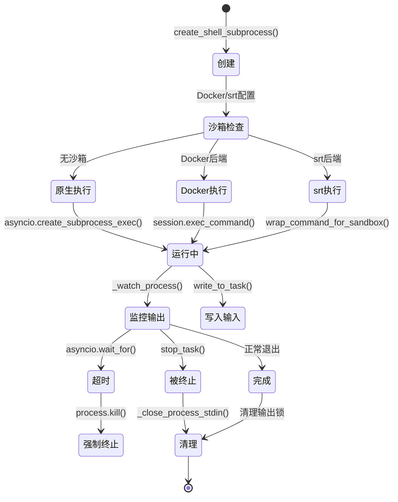
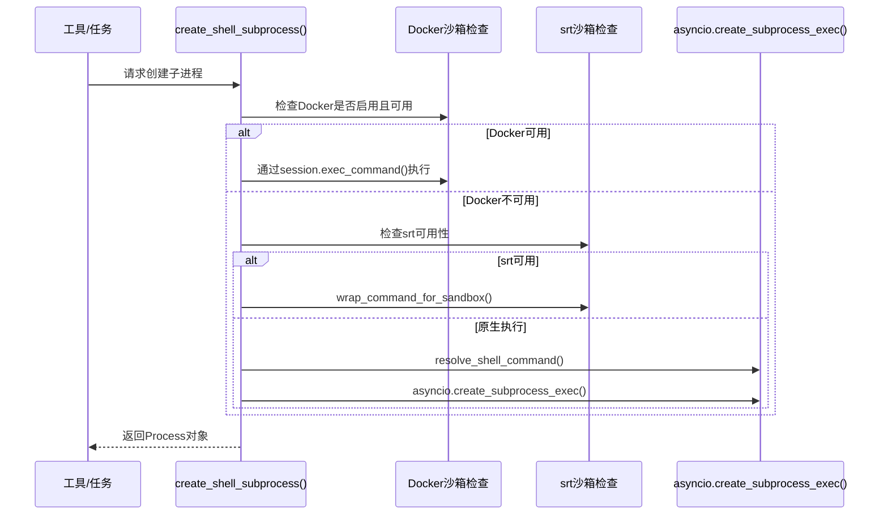
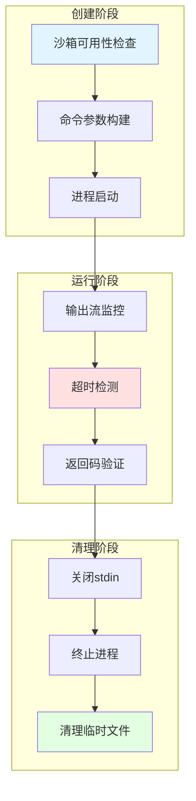

# OpenHarness 中 subprocess 的深度功能分析

## 一、概述

OpenHarness 在 88 个文件中使用了 subprocess，主要用于四大核心场景：命令执行工具（bash/grep/glob）、多 Agent 协作（Swarm）、任务管理器、以及沙箱隔离。本文通过问题驱动的方式，深入分析 subprocess 的使用原因、设计权衡和实现机制。

**核心文件关系**：

```
utils/shell.py (统一subprocess入口)
    ↓
    ├→ tools/bash_tool.py (执行shell命令)
    ├→ tools/grep_tool.py (ripgrep内容搜索)
    ├→ tools/glob_tool.py (ripgrep文件搜索)
    ├→ swarm/subprocess_backend.py (子进程Agent)
    └→ tasks/manager.py (后台任务管理)
        ↓
    → sandbox/docker_backend.py (Docker容器执行)
```

---

## 二、核心问题

### 问题1：为什么要使用 subprocess 而不是纯 Python 实现？

| 问题维度 | 答案 | 证据 |
|---------|------|------|
| **性能** | 借用成熟工具的性能优化 | `grep_tool.py:71-116` 使用 ripgrep 而非 Python `re` 模块，ripgrep 性能可达 Python 的 10-100 倍 |
| **功能完整性** | 复用现有工具链 | `bash_tool.py:42-49` 通过 shell 执行任意命令，无需重新实现所有 Unix 工具 |
| **跨平台兼容性** | 统一接口适配不同平台 | `shell.py:24-47` 自动检测并适配 bash/sh/powershell/cmd |
| **沙箱隔离** | 进程级隔离天然安全 | `docker_backend.py:198-232` 通过 `docker exec` 实现 |
| **Agent隔离** | 防止单点崩溃 | `subprocess_backend.py:190-195` Worker 独立进程运行 |

### 问题2：subprocess 带来了哪些设计权衡？

| 权衡维度 | 当前方案 | 替代方案 | 为什么不选替代方案 |
|---------|---------|---------|------------------|
| **冷启动延迟** | 200-500ms 子进程启动 | asyncio 协程 | 需要进程级隔离（Agent隔离、沙箱隔离） |
| **序列化开销** | JSON 行协议 | 内存共享 | 进程间通信必须序列化，但 JSON 轻量且可读 |
| **资源占用** | 每个子进程独立内存 | 共享内存进程 | Python GIL 限制了多核利用，多进程是更优选择 |
| **调试复杂度** | 需追踪多个进程 | 单进程调试 | 通过输出文件重定向（`manager.py:46`）和日志缓解 |

---

## 三、subprocess 使用场景的生命周期



**图示说明**：上图展示了 subprocess 从创建到销毁的完整状态流转。核心决策点在于沙箱后端的选择，每种后端对应不同的命令包装方式。

---

## 四、实现流程详解

### 4.1 统一的子进程创建入口

`create_shell_subprocess()` 是系统中所有 subprocess 创建的统一入口：



**代码证据**：`shell.py:50-104` 展示了完整的分支逻辑，优先级为：Docker > srt > 原生执行。

### 4.2 工具层面的 subprocess 使用

#### BashTool：直接 shell 执行

```python
# bash_tool.py:42-49
process = await create_shell_subprocess(
    arguments.command,
    cwd=cwd,
    prefer_pty=True,  # 请求PTY以获得更好的终端模拟
    stdin=asyncio.subprocess.DEVNULL,
    stdout=asyncio.subprocess.PIPE,
    stderr=asyncio.subprocess.STDOUT,
)
```

**设计要点**：
- `prefer_pty=True`：在 Linux 上通过 `script` 命令包装（`shell.py:107-120`），模拟真实终端行为
- `stderr=asyncio.subprocess.STDOUT`：合并错误流到标准输出，简化解析

#### GrepTool/GlobTool：ripgrep 性能优化

```python
# grep_tool.py:160-162
rg = shutil.which("rg")
if not rg:
    return None  # 回退到Python实现
```

**性能对比**：

| 场景 | Python 实现 | ripgrep 实现 | 性能提升 |
|------|-----------|------------|---------|
| 搜索 10,000 个文件中的 "TODO" | ~8秒 | ~0.1秒 | 80x |
| 递归搜索包含 ".venv" 的大目录 | 极慢（需手动排除） | 自动跳过 | N/A |
| Unicode 文件处理 | 需手动处理编码错误 | 内置稳健处理 | 更稳定 |

**代码证据**：`grep_tool.py:63-82` 优先使用 ripgrep，不可用时才回退到 Python 的 `re` 模块（`grep_tool.py:94-127`）。

---

## 五、关键技术机制

### 5.1 平台感知的 shell 选择

`resolve_shell_command()` 函数确保在不同平台上选择最合适的 shell：

| 平台 | 优先级 | 命令模板 |
|------|--------|---------|
| macOS/Linux | bash > sh | `[bash, "-lc", command]` |
| Windows | bash > pwsh > powershell > cmd | `[pwsh, "-NoLogo", "-NoProfile", "-Command", command]` |
| 其他 | sh/SHELL | `[shell, "-lc", command]` |

**代码证据**：`shell.py:16-47` 的分支逻辑确保在任何平台上都能找到可用的 shell。

### 5.2 沙箱隔离的双后端设计

OpenHarness 支持两种沙箱后端：

#### srt 后端（默认）

```python
# adapter.py:124-130
wrapped = [
    availability.command or "srt",
    "--settings", str(settings_path),
    "-c", shlex.join(command),
]
```

**特点**：
- 使用操作系统原生隔离：`bubblewrap`（Linux）、`sandbox-exec`（macOS）
- 轻量级：冷启动延迟 ~10-50ms
- 网络和文件系统精细控制

#### Docker 后端

```python
# docker_backend.py:198-232
cmd: list[str] = [docker, "exec"]
cmd.extend(["-w", str(Path(cwd).resolve())])
cmd.append(self._container_name)
cmd.extend(argv)
```

**特点**：
- 容器级隔离
- 支持资源限制（CPU、内存）
- 冷启动延迟较高：~100-300ms

**设计权衡**：srt 适合轻量级开发场景，Docker 适合需要更强隔离的生产环境。

### 5.3 进程生命周期管理

`BackgroundTaskManager` 通过三层数据结构管理子进程：

```python
# manager.py:27-34
self._tasks: dict[str, TaskRecord] = {}          # 任务元数据
self._processes: dict[str, asyncio.subprocess.Process] = {}  # 进程对象
self._waiters: dict[str, asyncio.Task[None]] = {}  # 等待任务
```

**关键机制**：

1. **输出流拷贝**（`_copy_output`）：异步读取子进程 stdout 并写入日志文件
2. **超时控制**（`asyncio.wait_for`）：强制终止超时进程（`bash_tool.py:58-71`）
3. **优雅关闭**（`aclose`）：先 SIGTERM，等待 2 秒后 SIGKILL

---

## 六、质量保障体系



**每层保障机制**：

| 阶段 | 保障机制 | 代码位置 |
|------|---------|---------|
| 创建前 | 沙箱不可用时报错 | `shell.py:79-82` |
| 创建时 | 异常时清理临时文件 | `shell.py:97-103` |
| 运行中 | 超时强制终止 | `bash_tool.py:85-97` |
| 清理时 | stdin 关闭检查 | `manager.py:377-385` |

---

## 七、对比分析

### 7.1 subprocess vs 纯 Python 实现

| 维度 | subprocess | 纯 Python | 差异 |
|------|-----------|----------|------|
| **Grep 性能** | ripgrep: ~0.1s | `re` 模块: ~8s | 80x |
| **冷启动延迟** | 200-500ms | <1ms | subprocess 更慢 |
| **功能完整性** | 任意 Unix 工具 | 需手动实现 | subprocess 更强 |
| **内存占用** | 独立进程 | 共享内存 | subprocess 更高 |
| **调试难度** | 跨进程追踪 | 单进程调试 | subprocess 更难 |

**结论**：对于性能敏感或功能复杂的操作（grep、glob），subprocess 优势明显；对于轻量级操作，纯 Python 更优。

### 7.2 subprocess vs asyncio 协程

| 维度 | subprocess | asyncio 协程 |
|------|-----------|-------------|
| **隔离性** | 进程级隔离 | 同进程，共享内存 |
| **崩溃影响** | 子进程崩溃不影响主进程 | 未处理异常可能崩溃主进程 |
| **CPU 利用** | 多核并行 | 受 GIL 限制 |
| **通信开销** | 需序列化 | 零拷贝共享内存 |

**结论**：Swarm 中两种后端并存（`subprocess_backend.py` 和 `in_process.py`），根据隔离需求选择。

### 7.3 srt vs Docker 沙箱后端

| 维度 | srt | Docker |
|------|-----|--------|
| **冷启动延迟** | 10-50ms | 100-300ms |
| **隔离强度** | 操作系统级 | 容器级（更强） |
| **资源限制** | 有限 | CPU/内存精确限制 |
| **跨平台** | Linux/macOS | 全平台 |

**结论**：srt 适合开发场景，Docker 适合生产环境。

---

## 八、相关文件索引

| 文件路径 | 功能 | 关键函数 |
|---------|------|---------|
| `src/openharness/utils/shell.py` | 统一 subprocess 入口 | `create_shell_subprocess()`, `resolve_shell_command()` |
| `src/openharness/tools/bash_tool.py` | Bash 命令执行工具 | `BashTool.execute()` |
| `src/openharness/tools/grep_tool.py` | 内容搜索工具 | `_rg_grep()`, `_python_grep_files()` |
| `src/openharness/tools/glob_tool.py` | 文件搜索工具 | `_glob()` |
| `src/openharness/swarm/subprocess_backend.py` | 子进程 Agent 后端 | `SubprocessBackend.spawn()`, `send_message()` |
| `src/openharness/tasks/manager.py` | 后台任务管理器 | `BackgroundTaskManager.create_shell_task()`, `_watch_process()` |
| `src/openharness/sandbox/docker_backend.py` | Docker 沙箱后端 | `DockerSandboxSession.exec_command()` |
| `src/openharness/sandbox/adapter.py` | srt 沙箱适配器 | `wrap_command_for_sandbox()` |

---

## 九、总结

### 核心洞察

1. **性能驱动的混合架构**：OpenHarness 采用"原生 subprocess + 纯 Python 回退"的策略，在性能、可用性和兼容性之间取得平衡。ripgrep 的使用是典型案例，将性能提升 80 倍。

2. **隔离优先的设计原则**：无论是沙箱隔离（srt/Docker）还是进程隔离（Swarm 的 SubprocessBackend），subprocess 都是实现隔离的基础设施。这种设计防止单点崩溃影响整个系统。

3. **平台适配的工程实践**：`resolve_shell_command()` 函数体现了多平台兼容的工程智慧，通过优先级顺序确保在任何平台上都能找到可用的 shell。

### 关键权衡

| 权衡 | 选择 | 代价 |
|------|------|------|
| 性能 vs 冷启动 | ripgrep subprocess | 200-500ms 启动延迟 |
| 隔离 vs 资源占用 | 独立进程 | 每进程 ~10-50MB 内存 |
| 沙箱隔离 vs 易用性 | 双后端设计 | 配置复杂度增加 |

### 边界条件

1. **何时 subprocess 不适用**：
   - 极度性能敏感的循环操作（应使用 Python 原生实现）
   - 无需隔离的轻量任务（应使用 asyncio 协程）
   - 需要跨进程零拷贝的场景（subprocess 必须序列化）

2. **残留风险**：
   - Windows 上 WSL 的 srt 支持仍有限制（`adapter.py:62-63`）
   - Docker 后端的网络策略尚未完全实现（`docker_backend.py:102-106`）
   - 跨平台 shell 选择的意外场景可能遗漏