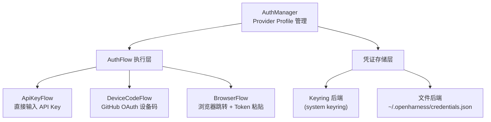

# 认证系统（Authentication）

## 摘要

认证系统是 OpenHarness 与外部 AI 供应商建立信任通道的核心子系统。它通过统一的 `AuthFlow` 抽象支持多种认证方式（API Key、设备码、浏览器跳转），由 `AuthManager` 管理多 Provider 的凭证状态，并支持 Profile 驱动的认证源切换。凭证存储采用 Keyring 优先、文件兜底的分层策略。

## 你将了解

- 认证系统的架构与核心组件
- 三种 `AuthFlow` 的流程解析
- 凭证存储的分层策略（Keyring + 文件）
- 支持的认证源完整列表
- `AuthManager` 的 Profile 管理和凭证切换
- 凭证安全存储的考量与局限
- 架构设计取舍与潜在风险

## 范围

本文档覆盖 `src/openharness/auth/` 目录下的认证流、凭证存储与认证管理器。

---

## 1. 认证系统的目的与架构

OpenHarness 需要与多种 AI 供应商交互，每个供应商有独立的认证机制。认证系统的设计目标：

- **统一抽象**：为不同认证方式（API Key、OAuth 设备码、浏览器跳转）提供一致的编程接口
- **多 Provider 支持**：同时管理 Anthropic、OpenAI、GitHub Copilot、Dashscope、Bedrock、Vertex、Moonshot、 Gemini 等多个供应商的凭证
- **Profile 切换**：通过 Provider Profile 在不同供应商配置间快速切换
- **安全存储**：凭证优先存储于系统 Keyring，Keyring 不可用时降级为文件存储



**图后解释**：认证系统的两层架构。上层的 `AuthManager` 协调 Provider Profile 与认证流执行；下层的凭证存储抽象自动选择 Keyring（系统密钥链）或文件存储作为后端。认证流执行后将凭证交给存储层持久化。

---

## 2. AuthFlow 体系

`AuthFlow` 是所有认证方式的上层抽象，每个 Flow 实现 `run()` 方法完成交互式认证并返回凭证字符串。

### 2.1 ApiKeyFlow（API Key 认证）

```python
# src/openharness/auth/flows.py -> ApiKeyFlow
class ApiKeyFlow(AuthFlow):
    def __init__(self, provider: str, prompt_text: str | None = None) -> None:
        self.provider = provider
        self.prompt_text = prompt_text or f"Enter your {provider} API key"

    def run(self) -> str:
        import getpass
        key = getpass.getpass(f"{self.prompt_text}: ").strip()
        if not key:
            raise ValueError("API key cannot be empty.")
        return key
```

**流程**：通过 `getpass.getpass()` 安全读取 API Key（非回显输入），验证非空后直接返回字符串。

**用途**：Anthropic API Key、OpenAI API Key、Dashscope API Key 等标准 API Key 认证场景。

### 2.2 DeviceCodeFlow（GitHub OAuth 设备码）

```python
# src/openharness/auth/flows.py -> DeviceCodeFlow
class DeviceCodeFlow(AuthFlow):
    def run(self) -> str:
        # 1. 请求设备码
        dc = request_device_code(client_id=self.client_id, github_domain=self.github_domain)
        # 2. 打印验证 URI 和用户码
        print(f"  Open: {dc.verification_uri}")
        print(f"  Code: {dc.user_code}")
        # 3. 尝试自动打开浏览器
        opened = self._try_open_browser(dc.verification_uri)
        # 4. 轮询 access token
        token = poll_for_access_token(dc.device_code, dc.interval, ...)
        return token
```

**流程**：

1. 向 GitHub 请求设备码，获取 `verification_uri`（验证 URL）和 `user_code`（用户码）
2. 自动打开浏览器（或提示用户手动打开）
3. 用户在浏览器中完成 GitHub 授权（输入用户码）
4. 后台轮询 token，直到授权完成或超时

**平台适配**：`_try_open_browser()` 根据操作系统选择打开命令：

- macOS：`open` 命令
- Windows：`start` 命令
- Linux/WSL：`xdg-open` 命令（2 秒超时）

**用途**：GitHub Copilot OAuth 认证。

### 2.3 BrowserFlow（浏览器跳转认证）

```python
# src/openharness/auth/flows.py -> BrowserFlow
class BrowserFlow(AuthFlow):
    def run(self) -> str:
        import getpass
        print(f"Opening browser for authentication: {self.auth_url}")
        opened = DeviceCodeFlow._try_open_browser(self.auth_url)
        if not opened:
            print(f"Could not open browser automatically. Visit: {self.auth_url}")
        token = getpass.getpass(f"{self.prompt_text}: ").strip()
        if not token:
            raise ValueError("No token provided.")
        return token
```

**流程**：打开认证 URL，用户在浏览器中完成认证后粘贴返回的 Token。

**用途**：支持标准 OAuth 回调流程但不支持设备码的认证源。

---

## 3. 凭证存储

### 3.1 双层存储策略

OpenHarness 的凭证存储遵循以下优先级：

```python
# src/openharness/auth/storage.py -> store_credential
def store_credential(provider: str, key: str, value: str, *, use_keyring: bool | None = None) -> None:
    if use_keyring is None:
        use_keyring = _keyring_available()

    if use_keyring:
        import keyring
        keyring.set_password(_KEYRING_SERVICE, _keyring_key(provider, key), value)
    else:
        # 降级到文件存储
        data = _load_creds_file()
        data.setdefault(provider, {})[key] = value
        _save_creds_file(data)
```

**Keyring 优先**：系统 Keyring（如 macOS Keychain、Windows Credential Manager、Linux libsecret）是凭证的优先存储后端。

**文件兜底**：Keyring 不可用时（容器、CI、Windows Subsystem for Linux 等环境），凭证以明文 JSON 存储在 `~/.openharness/credentials.json`，文件权限设为 `0o600`（仅所有者可读写）。

### 3.2 Keyring 可用性探测

```python
# src/openharness/auth/storage.py -> _keyring_available
def _keyring_available() -> bool:
    # 仅在首次调用时探测
    # 探测方式：尝试 keyring.get_password()（非 set）
    keyring.get_password(_KEYRING_SERVICE, "__probe__")
    _keyring_usable = True
```

探测使用 `get_password` 而非 `set_password`，避免污染 Keyring 数据。探测结果缓存在全局变量中，最多警告一次。

### 3.3 混淆 helpers（注意：非加密）

```python
# src/openharness/auth/storage.py -> _obfuscate / _deobfuscate
def _obfuscation_key() -> bytes:
    seed = str(Path.home()).encode() + b"openharness-v1"
    return hashlib.sha256(seed).digest()

def _obfuscate(plaintext: str) -> str:
    # base64(urlsafe) encoded XOR
    xored = bytes(b ^ key[i % len(key)] for i, b in enumerate(data))
    return base64.urlsafe_b64encode(xored).decode("ascii")
```

**警告**：混淆函数使用基于家目录的 XOR 编码，**不是真正的加密**。文档明确注明仅用于防止非专业的偷窥，**不得用于保护 API Key 等敏感数据**。

### 3.4 ExternalAuthBinding（外部凭证绑定）

```python
# src/openharness/auth/storage.py -> ExternalAuthBinding
@dataclass(frozen=True)
class ExternalAuthBinding:
    """Pointer to credentials managed by an external CLI."""
    provider: str
    source_path: str      # 外部 CLI 路径
    source_kind: str      # CLI 类型（如 "copilot", "claude-subscription"）
    managed_by: str       # 管理方名称
    profile_label: str = ""
```

用于指向由外部 CLI（如 `claude`、`copilot`）管理的凭证元数据，避免凭证重复存储。

---

## 4. 支持的认证源

`AuthManager` 维护以下认证源列表：

```python
# src/openharness/auth/manager.py -> _AUTH_SOURCES
_AUTH_SOURCES = [
    "anthropic_api_key",
    "openai_api_key",
    "codex_subscription",
    "claude_subscription",
    "copilot_oauth",
    "dashscope_api_key",
    "bedrock_api_key",
    "vertex_api_key",
    "moonshot_api_key",
    "gemini_api_key",
]
```

**Provider 列表**：

```python
_KNOWN_PROVIDERS = [
    "anthropic", "anthropic_claude", "openai", "openai_codex",
    "copilot", "dashscope", "bedrock", "vertex", "moonshot", "gemini",
]
```

**凭证来源优先级**（按 Provider 分）：

1. **环境变量**：`ANTHROPIC_API_KEY`、`OPENAI_API_KEY`、`DASHSCOPE_API_KEY`、`MOONSHOT_API_KEY` 等
2. **Keyring**：系统密钥链
3. **文件存储**：`~/.openharness/credentials.json`
4. **外部 CLI 绑定**：Copilot auth 文件、`claude-subscription` 绑定

---

## 5. AuthManager 的 Profile 管理

### 5.1 ProviderProfile 数据结构

`ProviderProfile` 定义了一个完整的供应商配置快照：

- **`provider: str`**：Provider 名称（如 `"anthropic"`）
- **`auth_source: str`**：认证源名称（如 `"anthropic_api_key"`）
- **`api_format: str`**：API 格式（如 `"anthropic"`、`"openai-compatible"`）
- **`base_url: str | None`**：API 基础 URL（用于代理或兼容端点）
- **`default_model: str`**：默认模型
- **`allowed_models: list[str]`**：允许的模型列表

### 5.2 Profile 管理操作

```python
# src/openharness/auth/manager.py -> AuthManager
class AuthManager:
    def use_profile(self, name: str) -> None:
        """激活指定名称的 Provider Profile"""
        updated = self.settings.model_copy(update={"active_profile": name}).materialize_active_profile()
        self._settings = updated
        self.save_settings()

    def upsert_profile(self, name: str, profile: ProviderProfile) -> None:
        """创建或替换 Provider Profile"""
        profiles = self.settings.merged_profiles()
        profiles[name] = profile
        updated = self.settings.model_copy(update={"profiles": profiles})
        self._settings = updated.materialize_active_profile()
        self.save_settings()

    def update_profile(self, name: str, **kwargs) -> None:
        """原地更新 Profile 的指定字段"""
        profiles = self.settings.merged_profiles()
        current = profiles[name]
        profiles[name] = current.model_copy(update=updates)
        # ...

    def remove_profile(self, name: str) -> None:
        """删除非内置 Profile"""
        # 不可删除当前活跃 Profile
        # 不可删除内置 Profile

    def switch_provider(self, name: str) -> None:
        """向后兼容的 Provider 切换入口"""
        # 支持 Provider 名称、Profile 名称、Auth Source 名称三种输入
```

### 5.3 凭证切换

```python
# src/openharness/auth/manager.py -> AuthManager.store_credential
def store_credential(self, provider: str, key: str, value: str) -> None:
    store_credential(provider, key, value)
    # 同步 api_key 到 settings 中的扁平快照
    if key == "api_key" and provider == auth_source_provider_name(...):
        updated = self.settings.model_copy(update={"api_key": value})
        self._settings = updated.materialize_active_profile()
        self.save_settings()
```

凭证变更后，`AuthManager` 自动同步 `settings.api_key` 快照以保持向后兼容。

---

## 6. 设计取舍

### 取舍 1：文件存储作为 Keyring 降级方案

在没有可用 Keyring 的环境中（容器、CI、WSL），凭证降级为 `mode 600` 的 JSON 文件。这一设计确保了 OpenHarness 在各种环境下的可用性，但安全模型从"强加密存储"降级为"仅依赖 POSIX 文件权限"，在多用户系统上存在凭证泄露风险。

### 取舍 2：Profile 与 AuthSource 的双层切换

OpenHarness 同时支持"Provider Profile 切换"和"认证源切换"两种操作。这种双层抽象增加了灵活性，但也带来认知负担——用户需要理解 Provider（供应商）、Profile（配置集）与 AuthSource（认证方式）三者的关系。

---

## 7. 凭证安全存储考量

1. **环境变量优先级最高**：所有 Provider 均优先检查 `ANTHROPIC_API_KEY` 等环境变量，这是最安全的方案（凭证不在磁盘上）。

2. **Keyring 存储优于文件存储**：Keyring 后端（如 macOS Keychain）使用系统级加密保护凭证，即使攻击者获得用户目录的读权限也无法直接获取明文凭证。

3. **文件存储的局限性**：`credentials.json` 以明文 JSON 存储，无额外加密。文件权限 `0o600` 仅能防止同系统其他用户的未授权访问，无法防止同一用户的其他进程读取。

4. **混淆函数不提供安全保障**：`_obfuscate`/`_deobfuscate` 的 XOR 编码本质上不提供加密保护。家目录路径作为种子意味着同一用户在不同机器上的"加密"密钥不同，但任何人都可以用相同方法解码。**绝对不能**将 API Key 依赖混淆函数保护。

---

## 8. 风险

1. **文件存储凭证泄露**：在共享系统（如 NFS 主目录、多用户 CI runner）上，`credentials.json` 的内容可能被系统上其他进程或用户读取。`0o600` 权限仅在单用户场景下有效。

2. **Keyring 降级静默发生**：当 Keyring 探测失败时，系统自动降级到文件存储，整个过程静默完成，用户不会收到"凭证现在以明文存储"的安全警告。

3. **OAuth Token 长期有效**：DeviceCodeFlow 获取的 GitHub OAuth token 通常有效期较长（数月），如果 token 被泄露，攻击者可以在无需二次验证的情况下长时间冒用用户身份。

4. **外部 CLI 凭证绑定的不透明性**：`ExternalAuthBinding` 指向外部 CLI（如 Claude Subscription）管理的凭证，OpenHarness 对这些凭证的内容、刷新策略和有效期完全不可见，可能导致静默认证失败。

---

## 9. 证据引用

- `src/openharness/auth/flows.py` -> `AuthFlow` — 抽象基类定义
- `src/openharness/auth/flows.py` -> `ApiKeyFlow.run` — API Key 交互式输入
- `src/openharness/auth/flows.py` -> `DeviceCodeFlow.run` — GitHub OAuth 设备码完整流程
- `src/openharness/auth/flows.py` -> `DeviceCodeFlow._try_open_browser` — 三平台浏览器打开适配
- `src/openharness/auth/flows.py` -> `BrowserFlow.run` — 浏览器跳转 + Token 粘贴流程
- `src/openharness/auth/storage.py` -> `store_credential` — Keyring 优先 + 文件降级双层存储
- `src/openharness/auth/storage.py` -> `_keyring_available` — 一次性 Keyring 探测与缓存
- `src/openharness/auth/storage.py` -> `_obfuscate` / `_deobfuscate` — XOR 混淆（非加密）警告
- `src/openharness/auth/storage.py` -> `ExternalAuthBinding` — 外部凭证绑定元数据结构
- `src/openharness/auth/manager.py` -> `AuthManager.get_auth_status` — 多 Provider 凭证状态查询
- `src/openharness/auth/manager.py` -> `AuthManager.use_profile` — Profile 激活与 `materialize_active_profile()`
- `src/openharness/auth/manager.py` -> `_KNOWN_PROVIDERS` — 已支持 Provider 完整列表
- `src/openharness/auth/manager.py` -> `_AUTH_SOURCES` — 已支持认证源完整列表
