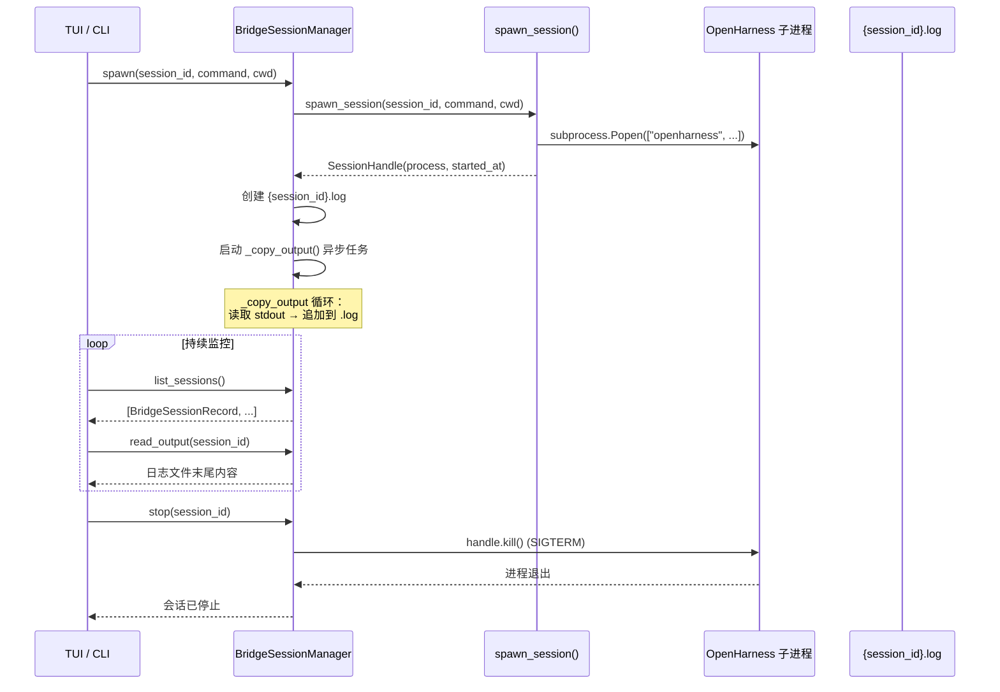

# Bridge 系统模块（Bridge）

## 摘要

`BridgeSessionManager` 管理 OpenHarness 的 `bridge-run` 子会话模式。当用户执行 `/bridge` 或 `bridge-run` 命令时，主会话在子进程中启动一个独立的 OpenHarness 实例，子会话的输出通过异步管道传回主会话显示。Bridge 模式用于在单一终端会话中运行隔离的子项目或并行实验。

## 你将了解

- `BridgeSessionManager` 的角色
- `bridge-run` 模式的触发与生命周期
- `spawn()` → `list_sessions()` → `read_output()` → `stop()` 完整流程
- 主会话与子会话的消息传递机制
- Bridge 与 Swarm 的区别与关系

## 范围

本模块涵盖 `src/openharness/bridge/` 下的会话管理和子进程运行逻辑。

---

## BridgeSessionManager 角色

`BridgeSessionManager` 是 `bridge-run` 模式的会话管理层，负责：

1. **创建子会话进程**（`spawn()`）
2. **跟踪会话列表**（`list_sessions()`）
3. **捕获子会话输出**（`read_output()` + 异步管道）
4. **停止子会话**（`stop()`）
5. **输出日志持久化**（`~/.openharness/data/bridge/{session_id}.log`）

```python
class BridgeSessionManager:
    def __init__(self) -> None:
        self._sessions: dict[str, SessionHandle] = {}      # session_id → 进程句柄
        self._commands: dict[str, str] = {}               # session_id → 命令
        self._output_paths: dict[str, Path] = {}           # session_id → 日志文件路径
        self._copy_tasks: dict[str, asyncio.Task[None]] = {}  # 异步复制协程

_DEFAULT_MANAGER: BridgeSessionManager | None = None

def get_bridge_manager() -> BridgeSessionManager:
    global _DEFAULT_MANAGER
    if _DEFAULT_MANAGER is None:
        _DEFAULT_MANAGER = BridgeSessionManager()
    return _DEFAULT_MANAGER
```

`src/openharness/bridge/manager.py` -> `BridgeSessionManager`

## 完整生命周期



图后解释：`spawn_session()` 内部调用 `subprocess.Popen()` 启动子 OpenHarness 进程。主会话不等待子进程退出，而是立即返回 `SessionHandle`。`_copy_output()` 异步任务持续将子进程的 stdout 追加到日志文件，主会话可通过 `read_output()` 实时查看子会话的运行状态。`stop()` 向子进程发送 SIGTERM 进行优雅停止。

## spawn()

```python
async def spawn(self, *, session_id: str, command: str, cwd: str | Path) -> SessionHandle:
    handle = await spawn_session(session_id=session_id, command=command, cwd=cwd)
    self._sessions[session_id] = handle
    self._commands[session_id] = command
    output_dir = get_data_dir() / "bridge"
    output_dir.mkdir(parents=True, exist_ok=True)
    output_path = output_dir / f"{session_id}.log"
    output_path.write_text("", encoding="utf-8")  # 清空旧内容
    self._output_paths[session_id] = output_path
    self._copy_tasks[session_id] = asyncio.create_task(self._copy_output(session_id, handle))
    return handle
```

`src/openharness/bridge/manager.py` -> `BridgeSessionManager.spawn`

`spawn_session()` 是 `session_runner.py` 中的底层函数，负责创建 `subprocess.Popen` 并返回 `SessionHandle`。

## read_output()

```python
def read_output(self, session_id: str, *, max_bytes: int = 12000) -> str:
    path = self._output_paths.get(session_id)
    if path is None or not path.exists():
        return ""
    content = path.read_text(encoding="utf-8", errors="replace")
    if len(content) > max_bytes:
        return content[-max_bytes:]  # 尾部截断
    return content
```

`src/openharness/bridge/manager.py` -> `BridgeSessionManager.read_output`

与 `BackgroundTaskManager.read_task_output()` 的设计一致：只读取日志文件末尾，防止大文件一次性加载导致内存问题。

## stop()

```python
async def stop(self, session_id: str) -> None:
    handle = self._sessions.get(session_id)
    if handle is None:
        raise ValueError(f"Unknown bridge session: {session_id}")
    await handle.kill()  # SessionHandle.kill() 实现
```

`src/openharness/bridge/manager.py` -> `BridgeSessionManager.stop`

`SessionHandle.kill()` 的默认行为是先 SIGTERM 后 SIGKILL（与 `BackgroundTaskManager.stop_task()` 一致）。

## 主会话与子会话的消息传递

Bridge 模式的消息传递是**单向**的：

- **子会话 → 主会话**：通过子进程的 stdout 管道，`_copy_output()` 协程将输出追加到日志文件。
- **主会话 → 子会话**：目前未实现。子会话是独立运行的 OpenHarness 实例，主会话无法向其发送命令或中断请求（`stop()` 只能终止进程，不能交互）。

这种设计适用于"启动后自主运行"的场景，如启动开发服务器、运行测试套件或执行长时间批处理任务。如果需要双向交互，应使用 Swarm 模式（Teammate 通过 Mailbox 通信）。

## Bridge vs Swarm

| 维度 | Bridge | Swarm |
|---|---|---|
| 进程模型 | 独立子进程 | 独立进程或协程 |
| 通信方式 | 单向 stdout 日志 | 双向 Mailbox（文件队列） |
| 协调者 | 无（子会话自主运行） | Leader 协调 Worker |
| 权限继承 | 不继承（独立权限） | 继承 + 审批机制 |
| 适用场景 | 并行实验、独立任务 | 协作分解、共同目标 |
| 生命周期管理 | `stop()` 终止进程 | `shutdown()` 优雅停止 + 重启 |

Bridge 用于隔离运行，Swarm 用于协作运行。两者可以组合使用：Bridge 子会话中启动 Swarm，多个 Swarm 在各自的 Bridge 中运行。

## 设计取舍

1. **日志文件 vs TTY 直通**：Bridge 选择将子会话输出写入日志文件而非直接透传到 TTY，主要目的是支持 `read_output()` 的随机读取和历史查看（UI 可以展示"回滚"查看早期输出）。代价是增加了文件系统写入延迟。对于需要实时交互式输入的场景（如 `vim`、`less`），这种设计不适用。

2. **无子会话到主会话的命令注入**：当前 Bridge 没有实现向子会话 stdin 写入的能力。如果子会话运行的是交互式 Agent，主会话无法中途注入指令（如停止、重试）。这是有意简化：Bridge 被设计为"fire-and-forget"任务管理，不承担协调职责。

## 风险

1. **子会话僵尸化**：如果主会话在 `stop()` 之前异常退出，`_copy_output()` 协程被取消，子进程可能成为孤儿进程（orphan）。虽然操作系统会继承父进程清理，但可能导致子会话工作目录被锁、临时文件未清理。补救措施是依赖操作系统的 `SIGHUP` 处理或容器层面的进程组管理。

2. **输出文件竞争写入**：`write_text("", encoding="utf-8")` 在 `spawn()` 中清空日志文件，同时 `_copy_output()` 可能在并发写入。清空操作只在 spawn 时执行一次，而 `_copy_output()` 只追加（`"ab"` 模式），两者无直接冲突。但如果 `read_output()` 在 `spawn()` 清空和 `_copy_output()` 首次写入之间被调用，返回空字符串，这在 UX 上可能造成短暂的白屏感。

3. **session_id 碰撞**：`spawn()` 接收调用方传入的 `session_id`，不做唯一性检查。如果两次 `spawn()` 使用相同的 `session_id`，后一次会覆盖前一次的句柄和日志路径，前一次会话的引用将丢失。调用方需要负责 `session_id` 的分配和唯一性保证。

---

## 证据引用

- `src/openharness/bridge/manager.py` -> `BridgeSessionManager` — 会话管理器类
- `src/openharness/bridge/manager.py` -> `BridgeSessionManager.spawn` — 子会话启动
- `src/openharness/bridge/manager.py` -> `BridgeSessionManager.list_sessions` — 会话列表
- `src/openharness/bridge/manager.py` -> `BridgeSessionManager.read_output` — 日志文件读取
- `src/openharness/bridge/manager.py` -> `BridgeSessionManager.stop` — 会话停止
- `src/openharness/bridge/manager.py` -> `BridgeSessionManager._copy_output` — 异步输出复制
- `src/openharness/bridge/manager.py` -> `BridgeSessionRecord` — UI 快照数据类
- `src/openharness/bridge/manager.py` -> `get_bridge_manager` — 单例访问器
- `src/openharness/bridge/session_runner.py` -> `spawn_session` — 底层子进程创建
- `src/openharness/bridge/session_runner.py` -> `SessionHandle` — 会话句柄
