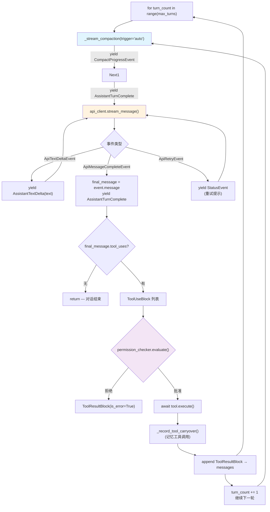

# Engine 模块（Engine）

## 摘要

`QueryEngine` 是 OpenHarness 的对话推理引擎，负责管理对话历史、驱动工具感知循环、处理流式事件和追踪使用成本。它通过 `run_query()` 协程实现 turn-by-turn 的 Agent 推理，并在每次模型调用前检查自动压缩（Auto-Compact）以防止上下文溢出。

## 你将了解

- QueryEngine 的核心职责
- `submit_message()` vs `continue_pending()` 的区别
- Query Loop 内部机制（`run_query()`）
- 消息模型（`ConversationMessage`、`TextBlock`、`ToolResultBlock`）
- StreamEvent 类型及其在循环中的作用
- CostTracker 的使用量追踪
- 正常流与异常流处理

## 范围

本模块涵盖 `src/openharness/engine/` 下的核心引擎逻辑：查询上下文、查询循环、消息模型、流事件和使用量追踪。

---

## QueryEngine 核心职责

`QueryEngine` 封装了对话引擎的所有状态：

```python
class QueryEngine:
    def __init__(
        self,
        *,
        api_client: SupportsStreamingMessages,
        tool_registry: ToolRegistry,
        permission_checker: PermissionChecker,
        cwd: str | Path,
        model: str,
        system_prompt: str,
        max_tokens: int = 4096,
        context_window_tokens: int | None = None,
        auto_compact_threshold_tokens: int | None = None,
        max_turns: int | None = 8,
        permission_prompt: PermissionPrompt | None = None,
        ask_user_prompt: AskUserPrompt | None = None,
        hook_executor: HookExecutor | None = None,
        tool_metadata: dict[str, object] | None = None,
    ) -> None:
        self._api_client = api_client
        self._tool_registry = tool_registry
        self._permission_checker = permission_checker
        self._cwd = Path(cwd).resolve()
        self._model = model
        self._system_prompt = system_prompt
        self._messages: list[ConversationMessage] = []
        self._cost_tracker = CostTracker()
```

`src/openharness/engine/query_engine.py` -> `QueryEngine.__init__`

核心属性：
- `_messages`：当前对话历史（`submit_message` 追加，`clear` 清空）
- `_cost_tracker`：累积使用量（input_tokens + output_tokens）
- `_tool_metadata`：跨轮次工具上下文（读文件历史、技能调用记录）

## submit_message() vs continue_pending()

**`submit_message(prompt)`** 追加新用户消息后启动完整查询循环：

```python
async def submit_message(self, prompt: str | ConversationMessage) -> AsyncIterator[StreamEvent]:
    user_message = (
        prompt if isinstance(prompt, ConversationMessage)
        else ConversationMessage.from_user_text(prompt)
    )
    if user_message.text.strip():
        remember_user_goal(self._tool_metadata, user_message.text)
    self._messages.append(user_message)
    context = QueryContext(...)
    async for event, usage in run_query(context, query_messages):
        if isinstance(event, AssistantTurnComplete):
            self._messages = list(query_messages)  # 更新对话历史
        if usage is not None:
            self._cost_tracker.add(usage)
        yield event
```

`src/openharness/engine/query_engine.py` -> `QueryEngine.submit_message`

**`continue_pending()`** 不追加新消息，直接继续已有的工具循环（用于处理被中断的后续推理）：

```python
async def continue_pending(self, *, max_turns: int | None = None) -> AsyncIterator[StreamEvent]:
    context = QueryContext(..., max_turns=max_turns if max_turns is not None else self._max_turns)
    async for event, usage in run_query(context, self._messages):
        if usage is not None:
            self._cost_tracker.add(usage)
        yield event
```

`src/openharness/engine/query_engine.py` -> `QueryEngine.continue_pending`

根本区别：

| 方面 | submit_message | continue_pending |
|---|---|---|
| 消息追加 | 追加用户消息 | 无 |
| 对话历史更新 | `AssistantTurnComplete` 时更新 | 不更新 |
| 使用量追踪 | 两者都追踪 | 两者都追踪 |
| 典型用途 | 新用户输入 | 恢复中断的工具调用 |

## Query Loop 内部机制



图后解释：`run_query()` 是异步生成器协程，每次 yield 返回 `(StreamEvent, UsageSnapshot | None)` 元组。每个 turn 包含：1) 自动压缩检查；2) API 流式调用；3) 工具执行（单工具顺序执行，多工具并发执行）；4) 工具结果追加到 messages 继续下一轮。当模型不再请求工具或达到 `max_turns` 时循环结束。

## 消息模型

### ConversationMessage

```python
class ConversationMessage(BaseModel):
    role: Literal["user", "assistant"]
    content: list[ContentBlock]  # TextBlock | ImageBlock | ToolUseBlock | ToolResultBlock

    @classmethod
    def from_user_text(cls, text: str) -> "ConversationMessage":
        return cls(role="user", content=[TextBlock(text=text)])

    @property
    def tool_uses(self) -> list[ToolUseBlock]:
        return [block for block in self.content if isinstance(block, ToolUseBlock)]

    def to_api_param(self) -> dict[str, Any]:
        return {"role": self.role, "content": [serialize_content_block(b) for b in self.content]}
```

`src/openharness/engine/messages.py` -> `ConversationMessage`

### ContentBlock 类型

| 类型 | 字段 | 说明 |
|---|---|---|
| `TextBlock` | `text: str` | 纯文本内容 |
| `ImageBlock` | `media_type`, `data` (base64), `source_path` | 多模态图片 |
| `ToolUseBlock` | `id`, `name`, `input` | 模型请求的工具调用 |
| `ToolResultBlock` | `tool_use_id`, `content`, `is_error` | 工具执行结果 |

```python
class ToolUseBlock(BaseModel):
    type: Literal["tool_use"] = "tool_use"
    id: str = Field(default_factory=lambda: f"toolu_{uuid4().hex}")
    name: str
    input: dict[str, Any] = Field(default_factory=dict)
```

`src/openharness/engine/messages.py` -> `ToolUseBlock`

## StreamEvent 类型

所有流事件均实现 `StreamEvent` 接口：

| 事件类型 | 字段 | 触发时机 |
|---|---|---|
| `AssistantTextDelta` | `text: str` | 模型逐 token 输出文本 |
| `AssistantTurnComplete` | `message: ConversationMessage`, `usage: UsageSnapshot` | 模型停止并输出完整回复 |
| `ToolExecutionStarted` | `tool_name`, `tool_input` | 工具开始执行 |
| `ToolExecutionCompleted` | `tool_name`, `output`, `is_error` | 工具执行完成 |
| `StatusEvent` | `message: str` | 内部状态提示（重试、压缩等） |
| `ErrorEvent` | `message: str` | API 或网络错误 |
| `CompactProgressEvent` | `phase`, `trigger`, `attempt`, `message` | 自动压缩进度 |

```python
class StatusEvent(StreamEvent):
    message: str

class ErrorEvent(StreamEvent):
    message: str

class ToolExecutionStarted(StreamEvent):
    tool_name: str
    tool_input: dict[str, Any]

class ToolExecutionCompleted(StreamEvent):
    tool_name: str
    output: str
    is_error: bool
```

`src/openharness/engine/stream_events.py` -> 事件类型定义

`run_query()` 在工具执行之间 yield `ToolExecutionStarted` 和 `ToolExecutionCompleted` 事件，允许上层（QueryEngine / Bridge / OHMO）将这些事件渲染为 UI 进度提示或发送给 IM 渠道。

## CostTracker

```python
class CostTracker:
    def __init__(self) -> None:
        self._usage = UsageSnapshot()

    def add(self, usage: UsageSnapshot) -> None:
        self._usage = UsageSnapshot(
            input_tokens=self._usage.input_tokens + usage.input_tokens,
            output_tokens=self._usage.output_tokens + usage.output_tokens,
        )

    @property
    def total(self) -> UsageSnapshot:
        return self._usage
```

`src/openharness/engine/cost_tracker.py` -> `CostTracker`

`CostTracker` 在每次 API 调用完成时（`AssistantTurnComplete` 事件携带 `usage`）通过 `self._cost_tracker.add(usage)` 累积计数。`QueryEngine.total_usage` 属性暴露聚合结果，供 UI 显示或日志记录。

## 异常处理

### Prompt 过长的反应式压缩

```python
async def run_query(self, context: QueryContext, messages: list[ConversationMessage]):
    try:
        async for event in context.api_client.stream_message(...):
            ...
    except Exception as exc:
        error_msg = str(exc)
        if not reactive_compact_attempted and _is_prompt_too_long_error(exc):
            reactive_compact_attempted = True
            yield StatusEvent(message=REACTIVE_COMPACT_STATUS_MESSAGE)
            async for event, usage in _stream_compaction(trigger="reactive", force=True):
                yield event, usage
            messages, was_compacted = last_compaction_result
            if was_compacted:
                continue  # 重试
        if "connect" in error_msg.lower() or "timeout" in error_msg.lower():
            yield ErrorEvent(message=f"Network error: {error_msg}")
        else:
            yield ErrorEvent(message=f"API error: {error_msg}")
```

`src/openharness/engine/query.py` -> `run_query` 中的异常处理

当 API 抛出"prompt too long"错误时，引擎自动触发一次反应式压缩（reactive compaction）：先用廉价方式压缩旧工具结果，若仍超限则执行 LLM 摘要压缩。压缩成功后重试 API 调用，否则抛出 `ErrorEvent` 结束循环。

### MaxTurnsExceeded

```python
class MaxTurnsExceeded(RuntimeError):
    def __init__(self, max_turns: int) -> None:
        super().__init__(f"Exceeded maximum turn limit ({max_turns})")
        self.max_turns = max_turns
```

`src/openharness/engine/query.py` -> `MaxTurnsExceeded`

当达到 `max_turns` 限制时，`run_query()` 抛出 `MaxTurnsExceeded`，由 `QueryEngine` 调用方（如 OHMO 的 `_stream_engine_message()`）捕获并转换为友好的用户消息。

## 设计取舍

1. **AsyncIterator 返回 `(StreamEvent, UsageSnapshot | None)` 元组**：`run_query()` 返回事件和用量元组，而非单独的事件流。`QueryEngine.submit_message()` 在 `AssistantTurnComplete` 时更新消息历史。这种设计将"消息追加时机"的控制权交给调用方，但意味着调用方必须正确解构元组——错误地丢弃 `usage` 会导致用量泄漏（CostTracker 不计数）。

2. **工具元数据作为跨轮次隐式状态**：`tool_metadata` 是一个 dict，存储读文件历史、技能调用记录等，通过 `_record_tool_carryover()` 在每次工具执行后更新。这些信息被注入到下一次 API 调用的工具调用中（如"你之前读取了文件 X"），但不属于 `ConversationMessage` 的一部分。这使其不被会话历史持久化，需要会话快照单独保存。

## 风险

1. **循环终止条件的不确定性**：若 API 返回 `final_message` 为空（既无 tool_uses 也无文本），`run_query()` 会进入下一轮循环直到 `max_turns` 耗尽。虽然 `final_message is None` 会抛出 RuntimeError（作为防御性检查），但如果模型在有效响应中仅返回空白文本，引擎会无意义地消耗 API 调用次数。

2. **并发工具执行的副作用风险**：`asyncio.gather(*[_run(tc) for tc in tool_calls])` 并发执行多个工具。当多个工具操作同一文件系统路径（如 `read_file` 和 `write_file` 并发）时，可能产生竞态条件。当前无文件级锁或操作序列化机制保护。

3. **API 重试的退避策略**：`ApiRetryEvent` 仅告知调用方重试延迟和次数，不包含自动退避逻辑。如果 API 因 rate limit 返回错误，`run_query()` 会在每次重试之间 yield 状态提示，但不会自动增加延迟。若 API 的 rate limit 窗口较长（如 60 秒），持续的即时重试可能导致账户级限封。

---

## 证据引用

- `src/openharness/engine/query_engine.py` -> `QueryEngine.__init__` — 引擎初始化
- `src/openharness/engine/query_engine.py` -> `QueryEngine.submit_message` — 提交消息入口
- `src/openharness/engine/query_engine.py` -> `QueryEngine.continue_pending` — 继续待处理循环
- `src/openharness/engine/query_engine.py` -> `QueryEngine.has_pending_continuation` — 待处理判断
- `src/openharness/engine/query_engine.py` -> `QueryEngine.total_usage` — 成本追踪属性
- `src/openharness/engine/query.py` -> `run_query` — 查询循环核心
- `src/openharness/engine/query.py` -> `QueryContext` — 查询上下文 dataclass
- `src/openharness/engine/query.py` -> `MaxTurnsExceeded` — 轮次超限异常
- `src/openharness/engine/query.py` -> `_execute_tool_call` — 工具执行逻辑
- `src/openharness/engine/query.py` -> `_is_prompt_too_long_error` — 超长检测
- `src/openharness/engine/messages.py` -> `ConversationMessage` — 对话消息模型
- `src/openharness/engine/messages.py` -> `TextBlock` — 文本块
- `src/openharness/engine/messages.py` -> `ToolUseBlock` — 工具调用块
- `src/openharness/engine/messages.py` -> `ToolResultBlock` — 工具结果块
- `src/openharness/engine/messages.py` -> `serialize_content_block` — 内容块序列化
- `src/openharness/engine/messages.py` -> `assistant_message_from_api` — API 响应转本地消息
- `src/openharness/engine/cost_tracker.py` -> `CostTracker` — 使用量累积器
- `src/openharness/engine/cost_tracker.py` -> `CostTracker.add` — 使用量追加
- `src/openharness/engine/stream_events.py` -> `StreamEvent` — 流事件基类
- `src/openharness/engine/stream_events.py` -> `AssistantTextDelta` — 文本增量事件
- `src/openharness/engine/stream_events.py` -> `AssistantTurnComplete` — 轮次完成事件
- `src/openharness/engine/stream_events.py` -> `ToolExecutionStarted` — 工具开始事件
- `src/openharness/engine/stream_events.py` -> `ToolExecutionCompleted` — 工具完成事件
- `src/openharness/engine/stream_events.py` -> `ErrorEvent` — 错误事件
- `src/openharness/engine/stream_events.py` -> `CompactProgressEvent` — 压缩进度事件
