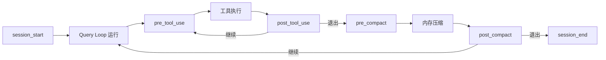

# 钩子系统（Hooks）

## 摘要

钩子系统是 OpenHarness 的生命周期事件注入框架，允许外部脚本、HTTP 服务或 AI 模型在预定义的系统事件点（会话开始/结束、工具使用前后、内存压缩前后）执行自定义逻辑。通过 `HookRegistry` 集中注册、`HookExecutor` 统一调度，钩子实现了无侵入式的行为扩展与验证机制。

## 你将了解

- 钩子系统的目的与使用场景
- 四种钩子类型的定义与配置
- `HookExecutor` 的同步/异步执行模型
- 生命周期事件完整列表
- 钩子与 Settings 的集成方式
- 架构设计取舍与潜在风险

## 范围

本文档覆盖 `src/openharness/hooks/` 目录下的执行器、类型定义、事件枚举与加载器。

---

## 1. 钩子系统的目的

钩子系统的核心价值在于提供**无侵入式的行为注入**。开发者无需修改 OpenHarness 核心代码，即可在以下场景中插入自定义逻辑：

- **安全验证**：在工具执行前验证参数是否符合安全策略
- **审计日志**：记录所有工具调用、API 请求与压缩事件
- **内容修改**：在提示词发送给模型前进行动态注入
- **流量转发**：将事件数据 POST 到外部监控服务
- **条件阻断**：根据 AI 模型判断结果决定是否继续执行

---

## 2. 钩子类型

OpenHarness 定义了四种钩子类型，每种类型有不同的触发方式与数据模型：

### 2.1 CommandHookDefinition（命令钩子）

```python
# src/openharness/hooks/schemas.py -> CommandHookDefinition
class CommandHookDefinition(BaseModel):
    type: Literal["command"] = "command"
    command: str              # shell 命令模板，$ARGUMENTS 会被替换为 JSON 序列化的 payload
    timeout_seconds: int = 30  # 命令超时时间
    matcher: str | None = None # fnmatch 模式，匹配 payload 中的 tool_name / prompt / event
    block_on_failure: bool = False  # 命令失败时是否阻断后续流程
```

**用途**：执行本地 Shell 脚本，适合轻量级的外部集成。

### 2.2 HttpHookDefinition（HTTP 钩子）

```python
# src/openharness/hooks/schemas.py -> HttpHookDefinition
class HttpHookDefinition(BaseModel):
    type: Literal["http"] = "http"
    url: str                           # 目标 URL
    headers: dict[str, str] = {}       # 自定义请求头
    timeout_seconds: int = 30
    matcher: str | None = None
    block_on_failure: bool = False
```

**用途**：向外部 HTTP 服务推送事件数据，适合与 CI/CD 系统、监控平台集成。

### 2.3 PromptHookDefinition（提示词钩子）

```python
# src/openharness/hooks/schemas.py -> PromptHookDefinition
class PromptHookDefinition(BaseModel):
    type: Literal["prompt"] = "prompt"
    prompt: str             # 验证用提示词模板
    model: str | None = None  # 使用的模型，默认使用系统默认模型
    timeout_seconds: int = 30
    matcher: str | None = None
    block_on_failure: bool = True  # 默认阻断（安全性优先）
```

**用途**：通过 AI 模型验证事件条件是否满足。模型需要返回严格 JSON：`{"ok": true}` 或 `{"ok": false, "reason": "..."}`。

### 2.4 AgentHookDefinition（Agent 钩子）

```python
# src/openharness/hooks/schemas.py -> AgentHookDefinition
class AgentHookDefinition(BaseModel):
    type: Literal["agent"] = "agent"
    prompt: str             # Agent 级验证提示词，更深入的分析
    model: str | None = None
    timeout_seconds: int = 60  # Agent 模式超时更长
    matcher: str | None = None
    block_on_failure: bool = True
```

**用途**：执行更深入的模型推理验证，Agent 模式会在决策前进行显式推理过程。

---

## 3. 生命周期事件



**图后解释**：OpenHarness 的完整生命周期包含六个可挂载钩子的事件点。`session_start` 和 `session_end` 标记会话边界；`pre_tool_use` 和 `post_tool_use` 包裹每次工具调用；`pre_compact` 和 `post_compact` 包裹内存压缩操作。

---

## 4. HookExecutor 的执行模型

`HookExecutor` 是所有钩子的统一调度器：

```python
# src/openharness/hooks/executor.py -> HookExecutor.execute
async def execute(self, event: HookEvent, payload: dict[str, Any]) -> AggregatedHookResult:
    """Execute all matching hooks for an event."""
    results: list[HookResult] = []
    for hook in self._registry.get(event):
        if not _matches_hook(hook, payload):
            continue
        if isinstance(hook, CommandHookDefinition):
            results.append(await self._run_command_hook(hook, event, payload))
        elif isinstance(hook, HttpHookDefinition):
            results.append(await self._run_http_hook(hook, event, payload))
        elif isinstance(hook, PromptHookDefinition):
            results.append(await self._run_prompt_like_hook(hook, event, payload, agent_mode=False))
        elif isinstance(hook, AgentHookDefinition):
            results.append(await self._run_prompt_like_hook(hook, event, payload, agent_mode=True))
    return AggregatedHookResult(results=results)
```

**执行流程**：

1. 从 `HookRegistry` 获取事件对应的所有钩子
2. 对每个钩子检查 `matcher` 过滤条件（基于 `tool_name`、`prompt` 或 `event` 的 fnmatch 匹配）
3. 根据钩子类型分发到对应的执行方法
4. 收集所有结果，封装为 `AggregatedHookResult`

**错误处理**：

- **命令钩子超时**：进程被 `process.kill()` 终止，返回 `HookResult(success=False, blocked=block_on_failure)`
- **HTTP 钩子异常**：捕获所有异常，返回 `HookResult(success=False, blocked=block_on_failure)`
- **Prompt/Agent 钩子解析失败**：降级解析（纯文本 `"ok"`/`"true"`/`"yes"` 视为通过），否则返回 `{"ok": false, "reason": text}`

**环境变量注入**：命令钩子在执行时会注入两个环境变量：

- `OPENHARNESS_HOOK_EVENT`：事件名称
- `OPENHARNESS_HOOK_PAYLOAD`：JSON 序列化的完整 payload

---

## 5. 钩子与 Settings 的集成

钩子通过 Settings 的 `hooks` 字典进行配置：

```python
# src/openharness/hooks/loader.py -> load_hook_registry
def load_hook_registry(settings, plugins=None) -> HookRegistry:
    registry = HookRegistry()
    # 从 settings.hooks 加载（用户配置）
    for raw_event, hooks in settings.hooks.items():
        try:
            event = HookEvent(raw_event)
        except ValueError:
            continue
        for hook in hooks:
            registry.register(event, hook)
    # 从插件加载
    for plugin in plugins or []:
        if not plugin.enabled:
            continue
        for raw_event, hooks in plugin.hooks.items():
            # ...
    return registry
```

插件贡献的钩子与 Settings 中的钩子合并到同一个 `HookRegistry` 中，按注册顺序执行。

---

## 6. 钩子配置格式

### 6.1 平面格式（Settings / 插件 hooks.json）

```json
{
  "pre_tool_use": [
    {
      "type": "command",
      "command": "echo $ARGUMENTS",
      "matcher": "bash",
      "block_on_failure": false,
      "timeout_seconds": 10
    }
  ],
  "post_compact": [
    {
      "type": "http",
      "url": "https://audit.example.com/events",
      "headers": {"Authorization": "Bearer ..."},
      "block_on_failure": false
    }
  ]
}
```

### 6.2 结构化格式（`hooks/hooks.json` with hooks 数组）

```json
{
  "hooks": {
    "pre_tool_use": [
      {
        "matcher": "write_file",
        "hooks": [
          {
            "type": "prompt",
            "prompt": "Validate this file write operation: $ARGUMENTS",
            "block_on_failure": true
          }
        ]
      }
    ]
  }
}
```

结构化格式支持 `matcher` 在外层声明，内层 `hooks` 数组复用同一匹配条件。

---

## 7. 设计取舍

### 取舍 1：JSON Schema 驱动的钩子验证

所有钩子定义通过 Pydantic 模型验证（`BaseModel.model_validate`），而非动态代码执行。这一设计确保了钩子配置的类型安全，防止因配置错误导致运行时崩溃。但这也意味着无法在钩子中执行任意 Python 代码，功能边界受限。

### 取舍 2：阻塞式与容错式的混合设计

`block_on_failure` 字段允许每个钩子独立决定失败时的行为（阻塞或容错）。这一细粒度控制提升了灵活性，但增加了配置复杂度，且多个钩子的 `block_on_failure` 行为组合后的整体效果难以预测。

---

## 8. 风险

1. **模型注入攻击**：PromptHook 和 AgentHook 使用 `$ARGUMENTS` 替换将原始 payload 嵌入提示词，如果 payload 来自不可信源（如模型自身生成的工具参数），攻击者可能通过精心构造的工具参数实现提示词注入（Prompt Injection），绕过验证钩子。

2. **无限循环触发**：`post_tool_use` 钩子如果注册了需要调用工具的外部脚本（如 HTTP 钩子调用了触发工具执行的 API），可能导致工具调用触发钩子、钩子触发工具的无限递归。

3. **凭证泄露风险**：`HttpHookDefinition` 支持自定义 `headers`，如果在其中硬编码 API Token，该 Token 将以明文形式存储在配置文件中，任何能访问配置目录的用户都可以读取。

4. **PromptHook 的非确定性**：PromptHook 依赖 AI 模型的 JSON 输出解析来判断验证结果。模型生成的 JSON 可能因模型版本、提示词微调或随机性而存在细微差异（如多余空格、大小写不一致），导致解析失败。

---

## 9. 证据引用

- `src/openharness/hooks/schemas.py` -> `CommandHookDefinition` — 命令钩子数据模型
- `src/openharness/hooks/schemas.py` -> `HttpHookDefinition` — HTTP 钩子数据模型
- `src/openharness/hooks/schemas.py` -> `PromptHookDefinition` — 提示词钩子数据模型
- `src/openharness/hooks/schemas.py` -> `AgentHookDefinition` — Agent 钩子数据模型
- `src/openharness/hooks/events.py` -> `HookEvent` — 六事件枚举定义
- `src/openharness/hooks/executor.py` -> `HookExecutor.execute` — 事件分发主循环
- `src/openharness/hooks/executor.py` -> `HookExecutor._run_command_hook` — Shell 子进程执行与环境变量注入
- `src/openharness/hooks/executor.py` -> `HookExecutor._run_http_hook` — HTTP POST 执行与超时处理
- `src/openharness/hooks/executor.py` -> `HookExecutor._run_prompt_like_hook` — 模型验证流程与 JSON 解析降级
- `src/openharness/hooks/loader.py` -> `load_hook_registry` — Settings + 插件双源合并加载
