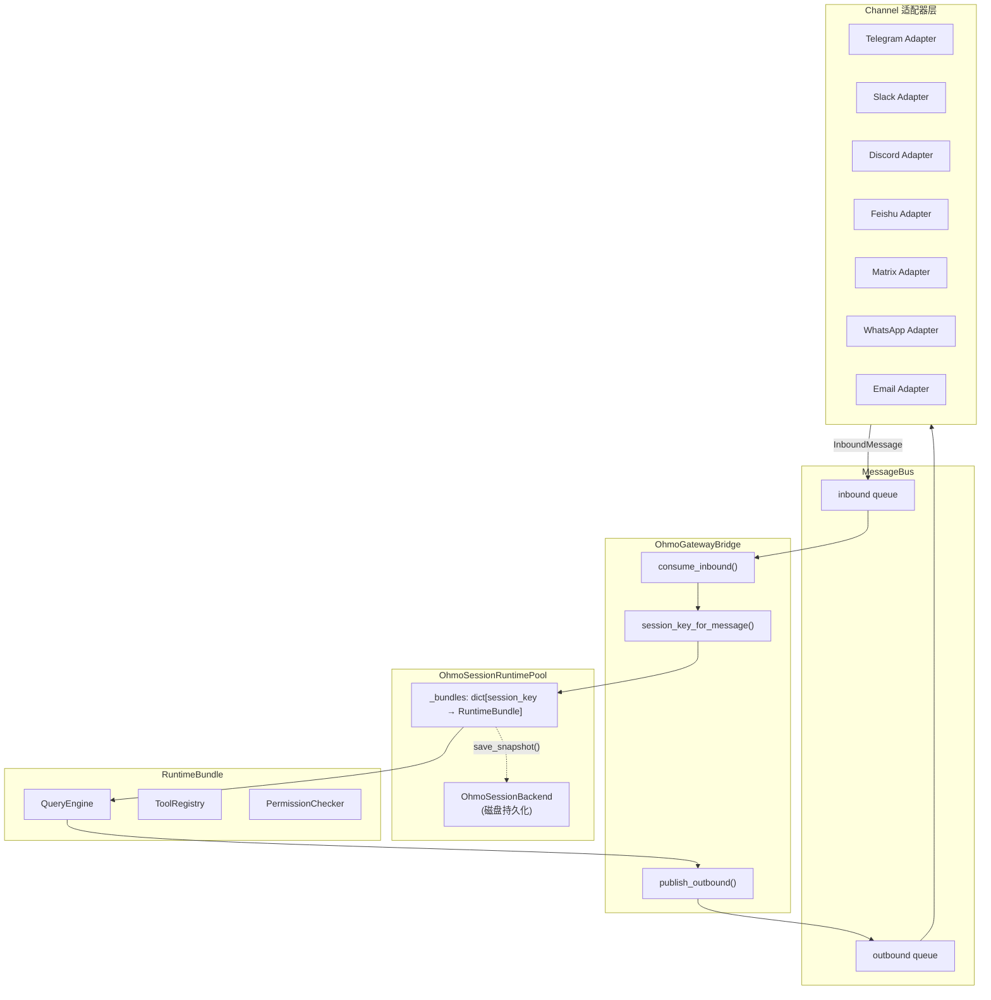

# OHMO 子系统模块（OHMO）

## 摘要

OHMO（Oh My Harness）是一个消息渠道 Gateway 服务，将 OpenHarness Agent 的对话能力通过 Telegram、Slack、Discord、飞书等即时通讯平台暴露给用户。它以独立守护进程运行，通过 `MessageBus` 连接多个 Channel 适配器，通过 `OhmoSessionRuntimePool` 管理每个 chat/thread 的独立会话，并通过 `OhmoGatewayBridge` 编排消息流。

## 你将了解

- OHMO 与 OpenHarness 的关系：Gateway 模式 vs CLI 模式
- Gateway 架构：Service、RuntimePool、Bridge、Router
- OhmoSessionRuntimePool 的运行时 bundle 管理
- Channel 桥接：MessageBus 与 QueryEngine 的集成
- MessageBus 的消息队列模型
- 支持的 Channel 适配器
- OHMO 会话管理与会话快照
- 中文/英文进度格式化

## 范围

本模块涵盖 `ohmo/` 目录下的 Gateway 服务、Channel 适配器、MessageBus、SessionStorage 和格式化逻辑。

---

## OHMO 与 OpenHarness 的关系

OpenHarness 有两种运行模式：

| 模式 | 入口 | 交互方式 | 会话管理 |
|---|---|---|---|
| **CLI 模式** | `python -m openharness` | 终端直接交互 | TUI 内内存管理 |
| **Gateway 模式（OHMO）** | `ohmo gateway run` | 远程 IM 渠道 | 每个 chat_id 对应独立 RuntimeBundle |

OHMO 是 OpenHarness 的**远程 Gateway**，将 Agent 能力以消息机器人的形式暴露到用户日常使用的 IM 平台中。

`src/openharness/engine/query_engine.py` -> `QueryEngine` （Gateway 使用相同的引擎）

`ohmo/gateway/service.py` -> `OhmoGatewayService` （Gateway 主入口）

## Gateway 架构



图后解释：Channel 适配器接收 IM 平台的 webhook 消息，推入 MessageBus 的入站队列。`OhmoGatewayBridge` 从队列消费消息，通过 `session_key_for_message()` 将消息路由到对应的 `RuntimeBundle`。`OhmoSessionRuntimePool` 维护所有活跃会话，若会话首次出现则通过 `build_runtime()` 创建新的 `RuntimeBundle`（包含 `QueryEngine`、`ToolRegistry`、`PermissionChecker`）。会话结束时调用 `save_snapshot()` 将对话历史和工具元数据持久化到磁盘。

## OhmoGatewayService

`OhmoGatewayService` 是 Gateway 进程的主包装器，负责进程生命周期管理：

```python
class OhmoGatewayService:
    def __init__(self, cwd, workspace) -> None:
        self._bus = MessageBus()
        self._runtime_pool = OhmoSessionRuntimePool(
            cwd=self._cwd, workspace=self._workspace,
            provider_profile=self._config.provider_profile,
        )
        self._bridge = OhmoGatewayBridge(
            bus=self._bus, runtime_pool=self._runtime_pool,
            restart_gateway=self.request_restart,
        )
        self._manager = ChannelManager(build_channel_manager_config(self._config), self._bus)

    async def run_foreground(self) -> int:
        bridge_task = asyncio.create_task(self._bridge.run())
        manager_task = asyncio.create_task(self._manager.start_all())
        stop_event = asyncio.Event()
        await stop_event.wait()
        # 清理资源...
```

`ohmo/gateway/service.py` -> `OhmoGatewayService`

启动时创建三个并发任务：`OhmoGatewayBridge.run()`（消息路由循环）、`ChannelManager.start_all()`（Channel 适配器生命周期）和重启通知发布。接收 SIGTERM/SIGINT 时优雅关闭。

## OhmoSessionRuntimePool

```python
class OhmoSessionRuntimePool:
    """Maintain one runtime bundle per chat/thread session."""

    def __init__(self, ..., provider_profile: str) -> None:
        self._session_backend = OhmoSessionBackend(self._workspace)
        self._bundles: dict[str, RuntimeBundle] = {}

    async def get_bundle(self, session_key: str, latest_user_prompt: str | None = None) -> RuntimeBundle:
        bundle = self._bundles.get(session_key)
        if bundle is not None:
            # 复用已有会话：更新 system prompt
            bundle.engine.set_system_prompt(self._runtime_system_prompt(bundle, latest_user_prompt))
            return bundle
        # 创建新会话
        snapshot = self._session_backend.load_latest_for_session_key(session_key)
        bundle = await build_runtime(..., restore_messages=snapshot.get("messages"), ...)
        await start_runtime(bundle)
        self._bundles[session_key] = bundle
        return bundle
```

`ohmo/gateway/runtime.py` -> `OhmoSessionRuntimePool.get_bundle`

`session_key` 的格式由 `session_key_for_message()` 决定，通常为 `{channel}:{chat_id}`，保证不同 Channel 中的同名 chat 不会相互混淆。

## Channel 桥接

`OhmoGatewayBridge` 是 MessageBus 与 SessionRuntime 之间的桥梁：

```python
class OhmoGatewayBridge:
    async def run(self) -> None:
        self._running = True
        while self._running:
            try:
                message = await asyncio.wait_for(self._bus.consume_inbound(), timeout=1.0)
            except asyncio.TimeoutError:
                continue

            if message.content.strip() == "/stop":
                await self._handle_stop(message, session_key)
                continue
            if message.content.strip() == "/restart":
                await self._handle_restart(message, session_key)
                continue
            # 中断旧任务
            await self._interrupt_session(session_key, reason="replaced by newer user message")
            # 启动新任务
            task = asyncio.create_task(self._process_message(message, session_key))
            self._session_tasks[session_key] = task

    async def _process_message(self, message, session_key: str) -> None:
        async for update in self._runtime_pool.stream_message(message, session_key):
            if update.kind == "final":
                reply = update.text
                continue
            await self._bus.publish_outbound(OutboundMessage(channel=..., content=update.text, ...))
```

`ohmo/gateway/bridge.py` -> `OhmoGatewayBridge.run`

关键设计：`/stop` 和 `/restart` 是保留指令，会中断当前正在运行的任务。在 `stream_message()` 期间，新消息会自动**替换**旧任务，确保用户的新指令优先执行。

## MessageBus 模型

MessageBus 是入站/出站双队列的消息中枢：

- **入站队列**（Inbound）：Channel 适配器将用户消息推入，等待 Bridge 消费。
- **出站队列**（Outbound）：Bridge 将 Agent 回复推入，等待 Channel 适配器投递到 IM 平台。

```python
# Inbound: Channel → MessageBus
await self._bus.publish_inbound(InboundMessage(channel=channel, chat_id=chat_id, sender_id=sender_id, content=content))

# Outbound: Bridge → MessageBus → Channel
await self._bus.publish_outbound(OutboundMessage(channel=channel, chat_id=chat_id, content=reply, metadata={...}))
```

`ohmo/gateway/bridge.py` -> `_process_message` 中的 `publish_outbound`

`ohmo/channels/bus/queue.py` 中的 `MessageBus` 实现。入站/出站分离使 Channel 适配器和 Bridge 可以独立扩缩容（未来可扩展为多进程架构）。

## Channel 适配器

支持以下 Channel，通过 `channel` 字段路由消息：

| Channel | 说明 | 配置密钥 |
|---|---|---|
| `telegram` | Telegram Bot | `OHMO_TELEGRAM_BOT_TOKEN` |
| `slack` | Slack App | `OHMO_SLACK_BOT_TOKEN` |
| `discord` | Discord Bot | `OHMO_DISCORD_BOT_TOKEN` |
| `feishu` | 飞书（Lark） | `OHMO_FEISHU_APP_ID` |
| `matrix` | Matrix / Element | `OHMO_MATRIX Homeserver` |
| `whatsapp` | WhatsApp | `OHMO_WHATSAPP_*` |
| `email` | Email (IMAP/SMTP) | `OHMO_EMAIL_*` |
| `dingtalk` | 钉钉 | `OHMO_DINGTALK_*` |
| `qq` | QQ | `OHMO_QQ_*` |
| `wechat` | 企业微信 | `OHMO_WECHAT_*` |

`ohmo/gateway/runtime.py` -> `_format_channel_progress` 中的 `channel not in {...}` 判断

`ohmo/channels/adapter.py` 提供适配器基类 `ChannelAdapter`。

## 会话管理与会话快照

每个会话的 `RuntimeBundle` 由 `OhmoSessionBackend` 管理持久化：

```python
async def _save_snapshot(self, bundle: RuntimeBundle, session_key: str, user_prompt: str) -> None:
    tool_metadata = getattr(bundle.engine, "tool_metadata", {}) or {}
    self._session_backend.save_snapshot(
        cwd=self._cwd,
        model=bundle.current_settings().model,
        system_prompt=self._runtime_system_prompt(bundle, user_prompt),
        messages=bundle.engine.messages,
        usage=bundle.engine.total_usage,
        session_id=bundle.session_id,
        session_key=session_key,
        tool_metadata=tool_metadata,
    )
```

`ohmo/gateway/runtime.py` -> `_save_snapshot`

快照包含：对话历史（`messages`）、工具元数据（`tool_metadata`）、模型选择、使用量（`CostTracker`）。重启 Gateway 时，`load_latest_for_session_key()` 恢复对话上下文，使用户感受不到 Gateway 重启。

## 中文/英文进度格式化

`_format_channel_progress()` 根据消息内容自动判断语言，生成适合 IM 渠道的进度提示：

```python
def _prefers_chinese_progress(content: str) -> bool:
    cjk_count = sum(1 for char in content if 0x4E00 <= ord(char) <= 0x9FFF)
    latin_count = sum(1 for char in content if ("A" <= char <= "Z") or ("a" <= char <= "z"))
    if cjk_count == 0: return False
    if latin_count == 0: return True
    return cjk_count >= latin_count
```

`ohmo/gateway/runtime.py` -> `_prefers_chinese_progress`

示例映射：

| 内部状态 | 中文进度 | 英文进度 |
|---|---|---|
| `thinking` | "🤔 想一想…" | "🤔 Thinking…" |
| `tool_hint` | "🛠️ 正在使用 read_file: src/..." | "🛠️ Using read_file: src/..." |
| `status: auto-compacting` | "🧠 聊天有点长啦，我先帮你蹦蹦跳跳压缩一下记忆，马上带着重点回来～" | "🧠 This chat is getting long — I'm doing a quick memory squeeze..." |
| `compact_retry` | "🔁 压缩记忆这一步有点卡，我换个方式再试一次。" | "🔁 Compaction got stuck, trying a lighter retry." |

## 设计取舍

1. **会话存储后端**：选择文件系统的 `OhmoSessionBackend` 而非数据库（如 SQLite）。优势是无外部依赖、部署简单；代价是并发写入同一会话时缺乏事务保护。不过 OHMO 的设计是单进程单 Gateway，多个 Channel 适配器共享同一进程，因此并发写入同一 session_key 的情况在实际使用中极少发生。

2. **每消息 /stop 和 /restart 指令检测**：在 `OhmoGatewayBridge.run()` 循环中以纯字符串比较判断保留指令，而非通过命令解析系统。这是最简实现，但无法处理带参数的变体（如 `/stop@bot`）。优势是零依赖、零延迟；劣势是扩展性受限。

## 风险

1. **Gateway 单点故障**：Gateway 以单进程运行，若因未捕获异常崩溃，所有活跃会话中断，用户需要重新发送消息触发新会话创建。虽然 `_save_snapshot()` 保护了对话历史，但运行中的中间结果（如正在执行的工具调用）会丢失。

2. **Channel 适配器的 rate limit**：不同 IM 平台有不同的 API 限速策略（如 Telegram 30 msg/s，Slack 1 req/s）。`MessageBus` 的出站队列在高吞吐场景下可能积压，导致回复延迟。目前没有背压（backpressure）机制。

3. **语言判断启发式的局限**：`_prefers_chinese_progress()` 仅基于字符集的统计 heuristics，在包含少量中文的英文技术文档场景下可能误判。建议用户显式指定语言偏好而非依赖自动判断。

---

## 证据引用

- `ohmo/gateway/service.py` -> `OhmoGatewayService` — Gateway 主服务包装器
- `ohmo/gateway/service.py` -> `OhmoGatewayService.run_foreground` — 前台运行循环与信号处理
- `ohmo/gateway/service.py` -> `start_gateway_process` — 守护进程启动
- `ohmo/gateway/runtime.py` -> `OhmoSessionRuntimePool` — Session Bundle 池
- `ohmo/gateway/runtime.py` -> `OhmoSessionRuntimePool.get_bundle` — 会话获取或创建
- `ohmo/gateway/runtime.py` -> `OhmoSessionRuntimePool.stream_message` — 消息处理流
- `ohmo/gateway/runtime.py` -> `_save_snapshot` — 会话快照保存
- `ohmo/gateway/runtime.py` -> `_prefers_chinese_progress` — 语言自动判断
- `ohmo/gateway/runtime.py` -> `_format_channel_progress` — 进度格式化
- `ohmo/gateway/runtime.py` -> `_CHANNEL_THINKING_PHRASES` — 中文进度短语列表
- `ohmo/gateway/bridge.py` -> `OhmoGatewayBridge.run` — Bridge 主循环
- `ohmo/gateway/bridge.py` -> `_interrupt_session` — 任务中断机制
- `ohmo/gateway/bridge.py` -> `_format_gateway_error` — 错误格式化
- `ohmo/channels/bus/queue.py` -> `MessageBus` — 消息队列
- `ohmo/channels/adapter.py` -> `ChannelAdapter` — 适配器基类
- `src/openharness/engine/query_engine.py` -> `QueryEngine` — Gateway 使用的底层引擎
