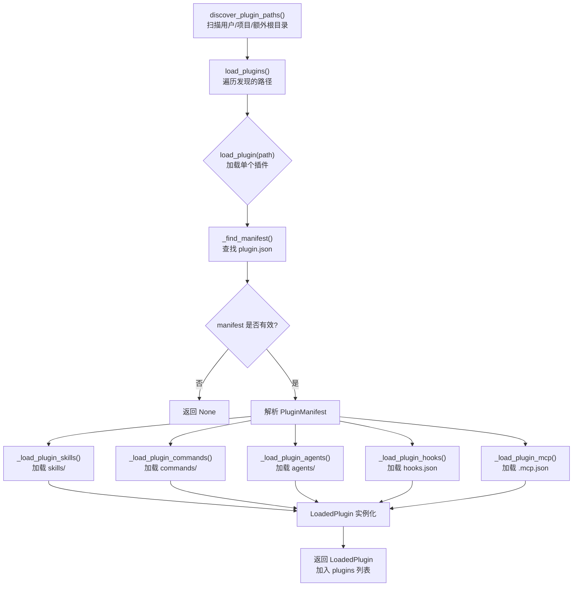

# 插件系统（Plugins）

## 摘要

插件系统是 OpenHarness 的核心扩展机制，允许用户通过自包含的插件包向系统注入自定义技能（Skills）、命令（Commands）、Agent 定义（Agents）、钩子（Hooks）以及 MCP 服务器配置。插件遵循固定的目录结构规范，通过 `plugin.json` 清单文件声明自身身份与贡献内容，由 `PluginLoader` 在启动时自动发现、加载与注册。

## 你将了解

- 插件系统的目的与扩展模型
- 插件的目录结构与清单文件格式
- 插件发现路径与加载流程
- 各组件的加载机制（Skills、Commands、Agents、Hooks、MCP）
- `LoadedPlugin` 数据结构
- 插件的安装与卸载
- 内置插件与用户插件的区别
- 架构设计取舍与潜在风险

## 范围

本文档覆盖 `src/openharness/plugins/` 目录下的加载器、类型定义与安装器，以及插件清单规范。

---

## 1. 插件系统的目的

OpenHarness 旨在成为一个高度可定制的 AI Agent 运行环境。插件系统提供了以下扩展能力：

- **注入技能**：通过 Markdown 文件定义的专业操作指南，供 Agent 调用
- **注册命令**：提供自定义 slash 命令，扩展 CLI 交互面
- **定义 Agent**：通过 Markdown 前端matter 声明子 Agent 的行为规范
- **挂载钩子**：在生命周期事件中注入自定义逻辑（验证、日志、拦截等）
- **配置 MCP 服务器**：声明 MCP 协议服务器，使第三方工具集成即插即用

---

## 2. 插件结构

每个插件是一个包含 `plugin.json` 清单文件的目录，其典型结构如下：

```
plugin-name/
├── plugin.json          # 插件清单（必需）
├── skills/              # 技能定义目录
│   ├── SKILL.md        # 直接技能
│   └── my-skill/
│       └── SKILL.md    # 命名空间技能
├── commands/            # 命令定义目录
│   └── command.md
├── agents/              # Agent 定义目录
│   └── agent.md
├── hooks/               # 钩子定义目录
│   └── hooks.json
└── .mcp.json            # MCP 服务器配置（可选）
```

### 2.1 plugin.json 清单文件

`plugin.json` 是插件的身份证，包含以下关键字段：

- **`name: str`**：插件唯一标识符
- **`description: str`**：插件描述
- **`enabled_by_default: bool`**：默认是否启用
- **`skills_dir: str`**：技能目录名称（默认 `skills`）
- **`commands: list[str] | dict`**：命令定义路径或内联命令配置
- **`agents: list[str]`**：Agent 定义路径列表
- **`hooks_file: str`**：钩子配置文件路径（默认 `hooks/hooks.json`）
- **`mcp_file: str`**：MCP 配置文件路径（默认 `mcp.json`）

---

## 3. 插件发现路径

OpenHarness 按以下优先级扫描插件目录：

1. **用户插件目录**：`~/.openharness/plugins/`（通过 `get_user_plugins_dir()` 获取）
2. **项目插件目录**：`.openharness/plugins/`（相对于 `cwd`）
3. **额外根目录**：通过 `extra_roots` 参数传入的路径

```python
# src/openharness/plugins/loader.py -> discover_plugin_paths
def discover_plugin_paths(cwd: str | Path, extra_roots: Iterable[str | Path] | None = None) -> list[Path]:
    """Find plugin directories from user and project locations."""
    roots = [get_user_plugins_dir(), get_project_plugins_dir(cwd)]
    if extra_roots:
        for root in extra_roots:
            path = Path(root).expanduser().resolve()
            path.mkdir(parents=True, exist_ok=True)
            roots.append(path)
    # 遍历 roots，查找包含 plugin.json 的目录
```

对于每个候选目录，系统按以下顺序查找清单文件：

1. `plugin.json`（标准位置）
2. `.claude-plugin/plugin.json`（兼容 Claude Code 的位置）

---

## 4. 插件加载流程



**图后解释**：插件加载是一个流水线过程。首先 `discover_plugin_paths()` 发现所有候选插件目录，然后 `load_plugin()` 对每个目录执行：查找清单文件、解析元数据、分别加载五大组件（Skills、Commands、Agents、Hooks、MCP），最后将结果封装为 `LoadedPlugin` 实例返回。

---

## 5. 插件组件加载

### 5.1 _load_plugin_skills()

技能加载遵循 Claude Code 的目录 SKILL.md 布局：

```python
# src/openharness/plugins/loader.py -> _load_plugin_skills
def _load_plugin_skills(path: Path) -> list[SkillDefinition]:
    direct_skill = path / "SKILL.md"
    if direct_skill.exists():
        content = direct_skill.read_text(encoding="utf-8")
        name, description = _parse_skill_markdown(path.name, content)
        skills.append(SkillDefinition(name=name, description=description, content=content, source="plugin", ...))
        return skills
    # 否则遍历子目录，查找 <subdir>/SKILL.md
```

支持两种布局：

- **直接技能**：`skills/SKILL.md` — 技能名称继承插件名
- **命名空间技能**：`skills/<name>/SKILL.md` — 技能名称为目录名

### 5.2 _load_plugin_commands()

命令加载遍历 `commands/` 目录下的 Markdown 文件，解析前端matter 元数据：

```python
# src/openharness/plugins/loader.py -> _load_plugin_commands
def _load_plugin_commands(path: Path, manifest: PluginManifest) -> list[PluginCommandDefinition]:
    # 遍历目录 + 解析 frontmatter
    # 支持 manifest.commands 中的内联定义
    # 命名格式：plugin-name:namespace:command-name
```

命令名称通过 `plugin-name:namespace:command-name` 的层级结构生成，确保唯一性。

### 5.3 _load_plugin_agents()

Agent 定义通过解析 Markdown 文件的前端matter 声明：

```python
# src/openharness/plugins/loader.py -> _load_plugin_agents
def _load_plugin_agents(path: Path, manifest: PluginManifest) -> list[AgentDefinition]:
    # 解析 frontmatter 中的 name, description, tools, disallowedTools, model, effort 等字段
    # Agent 名称格式：plugin-name:namespace:base-name
```

### 5.4 _load_plugin_hooks()

钩子加载支持两种格式：

- **平面格式**（`hooks/hooks.json`）：直接以事件名为键，钩子列表为值
- **结构化格式**（`hooks/hooks.json` with nested `hooks` 数组）：支持 `matcher` 等高级过滤条件

```python
# src/openharness/plugins/loader.py -> _load_plugin_hooks
def _load_plugin_hooks(path: Path) -> dict[str, list]:
    # 根据 type 字段分发为 CommandHookDefinition / PromptHookDefinition / HttpHookDefinition / AgentHookDefinition
```

### 5.5 _load_plugin_mcp()

MCP 配置从 `.mcp.json` 文件加载，解析为 `McpJsonConfig` 并提取 `mcpServers` 字典。

```python
# src/openharness/plugins/loader.py -> _load_plugin_mcp
def _load_plugin_mcp(path: Path) -> dict[str, object]:
    raw = json.loads(path.read_text(encoding="utf-8"))
    parsed = McpJsonConfig.model_validate(raw)
    return parsed.mcpServers
```

---

## 6. LoadedPlugin 数据结构

`LoadedPlugin` 是插件加载完成后的完整状态封装：

```python
# src/openharness/plugins/types.py -> LoadedPlugin
@dataclass(frozen=True)
class LoadedPlugin:
    manifest: PluginManifest          # 插件清单
    path: Path                        # 插件目录路径
    enabled: bool                     # 是否启用（受 settings 控制）
    skills: list[SkillDefinition]     # 技能列表
    commands: list[PluginCommandDefinition]  # 命令列表
    agents: list[AgentDefinition]     # Agent 定义列表
    hooks: dict[str, list]            # 钩子字典（按事件分组）
    mcp_servers: dict[str, McpServerConfig]  # MCP 服务器配置

    @property
    def name(self) -> str:
        return self.manifest.name

    @property
    def description(self) -> str:
        return self.manifest.description
```

---

## 7. 插件安装与卸载

### 7.1 安装

```python
# src/openharness/plugins/installer.py -> install_plugin_from_path
def install_plugin_from_path(source: str | Path) -> Path:
    """Install a plugin directory into the user plugin directory."""
    src = Path(source).resolve()
    dest = get_user_plugins_dir() / src.name
    if dest.exists():
        shutil.rmtree(dest)  # 覆盖已存在的同名插件
    shutil.copytree(src, dest)
    return dest
```

安装过程将源目录复制到用户插件目录，如果目标已存在则完全替换。

### 7.2 卸载

```python
# src/openharness/plugins/installer.py -> uninstall_plugin
def uninstall_plugin(name: str) -> bool:
    """Remove a user plugin by directory name."""
    path = get_user_plugins_dir() / name
    if not path.exists():
        return False
    shutil.rmtree(path)
    return True
```

卸载仅从用户插件目录删除，**不检查**项目插件目录中的同名插件。

---

## 8. 内置插件 vs 用户插件

| 维度 | 内置插件 | 用户插件 |
|------|---------|---------|
| **存储位置** | 随 OpenHarness 包分发 | `~/.openharness/plugins/` |
| **加载优先级** | 由 `get_user_plugins_dir()` 决定 | 用户目录优先 |
| **卸载方式** | 需修改 OpenHarness 安装 | `uninstall_plugin(name)` |
| **启用控制** | `settings.enabled_plugins` | 同上 |

---

## 9. 设计取舍

### 取舍 1：文件系统驱动的插件发现

插件系统采用文件系统扫描发现插件，而非包管理器或注册中心。这一设计降低了插件分发的技术门槛，任何包含 `plugin.json` 的目录都可成为插件。但代价是缺乏版本管理、依赖解析和签名验证机制，恶意插件难以被阻止。

### 取舍 2：Markdown 作为配置语言

插件的技能、命令和 Agent 定义均使用 Markdown 文件（带前端matter），而非结构化配置文件（如 YAML/JSON）。这一设计提升了内容的可读性和可编辑性，降低了门槛。但 Markdown 的解析脆弱性（对格式错误容忍度低）可能导致加载静默失败。

---

## 10. 风险

1. **恶意插件执行**：`PluginLoader` 在启动时执行任意目录中的 Python 代码（通过解析 Markdown），攻击者可构造包含恶意代码的插件实现远程代码执行（RCE）。系统未对插件内容进行沙箱隔离。

2. **MCP 服务器信任问题**：插件可声明任意 MCP 服务器配置，包括指向不受信任网络的服务器。`mcp_servers` 配置在加载后直接传递给 `McpClientManager`，系统未验证服务器的身份与权限。

3. **符号链接逃逸**：插件目录扫描使用 `os.walk(root, followlinks=True)`，攻击者可利用符号链接将扫描范围扩展到插件目录之外，访问敏感文件。

4. **覆盖攻击**：由于安装时 `shutil.rmtree(dest)` 会直接删除同名插件，攻击者可通过预先在用户插件目录创建同名恶意插件，覆盖合法插件的功能。

---

## 11. 证据引用

- `src/openharness/plugins/loader.py` -> `discover_plugin_paths` — 多根目录扫描与去重
- `src/openharness/plugins/loader.py` -> `load_plugin` — 单插件完整加载流水线
- `src/openharness/plugins/loader.py` -> `_load_plugin_skills` — 目录 SKILL.md 布局解析
- `src/openharness/plugins/loader.py` -> `_load_plugin_commands` — frontmatter 解析与命名空间生成
- `src/openharness/plugins/loader.py` -> `_load_plugin_agents` — Agent frontmatter 字段提取
- `src/openharness/plugins/loader.py` -> `_load_plugin_hooks` — 平面格式钩子解析
- `src/openharness/plugins/loader.py` -> `_load_plugin_hooks_structured` — 结构化格式钩子解析（含 `matcher` 支持）
- `src/openharness/plugins/loader.py` -> `_load_plugin_mcp` — `.mcp.json` 解析为 `McpJsonConfig`
- `src/openharness/plugins/types.py` -> `LoadedPlugin` — 冻结数据类封装
- `src/openharness/plugins/types.py` -> `PluginCommandDefinition` — 命令定义数据结构
- `src/openharness/plugins/installer.py` -> `install_plugin_from_path` — `shutil.copytree` 覆盖安装
- `src/openharness/plugins/installer.py` -> `uninstall_plugin` — `shutil.rmtree` 卸载
