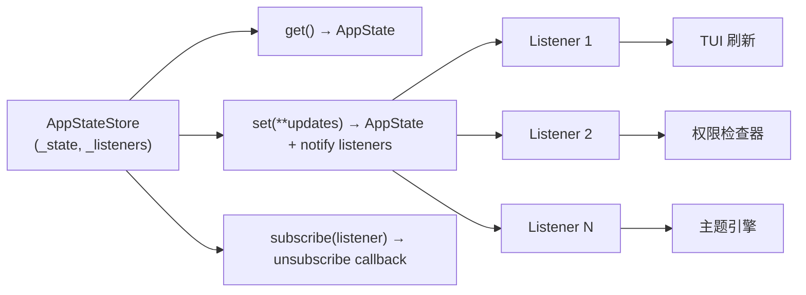
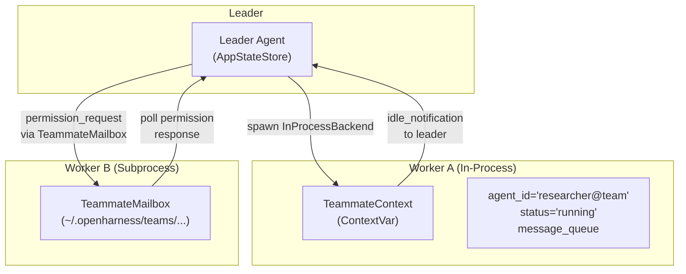

# 状态管理模块（State）

## 摘要

`AppStateStore` 是 OpenHarness 应用层的核心状态容器，采用**可观察（Observable）单例模式**管理 UI 状态、工作区配置和会话上下文。它通过发布-订阅机制驱动 TUI 刷新、权限模式切换、主题变更等跨组件协调，并通过 ContextVar 在协程间提供线程安全的上下文隔离。

## 你将了解

- `AppStateStore` 的设计哲学与 API 契约
- 状态与会话持久化的关系
- Swarm 多 Teammate 环境中的状态同步机制
- ContextVar 如何在协程层面隔离状态
- 内存与磁盘持久化策略的权衡

## 范围

本模块涵盖 `src/openharness/state/` 下的状态建模、状态存储、订阅机制，不包括持久化存储引擎（由 `session_backend` 单独负责）。

---

## 核心数据结构：AppState

`AppState` 是一个 Python `dataclass`，定义了 OpenHarness 运行时的所有共享可写状态字段：

```python
@dataclass
class AppState:
    model: str                    # 当前使用的模型名称
    permission_mode: str           # 权限模式（default / plan / etc.）
    theme: str                     # UI 主题
    cwd: str = "."                 # 当前工作目录
    provider: str = "unknown"      # API 提供商
    auth_status: str = "missing"   # 认证状态
    base_url: str = ""             # API Base URL
    vim_enabled: bool = False      # Vim 键盘模式
    voice_enabled: bool = False    # 语音模式
    voice_available: bool = False  # 语音可用性
    voice_reason: str = ""         # 语音不可用原因
    fast_mode: bool = False        # 快速模式
    effort: str = "medium"         # 努力等级
    passes: int = 1                # 执行轮次
    mcp_connected: int = 0         # MCP 已连接数
    mcp_failed: int = 0           # MCP 失败数
    bridge_sessions: int = 0       # Bridge 子会话数
    output_style: str = "default"   # 输出样式
    keybindings: dict[str, str]    # 键盘绑定
```

`src/openharness/state/app_state.py` -> `AppState`

## AppStateStore 设计

`AppStateStore` 是对 `AppState` 的包装器，添加了**可观察性**：

```python
class AppStateStore:
    def __init__(self, initial_state: AppState) -> None:
        self._state = initial_state
        self._listeners: list[Listener] = []

    def get(self) -> AppState:
        return self._state

    def set(self, **updates) -> AppState:
        self._state = replace(self._state, **updates)
        for listener in list(self._listeners):
            listener(self._state)
        return self._state

    def subscribe(self, listener: Listener) -> Callable[[], None]:
        self._listeners.append(listener)
        def _unsubscribe() -> None:
            if listener in self._listeners:
                self._listeners.remove(listener)
        return _unsubscribe
```

`src/openharness/state/store.py` -> `AppStateStore`

核心特性：

1. **`get()`**：返回当前状态的不可变快照（dataclass copy），调用方不会意外修改内部状态。
2. **`set(**updates)`**：使用 `dataclasses.replace()` 创建新实例而非原地修改，保证状态变更的可追溯性，同时触发所有已注册监听器。
3. **`subscribe(listener)`**：返回取消订阅的回调函数，支持动态增删监听者。



图后解释：调用 `store.set(model="claude-sonnet-4")` 会触发 `replace()` 生成新的 `AppState` 实例，然后依次调用所有已订阅的监听器。TUI 监听器负责重新渲染界面，权限检查器监听器重新评估当前权限规则，主题引擎监听器切换配色方案。这种发布-订阅模式解耦了状态写入方与消费方。

## Swarm 状态同步机制

在 Swarm 模式中，多个 Teammate（Worker）运行在独立进程中或同一进程的协程内。每个 Teammate 的上下文通过 `TeammateContext` 隔离，其中包含 `agent_id`、`abort_controller`、`message_queue`、`status` 等字段。



图后解释：Leader 通过 `TeammateMailbox`（基于文件的消息队列）与 Subprocess Worker 通信，通过 ContextVar 直接注入 `TeammateContext` 与 In-Process Worker 通信。`permission_sync.py` 中实现了 `send_permission_request_via_mailbox` 和 `send_permission_response_via_mailbox`，确保 Worker 的权限请求能被 Leader 统一审批。Leader 的 `AppStateStore` 维护团队范围的权限状态，Worker 的权限状态由各自的 `TeammateContext` 独立维护。

## ContextVar 隔离

Python 的 `contextvars` 模块提供了协程级别的上下文隔离。`InProcessBackend` 利用这一特性：

```python
TeammateStatus = Literal["starting", "running", "idle", "stopping", "stopped"]

@dataclass
class TeammateContext:
    agent_id: str
    agent_name: str
    team_name: str
    parent_session_id: str | None
    color: str | None
    plan_mode_required: bool
    abort_controller: TeammateAbortController
    message_queue: asyncio.Queue[TeammateMessage]
    status: TeammateStatus
    started_at: float
    tool_use_count: int
    total_tokens: int

_teammate_context_var: ContextVar[TeammateContext | None] = ContextVar(
    "_teammate_context_var", default=None
)

def get_teammate_context() -> TeammateContext | None:
    return _teammate_context_var.get()

def set_teammate_context(ctx: TeammateContext) -> None:
    _teammate_context_var.set(ctx)
```

`src/openharness/swarm/in_process.py` -> `TeammateContext`, `_teammate_context_var`

当 `asyncio.create_task()` 启动一个 In-Process Teammate 时，Python 自动复制当前的 ContextVar 快照到新任务中，使每个并发 Teammate 拥有独立的上下文副本，无需加锁。

## 状态与会话持久化

`AppStateStore` 本身是**内存只读**存储，`get()` 返回快照，`set()` 只在内存中更新。持久化由外部组件负责：

| 持久化场景 | 实现位置 | 说明 |
|---|---|---|
| 对话历史 | `QueryEngine._messages` | 在内存中累积，`submit_message` 追加新消息 |
| 工具元数据 | `tool_metadata` dict | 跨轮次携带读文件历史、技能调用记录 |
| OHMO 会话 | `OhmoSessionBackend` | 每个 chat/thread 的快照序列化到磁盘 |
| Swarm 权限 | `~/.openharness/teams/` 目录 | `pending/` 和 `resolved/` 子目录存储权限请求 |
| Bridge 输出 | `get_data_dir() / "bridge/"` | 每个子会话的 `.log` 文件 |

`src/openharness/bridge/manager.py` -> `BridgeSessionManager._output_paths`

`ohmo/gateway/runtime.py` -> `OhmoSessionRuntimePool._session_backend`

## 设计取舍

1. **不可变性优先 vs 可变状态便利性**：选择 `dataclasses.replace()` 而非原地修改，确保状态变更历史可追踪、订阅者总能读到一致快照，代价是每次更新都分配新对象，在高频更新场景（如字符流）下有 GC 压力。OpenHarness 通过将字符流事件（`AssistantTextDelta`）放在 StreamEvent 中而非 AppState 中规避了这个问题。

2. **ContextVar vs 显式参数传递**：使用 ContextVar 让 Teammate 代码中任何层级都能通过 `get_teammate_context()` 获取自身身份，无需在每一层函数签名中显式传递 ctx 对象。这降低了 API 表面积，但 ContextVar 的隐式跨调用特性也使得控制流不如显式参数那样直观，在调试时需要额外的认知负担。

## 风险

1. **订阅者未取消订阅导致引用泄漏**：如果监听器持有外部对象引用并在模块卸载时未调用取消订阅回调，会产生引用泄漏。`AppStateStore.subscribe()` 返回的取消订阅函数需要调用方主动管理生命周期。

2. **ContextVar 在同步代码中不隔离**：`set_teammate_context()` 只在异步上下文中有效。如果 In-Process Teammate 调用了同步阻塞代码（如 `time.sleep()`），其他协程不受影响；但如果使用 `loop.run_in_executor()` 进入线程池，ContextVar 不会自动传播到线程层面。

3. **AppState 的字段变更需要协调**：新增字段（如 `bridge_sessions`、`mcp_connected`）需要同时更新所有订阅方。缺少集中的 schema 验证意味着错误的字段名只会在运行时才暴露。

---

## 证据引用

- `src/openharness/state/store.py` -> `AppStateStore.__init__` — 初始化状态和监听器列表
- `src/openharness/state/store.py` -> `AppStateStore.get` — 返回不可变快照
- `src/openharness/state/store.py` -> `AppStateStore.set` — 使用 replace 创建新实例并通知监听器
- `src/openharness/state/store.py` -> `AppStateStore.subscribe` — 发布订阅与取消订阅机制
- `src/openharness/state/app_state.py` -> `AppState` — 共享状态的所有字段定义
- `src/openharness/swarm/in_process.py` -> `TeammateContext` — Teammate 上下文隔离数据结构
- `src/openharness/swarm/in_process.py` -> `_teammate_context_var` — ContextVar 声明与默认值
- `src/openharness/swarm/in_process.py` -> `set_teammate_context` — 设置协程级上下文
- `src/openharness/swarm/in_process.py` -> `get_teammate_context` — 获取协程级上下文
