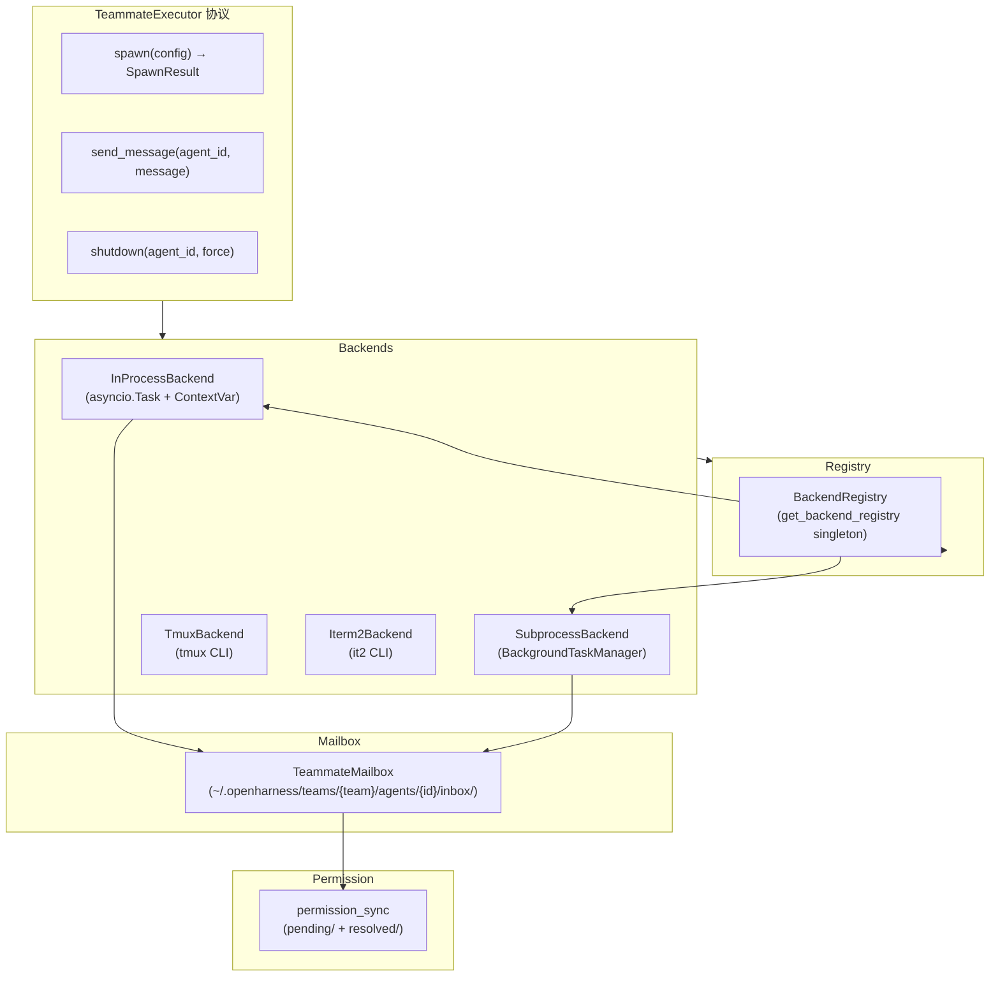
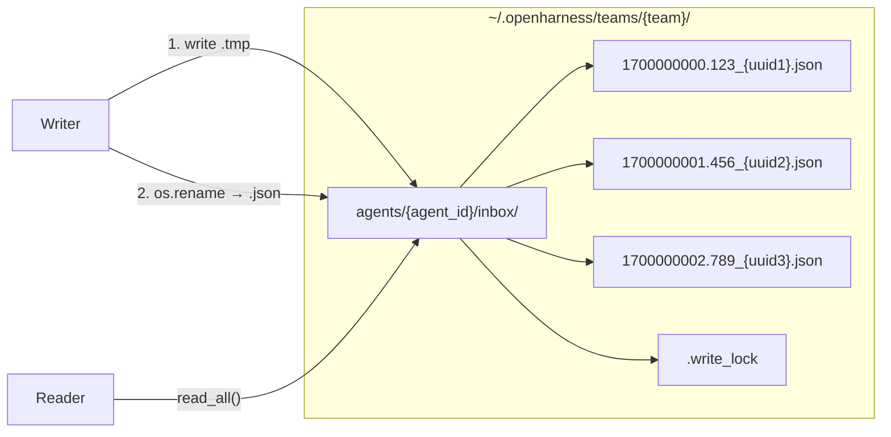
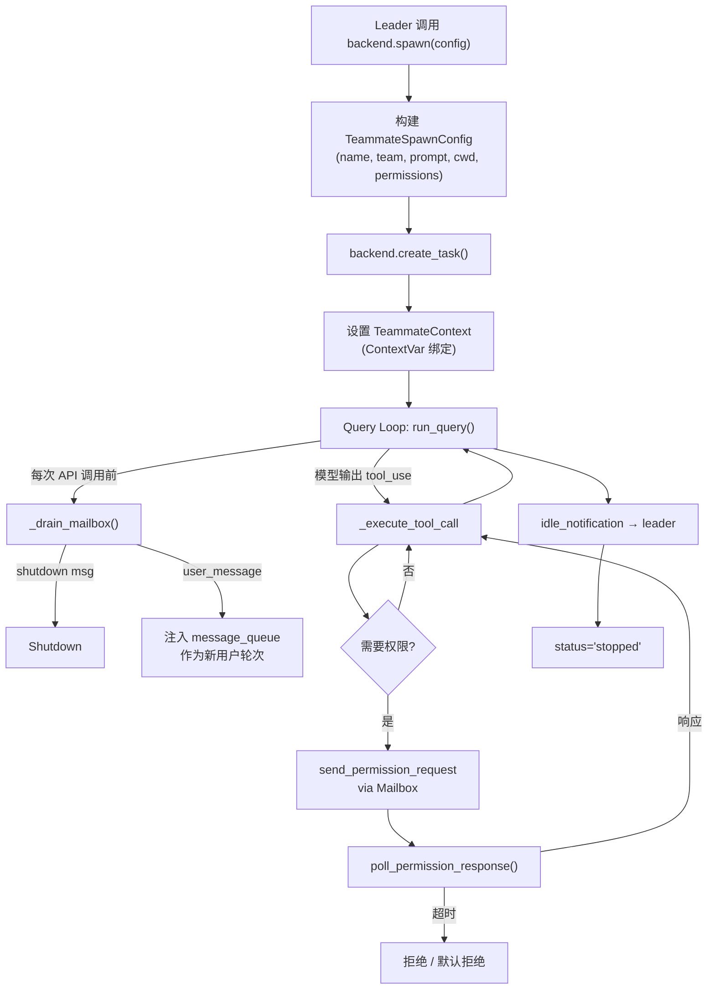
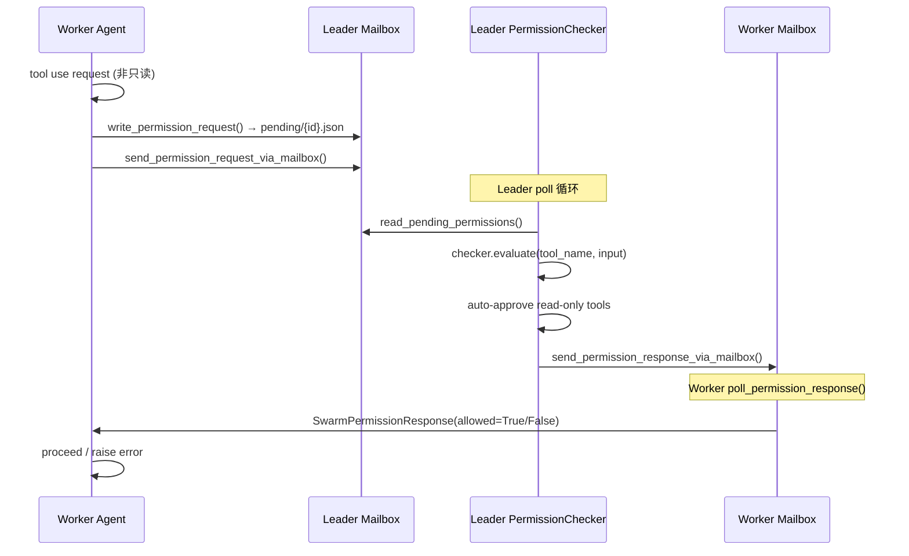

# Swarm 模块（Swarm）

## 摘要

Swarm 是 OpenHarness 的多 Agent 协作框架，通过 `TeammateExecutor` 协议抽象出四种执行后端（In-Process、Subprocess、tmux、iTerm2），实现 Leader-Worker 架构下的 Teammate 生命周期管理、跨进程消息传递（Mailbox）和权限同步（permission_sync）。`BackendRegistry` 作为全局单例自动探测最佳后端。

## 你将了解

- TeammateExecutor 协议与 Backend 实现架构
- InProcessBackend（asyncio Task + ContextVar 隔离）
- SubprocessBackend（通过 BackgroundTaskManager）
- tmux / iTerm2 Pane 管理
- Teammate 生命周期：Spawn → 消息循环 → 停止
- SwarmRegistry 与后端自动探测
- Mailbox 机制（文件队列 + 原子写入）
- Swarm 中的权限同步流程

## 范围

本模块涵盖 `src/openharness/swarm/` 下的所有子模块：类型定义、执行后端、消息邮箱、权限同步、团队生命周期和后端注册表。

---

## 架构总览



图后解释：`TeammateExecutor` 是一个 `@runtime_checkable Protocol`，定义了所有后端必须实现的 `spawn`、`send_message`、`shutdown` 三个方法。`BackendRegistry` 在初始化时注册 InProcessBackend 和 SubprocessBackend，并根据环境变量 `OPENHARNESS_TEAMMATE_MODE` 或自动探测结果选择执行后端。Mailbox 和 permission_sync 是跨所有后端共享的通信与安全基础设施。

## Backend 类型详解

### InProcessSwarm（进程内执行）

`InProcessBackend` 将 Teammate 作为 `asyncio.Task` 运行在同一 Python 进程中，通过 `ContextVar` 提供身份隔离：

```python
class InProcessBackend:
    type: BackendType = "in_process"

    def __init__(self) -> None:
        self._active: dict[str, _TeammateEntry] = {}  # agent_id → Task

    async def spawn(self, config: TeammateSpawnConfig) -> SpawnResult:
        agent_id = f"{config.name}@{config.team}"
        abort_controller = TeammateAbortController()
        task = asyncio.create_task(
            start_in_process_teammate(config=config, agent_id=agent_id, abort_controller=abort_controller),
            name=f"teammate-{agent_id}",
        )
        # asyncio.create_task() 自动复制 ContextVar
        self._active[agent_id] = _TeammateEntry(task=task, abort_controller=abort_controller, task_id=task_id)
        return SpawnResult(task_id=task_id, agent_id=agent_id, backend_type=self.type)
```

`src/openharness/swarm/in_process.py` -> `InProcessBackend.spawn`

`TeammateAbortController` 提供双信号中止：

```python
class TeammateAbortController:
    def __init__(self) -> None:
        self.cancel_event: asyncio.Event = asyncio.Event()  # 优雅
        self.force_cancel: asyncio.Event = asyncio.Event()    # 强制

    def request_cancel(self, reason: str | None = None, *, force: bool = False) -> None:
        if force:
            self.force_cancel.set()
            self.cancel_event.set()  # 两信号同时设
        else:
            self.cancel_event.set()
```

`src/openharness/swarm/in_process.py` -> `TeammateAbortController`

### SubprocessSwarmBackend（子进程执行）

`SubprocessBackend` 通过 `BackgroundTaskManager` 创建子进程：

```python
class SubprocessBackend:
    type: BackendType = "subprocess"
    _agent_tasks: dict[str, str]  # agent_id → task_id

    async def spawn(self, config: TeammateSpawnConfig) -> SpawnResult:
        agent_id = f"{config.name}@{config.team}"
        flags = build_inherited_cli_flags(model=config.model, plan_mode_required=config.plan_mode_required)
        extra_env = build_inherited_env_vars()
        command = f"{env_prefix} {' '.join(cmd_parts)}"
        manager = get_task_manager()
        record = await manager.create_agent_task(
            prompt=config.prompt, description=f"Teammate: {agent_id}",
            cwd=config.cwd, task_type="in_process_teammate",
            model=config.model, command=command,
        )
        self._agent_tasks[agent_id] = record.id
        return SpawnResult(task_id=record.id, agent_id=agent_id, backend_type=self.type)

    async def shutdown(self, agent_id: str, *, force: bool = False) -> bool:
        task_id = self._agent_tasks.get(agent_id)
        if task_id is None:
            return False
        manager = get_task_manager()
        await manager.stop_task(task_id)  # SIGTERM + SIGKILL
        self._agent_tasks.pop(agent_id, None)
        return True
```

`src/openharness/swarm/subprocess_backend.py` -> `SubprocessBackend`

## TeammateExecutor 协议

```python
@runtime_checkable
class TeammateExecutor(Protocol):
    type: BackendType

    def is_available(self) -> bool: ...
    async def spawn(self, config: TeammateSpawnConfig) -> SpawnResult: ...
    async def send_message(self, agent_id: str, message: TeammateMessage) -> None: ...
    async def shutdown(self, agent_id: str, *, force: bool = False) -> bool: ...
```

`src/openharness/swarm/types.py` -> `TeammateExecutor`

消息通过 `TeammateMessage` 传递：

```python
@dataclass
class TeammateMessage:
    text: str
    from_agent: str
    color: str | None = None
    timestamp: str | None = None
    summary: str | None = None
```

`src/openharness/swarm/types.py` -> `TeammateMessage`

## Mailbox 机制

`TeammateMailbox` 是基于文件的异步消息队列，每个消息存储为独立的 JSON 文件：



图后解释：写入时先将内容写入 `.tmp` 文件，再通过 `os.replace()` 原子重命名为最终文件名，配合 `.write_lock` 文件锁防止并发写入冲突。读取时扫描 `*.json` 文件（跳过 `.lock` 和 `.tmp`），按时间戳排序返回消息。设计优势在于即使进程崩溃，已写入的消息文件不会损坏。

Mailbox 消息类型：`user_message`、`permission_request`、`permission_response`、`sandbox_permission_request`、`sandbox_permission_response`、`shutdown`、`idle_notification`。

```python
async def write(self, msg: MailboxMessage) -> None:
    inbox = self.get_mailbox_dir()
    filename = f"{msg.timestamp:.6f}_{msg.id}.json"
    tmp_path.write_text(payload, encoding="utf-8")
    os.replace(tmp_path, final_path)  # 原子重命名
```

`src/openharness/swarm/mailbox.py` -> `TeammateMailbox.write`

## Teammate 生命周期



图后解释：Teammate 的主循环是 `run_query()`，在每次模型调用之间调用 `_drain_mailbox()` 检查来自 Leader 的消息。`user_message` 被注入到 `message_queue`，在下一次循环迭代中作为用户输入追加到对话历史。`idle_notification` 告知 Leader 当前 Teammate 已完成一个完整轮次。

## Pane 管理（tmux / iTerm2）

`PaneBackend` 协议定义了终端面板管理的统一接口：

```python
@runtime_checkable
class PaneBackend(Protocol):
    @property
    def type(self) -> BackendType: ...
    async def is_available(self) -> bool: ...
    async def create_teammate_pane_in_swarm_view(self, name: str, color: str | None = None) -> CreatePaneResult: ...
    async def set_pane_border_color(self, pane_id: PaneId, color: str) -> None: ...
    async def set_pane_title(self, pane_id: PaneId, name: str, color: str | None = None) -> None: ...
    async def rebalance_panes(self, window_target: str, has_leader: bool) -> None: ...
    async def kill_pane(self, pane_id: PaneId) -> bool: ...
    async def hide_pane(self, pane_id: PaneId) -> bool: ...
    async def show_pane(self, pane_id: PaneId, target_window_or_pane: str) -> bool: ...
```

`src/openharness/swarm/types.py` -> `PaneBackend`

`BackendRegistry.detect_pane_backend()` 的探测优先级：1) 已在 tmux 中 → tmux；2) 在 iTerm2 中且 `it2` CLI 可用 → iTerm2；3) 在 iTerm2 中但无 `it2` → tmux 回退；4) 不在任何终端 → tmux（外部会话）。

## SwarmRegistry

`BackendRegistry` 是全局单例，负责后端注册和自动探测：

```python
class BackendRegistry:
    def __init__(self) -> None:
        self._backends: dict[BackendType, TeammateExecutor] = {}
        self._detected: BackendType | None = None
        self._in_process_fallback_active: bool = False
        self._register_defaults()

    def detect_backend(self) -> BackendType:
        # Priority: in_process_fallback → tmux → subprocess
        ...

    def get_executor(self, backend: BackendType | None = None) -> TeammateExecutor:
        resolved = backend or self.detect_backend()
        return self._backends[resolved]

    def mark_in_process_fallback(self) -> None:
        self._in_process_fallback_active = True
        self._detected = None  # 下次重新探测
```

`src/openharness/swarm/registry.py` -> `BackendRegistry`

## 权限同步（permission_sync）



图后解释：Worker 发起工具调用时，`permission_sync.py` 判断是否为只读工具（`read_file`、`grep`、`web_fetch` 等内置白名单），只读工具自动批准；其他工具通过文件队列或邮箱向 Leader 请求审批。Leader 使用 `PermissionChecker` 统一评估，响应写回 Worker 的邮箱。Worker 通过轮询等待响应，最长 60 秒超时。

```python
async def poll_permission_response(
    team_name: str, worker_id: str, request_id: str, timeout: float = 60.0
) -> SwarmPermissionResponse | None:
    worker_mailbox = TeammateMailbox(team_name, worker_id)
    deadline = time.monotonic() + timeout
    while time.monotonic() < deadline:
        messages = await worker_mailbox.read_all(unread_only=True)
        for msg in messages:
            if msg.type == "permission_response" and msg.payload.get("request_id") == request_id:
                return SwarmPermissionResponse(...)
        await asyncio.sleep(0.5)
    return None
```

`src/openharness/swarm/permission_sync.py` -> `poll_permission_response`

## 设计取舍

1. **文件队列 vs 内存队列**：Mailbox 使用文件系统而非内存 `asyncio.Queue`，优势是重启后消息不丢失、跨进程天然隔离；代价是每次读写都有文件系统 I/O 和锁竞争。在高频率消息传递（如每个工具调用都发消息）场景下，磁盘 I/O 可能成为瓶颈。

2. **ContextVar 隔离 vs 进程隔离**：InProcessBackend 使用 ContextVar 而非真正的进程隔离，优势是低开销、低延迟，Leader 和 Worker 可直接共享内存中的对象；代价是一个 Worker 的未捕获异常可能波及整个进程。OpenHarness 通过 `task.add_done_callback` 处理 Teammate 的异常，避免进程崩溃。

## 风险

1. **Mailbox 文件系统竞争**：多个 Writer 同时向同一 Mailbox 写入时，虽然有 `.write_lock` 文件锁保护，但 0.5 秒轮询间隔和文件系统的组调度策略可能导致消息延迟。此外，`read_all()` 中的 JSON 解析异常会被静默跳过（`except (json.JSONDecodeError, KeyError): continue`），如果消息文件损坏，该消息将永久丢失而不报警。

2. **tmux / iTerm2 非跨平台**：`PaneBackend` 在 macOS/Linux 上依赖外部 CLI 工具。`it2` CLI 需要单独安装（`pip install it2`），且在非 iTerm2 终端中完全不可用。OpenHarness 提供了 tmux 作为通用回退，但 tmux 在 Windows 上需要 WSL 支持。

3. **SubprocessBackend 与 InProcessBackend 的消息语义差异**：SubprocessBackend 通过 `manager.write_to_task()` 发送 JSON 行到 stdin，消息被 Teammate 进程接收取决于该进程是否在监听 stdin。InProcessBackend 直接将消息推入 `ctx.message_queue`，无需序列化。在两个后端混用的场景中（某些 Teammate 用 subprocess，某些用 in-process），Leader 需要处理不同的消息投递语义。

---

## 证据引用

- `src/openharness/swarm/types.py` -> `TeammateExecutor` — 执行器协议定义
- `src/openharness/swarm/types.py` -> `TeammateMessage` — 消息数据结构
- `src/openharness/swarm/types.py` -> `TeammateSpawnConfig` — Teammate 启动配置
- `src/openharness/swarm/types.py` -> `SpawnResult` — 启动结果
- `src/openharness/swarm/types.py` -> `PaneBackend` — 面板后端协议
- `src/openharness/swarm/in_process.py` -> `InProcessBackend` — 进程内执行后端
- `src/openharness/swarm/in_process.py` -> `TeammateAbortController` — 双信号中止控制器
- `src/openharness/swarm/in_process.py` -> `TeammateContext` — 上下文隔离结构
- `src/openharness/swarm/in_process.py` -> `_teammate_context_var` — ContextVar 声明
- `src/openharness/swarm/in_process.py` -> `start_in_process_teammate` — Teammate 主协程
- `src/openharness/swarm/in_process.py` -> `_drain_mailbox` — 邮箱轮询与消息注入
- `src/openharness/swarm/subprocess_backend.py` -> `SubprocessBackend` — 子进程执行后端
- `src/openharness/swarm/registry.py` -> `BackendRegistry` — 后端注册与自动探测
- `src/openharness/swarm/mailbox.py` -> `TeammateMailbox` — 文件邮箱实现
- `src/openharness/swarm/mailbox.py` -> `write` — 原子写入流程
- `src/openharness/swarm/permission_sync.py` -> `poll_permission_response` — 权限响应轮询
- `src/openharness/swarm/permission_sync.py` -> `SwarmPermissionRequest` — 权限请求数据结构
