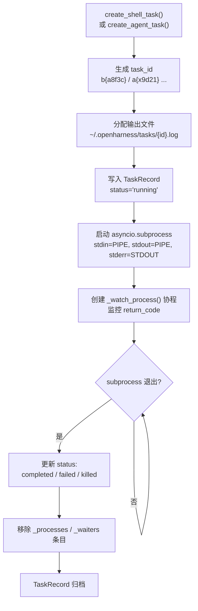

# 任务管理模块（Tasks）

## 摘要

`BackgroundTaskManager` 是 OpenHarness 的后台任务执行引擎，负责创建、监控和停止 shell 命令与 Agent 子进程。它管理 `local_bash`、`local_agent`、`remote_agent` 和 `in_process_teammate` 四类任务，通过 asyncio subprocess 与主事件循环深度集成，支持任务 I/O 读写、优雅停止和自动重启。

## 你将了解

- `BackgroundTaskManager` 的角色与设计哲学
- 四种任务类型的区分与适用场景
- 任务生命周期：create / run / monitor / stop
- `create_shell_task()` 与 `create_agent_task()` 的根本区别
- 任务 I/O：stdin 写入与日志文件读取
- 优雅停止与强制终止的权衡
- 与 Swarm / Coordinator 的集成方式

## 范围

本模块涵盖 `src/openharness/tasks/` 下的任务管理、类型定义和子进程管理，不包括 Teammate 的执行后端（由 `swarm` 模块提供）。

---

## BackgroundTaskManager 角色

`BackgroundTaskManager` 是全局单例，负责：

1. **进程生命周期管理**：创建 asyncio subprocess，管理进程引用，监听退出码。
2. **输出捕获**：将 subprocess 的 stdout/stderr 合并重定向到日志文件。
3. **任务元数据持久化**：通过 `TaskRecord` 快照记录任务状态供 UI 和协调层查询。
4. **输入管道管理**：支持向正在运行的 agent 任务写入 stdin，支持断线后自动重启。

```python
class BackgroundTaskManager:
    def __init__(self) -> None:
        self._tasks: dict[str, TaskRecord] = {}          # 任务元数据
        self._processes: dict[str, asyncio.subprocess.Process] = {}  # 进程引用
        self._waiters: dict[str, asyncio.Task[None]] = {}            # 监控协程
        self._output_locks: dict[str, asyncio.Lock] = {}             # 输出文件锁
        self._input_locks: dict[str, asyncio.Lock] = {}               # 输入管道锁
        self._generations: dict[str, int] = {}                         # 重启代数
```

`src/openharness/tasks/manager.py` -> `BackgroundTaskManager.__init__`

## 任务类型

| 类型 | 前缀 | 说明 | stdin 支持 |
|---|---|---|---|
| `local_bash` | `b` | 本地 shell 命令 | 无（单向管道） |
| `local_agent` | `a` | 本地 Agent 子进程 | 有（OHAuto 条令式交互） |
| `remote_agent` | `r` | 远程 Agent（预留） | 有 |
| `in_process_teammate` | `t` | Swarm In-Process Teammate | 有 |

```python
def _task_id(task_type: TaskType) -> str:
    prefixes = {
        "local_bash": "b",
        "local_agent": "a",
        "remote_agent": "r",
        "in_process_teammate": "t",
    }
    return f"{prefixes[task_type]}{uuid4().hex[:8]}"
```

`src/openharness/tasks/manager.py` -> `_task_id`

`TaskRecord` 包含：id、type、status、description、cwd、output_file、command、created_at、started_at、ended_at、return_code、prompt、metadata。

## 任务生命周期



图后解释：任务创建后立即进入监控循环。`_watch_process()` 协程同时执行两个职责：通过 `_copy_output()` 实时将 stdout 写入日志文件，以及等待 `process.wait()` 获取退出码。当进程退出时，`generation` 检查确保只处理最新一代的任务（忽略被重启覆盖的旧进程）。

## create_shell_task vs create_agent_task

**`create_shell_task()`** 接收原始 shell 命令：

```python
async def create_shell_task(
    self,
    *,
    command: str,
    description: str,
    cwd: str | Path,
    task_type: TaskType = "local_bash",
) -> TaskRecord:
    task_id = _task_id(task_type)
    output_path = get_tasks_dir() / f"{task_id}.log"
    record = TaskRecord(
        id=task_id, type=task_type, status="running",
        description=description, cwd=str(Path(cwd).resolve()),
        output_file=output_path, command=command,
        created_at=time.time(), started_at=time.time(),
    )
    output_path.write_text("", encoding="utf-8")
    self._tasks[task_id] = record
    await self._start_process(task_id)
    return record
```

`src/openharness/tasks/manager.py` -> `BackgroundTaskManager.create_shell_task`

**`create_agent_task()`** 在 `create_shell_task` 基础上增加了：

1. 自动构建 `openharness --api-key ...` 命令（若未提供 `command`）
2. 将 `prompt` 字段写入 `TaskRecord`
3. **立即向 stdin 写入初始 prompt**：`await self.write_to_task(record.id, prompt)`
4. 支持 agent 重启时自动恢复 stdin 连接

```python
async def create_agent_task(
    self,
    *,
    prompt: str,
    description: str,
    cwd: str | Path,
    task_type: TaskType = "local_agent",
    model: str | None = None,
    api_key: str | None = None,
    command: str | None = None,
) -> TaskRecord:
    if command is None:
        effective_api_key = api_key or os.environ.get("ANTHROPIC_API_KEY")
        cmd = ["python", "-m", "openharness", "--api-key", effective_api_key]
        if model:
            cmd.extend(["--model", model])
        command = " ".join(shlex.quote(part) for part in cmd)
    record = await self.create_shell_task(command=command, ...)
    updated = replace(record, prompt=prompt)
    self._tasks[record.id] = updated
    await self.write_to_task(record.id, prompt)  # 关键差异
    return updated
```

`src/openharness/tasks/manager.py` -> `BackgroundTaskManager.create_agent_task`

根本区别：`create_shell_task` 执行的是纯命令，进程退出即结束；`create_agent_task` 创建一个可以持续交互的 Agent 进程，主进程通过 stdin/stdout 与其通信，并在进程断线时自动重启。

## 任务 I/O

**写入 stdin**：

```python
async def write_to_task(self, task_id: str, data: str) -> None:
    task = self._require_task(task_id)
    async with self._input_locks[task_id]:
        process = await self._ensure_writable_process(task)
        process.stdin.write((data.rstrip("\n") + "\n").encode("utf-8"))
        try:
            await process.stdin.drain()
        except (BrokenPipeError, ConnectionResetError):
            # Agent 断线：自动重启
            if task.type not in {"local_agent", "remote_agent", "in_process_teammate"}:
                raise ValueError(f"Task {task_id} does not accept input")
            process = await self._restart_agent_task(task)
            process.stdin.write((data.rstrip("\n") + "\n").encode("utf-8"))
            await process.stdin.drain()
```

`src/openharness/tasks/manager.py` -> `BackgroundTaskManager.write_to_task`

**读取输出**：读取日志文件的末尾内容（默认最多 12000 字节）。

```python
def read_task_output(self, task_id: str, *, max_bytes: int = 12000) -> str:
    task = self._require_task(task_id)
    content = task.output_file.read_text(encoding="utf-8", errors="replace")
    if len(content) > max_bytes:
        return content[-max_bytes:]  # 只返回末尾
    return content
```

`src/openharness/tasks/manager.py` -> `BackgroundTaskManager.read_task_output`

## 任务停止：优雅 vs 强制

```python
async def stop_task(self, task_id: str) -> TaskRecord:
    task = self._require_task(task_id)
    process = self._processes.get(task_id)
    if process is None:
        if task.status in {"completed", "failed", "killed"}:
            return task
        raise ValueError(f"Task {task_id} is not running")

    process.terminate()  # SIGTERM — 优雅停止
    try:
        await asyncio.wait_for(process.wait(), timeout=3)  # 等待 3 秒
    except asyncio.TimeoutError:
        process.kill()    # SIGKILL — 强制终止
        await process.wait()

    task.status = "killed"
    task.ended_at = time.time()
    return task
```

`src/openharness/tasks/manager.py` -> `BackgroundTaskManager.stop_task`

默认策略：先 SIGTERM（优雅），3 秒后 SIGKILL（强制）。这与 Linux 容器优雅停止的最佳实践一致，但 3 秒固定超时在长时间运行的数据库迁移等场景中可能不足。

## 与 Swarm / Coordinator 的集成

`SubprocessBackend` 依赖 `BackgroundTaskManager` 来执行 In-Process Teammate：

```python
async def spawn(self, config: TeammateSpawnConfig) -> SpawnResult:
    manager = get_task_manager()
    record = await manager.create_agent_task(
        prompt=config.prompt,
        description=f"Teammate: {agent_id}",
        cwd=config.cwd,
        task_type="in_process_teammate",  # 任务类型区分
        model=config.model,
        command=command,
    )
    self._agent_tasks[agent_id] = record.id
    return SpawnResult(task_id=record.id, agent_id=agent_id, backend_type=self.type)
```

`src/openharness/swarm/subprocess_backend.py` -> `SubprocessBackend.spawn`

Coordinator 通过 `BackgroundTaskManager.list_tasks(status="running")` 查询当前活跃任务，并在协调决策中引用任务 ID 进行消息路由。

## 设计取舍

1. **日志文件 vs 内存缓冲**：所有输出通过 `_copy_output()` 协程实时写入磁盘文件（`~/.openharness/tasks/{id}.log`），而非保留在内存中。这确保了即使任务管理器崩溃，日志也不会丢失，但每次写入都涉及文件系统 I/O，在高吞吐场景（如大量工具调用的输出）下可能成为瓶颈。

2. **自动重启 agent 的策略**：当 `local_agent` 类型任务的 stdin 管道断裂时，`write_to_task()` 会自动调用 `_restart_agent_task()` 重建进程。这种"短路自愈"简化了调用方逻辑，但重启期间的消息会丢失（因为旧进程已退出），可能造成对话不连贯。

## 风险

1. **僵尸进程风险**：如果 `_watch_process()` 协程因异常提前退出，而 `_processes` 中的进程引用未被清理，会留下僵尸进程。代码通过 `generation` 检查和 `finally` 块中的清理来缓解这一问题，但并发场景下仍存在竞态条件的理论可能。

2. **输出文件权限问题**：`get_tasks_dir()` 依赖 `~/.openharness/` 的存在和权限。若该目录被其他用户创建（如共享机器环境），当前用户的任务可能因权限不足而无法写入日志文件。

3. **stdin drain 的死锁风险**：`await process.stdin.drain()` 在子进程已停止但未完全退出的短暂窗口中可能永久阻塞。代码通过捕获 `BrokenPipeError` 和 `ConnectionResetError` 来处理断管情况，但无法覆盖所有竞态。

---

## 证据引用

- `src/openharness/tasks/manager.py` -> `BackgroundTaskManager.create_shell_task` — shell 任务创建入口
- `src/openharness/tasks/manager.py` -> `BackgroundTaskManager.create_agent_task` — agent 任务创建入口，包含 prompt 注入和自动重启
- `src/openharness/tasks/manager.py` -> `BackgroundTaskManager.write_to_task` — stdin 写入与断线重启
- `src/openharness/tasks/manager.py` -> `BackgroundTaskManager.read_task_output` — 日志文件尾部读取
- `src/openharness/tasks/manager.py` -> `BackgroundTaskManager.stop_task` — SIGTERM + SIGKILL 两阶段停止
- `src/openharness/tasks/manager.py` -> `BackgroundTaskManager._watch_process` — 进程监控与退出码处理
- `src/openharness/tasks/manager.py` -> `BackgroundTaskManager._restart_agent_task` — agent 自动重启逻辑
- `src/openharness/swarm/subprocess_backend.py` -> `SubprocessBackend.spawn` — 通过 BackgroundTaskManager 创建 Teammate
