# OpenHarness 功能分析

## 一、概述

**分析目标：** OpenHarness - 开源 Agent Harness 基础设施
**分析范围：** 整个代码库（src/openharness/）
**分析时间：** 2026-05-14
**核心定位：** 为 LLM 提供工具、知识、观察、行动和安全边界的完整基础设施

### 系统架构概览

```
openharness/
├── engine/          # 核心 Agent Loop — 查询 → 流式 → 工具调用 → 循环
├── tools/           # 43+ 工具 — 文件、Shell、搜索、Web、MCP
├── commands/        # 90+ 命令 — /help, /commit, /plan, /resume 等
├── skills/          # 知识系统 — 按需加载 .md 技能文件
├── plugins/         # 插件系统 — 命令、钩子、代理、MCP 服务器
├── permissions/     # 安全管理 — 多级权限、路径规则
├── hooks/           # 生命周期 — PreToolUse/PostToolUse 钩子
├── mcp/             # MCP 客户端 — Model Context Protocol
├── mcp_runtime/     # MCP 运行时
├── memory/          # 持久化记忆 — Markdown 和 mem0 后端
├── tasks/           # 后台任务管理
├── coordinator/     # 多代理协调 — 子代理生成、团队管理
├── swarm/           # 蜂群系统 — tmux/iTerm2 集成
├── prompts/         # 上下文管理 — CLAUDE.md、系统提示
├── config/          # 多层配置系统
├── api/             # API 客户端 — Anthropic/OpenAI/Codex
├── auth/            # 认证管理
├── channels/        # 消息通道 — Telegram/Slack/Discord/Feishu
├── services/        # 核心服务 — 上下文压缩、Token 估计
├── ui/              # React TUI — 后端协议和前端
├── sandbox/         # 沙箱运行时
└── utils/           # 工具函数
```

---

## 二、功能总览

### 2.1 按模块分组

| 编号 | 模块 | 功能点 | 说明 |
|------|------|--------|------|
| **M1** | **Engine（引擎）** | 8 | 核心 Agent 对话循环 |
| **M2** | **Tools（工具系统）** | 43 | 43 个内置工具 |
| **M3** | **Commands（命令系统）** | 90+ | 90+ slash 命令 |
| **M4** | **Plugins（插件系统）** | 5 | 插件加载、安装、钩子 |
| **M5** | **Skills（技能系统）** | 4 | 技能加载、注册、发现 |
| **M6** | **MCP（协议客户端）** | 3 | MCP 服务器连接、工具调用 |
| **M7** | **Swarm/Coordinator** | 5 | 多代理协调、团队管理 |
| **M8** | **Memory（记忆系统）** | 5 | 持久化记忆、搜索、提取 |
| **M9** | **Tasks（任务系统）** | 5 | 后台任务管理 |
| **M10** | **Permissions（权限）** | 4 | 多级权限、路径规则 |
| **M11** | **Hooks（钩子系统）** | 6 | 生命周期钩子事件 |
| **M12** | **Prompts（提示词）** | 5 | 上下文组装、CLAUDE.md |
| **M13** | **Config（配置系统）** | 6 | 多层配置、迁移 |
| **M14** | **API（API 客户端）** | 5 | 模型调用、重试、成本 |
| **M15** | **Auth（认证）** | 4 | 多提供商认证 |
| **M16** | **Channels（通道）** | 6 | 消息桥接、通道适配 |
| **M17** | **Services（服务）** | 4 | 压缩、Token 估计、会话 |
| **M18** | **UI（界面）** | 5 | React TUI、协议 |

**总计：18 个模块，约 180+ 功能点**

---

## 三、模块详述

### M1. Engine（核心引擎）

**模块职责：** 管理对话历史和工具感知的模型循环，是 Agent 的核心执行引擎

**源码位置：** `src/openharness/engine/`

#### F1. QueryEngine - 对话引擎

**流程图：**

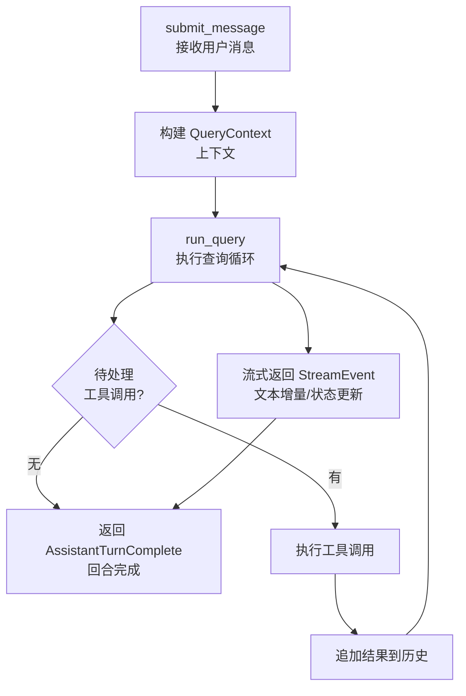
```mermaid
graph TD
    A[submit_message<br/>接收用户消息] --> B[构建 QueryContext<br/>上下文]
    B --> C[run_query<br/>执行查询循环]
    C --> D{待处理<br/>工具调用?}
    D -->|无| E[返回 AssistantTurnComplete<br/>回合完成]
    D -->|有| F[执行工具调用]
    F --> G[追加结果到历史]
    G --> C
    C --> H[流式返回 StreamEvent<br/>文本增量/状态更新]
    H --> E
```

触发条件：用户提交消息或模型需要继续执行
执行路径：
1. `submit_message()` 接收用户消息
2. 构建 `QueryContext` 上下文
3. 调用 `run_query()` 执行查询循环
4. 流式返回 `StreamEvent` 事件
5. 更新对话历史和成本跟踪

关键分支：
- 无待处理工具调用 → 返回 `AssistantTurnComplete`
- 有工具调用 → 执行工具并追加结果
- 达到 max_turns → 抛出 `MaxTurnsExceeded`

输出结果：流式事件（文本增量、工具执行、状态更新）
依赖关系：API 客户端、工具注册表、权限检查器、钩子执行器、记忆后端
源码证据：`engine/query_engine.py` -> `QueryEngine`

#### F2. run_query - 查询循环

**流程图：**

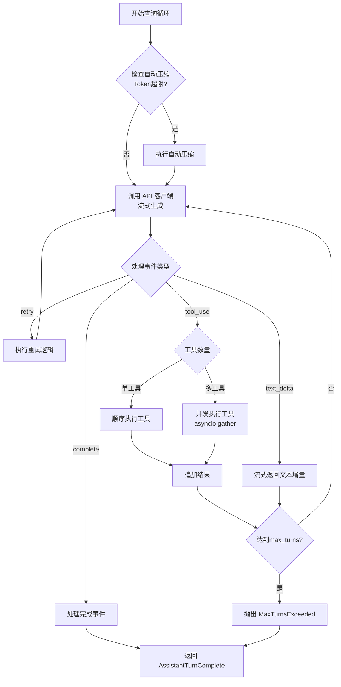
```mermaid
graph TD
    A[开始查询循环] --> B{检查自动压缩<br/>Token超限?}
    B -->|是| C[执行自动压缩]
    B -->|否| D[调用 API 客户端<br/>流式生成]
    C --> D
    D --> E{处理事件类型}
    E -->|text_delta| F[流式返回文本增量]
    E -->|retry| G[执行重试逻辑]
    E -->|complete| H[处理完成事件]
    E -->|tool_use| I{工具数量}
    I -->|单工具| J[顺序执行工具]
    I -->|多工具| K[并发执行工具<br/>asyncio.gather]
    J --> L[追加结果]
    K --> L
    L --> M{达到max_turns?}
    M -->|是| N[抛出 MaxTurnsExceeded]
    M -->|否| D
    F --> M
    G --> D
    H --> O[返回 AssistantTurnComplete]
    N --> O
```

触发条件：QueryEngine 提交消息
执行路径：
1. 检查并执行自动压缩
2. 调用 API 客户端流式生成
3. 处理文本增量事件
4. 处理 API 重试事件
5. 处理完成事件
6. 执行工具调用（单工具顺序、多工具并发）
7. 追加结果并继续循环

关键分支：
- 单工具调用 → 顺序执行，立即流式返回
- 多工具调用 → 并发执行（`asyncio.gather`）
- 工具执行异常 → 返回异常结果，不取消其他工具
- Prompt 过长 → 触发响应式压缩

输出结果：`(StreamEvent, UsageSnapshot)` 元组流
依赖关系：API 客户端、工具注册表、权限检查器
源码证据：`engine/query.py` -> `run_query`

#### F3. 工具执行管道

**流程图：**

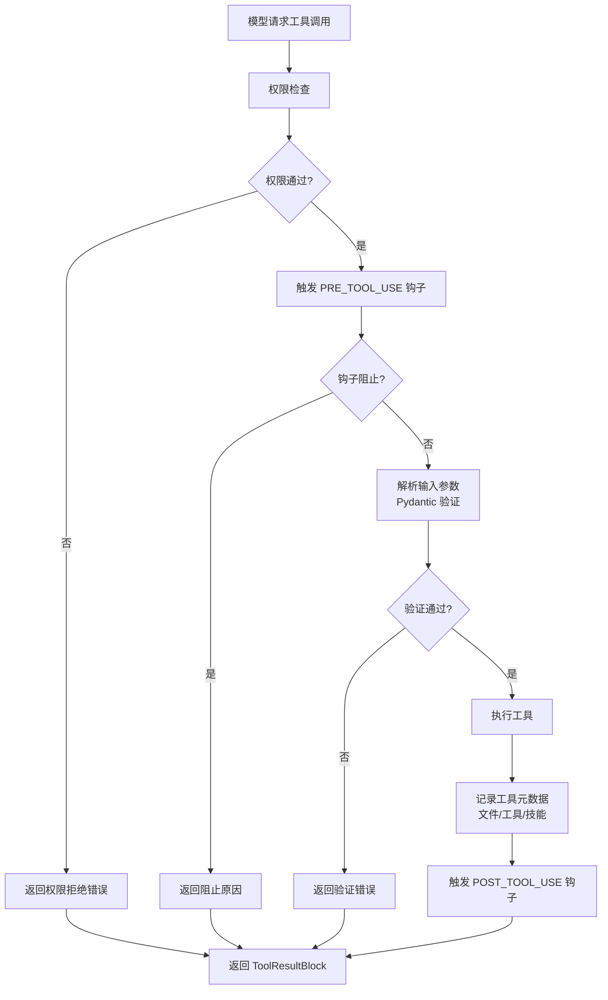
```mermaid
graph TD
    A[模型请求工具调用] --> B[权限检查]
    B --> C{权限通过?}
    C -->|否| D[返回权限拒绝错误]
    C -->|是| E[触发 PRE_TOOL_USE 钩子]
    E --> F{钩子阻止?}
    F -->|是| G[返回阻止原因]
    F -->|否| H[解析输入参数<br/>Pydantic 验证]
    H --> I{验证通过?}
    I -->|否| J[返回验证错误]
    I -->|是| K[执行工具]
    K --> L[记录工具元数据<br/>文件/工具/技能]
    L --> M[触发 POST_TOOL_USE 钩子]
    M --> N[返回 ToolResultBlock]
    D --> N
    G --> N
    J --> N
```

触发条件：模型请求工具调用
执行路径：
1. 权限检查（路径规则、命令规则）
2. 触发 `PRE_TOOL_USE` 钩子
3. 解析输入参数（Pydantic 验证）
4. 执行工具
5. 记录工具元数据（文件、工具、技能）
6. 触发 `POST_TOOL_USE` 钩子
7. 返回工具结果

关键分支：
- 权限被阻止 → 返回错误结果
- 预钩子阻止 → 返回阻止原因
- 输入验证失败 → 返回验证错误

输出结果：`ToolResultBlock`
依赖关系：权限检查器、钩子执行器、工具注册表
源码证据：`engine/query.py` -> `_execute_tool_call`

#### F4. 自动压缩

**流程图：**

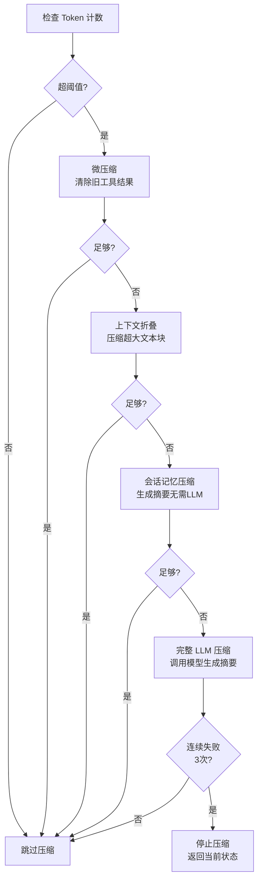
```mermaid
graph TD
    A[检查 Token 计数] --> B{超阈值?}
    B -->|否| C[跳过压缩]
    B -->|是| D[微压缩<br/>清除旧工具结果]
    D --> E{足够?}
    E -->|是| C
    E -->|否| F[上下文折叠<br/>压缩超大文本块]
    F --> G{足够?}
    G -->|是| C
    G -->|否| H[会话记忆压缩<br/>生成摘要无需LLM]
    H --> I{足够?}
    I -->|是| C
    I -->|否| J[完整 LLM 压缩<br/>调用模型生成摘要]
    J --> K{连续失败<br/>3次?}
    K -->|是| L[停止压缩<br/>返回当前状态]
    K -->|否| C
```

触发条件：每轮循环开始检查，或收到 "prompt too long" 错误
执行路径：
1. Token 计数超过阈值 → 触发自动压缩
2. 微压缩：清除旧工具结果内容（廉价操作）
3. 上下文折叠：折叠超大文本块
4. 会话记忆压缩：生成会话摘要（无需 LLM）
5. 完整压缩：调用 LLM 生成结构化摘要

关键分支：
- 微压缩足够 → 直接返回
- 微压缩不够 → 尝试上下文折叠
- 上下文折叠不够 → 尝试会话记忆压缩
- 仍不够 → 完整 LLM 压缩
- 连续失败 3 次 → 停止自动压缩

输出结果：压缩后的消息列表 + 压缩附件
依赖关系：API 客户端、Token 估计器、钩子执行器
源码证据：`services/compact/` -> `auto_compact_if_needed`

#### F5. 记忆提取

触发条件：用户消息提交后，或助手响应后
执行路径：
1. 检查时间间隔和消息计数
2. 满足阈值 → 调用记忆后端提取
3. 保存对话到记忆系统

关键分支：
- 记忆后端未配置 → 跳过
- 记忆后端不可用 → 静默失败
- 压缩前 → 安全网提取（防止信息丢失）

输出结果：无（副作用：保存到记忆后端）
依赖关系：记忆后端
源码证据：`engine/query.py` -> `_maybe_extract_memories`, `_extract_before_compact`

#### F6. 成本跟踪

触发条件：每次 API 调用完成
执行路径：
1. 收集 UsageSnapshot
2. 累加到 CostTracker

输出结果：`CostTracker.total` 包含 input_tokens、output_tokens、total_tokens
依赖关系：API 客户端
源码证据：`engine/cost_tracker.py` -> `CostTracker`

#### F7. 工具元数据追踪

触发条件：每次工具执行完成
执行路径：
1. 追踪读取的文件（路径、行范围、预览）
2. 追踪激活的工件（文件、URL、技能）
3. 追踪已验证的工作
4. 追踪异步代理活动
5. 追踪工作日志
6. 追踪用户目标

输出结果：更新 `tool_metadata` 字典
依赖关系：工具执行结果
源码证据：`engine/query.py` -> `_record_tool_carryover`

#### F8. 流式事件系统

**流程图：**

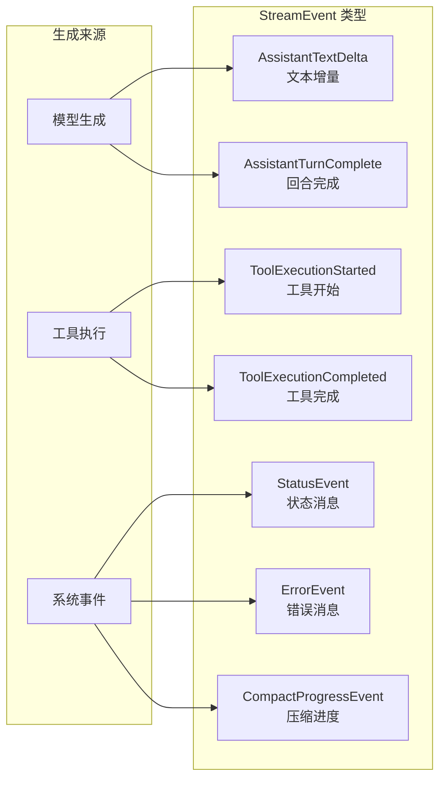
```mermaid
graph LR
    subgraph "StreamEvent 类型"
        A[AssistantTextDelta<br/>文本增量]
        B[AssistantTurnComplete<br/>回合完成]
        C[ToolExecutionStarted<br/>工具开始]
        D[ToolExecutionCompleted<br/>工具完成]
        E[StatusEvent<br/>状态消息]
        F[ErrorEvent<br/>错误消息]
        G[CompactProgressEvent<br/>压缩进度]
    end
    subgraph "生成来源"
        H[模型生成]
        I[工具执行]
        J[系统事件]
    end
    H --> A
    H --> B
    I --> C
    I --> D
    J --> E
    J --> F
    J --> G
```

触发条件：模型生成文本或工具执行完成
执行路径：
1. `AssistantTextDelta` - 文本增量输出
2. `AssistantTurnComplete` - 助手回合完成
3. `ToolExecutionStarted` - 工具开始执行
4. `ToolExecutionCompleted` - 工具执行完成
5. `StatusEvent` - 状态消息（重试、压缩进度）
6. `ErrorEvent` - 错误消息
7. `CompactProgressEvent` - 压缩进度

输出结果：异步迭代器流
依赖关系：QueryEngine
源码证据：`engine/stream_events.py` -> `StreamEvent`

---

### M2. Tools（工具系统）

**模块职责：** 提供 43+ 内置工具供 Agent 调用

**源码位置：** `src/openharness/tools/`

#### 文件操作工具

| 编号 | 工具名 | 功能 | 说明 |
|------|--------|------|------|
| F9 | Read | 读取文件 | 支持 offset、limit、路径解析 |
| F10 | Write | 写入文件 | 自动创建目录 |
| F11 | Edit | 编辑文件 | 支持精确替换 |
| F12 | Glob | 文件模式匹配 | 递归模式匹配 |
| F13 | Grep | 文本搜索 | 支持上下文行数 |
| F14 | NotebookEdit | Jupyter 笔记本编辑 | 单元格操作 |

#### Shell 工具

| 编号 | 工具名 | 功能 | 说明 |
|------|--------|------|------|
| F15 | Bash | 执行 Shell 命令 | 返回 stdout/stderr |

**F15 Bash 工具执行流程：**

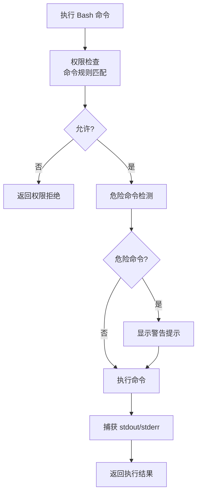
```mermaid
graph TD
    A[执行 Bash 命令] --> B[权限检查<br/>命令规则匹配]
    B --> C{允许?}
    C -->|否| D[返回权限拒绝]
    C -->|是| E[危险命令检测]
    E --> F{危险命令?}
    F -->|是| G[显示警告提示]
    F -->|否| H[执行命令]
    G --> H
    H --> I[捕获 stdout/stderr]
    I --> J[返回执行结果]
```

#### 搜索工具

| 编号 | 工具名 | 功能 | 说明 |
|------|--------|------|------|
| F16 | WebFetch | 获取网页内容 | 支持 HTML/Markdown 解析 |
| F17 | WebSearch | 网络搜索 | 查询搜索引擎 |
| F18 | ToolSearch | 工具搜索 | 搜索可用工具 |
| F19 | LSP | 语言服务器协议 | 代码导航、引用查找 |

#### 代理工具

| 编号 | 工具名 | 功能 | 说明 |
|------|--------|------|------|
| F20 | Agent | 生成子代理 | 支持 worker 模式 |
| F21 | SendMessage | 发送消息给子代理 | 继续执行 |
| F22 | TeamCreate | 创建团队 | 多代理协作 |
| F23 | TeamDelete | 删除团队 | 清理资源 |

**F20 Agent 子代理生成流程：**

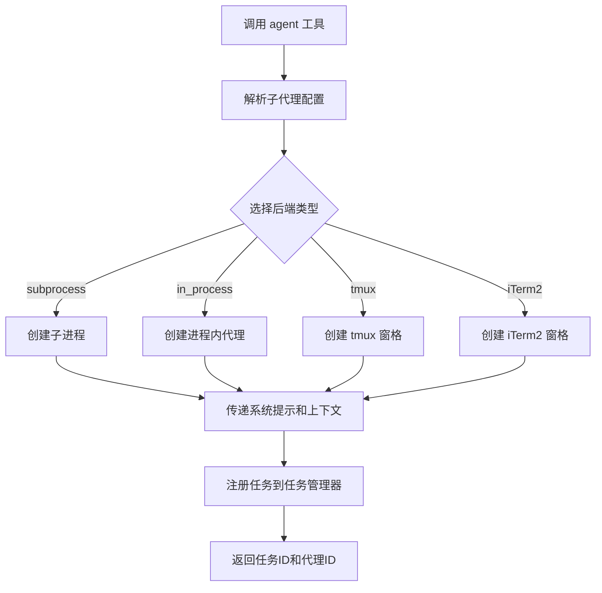
```mermaid
graph TD
    A[调用 agent 工具] --> B[解析子代理配置]
    B --> C{选择后端类型}
    C -->|subprocess| D[创建子进程]
    C -->|in_process| E[创建进程内代理]
    C -->|tmux| F[创建 tmux 窗格]
    C -->|iTerm2| G[创建 iTerm2 窗格]
    D --> H[传递系统提示和上下文]
    E --> H
    F --> H
    G --> H
    H --> I[注册任务到任务管理器]
    I --> J[返回任务ID和代理ID]
```

#### 任务工具

| 编号 | 工具名 | 功能 | 说明 |
|------|--------|------|------|
| F24 | TaskCreate | 创建后台任务 | Shell 任务 |
| F25 | TaskGet | 获取任务 | 查看任务详情 |
| F26 | TaskList | 列出任务 | 过滤状态 |
| F27 | TaskUpdate | 更新任务 | 进度、描述 |
| F28 | TaskStop | 停止任务 | 终止执行 |
| F29 | TaskOutput | 读取输出 | 获取任务日志 |

#### MCP 工具

| 编号 | 工具名 | 功能 | 说明 |
|------|--------|------|------|
| F30 | MCPTool | 调用 MCP 工具 | 协议转换 |
| F31 | ListMcpResources | 列出 MCP 资源 | 发现可用资源 |
| F32 | ReadMcpResource | 读取 MCP 资源 | 获取资源内容 |
| F33 | MCPAuth | MCP 认证 | 设置认证信息 |

#### 模式工具

| 编号 | 工具名 | 功能 | 说明 |
|------|--------|------|------|
| F34 | EnterPlanMode | 进入计划模式 | 阻止写操作 |
| F35 | ExitPlanMode | 退出计划模式 | 恢复默认 |
| F36 | EnterWorktree | 进入 Git 工作树 | 隔离开发 |
| F37 | ExitWorktree | 退出 Git 工作树 | 清理资源 |

#### 计划工具

| 编号 | 工具名 | 功能 | 说明 |
|------|--------|------|------|
| F38 | CronCreate | 创建定时任务 | 自动化执行 |
| F39 | CronList | 列出定时任务 | 查看调度 |
| F40 | CronDelete | 删除定时任务 | 移除调度 |
| F41 | CronToggle | 切换定时任务 | 启用/禁用 |
| F42 | RemoteTrigger | 远程触发 | 事件驱动 |

#### 元工具

| 编号 | 工具名 | 功能 | 说明 |
|------|--------|------|------|
| F43 | Skill | 加载技能 | 知识注入 |
| F44 | Config | 配置管理 | 运行时配置 |
| F45 | Brief | 简要模式 | 简化输出 |
| F46 | Sleep | 延迟执行 | 等待操作 |
| F47 | AskUser | 询问用户 | 交互式输入 |

#### 记忆工具

| 编号 | 工具名 | 功能 | 说明 |
|------|--------|------|------|
| F48 | MemoryAdd | 添加记忆 | 保存知识 |
| F49 | MemorySearch | 搜索记忆 | 检索信息 |

#### 其他工具

| 编号 | 工具名 | 功能 | 说明 |
|------|--------|------|------|
| F50 | TodoWrite | 写待办事项 | 任务跟踪 |

---

### M3. Commands（命令系统）

**模块职责：** 提供 90+ slash 命令供用户交互

**源码位置：** `src/openharness/commands/registry.py`

#### 会话管理命令

| 编号 | 命令 | 功能 | 说明 |
|------|------|------|------|
| F51 | /help | 显示帮助 | 列出所有命令 |
| F52 | /exit, /quit | 退出 | 关闭会话 |
| F53 | /clear | 清除对话 | 清空历史 |
| F54 | /resume | 恢复会话 | 从快照恢复 |
| F55 | /session | 会话管理 | 显示/列出/标记 |
| F56 | /export | 导出记录 | Markdown 导出 |
| F57 | /share | 分享记录 | 创建快照 |
| F58 | /copy | 复制响应 | 剪贴板集成 |
| F59 | /tag | 标签会话 | 命名快照 |
| F60 | /rewind | 回退轮次 | 撤销对话 |

#### 上下文命令

| 编号 | 命令 | 功能 | 说明 |
|------|------|------|------|
| F61 | /context | 显示系统提示 | 调试用 |
| F62 | /summary | 总结对话 | 最近消息 |
| F63 | /compact | 压缩历史 | LLM 摘要 |
| F64 | /memory | 记忆管理 | 列表/添加/删除 |

#### Git 命令

| 编号 | 命令 | 功能 | 说明 |
|------|------|------|------|
| F65 | /diff | 显示差异 | Git 集成 |
| F66 | /branch | 分支管理 | 显示/列出 |
| F67 | /commit | Git 提交 | 创建提交 |

#### 配置命令

| 编号 | 命令 | 功能 | 说明 |
|------|------|------|------|
| F68 | /config | 配置管理 | 显示/设置 |
| F69 | /permissions | 权限模式 | 显示/设置 |
| F70 | /plan | 计划模式 | 切换模式 |
| F71 | /fast | 快速模式 | 简洁响应 |
| F72 | /effort | 推理努力 | 低/中/高 |
| F73 | /passes | 推理次数 | 1-8 次 |
| F74 | /turns | 最大轮次 | 限制迭代 |

#### 模型命令

| 编号 | 命令 | 功能 | 说明 |
|------|------|------|------|
| F75 | /provider | 提供商管理 | 切换提供商 |
| F76 | /model | 模型管理 | 切换模型 |
| F77 | /login | 登录 | API 密钥 |
| F78 | /logout | 登出 | 清除密钥 |

#### 诊断命令

| 编号 | 命令 | 功能 | 说明 |
|------|------|------|------|
| F79 | /status | 会话状态 | 显示统计 |
| F80 | /doctor | 环境诊断 | 健康检查 |
| F81 | /stats | 统计信息 | 工具/记忆/任务 |
| F82 | /usage | 使用统计 | Token 计数 |
| F83 | /cost | 成本估算 | 费用计算 |
| F84 | /version | 版本信息 | 显示版本 |

#### 插件命令

| 编号 | 命令 | 功能 | 说明 |
|------|------|------|------|
| F85 | /plugin | 插件管理 | 列表/启用/安装 |
| F86 | /skills | 技能管理 | 列表/显示 |
| F87 | /mcp | MCP 状态 | 显示配置 |
| F88 | /hooks | 钩子列表 | 显示钩子 |
| F89 | /reload-plugins | 重载插件 | 刷新发现 |

#### 项目命令

| 编号 | 命令 | 功能 | 说明 |
|------|------|------|------|
| F90 | /init | 初始化项目 | 创建配置文件 |
| F91 | /files | 文件浏览 | 列出文件 |
| F92 | /issue | Issue 上下文 | 设置/显示 |
| F93 | /pr_comments | PR 评论 | 追踪评论 |

#### 代理命令

| 编号 | 命令 | 功能 | 说明 |
|------|------|------|------|
| F94 | /agents | 代理管理 | 列表/显示 |
| F95 | /tasks | 任务管理 | 列表/运行/停止 |
| F96 | /bridge | 桥接管理 | 编码/解码/启动 |

#### 自动驾驶命令

| 编号 | 命令 | 功能 | 说明 |
|------|------|------|------|
| F97 | /autopilot | 自动驾驶 | 队列/扫描/执行 |
| F98 | /ship | 快速发版 | 队列并执行 |

#### 个性化命令

| 编号 | 命令 | 功能 | 说明 |
|------|------|------|------|
| F99 | /theme | 主题管理 | 列表/设置 |
| F100 | /output-style | 输出样式 | 切换格式 |
| F101 | /vim | Vim 模式 | 启用/禁用 |
| F102 | /voice | 语音模式 | 启用/禁用 |
| F103 | /keybindings | 键盘绑定 | 显示绑定 |

---

### M4. Plugins（插件系统）

**模块职责：** 插件扩展机制，支持命令、钩子、代理、MCP 服务器

**源码位置：** `src/openharness/plugins/`

#### F104. 插件发现与加载

**流程图：**

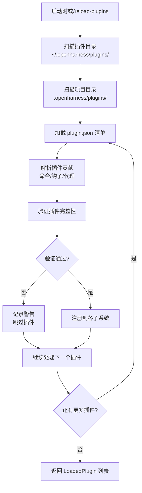
```mermaid
graph TD
    A[启动时或/reload-plugins] --> B[扫描插件目录<br/>~/.openharness/plugins/]
    B --> C[扫描项目目录<br/>.openharness/plugins/]
    C --> D[加载 plugin.json 清单]
    D --> E[解析插件贡献<br/>命令/钩子/代理]
    E --> F[验证插件完整性]
    F --> G{验证通过?}
    G -->|否| H[记录警告<br/>跳过插件]
    G -->|是| I[注册到各子系统]
    H --> J[继续处理下一个插件]
    I --> J
    J --> K{还有更多插件?}
    K -->|是| D
    K -->|否| L[返回 LoadedPlugin 列表]
```

触发条件：启动时或 `/reload-plugins`
执行路径：
1. 扫描 `~/.openharness/plugins/`
2. 扫描项目 `.openharness/plugins/`
3. 加载 `plugin.json` 清单
4. 解析插件贡献（命令、钩子、代理）
5. 验证插件完整性

输出结果：`list[LoadedPlugin]`
源码证据：`plugins/loader.py` -> `load_plugins`

#### F105. 插件安装与卸载

触发条件：`/plugin install/uninstall`
执行路径：
1. 安装：从路径复制到插件目录
2. 卸载：从插件目录删除

输出结果：安装路径或成功标志
源码证据：`plugins/installer.py` -> `install_plugin_from_path`, `uninstall_plugin`

#### F106. 插件命令渲染

触发条件：执行插件命令
执行路径：
1. 替换 `${ARGUMENTS}` 占位符
2. 添加技能基础目录头部
3. 可选禁用模型调用

输出结果：渲染后的提示文本
源码证据：`commands/registry.py` -> `_render_plugin_command_prompt`

#### F107. 插件贡献集成

触发条件：插件加载时
执行路径：
1. 注册插件命令到命令注册表
2. 注册插件钩子到钩子系统
3. 注册插件代理定义
4. 注册 MCP 服务器配置

输出结果：集成到各子系统
源码证据：`plugins/types.py` -> `LoadedPlugin`

---

### M5. Skills（技能系统）

**模块职责：** 按需加载知识技能，提供领域专家指导

**源码位置：** `src/openharness/skills/`

#### F108. 技能加载

触发条件：启动时或技能注册时
执行路径：
1. 加载内置技能
2. 加载用户技能（`~/.openharness/skills/`）
3. 加载插件技能
4. 解析 YAML frontmatter 获取元数据

输出结果：`SkillRegistry`
源码证据：`skills/loader.py` -> `load_skill_registry`

#### F109. 技能注册表

触发条件：技能加载时
执行路径：
1. 注册技能定义
2. 按名称查找
3. 列表所有技能

输出结果：技能注册表实例
源码证据：`skills/registry.py` -> `SkillRegistry`

#### F110. 技能执行

触发条件：Agent 调用 `skill` 工具
执行路径：
1. 查找技能定义
2. 加载技能内容
3. 返回技能指导

输出结果：技能内容文本
源码证据：`skills/loader.py` -> `load_skill_registry`

#### F111. 技能追踪

触发条件：技能执行后
执行路径：
1. 记录技能名称
2. 更新活跃工件
3. 更新验证工作

输出结果：更新 tool_metadata
源码证据：`engine/query.py` -> `_remember_skill_invocation`

---

### M6. MCP（Model Context Protocol）

**模块职责：** 连接 MCP 服务器，扩展工具集

**源码位置：** `src/openharness/mcp/`, `src/openharness/mcp_runtime/`

#### F112. MCP 服务器管理

**流程图：**

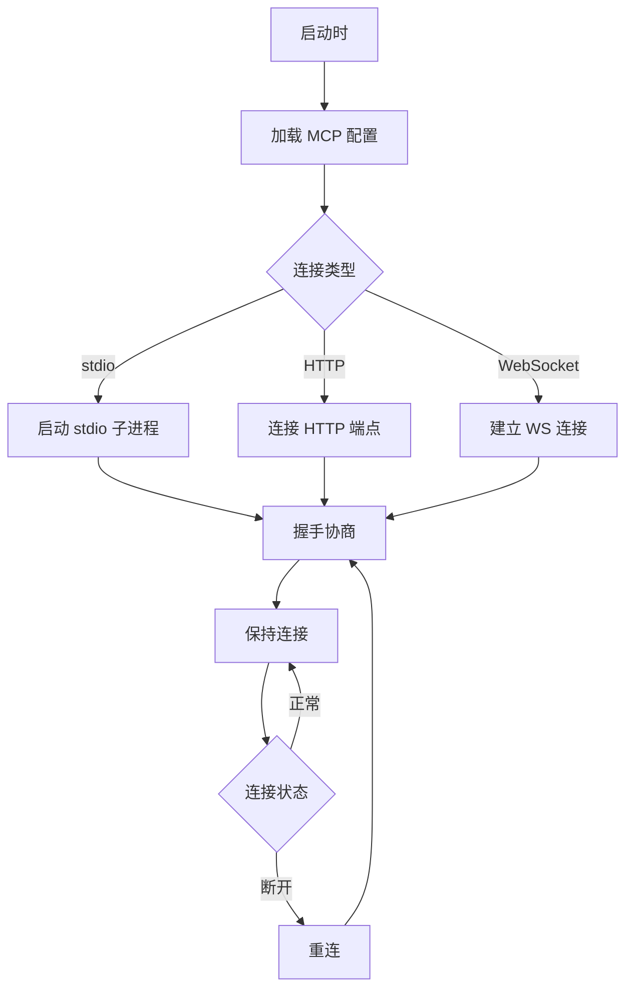
```mermaid
graph TD
    A[启动时] --> B[加载 MCP 配置]
    B --> C{连接类型}
    C -->|stdio| D[启动 stdio 子进程]
    C -->|HTTP| E[连接 HTTP 端点]
    C -->|WebSocket| F[建立 WS 连接]
    D --> G[握手协商]
    E --> G
    F --> G
    G --> H[保持连接]
    H --> I{连接状态}
    I -->|断开| J[重连]
    I -->|正常| H
    J --> G
```

触发条件：启动时
执行路径：
1. 加载 MCP 配置
2. 启动 stdio 进程或连接 HTTP/WS
3. 握手协商
4. 保持连接

输出结果：`McpClientManager`
源码证据：`mcp_runtime/client.py` -> `McpClientManager`

#### F113. MCP 工具调用

**流程图：**

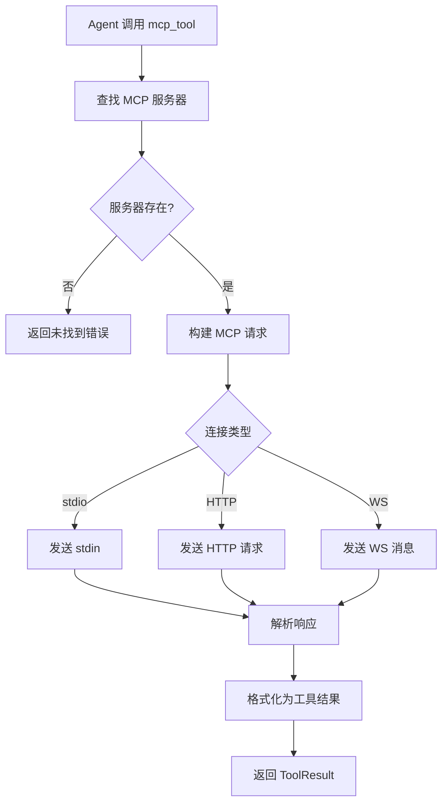
```mermaid
graph TD
    A[Agent 调用 mcp_tool] --> B[查找 MCP 服务器]
    B --> C{服务器存在?}
    C -->|否| D[返回未找到错误]
    C -->|是| E[构建 MCP 请求]
    E --> F{连接类型}
    F -->|stdio| G[发送 stdin]
    F -->|HTTP| H[发送 HTTP 请求]
    F -->|WS| I[发送 WS 消息]
    G --> J[解析响应]
    H --> J
    I --> J
    J --> K[格式化为工具结果]
    K --> L[返回 ToolResult]
```

触发条件：Agent 调用 `mcp_tool`
执行路径：
1. 查找 MCP 服务器
2. 构建 MCP 请求
3. 发送请求（stdio/HTTP/WS）
4. 解析响应
5. 格式化为工具结果

输出结果：工具结果
源码证据：`mcp_runtime/client.py` -> `call_tool`

#### F114. MCP 资源读取

触发条件：Agent 调用 `read_mcp_resource`
执行路径：
1. 列出 MCP 服务器资源
2. 读取指定资源
3. 返回资源内容

输出结果：资源内容
源码证据：`mcp_runtime/client.py` -> `read_resource`

---

### M7. Swarm/Coordinator（蜂群协调）

**模块职责：** 多代理协作，子代理生成和管理

**源码位置：** `src/openharness/swarm/`, `src/openharness/coordinator/`

#### F115. 子代理生成

**流程图：**

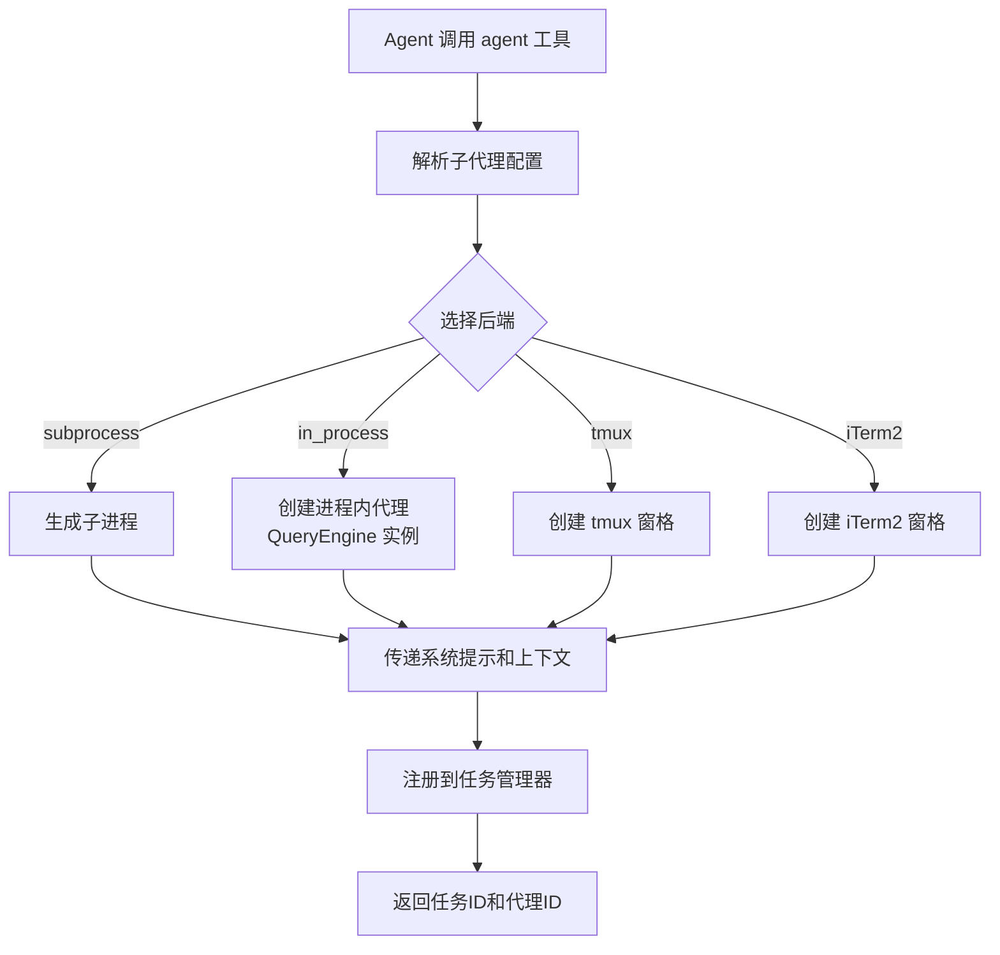
```mermaid
graph TD
    A[Agent 调用 agent 工具] --> B[解析子代理配置]
    B --> C{选择后端}
    C -->|subprocess| D[生成子进程]
    C -->|in_process| E[创建进程内代理<br/>QueryEngine 实例]
    C -->|tmux| F[创建 tmux 窗格]
    C -->|iTerm2| G[创建 iTerm2 窗格]
    D --> H[传递系统提示和上下文]
    E --> H
    F --> H
    G --> H
    H --> I[注册到任务管理器]
    I --> J[返回任务ID和代理ID]
```

触发条件：Agent 调用 `agent` 工具
执行路径：
1. 解析子代理配置
2. 选择执行后端（subprocess/in_process/tmux/iTerm2）
3. 生成子进程或创建进程内代理
4. 传递系统提示和上下文
5. 注册任务到任务管理器

输出结果：任务 ID 和代理 ID
源码证据：`swarm/` -> `TeammateExecutor`

#### F116. 团队管理

触发条件：Agent 调用 `team_create`
执行路径：
1. 创建团队上下文
2. 注册团队成员
3. 分配角色和权限

输出结果：团队 ID
源码证据：`swarm/` -> `TeamLifecycle`

#### F117. 进程内团队成员

触发条件：使用 in_process 后端
执行路径：
1. 创建新的 QueryEngine 实例
2. 在同一进程运行
3. 通过消息队列通信

输出结果：团队成员实例
源码证据：`swarm/in_process.py` -> `InProcessTeammate`

#### F118. tmux/iTerm2 集成

**流程图：**

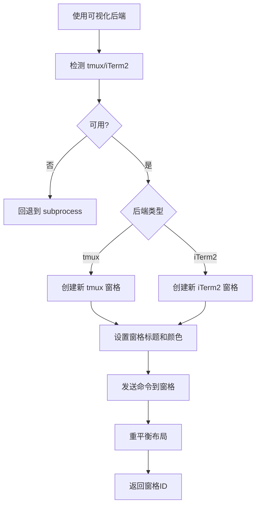
```mermaid
graph TD
    A[使用可视化后端] --> B[检测 tmux/iTerm2]
    B --> C{可用?}
    C -->|否| D[回退到 subprocess]
    C -->|是| E{后端类型}
    E -->|tmux| F[创建新 tmux 窗格]
    E -->|iTerm2| G[创建新 iTerm2 窗格]
    F --> H[设置窗格标题和颜色]
    G --> H
    H --> I[发送命令到窗格]
    I --> J[重平衡布局]
    J --> K[返回窗格ID]
```

触发条件：使用可视化后端
执行路径：
1. 检测 tmux/iTerm2 可用性
2. 创建新窗格
3. 设置窗格标题和颜色
4. 发送命令到窗格
5. 重平衡布局

输出结果：窗格 ID
源码证据：`swarm/` -> `tmux.py`, `iterm2.py`

#### F119. 代理消息传递

触发条件：Agent 调用 `send_message`
执行路径：
1. 查找目标代理
2. 构建消息
3. 通过 stdin 发送
4. 处理响应

输出结果：消息传递结果
源码证据：`swarm/` -> `TeammateExecutor.send_message`

---

### M8. Memory（记忆系统）

**模块职责：** 持久化跨会话知识

**源码位置：** `src/openharness/memory/`

#### F120. Markdown 记忆后端

**流程图：**

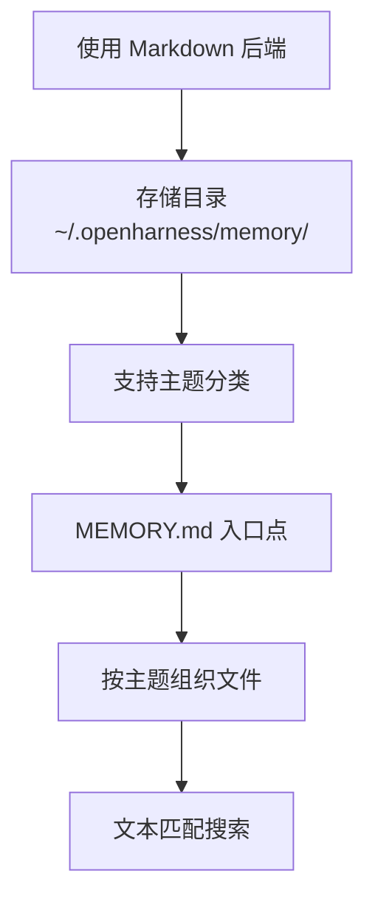
```mermaid
graph TD
    A[使用 Markdown 后端] --> B[存储目录<br/>~/.openharness/memory/]
    B --> C[支持主题分类]
    C --> D[MEMORY.md 入口点]
    D --> E[按主题组织文件]
    E --> F[文本匹配搜索]
```

触发条件：使用 Markdown 后端
执行路径：
1. 存储记忆到 `~/.openharness/memory/`
2. 支持 `MEMORY.md` 入口点
3. 支持按主题分类

输出结果：记忆文件
源码证据：`memory/markdown/` -> `MarkdownMemoryBackend`

#### F121. Mem0 记忆后端

触发条件：使用 mem0 后端
执行路径：
1. 连接到 mem0 服务
2. 自动提取对话记忆
3. 向量存储和检索

输出结果：记忆条目
源码证据：`memory/mem0/` -> `Mem0MemoryBackend`

#### F122. 记忆搜索

**流程图：**

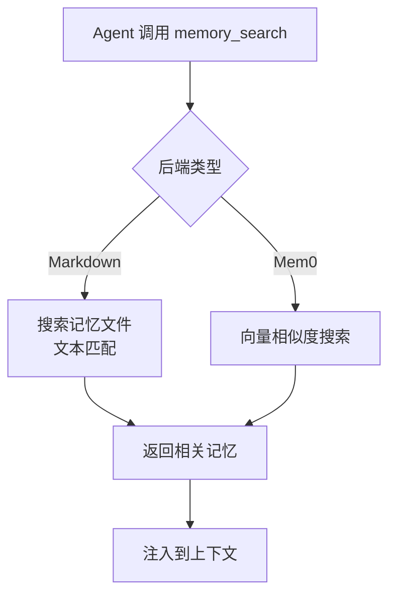
```mermaid
graph TD
    A[Agent 调用 memory_search] --> B{后端类型}
    B -->|Markdown| C[搜索记忆文件<br/>文本匹配]
    B -->|Mem0| D[向量相似度搜索]
    C --> E[返回相关记忆]
    D --> E
    E --> F[注入到上下文]
```

触发条件：Agent 调用 `memory_search`
执行路径：
1. 搜索记忆文件或向量数据库
2. 返回相关记忆
3. 注入到上下文

输出结果：相关记忆列表
源码证据：`memory/markdown/search.py` -> `find_relevant_memories`

#### F123. 记忆提取

触发条件：达到提取阈值
执行路径：
1. 收集对话消息
2. 提取关键信息
3. 保存到记忆后端

输出结果：保存确认
源码证据：`memory/` -> `extract_and_store`

#### F124. 入口点管理

触发条件：上下文组装时
执行路径：
1. 加载 `MEMORY.md`
2. 限制行数
3. 注入到系统提示

输出结果：入口点文本
源码证据：`memory/markdown/memdir.py` -> `load_memory_prompt`

---

### M9. Tasks（任务系统）

**模块职责：** 后台任务管理

**源码位置：** `src/openharness/tasks/`

#### F125. Shell 任务创建

**流程图：**

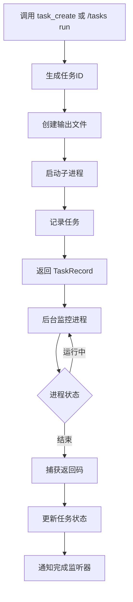
```mermaid
graph TD
    A[调用 task_create 或 /tasks run] --> B[生成任务ID]
    B --> C[创建输出文件]
    C --> D[启动子进程]
    D --> E[记录任务]
    E --> F[返回 TaskRecord]
    F --> G[后台监控进程]
    G --> H{进程状态}
    H -->|运行中| G
    H -->|结束| I[捕获返回码]
    I --> J[更新任务状态]
    J --> K[通知完成监听器]
```

触发条件：Agent 调用 `task_create` 或 `/tasks run`
执行路径：
1. 生成任务 ID
2. 创建输出文件
3. 启动子进程
4. 记录任务

输出结果：`TaskRecord`
源码证据：`tasks/manager.py` -> `BackgroundTaskManager.create_shell_task`

#### F126. Agent 任务创建

触发条件：Agent 调用 `agent` 工具
执行路径：
1. 构建子代理命令
2. 调用 `create_shell_task`
3. 存储初始提示

输出结果：`TaskRecord`
源码证据：`tasks/manager.py` -> `BackgroundTaskManager.create_agent_task`

#### F127. 任务输出读取

触发条件：Agent 调用 `task_output`
执行路径：
1. 查找任务记录
2. 读取输出文件
3. 返回尾部内容

输出结果：任务输出文本
源码证据：`tasks/manager.py` -> `BackgroundTaskManager.read_task_output`

#### F128. 任务停止

**流程图：**

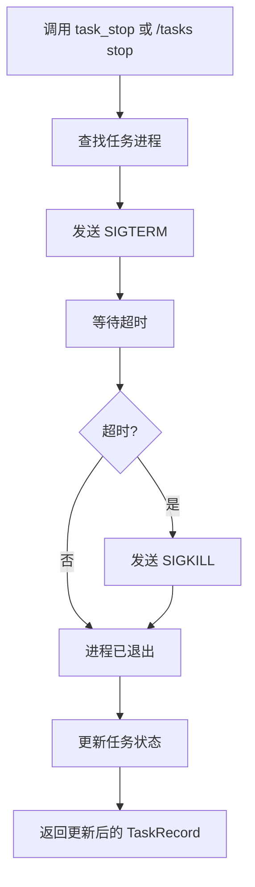
```mermaid
graph TD
    A[调用 task_stop 或 /tasks stop] --> B[查找任务进程]
    B --> C[发送 SIGTERM]
    C --> D[等待超时]
    D --> E{超时?}
    E -->|是| F[发送 SIGKILL]
    E -->|否| G[进程已退出]
    F --> G
    G --> H[更新任务状态]
    H --> I[返回更新后的 TaskRecord]
```

触发条件：Agent 调用 `task_stop` 或 `/tasks stop`
执行路径：
1. 查找任务进程
2. 发送 SIGTERM
3. 超时发送 SIGKILL
4. 更新任务状态

输出结果：更新后的 TaskRecord
源码证据：`tasks/manager.py` -> `BackgroundTaskManager.stop_task`

#### F129. 任务生命周期

触发条件：进程结束
执行路径：
1. 捕获返回码
2. 更新任务状态
3. 通知完成监听器

输出结果：状态变更 + 回调
源码证据：`tasks/manager.py` -> `_watch_process`

---

### M10. Permissions（权限系统）

**模块职责：** 多级安全管理

**源码位置：** `src/openharness/permissions/`

#### F130. 权限模式

**流程图：**

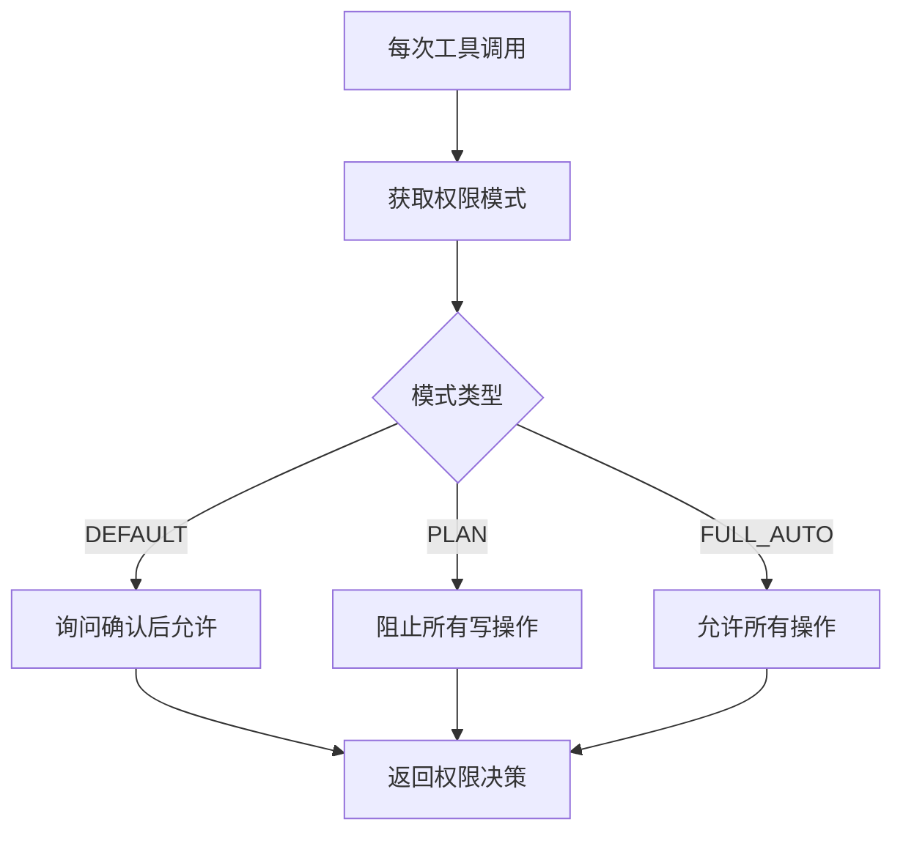
```mermaid
graph TD
    A[每次工具调用] --> B[获取权限模式]
    B --> C{模式类型}
    C -->|DEFAULT| D[询问确认后允许]
    C -->|PLAN| E[阻止所有写操作]
    C -->|FULL_AUTO| F[允许所有操作]
    D --> G[返回权限决策]
    E --> G
    F --> G
```

触发条件：每次工具调用
执行路径：
1. DEFAULT：询问确认后允许
2. PLAN：阻止所有写操作
3. FULL_AUTO：允许所有操作

输出结果：权限决策
源码证据：`permissions/modes.py` -> `PermissionMode`

#### F131. 路径规则

触发条件：工具涉及文件路径
执行路径：
1. 匹配 glob 模式
2. 根据规则允许/拒绝
3. 记录拒绝原因

输出结果：权限决策
源码证据：`permissions/checker.py` -> `PermissionChecker.evaluate`

#### F132. 命令规则

触发条件：Bash 工具执行
执行路径：
1. 匹配命令模式
2. 拒绝危险命令（如 `rm -rf /`）
3. 提示包安装风险

输出结果：权限决策
源码证据：`permissions/checker.py` -> `_bash_permission_hint`

#### F133. 敏感路径保护

触发条件：工具访问敏感路径
执行路径：
1. 硬编码敏感路径模式
2. fnmatch 匹配
3. 始终拒绝

输出结果：权限决策（始终拒绝）
源码证据：`permissions/checker.py` -> `SENSITIVE_PATH_PATTERNS`

---

### M11. Hooks（钩子系统）

**模块职责：** 生命周期事件钩子

**源码位置：** `src/openharness/hooks/`

#### 钩子事件类型

| 编号 | 事件 | 触发时机 | 说明 |
|------|------|----------|------|
| F134 | USER_PROMPT_SUBMIT | 用户提交提示 | 可修改提示 |
| F135 | PRE_TOOL_USE | 工具执行前 | 可阻止执行 |
| F136 | POST_TOOL_USE | 工具执行后 | 可记录/修改结果 |
| F137 | STOP | 对话结束 | 最终清理 |
| F138 | PRE_COMPACT | 压缩前 | 可阻止压缩 |
| F139 | POST_COMPACT | 压缩后 | 可记录结果 |
| F140 | NOTIFICATION | 通知事件 | 提示用户 |

**钩子执行流程：**

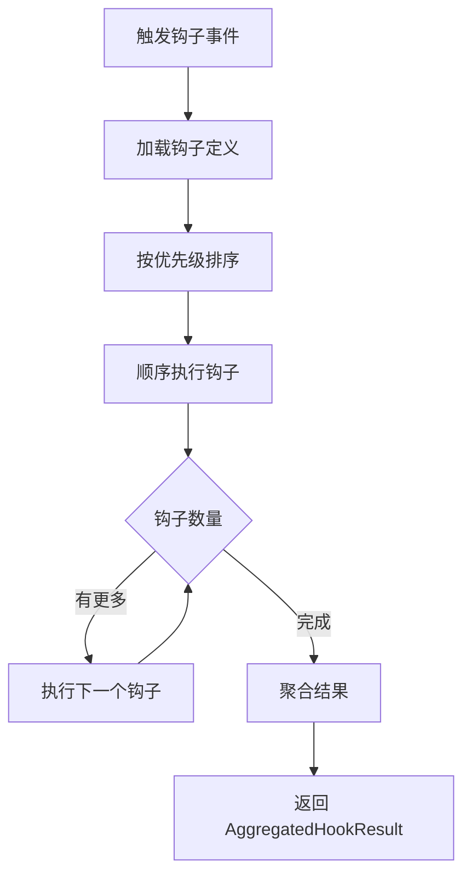
```mermaid
graph TD
    A[触发钩子事件] --> B[加载钩子定义]
    B --> C[按优先级排序]
    C --> D[顺序执行钩子]
    D --> E{钩子数量}
    E -->|有更多| F[执行下一个钩子]
    E -->|完成| G[聚合结果]
    F --> E
    G --> H[返回 AggregatedHookResult]
```

#### 钩子加载与执行

触发条件：启动时和钩子配置变更
执行路径：
1. 加载钩子定义
2. 按优先级排序
3. 顺序执行钩子
4. 聚合结果

输出结果：`AggregatedHookResult`
源码证据：`hooks/executor.py` -> `HookExecutor`

---

### M12. Prompts（提示词系统）

**模块职责：** 上下文组装和系统提示构建

**源码位置：** `src/openharness/prompts/`

#### F141. CLAUDE.md 加载

触发条件：启动时
执行路径：
1. 查找 `CLAUDE.md`
2. 读取内容
3. 注入系统提示

输出结果：CLAUDE.md 内容
源码证据：`prompts/claudemd.py` -> `load_claude_md_prompt`

#### F142. 系统提示构建

**流程图：**

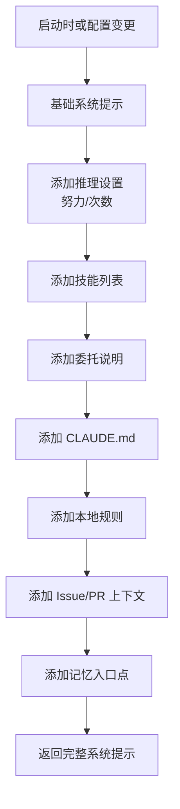
```mermaid
graph TD
    A[启动时或配置变更] --> B[基础系统提示]
    B --> C[添加推理设置<br/>努力/次数]
    C --> D[添加技能列表]
    D --> E[添加委托说明]
    E --> F[添加 CLAUDE.md]
    F --> G[添加本地规则]
    G --> H[添加 Issue/PR 上下文]
    H --> I[添加记忆入口点]
    I --> J[返回完整系统提示]
```

触发条件：启动时和配置变更
执行路径：
1. 基础系统提示
2. 推理设置（努力/次数）
3. 技能列表
4. 委托说明
5. CLAUDE.md 内容
6. 本地规则
7. Issue/PR 评论上下文
8. 记忆入口点

输出结果：完整系统提示
源码证据：`prompts/system_prompt.py` -> `build_system_prompt`

#### F143. 运行时提示组装

**流程图：**

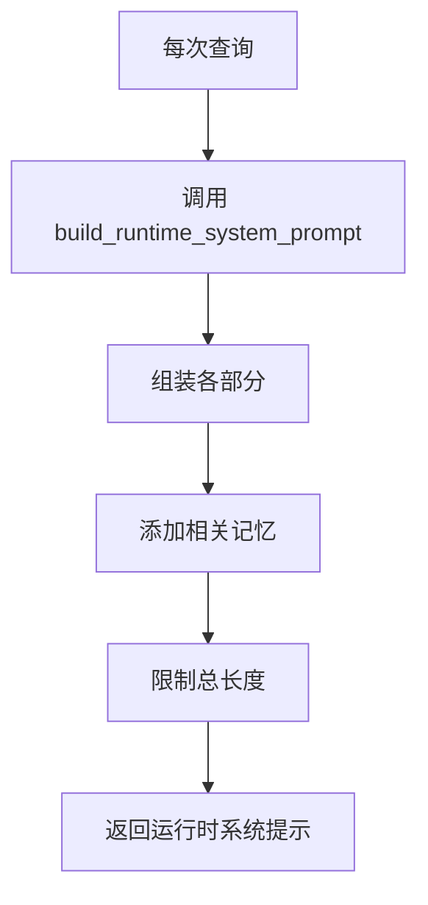
```mermaid
graph TD
    A[每次查询] --> B[调用 build_runtime_system_prompt]
    B --> C[组装各部分]
    C --> D[添加相关记忆]
    D --> E[限制总长度]
    E --> F[返回运行时系统提示]
```

触发条件：每次查询
执行路径：
1. 调用 `build_runtime_system_prompt`
2. 组装各部分
3. 添加相关记忆
4. 限制总长度

输出结果：运行时系统提示
源码证据：`prompts/context.py` -> `build_runtime_system_prompt`

#### F144. 协调器提示

触发条件：协调器模式
执行路径：
1. 检测协调器模式
2. 加载协调器提示
3. 添加团队上下文

输出结果：协调器系统提示
源码证据：`prompts/system_prompt.py` -> `get_coordinator_system_prompt`

#### F145. 记忆提示注入

触发条件：上下文组装
执行路径：
1. 加载记忆后端
2. 获取入口点
3. 搜索相关记忆
4. 注入到提示

输出结果：记忆文本
源码证据：`prompts/context.py` -> `build_runtime_system_prompt`

---

### M13. Config（配置系统）

**模块职责：** 多层配置管理

**源码位置：** `src/openharness/config/`

#### F146. 设置模型

**流程图：**

```mermaid
graph TD
    A[启动时] --> B[加载 settings.json]
    B --> C[解析 Pydantic 模型]
    C --> D[应用默认值]
    D --> E[检查环境变量覆盖]
    E --> F[应用环境变量]
    F --> G[检查 CLI 参数]
    G --> H[应用 CLI 参数]
    H --> I[返回 Settings]
```

触发条件：启动时
执行路径：
1. 加载 `~/.openharness/settings.json`
2. 解析 Pydantic 模型
3. 应用默认值

输出结果：`Settings`
源码证据：`config/settings.py` -> `Settings`

#### F147. 环境变量覆盖

触发条件：启动时
执行路径：
1. 检查环境变量
2. 覆盖文件配置
3. 应用优先级

输出结果：合并后的设置
源码证据：`config/settings.py` -> `resolve_from_env`

#### F148. CLI 参数覆盖

触发条件：CLI 调用
执行路径：
1. 解析 CLI 参数
2. 覆盖环境变量
3. 应用于运行时

输出结果：最终设置
源码证据：`cli.py` -> 顶层参数解析

#### F149. 提供商配置

触发条件：提供商切换
执行路径：
1. 加载提供商配置
2. 验证凭证
3. 切换活动提供商

输出结果：提供商 Profile
源码证据：`config/settings.py` -> `ProviderProfile`

#### F150. MCP 服务器配置

触发条件：启动时
执行路径：
1. 加载 MCP 配置
2. 解析服务器定义
3. 启动服务器

输出结果：`McpServerConfig`
源码证据：`config/settings.py` -> `McpServerConfig`

#### F151. 记忆配置

触发条件：启动时
执行路径：
1. 加载记忆设置
2. 选择后端
3. 配置提取参数

输出结果：`MemorySettings`
源码证据：`config/settings.py` -> `MemorySettings`

---

### M14. API（API 客户端）

**模块职责：** 模型调用抽象

**源码位置：** `src/openharness/api/`

#### F152. Anthropic API 客户端

**流程图：**

```mermaid
graph TD
    A[发送消息] --> B[构建 API 请求]
    B --> C[添加认证头]
    C --> D[发送流式请求]
    D --> E[处理响应事件]
    E --> F{事件类型}
    F -->|text_delta| G[返回文本增量]
    F -->|content_block| H[处理内容块]
    F -->|message_stop| I[处理消息结束]
    G --> J[继续处理]
    H --> J
    I --> K[返回 UsageSnapshot]
```

触发条件：发送消息
执行路径：
1. 构建 API 请求
2. 添加认证头
3. 发送流式请求
4. 处理响应

输出结果：流式事件
源码证据：`api/client.py` -> `AnthropicApiClient`

#### F153. 重试逻辑

**流程图：**

```mermaid
graph TD
    A[API 调用失败] --> B[检测可重试错误]
    B --> C{可重试?}
    C -->|否| D[返回最终错误]
    C -->|是| E[指数退避]
    E --> F[添加抖动]
    F --> G[等待延迟]
    G --> H[重试请求]
    H --> I{重试次数}
    I -->|未达上限| A
    I -->|已达上限| D
```

触发条件：API 调用失败
执行路径：
1. 检测可重试错误
2. 指数退避
3. 添加抖动
4. 最多 3 次重试

输出结果：重试状态或最终错误
源码证据：`api/client.py` -> `_get_retry_delay`

#### F154. OpenAI 兼容客户端

触发条件：使用 OpenAI 兼容提供商
执行路径：
1. 构建 OpenAI 格式请求
2. 映射到 Anthropic 格式
3. 发送请求

输出结果：流式事件
源码证据：`api/openai_client.py` -> `OpenAICompatibleClient`

#### F155. Codex 客户端

触发条件：使用 Codex 订阅
执行路径：
1. 检测 Codex 订阅
2. 使用本地认证
3. 代理到 Codex

输出结果：流式事件
源码证据：`api/codex_client.py` -> `CodexClient`

#### F156. 成本跟踪

触发条件：API 调用完成
执行路径：
1. 解析 usage 信息
2. 累加 token
3. 计算成本

输出结果：`UsageSnapshot`
源码证据：`api/usage.py` -> `UsageSnapshot`

---

### M15. Auth（认证）

**模块职责：** 多提供商认证管理

**源码位置：** `src/openharness/auth/`

#### F157. API 密钥认证

触发条件：使用 API 密钥
执行路径：
1. 存储密钥到配置文件
2. 加载密钥
3. 设置到 API 客户端

输出结果：认证状态
源码证据：`auth/manager.py` -> `AuthManager`

#### F158. OAuth 认证

**流程图：**

```mermaid
graph TD
    A[使用 GitHub Copilot] --> B[启动 OAuth 流程]
    B --> C[打开浏览器]
    C --> D[用户授权]
    D --> E[交换授权码]
    E --> F[获取访问令牌]
    F --> G[存储令牌]
    G --> H[返回 OAuth 令牌]
```

触发条件：使用 GitHub Copilot
执行路径：
1. 启动 OAuth 流程
2. 打开浏览器
3. 交换代码
4. 存储令牌

输出结果：OAuth 令牌
源码证据：`auth/oauth.py` -> `OAuthFlow`

#### F159. Claude 订阅桥接

触发条件：使用 Claude 订阅
执行路径：
1. 读取本地凭证
2. 构建归属头
3. 代理请求

输出结果：认证头
源码证据：`auth/external.py` -> `claude_oauth_headers`

#### F160. 提供商自动检测

触发条件：启动时
执行路径：
1. 检测 base_url
2. 匹配提供商模式
3. 返回提供商类型

输出结果：`Provider`
源码证据：`api/provider.py` -> `detect_provider`

---

### M16. Channels（消息通道）

**模块职责：** 连接消息平台（Telegram/Slack/Discord/Feishu）

**源码位置：** `src/openharness/channels/`

#### F161. ChannelBridge

**流程图：**

```mermaid
graph TD
    A[收到消息] --> B[消费入站消息]
    B --> C[提交到 QueryEngine]
    C --> D[处理消息]
    D --> E[生成响应]
    E --> F[发布出站回复]
    F --> G[返回回复消息]
```

触发条件：收到消息
执行路径：
1. 消费入站消息
2. 提交到 QueryEngine
3. 发布出站回复

输出结果：回复消息
源码证据：`channels/adapter.py` -> `ChannelBridge`

#### F162. 消息总线

**流程图：**

```mermaid
graph TD
    A[消息处理] --> B[入站队列]
    B --> C[处理消息]
    C --> D[出站队列]
    D --> E[异步消费]
    E --> F[消息传递]
```

触发条件：消息处理
执行路径：
1. 入站队列
2. 出站队列
3. 异步消费

输出结果：消息传递
源码证据：`channels/bus/` -> `MessageBus`

#### F163. Telegram 适配器

触发条件：Telegram 消息
执行路径：
1. Webhook 接收
2. 格式转换
3. 发送到总线

输出结果：格式化的消息
源码证据：`channels/impl/telegram.py` -> `TelegramAdapter`

#### F164. Slack 适配器

触发条件：Slack 事件
执行路径：
1. OAuth 配置
2. 事件订阅
3. 格式转换

输出结果：格式化的消息
源码证据：`channels/impl/slack.py` -> `SlackAdapter`

#### F165. Discord 适配器

触发条件：Discord 消息
执行路径：
1. Bot token 配置
2. Gateway 连接
3. 格式转换

输出结果：格式化的消息
源码证据：`channels/impl/discord.py` -> `DiscordAdapter`

#### F166. Feishu 适配器

触发条件：飞书消息
执行路径：
1. App ID/Secret 配置
2. 事件订阅
3. 格式转换

输出结果：格式化的消息
源码证据：`channels/impl/feishu.py` -> `FeishuAdapter`

---

### M17. Services（服务）

**模块职责：** 核心辅助服务

**源码位置：** `src/openharness/services/`

#### F167. 上下文压缩

**流程图：**

```mermaid
graph TD
    A[需要压缩上下文] --> B{压缩级别}
    B -->|微压缩| C[清除旧工具结果]
    B -->|上下文折叠| D[压缩超大文本块]
    B -->|会话记忆| E[生成摘要无需LLM]
    B -->|完整压缩| F[调用 LLM 生成摘要]
    C --> G[返回压缩后的消息]
    D --> G
    E --> G
    F --> G
```

触发条件：需要压缩上下文
执行路径：
1. 微压缩（清除旧工具结果）
2. 上下文折叠（压缩大文本）
3. 会话记忆（生成摘要）
4. 完整压缩（调用 LLM）

输出结果：压缩后的消息
源码证据：`services/compact/` -> `compact_conversation`

#### F168. Token 估计

触发条件：计算 token 数量
执行路径：
1. 按模型估算
2. 添加安全边距
3. 返回 token 数

输出结果：估计的 token 数
源码证据：`services/token_estimation.py` -> `estimate_tokens`

#### F169. 会话持久化

触发条件：会话保存/恢复
执行路径：
1. 序列化消息
2. 保存到文件
3. 加载并反序列化

输出结果：会话快照
源码证据：`services/session_backend.py` -> `SessionBackend`

#### F170. LSP 服务

触发条件：代码导航请求
执行路径：
1. 连接 LSP 服务器
2. 发送请求
3. 解析响应

输出结果：LSP 响应
源码证据：`services/lsp/` -> `LSPClient`

---

### M18. UI（界面）

**模块职责：** React TUI 界面

**源码位置：** `src/openharness/ui/`

#### F171. React TUI 后端协议

**流程图：**

```mermaid
graph TD
    A[TUI 事件] --> B[解析输入协议]
    B --> C[执行命令]
    C --> D[序列化事件]
    D --> E[发送事件流]
    E --> F[UI 渲染]
```

触发条件：TUI 事件
执行路径：
1. 解析输入协议
2. 执行命令
3. 序列化和发送事件

输出结果：事件流
源码证据：`ui/protocol.py` -> `UIProtocol`

#### F172. React 启动器

触发条件：启动 TUI
执行路径：
1. 启动 React 开发服务器
2. 打开浏览器
3. 建立 WebSocket 连接

输出结果：TUI 运行
源码证据：`ui/react_launcher.py` -> `launch_react_ui`

#### F173. Textual 应用

触发条件：使用 Textual TUI
执行路径：
1. 初始化 Textual 应用
2. 运行事件循环
3. 渲染界面

输出结果：TUI 界面
源码证据：`ui/textual_app.py` -> `TextualApp`

#### F174. 权限对话框

触发条件：需要用户确认
执行路径：
1. 显示工具信息
2. 接收用户输入
3. 返回确认结果

输出结果：用户决策
源码证据：`ui/permission_dialog.py` -> `PermissionDialog`

#### F175. 输出渲染

触发条件：显示输出
执行路径：
1. 应用主题
2. 格式化内容
3. 处理 Markdown

输出结果：渲染后的文本
源码证据：`ui/output.py` -> `render_output`

---

## 四、模块间依赖关系

### 4.1 调用关系图

```mermaid
graph LR
    subgraph "入口层"
        CLI[CLI/UI]
    end

    subgraph "命令层"
        CMDS[Commands<br/>90+ 命令]
    end

    subgraph "核心层"
        ENGINE[Engine<br/>QueryEngine]
    end

    subgraph "基础设施层"
        API[API 客户端]
        HOOKS[Hooks<br/>钩子系统]
        PERMS[Permissions<br/>权限检查]
    end

    subgraph "扩展层"
        TOOLS[Tools<br/>43+ 工具]
        PLUGINS[Plugins<br/>插件系统]
        MEMORY[Memory<br/>记忆系统]
        MCP[MCP<br/>协议客户端]
    end

    subgraph "协调层"
        SWARM[Swarm<br/>蜂群协调]
        TASKS[Tasks<br/>任务管理]
    end

    CLI --> CMDS
    CMDS --> ENGINE
    ENGINE --> API
    ENGINE --> TOOLS
    ENGINE --> HOOKS
    ENGINE --> PERMS
    ENGINE --> MEMORY
    TOOLS --> PLUGINS
    PLUGINS --> HOOKS
    SWARM --> TASKS
    SWARM --> ENGINE
    MCP --> TOOLS
```

### 4.2 主要数据流

**用户输入流程：**

```mermaid
graph TD
    A[CLI/UI 接收用户输入] --> B[Commands 处理命令]
    B --> C[Engine 提交消息]
    C --> D[API 客户端调用]
    D --> E[流式返回事件]
    E --> F[UI 渲染输出]
```

**工具执行流程：**

```mermaid
graph TD
    A[Engine 执行工具调用] --> B[Permissions 权限检查]
    B --> C{通过?}
    C -->|否| D[返回拒绝]
    C -->|是| E[Hooks PRE_TOOL_USE]
    E --> F{阻止?}
    F -->|是| G[返回阻止原因]
    F -->|否| H[Tools 执行工具]
    H --> I[Hooks POST_TOOL_USE]
    I --> J[返回 ToolResult]
    D --> J
    G --> J
```

**上下文组装流程：**

```mermaid
graph TD
    A[Prompts 组装上下文] --> B[加载 Skills 技能]
    B --> C[加载 Memory 记忆]
    C --> D[应用 Config 配置]
    D --> E[构建 System Prompt]
    E --> F[传递给 Engine]
```

---

## 五、源码索引

| 模块 | 主要文件 | 关键类和函数 |
|------|----------|--------------|
| Engine | `engine/query_engine.py` | `QueryEngine` |
| Engine | `engine/query.py` | `run_query`, `_execute_tool_call` |
| Engine | `engine/stream_events.py` | `StreamEvent` |
| Engine | `engine/cost_tracker.py` | `CostTracker` |
| Tools | `tools/base.py` | `BaseTool`, `ToolRegistry` |
| Tools | `tools/registry.py` | 工具注册 |
| Commands | `commands/registry.py` | `CommandRegistry`, 90+ 命令处理器 |
| Plugins | `plugins/loader.py` | `load_plugins` |
| Plugins | `plugins/installer.py` | `install_plugin_from_path` |
| Skills | `skills/loader.py` | `load_skill_registry` |
| Skills | `skills/registry.py` | `SkillRegistry` |
| MCP | `mcp_runtime/client.py` | `McpClientManager` |
| Swarm | `swarm/registry.py` | `TeammateExecutor` |
| Memory | `memory/markdown/` | `MarkdownMemoryBackend` |
| Memory | `memory/mem0/` | `Mem0MemoryBackend` |
| Tasks | `tasks/manager.py` | `BackgroundTaskManager` |
| Permissions | `permissions/checker.py` | `PermissionChecker` |
| Hooks | `hooks/executor.py` | `HookExecutor` |
| Prompts | `prompts/context.py` | `build_runtime_system_prompt` |
| Config | `config/settings.py` | `Settings` |
| API | `api/client.py` | `AnthropicApiClient` |
| Auth | `auth/manager.py` | `AuthManager` |
| Channels | `channels/adapter.py` | `ChannelBridge` |
| Services | `services/compact/` | `compact_conversation` |
| UI | `ui/protocol.py` | `UIProtocol` |

---

## 六、总结

### 核心发现

1. **Engine 是系统的核心**：QueryEngine 管理整个对话循环，包括消息历史、工具执行、成本跟踪和自动压缩

2. **工具系统高度可扩展**：43+ 内置工具 + 插件系统 + MCP 集成 = 无限扩展能力

3. **多层安全防护**：权限模式 + 路径规则 + 命令规则 + 敏感路径保护 + 钩子系统

4. **记忆系统支持多种后端**：Markdown（简单文件）+ Mem0（向量检索）

5. **多代理协作**：Swarm/Coordinator 支持子代理生成、团队管理、tmux/iTerm2 集成

6. **完整的生命周期钩子**：从用户输入到工具执行再到压缩，都有钩子介入点

7. **丰富的命令系统**：90+ slash 命令覆盖会话、配置、诊断、项目管理等

### 架构特点

- **分层设计**：清晰的职责边界，模块间通过接口交互
- **事件驱动**：流式事件系统支持实时反馈
- **可扩展性**：插件系统、技能系统、MCP 集成
- **安全优先**：多层权限控制和敏感路径保护
- **持久化支持**：记忆系统、会话恢复、任务管理
