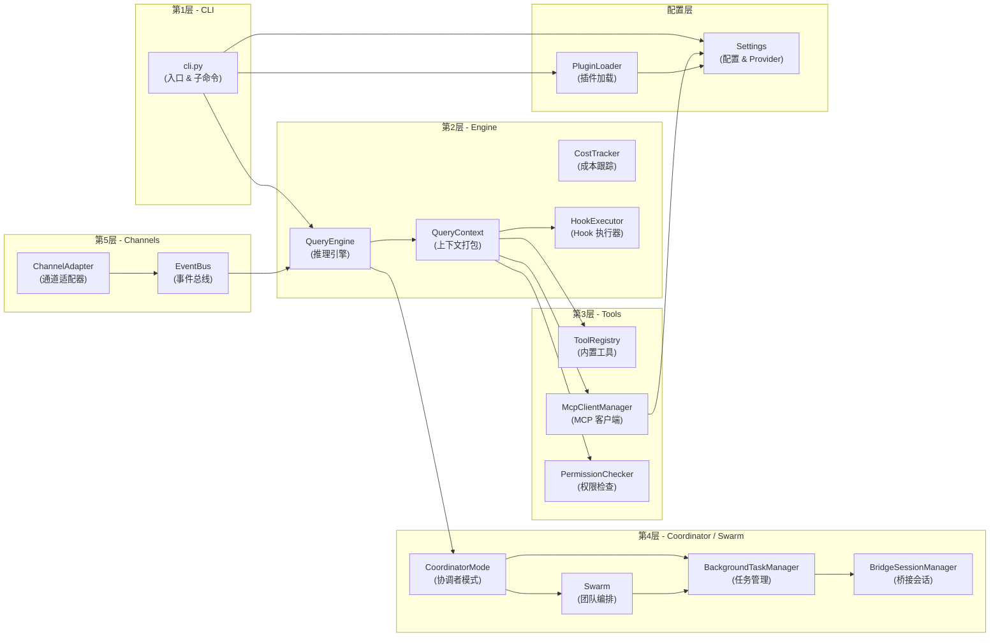

# 架构总览

## 摘要

OpenHarness 是一个以 AI 模型为核心驱动力的自动化编码助手运行时，其架构遵循经典的"输入 → 推理 → 执行 → 反馈"循环，但通过多智能体编排层（Coordinator/Swarm）和多通道抽象层（Channels/OHMO）大幅拓展了传统 CLI 工具的边界。本文介绍系统的五层逻辑架构、核心模块职责、模块依赖关系，以及关键的设计取舍与风险。

## 你将了解

- OpenHarness 的五层架构如何从上到下组织
- Engine、Coordinator、Tools、MCP、Plugins、Swarm、Channels 各模块的职责边界
- 模块间的依赖关系和数据流向
- 系统在设计上做出的关键取舍及其权衡理由
- 架构层面的已知风险

## 范围

本文档覆盖 OpenHarness 的核心运行时架构，不包括：OHMO 独立服务（Gateway、数据层）、IDE 插件、CI/CD 集成路径的具体实现。

---

## 五层架构

OpenHarness 的逻辑架构分为五个层次，从用户触达到外部系统依次为：

```
┌─────────────────────────────────────────────────────┐
│  第1层  CLI / REPL                                  │
│  用户入口：oh 命令、交互式终端、非交互 Print 模式     │
├─────────────────────────────────────────────────────┤
│  第2层  Engine / Query                              │
│  对话引擎：QueryEngine，管理历史消息、执行推理循环    │
├─────────────────────────────────────────────────────┤
│  第3层  Tools / MCP                                │
│  工具抽象：ToolRegistry + McpClientManager           │
├─────────────────────────────────────────────────────┤
│  第4层  Coordinator / Swarm                         │
│  多智能体编排：Coordinator 调度 Worker，Swarm 管理团队 │
├─────────────────────────────────────────────────────┤
│  第5层  Channels / OHMO                             │
│  通信通道：多协议适配（Slack/Discord/钉钉等）          │
└─────────────────────────────────────────────────────┘
```

### 第1层：CLI / REPL

CLI 是用户与 OpenHarness 交互的最外层。`cli.py` 通过 Typer 框架注册了多个子命令组：

- `oh` 主命令：启动交互式会话（`run_repl`）、执行单次提示（`run_print_mode`）、恢复历史会话（`--resume` / `--continue`）
- `oh mcp`：MCP 服务器的增删查管理
- `oh plugin`：插件的安装、卸载、列举
- `oh auth`：多提供商认证（Anthropic、OpenAI、GitHub Copilot、Codex、Claude 订阅等）
- `oh provider`：Provider Profile 的增删改查与切换
- `oh cron`：定时任务调度器守护进程的管理

CLI 层还负责将命令行参数合并到 Settings 对象中，优先级为：CLI 参数 > 环境变量 > 配置文件 `~/.openharness/settings.json` > 默认值。

### 第2层：Engine / Query

`QueryEngine`（`src/openharness/engine/query_engine.py`）是整个系统的推理核心。它持有对话历史（`_messages`），对外暴露 `submit_message` 和 `continue_pending` 两个异步迭代器接口：

- `submit_message`：接收用户文本或结构化消息，追加到历史，触发完整的模型调用循环（Tool Call → 执行 → 结果回填 → 再次调用）
- `continue_pending`：在工具调用中断后继续执行，不追加新用户消息

`QueryEngine` 内部通过 `QueryContext` 将 API 客户端、工具注册表、权限检查器等依赖项打包传递给底层的 `run_query` 函数。它还集成了 `HookExecutor`，在工具调用前后允许插件注入自定义逻辑。

`Settings` 对象中定义的 `ProviderProfile` 支持多提供商：Anthropic（直接 API Key）、Claude 订阅（OAuth 桥接）、OpenAI 兼容（DashScope / OpenRouter / Kimi / GLM / MiniMax 等）、GitHub Copilot（OAuth）等，每种 Provider 都有自己的认证解析路径（`resolve_auth`）。

### 第3层：Tools / MCP

工具层由两套子系统组成：

**内置工具注册表**（`ToolRegistry`）：系统内置的 Bash、文件读写、Glob、Grep、Web Fetch、Web Search、Task Create/List/Output、Skill 等工具，在权限检查器（`PermissionChecker`）的配合下决定是否向模型暴露。

**MCP 工具层**（`McpClientManager`，`src/openharness/mcp/client.py`）：通过 MCP（Model Context Protocol）协议连接外部 MCP 服务器。MCP 支持两种传输方式：

- **stdio 传输**：MCP 服务器作为子进程启动，通过标准输入/输出通信（`StdioServerParameters`，命令、参数、环境变量、工作目录均可配置）
- **HTTP Streamable 传输**：通过 `httpx.AsyncClient` 连接远程 MCP 服务器，支持自定义请求头认证

`McpClientManager` 在连接时调用 `session.initialize()` 获取工具列表和资源列表，将它们注册为等效的内置工具，对 `QueryEngine` 透明。

### 第4层：Coordinator / Swarm

**Coordinator 模式**（`src/openharness/coordinator/coordinator_mode.py`）：当环境变量 `CLAUCE_CODE_COORDINATOR_MODE=1` 时，进程进入协调者模式。此时系统提示词被替换为 Coordinator 专用的提示模板，主要工具变为三个编排工具：`agent`（启动 Worker）、`send_message`（向 Worker 发送后续消息）、`task_stop`（停止 Worker）。

Worker 通过 `BackgroundTaskManager.create_agent_task` 启动为子进程，使用相同的 OpenHarness 可执行文件（`python -m openharness --task-worker`），通过 stdin/stdout 传递任务描述和结果。

**Swarm**（`src/openharness/swarm/`）：在协调者模式的基础上，Swarm 进一步管理多智能体团队生命周期：

- `SwarmTeamLifecycle`：管理团队的创建、成员注册和销毁
- `TeammateExecutor` 协议：抽象了 subprocess（始终可用）、in-process、tmux、iTerm2 四种执行后端
- `Mailbox`：Worker 之间通过命名的临时文件传递消息
- `Lockfile`：防止并发写入同一文件
- `WorktreeManager`：为每个 Team Member 分配独立的 Git Worktree，实现文件系统级隔离
- `PermissionSync`：在 Coordinator 和 Worker 之间同步权限策略

### 第5层：Channels / OHMO

**Channels 层**（`src/openharness/channels/`）：通过通道抽象层，OpenHarness 可以通过多种即时通讯协议与用户交互：

- 实现层包括：Slack、Discord、钉钉（DingTalk）、飞书（Feishu）、Telegram、WhatsApp、Matrix、QQ、MoChat、Email
- 每个通道通过适配器模式（`ChannelAdapter`）接入，内部使用异步事件总线（`EventBus`）分发消息
- 消息在进入/离开通道时经过相同的处理流水线，使 Channels 层对上层引擎完全透明

**OHMO**（OpenHarness Messaging Orchestration）：是一套独立部署的消息网关服务（见 `docs/dev/ohmo/`），负责 Channels 的长连接管理、消息路由和会话生命周期。OpenHarness 主进程通过 OHMO Gateway 的 WebSocket 接口接收外部消息，并通过 Bridge Session 与 OHMO 保持同步。

---

## 核心模块职责

| 模块 | 职责 | 关键类型 |
|------|------|---------|
| `cli.py` | CLI 入口、参数解析、子命令路由 | `app: typer.Typer` |
| `QueryEngine` | 对话历史管理、推理循环编排、成本跟踪 | `QueryEngine.submit_message()` |
| `ToolRegistry` | 内置工具的注册与查找 | `ToolRegistry.list_tools()` |
| `McpClientManager` | MCP 服务器生命周期、stdio/HTTP 传输、工具暴露 | `McpClientManager.connect_all()` |
| `PermissionChecker` | 权限模式（default / plan / full_auto）执行、路径规则 | `PermissionChecker.check()` |
| `BackgroundTaskManager` | 子进程（Shell / Agent）的创建、监控、重启 | `BackgroundTaskManager.create_agent_task()` |
| `BridgeSessionManager` | Bridge 子会话的 spawn、输出捕获、停止 | `BridgeSessionManager.spawn()` |
| `CoordinatorMode` | 协调者角色注入、Worker 工具列表、XML 通知序列化 | `is_coordinator_mode()` |
| `SwarmTeamLifecycle` | Team 创建、Teammate 注册/销毁、Pane 可视化 | `SwarmTeamLifecycle.create_team()` |
| `TeammateExecutor` | subprocess / in-process / tmux / iterm2 执行后端 | `TeammateExecutor.spawn()` |
| `ChannelAdapter` | 多协议消息收发、事件总线 | `ChannelAdapter.send()` |
| `Settings` | 配置解析、Provider Profile、多层优先级合并 | `Settings.resolve_profile()` |
| `PluginLoader` | 插件发现、加载、Hook/Agent/Skill/MCP 注册 | `load_plugins()` |
| `CronScheduler` | 定时任务守护进程、任务执行历史 | `start_daemon()` |

---

## 模块依赖关系

以下 Mermaid 图描述了核心模块之间的依赖方向和关键数据流：



**依赖关系解读：**

- `cli.py` 是唯一的顶层入口，通过 `run_repl` / `run_print_mode` 将控制权交给 `QueryEngine`
- `QueryEngine` 本身不直接持有工具实现，而是通过 `QueryContext` 委托给 `ToolRegistry`、`McpClientManager` 和 `PermissionChecker`
- `CoordinatorMode` 和 `Swarm` 依赖 `BackgroundTaskManager` 来 spawn 和管理子进程，但不直接调用 API
- `Settings` 和 `PluginLoader` 在启动时由 CLI 层实例化，向下注入到 `QueryEngine` 和 `McpClientManager`
- `ChannelAdapter` 和 `EventBus` 位于最外层，通过将消息注入 `QueryEngine` 的消息队列来触发推理循环

---

## 设计取舍

### 取舍 1：子进程 vs. 进程内执行——选择进程隔离以换取健壮性

OpenHarness 选择将每个 Worker Agent 作为独立子进程（通过 `BackgroundTaskManager` spawn）运行，而不是在主进程中以协程方式执行。

**优势：**
- Worker 的崩溃不会导致主协调者进程崩溃，实现了天然的错误隔离
- 每个子进程有独立的 Python 解释器和内存空间，避免了状态泄露
- 可以利用操作系统的进程调度器管理 Worker 的资源使用

**劣势：**
- 进程间通信（IPC）必须通过 stdin/stdout 序列化的消息传递，带来了序列化开销
- 无法在进程间共享大型对象（如加载到内存的代码库上下文）
- 进程启动存在冷启动延迟（约数百毫秒）

**证据：**

`src/openharness/tasks/manager.py` → `BackgroundTaskManager.create_agent_task`：
```python
# 子进程使用 python -m openharness --task-worker 启动
cmd = ["python", "-m", "openharness", "--api-key", effective_api_key]
if model:
    cmd.extend(["--model", model])
command = " ".join(shlex.quote(part) for part in cmd)
record = await self.create_shell_task(command=command, ...)
```

### 取舍 2：MCP 协议作为工具扩展的统一抽象

OpenHarness 没有为每种外部工具（如 GitHub、数据库、搜索 API）单独编写集成代码，而是统一采用 MCP 协议作为扩展机制。

**优势：**
- MCP 生态中有大量现成的服务器实现，可以即插即用
- MCP 定义了标准化的工具描述格式（JSON Schema），工具发现和参数验证可以自动化
- stdio 传输使 MCP 服务器可以在不暴露网络端口的情况下运行，安全性更高

**劣势：**
- MCP 的 stdio 传输在高延迟场景下（每个工具调用需要进程启动 + JSON 序列化）性能较差
- MCP 协议本身仍在演进，部分 MCP 服务器的实现质量参差不齐
- MCP 生态的治理和版本稳定性尚未完全确立

**证据：**

`src/openharness/mcp/client.py` → `McpClientManager._connect_stdio`：
```python
# stdio 传输通过 AsyncExitStack 管理子进程生命周期
read_stream, write_stream = await stack.enter_async_context(
    stdio_client(
        StdioServerParameters(
            command=config.command,
            args=config.args,
            env=config.env,
            cwd=config.cwd,
        )
    )
)
```

### 取舍 3：Coordinator 模式中的 XML 通知信封 vs. 结构化 RPC

Worker Agent 的任务完成通知采用自定义 XML 文本格式（`<task-notification>`），而不是通过序列化后的 Python 对象或 gRPC/JSON-RPC 传递。

**优势：**
- XML 文本可以通过 stdin/stdout 透明传递，不需要额外的序列化协议
- 用户可以在终端中直接看到 Worker 的结构化结果，便于调试
- 不引入额外的数据格式依赖

**劣势：**
- XML 解析依赖正则表达式（`src/openharness/coordinator/coordinator_mode.py` → `parse_task_notification`），在收到畸形输入时脆弱
- 无法表达复杂的数据结构，只能传递字符串字段
- 缺乏类型安全，字段遗漏或格式错误只能在运行时发现

**证据：**

`src/openharness/coordinator/coordinator_mode.py` → `format_task_notification`：
```python
def format_task_notification(n: TaskNotification) -> str:
    parts = [
        "<task-notification>",
        f"<task-id>{n.task_id}</task-id>",
        f"<status>{n.status}</status>",
        f"<summary>{n.summary}</summary>",
    ]
    # ...
    return "\n".join(parts)
```

### 取舍 4：多 Provider 抽象 vs. 单一 Provider 硬编码

OpenHarness 通过 `ProviderProfile` 抽象层支持 Anthropic、OpenAI、GitHub Copilot、Claude 订阅、Kimi、GLM、MiniMax、DashScope、Bedrock、Vertex、Gemini 等多种 Provider，而不是为每个 Provider 单独维护一套代码路径。

**优势：**
- 用户可以在不同 Provider 之间切换而无需改变工作流配置
- `resolve_model_setting` 函数统一处理模型别名（如 "sonnet" → "claude-sonnet-4-6"），降低了配置复杂度
- Provider Profile 可以持久化到 `settings.json`，支持多项目多配置

**劣势：**
- 不同 Provider 的 API 差异（如认证方式、错误码、速率限制）被抽象层抹平后，部分 Provider 特有的行为无法优雅表达
- `api_format`（"anthropic" / "openai" / "copilot"）的分类在高版本 API 演进时可能需要重新划分
- 自定义 Provider（通过 base_url 配置的兼容端点）缺少类型安全的模型参数验证

**证据：**

`src/openharness/config/settings.py` → `Settings.resolve_auth`：
```python
if auth_source in {"codex_subscription", "claude_subscription"}:
    # 外部 CLI 桥接认证
    binding = load_external_binding(auth_source_provider_name(auth_source))
    credential = load_external_credential(binding, refresh_if_needed=...)
```

### 取舍 5：Channels 多协议适配 vs. 单一 WebSocket 协议

OpenHarness 在 Channels 层实现了对 Slack、Discord、钉钉、飞书、Telegram、WhatsApp、Matrix、QQ、MoChat、Email 等十余种通信协议的适配。

**优势：**
- 用户可以在自己惯用的 IM 工具中与 OpenHarness 交互，降低了使用门槛
- 每个通道的实现是独立的插件式模块（`src/openharness/channels/impl/`），新增通道只需要实现 `ChannelAdapter` 接口

**劣势：**
- 各通道的消息格式、API 限速、连接管理方式差异巨大，适配层代码复杂度高
- 长连接通道（如 Discord、Slack WebSocket）的断线重连、心跳保活逻辑在每个通道实现中重复
- 测试覆盖率难以保证，非官方支持的通道（QQ、MoChat）在生产环境中可能存在未发现的边缘情况

---

## 风险

以下风险基于代码中的已知依赖和架构特征识别：

### 风险 1：Anthropic API 依赖——单点供应商风险

**触发条件：** Anthropic API 发生区域性中断、API 版本不兼容变更、或 API Key 泄露导致账户被封禁。

**影响范围：** 所有使用 `claude-api` 或 `claude-subscription` Provider Profile 的会话无法正常运行。Swarm 中的所有 Worker 依赖同一个 API Key，任一 Key 的失效会导致整个多智能体团队停止工作。

**可观测信号：** `api/client.py` 的 API 调用返回 5xx 错误或 401/403 响应；`CostTracker` 显示调用失败率上升；`--verbose` 日志中出现 `anthropic API error` 字样。

**缓解动作：** 用户应配置至少一个备用 Provider Profile（如 `kimi-anthropic` 使用 Kimi 的 Anthropic 兼容端点），通过 `oh provider use <name>` 切换；OpenHarness 在 `resolve_auth` 失败时会抛出明确的错误消息，指导用户运行 `oh auth login` 重新认证。

### 风险 2：MCP stdio 传输的冷启动延迟

**触发条件：** Worker Agent 首次调用 MCP 工具时，对应的 MCP 服务器子进程尚未启动（`AsyncExitStack` 中尚未创建）。

**影响范围：** 工具调用延迟增加 200-800ms（取决于 MCP 服务器的启动时间）；在 `max_turns` 限制较紧的场景下，延迟可能消耗过多轮次配额。

**可观测信号：** MCP 服务器首次连接时 `McpClientManager._connect_stdio` 抛出异常并设置 `state="failed"`；`list_statuses()` 返回的 `detail` 字段包含 Python traceback。

**缓解动作：** 在启动会话前通过 `oh mcp list` 验证所有 MCP 服务器已成功连接；对启动较慢的 MCP 服务器考虑改用 HTTP Streamable 传输。

### 风险 3：子进程孤儿化——Worker 在主进程异常退出时无法被回收

**触发条件：** 主 OpenHarness 进程收到 SIGKILL（非优雅退出）、遭遇 OOM、或被用户强制终止（`Ctrl+C` 在特定时机被操作系统直接杀死）。

**影响范围：** 仍在运行中的 Worker 子进程（通过 `BackgroundTaskManager` spawn 的 `local_agent` / `in_process_teammate` 类型任务）成为孤儿进程，继续消耗 CPU 和内存资源，但不产生任何有效输出。

**可观测信号：** 进程退出后，用户主机的进程列表中仍存在以 `openharness --task-worker` 运行的 Python 进程；`~/.openharness/data/tasks/` 目录中存在状态为 "running" 但进程已不存在的任务记录。

**缓解动作：** `BackgroundTaskManager._watch_process` 会在子进程退出时更新 `task.status`，但 SIGKILL 场景下此机制失效；建议用户使用 `oh tasks` 命令查看任务列表，对孤儿任务手动清理。

### 风险 4：Coordinator 模式的 XML 解析脆弱性

**触发条件：** Worker Agent 的输出中包含看起来像 `<task-notification>` 标签的文本（如代码注释、文档字符串中嵌入的 XML 片段），或 Worker 在异常情况下输出截断的 XML。

**影响范围：** Coordinator 的正则解析器（`parse_task_notification`）可能提取错误的字段值，导致任务状态误判（如将 "running" 状态误解析为 "completed"）；最坏情况下引发 Python 正则表达式 `re.DOTALL` 回溯性能问题（ReDoS）。

**可观测信号：** Coordinator 日志中出现 "TaskNotification parse error"；Worker 报告完成但 Coordinator 持续等待 `<task-notification>`；正则回溯导致的间歇性 CPU 尖峰。

**缓解动作：** `parse_task_notification` 在解析失败时返回 `TaskNotification` 的默认值；建议在 Worker 的输出中使用结构化 JSON 或在 XML 片段前后添加明确的边界标记以减少歧义。

### 风险 5：Plugin 动态代码执行——任意代码注入

**触发条件：** 用户从不受信任的来源安装 OpenHarness 插件，或插件的 `plugin.json` / `commands/` 目录被恶意篡改。

**影响范围：** 插件的 Markdown 文件在加载时会被解析并作为 Agent 指令执行，理论上可以包含恶意 Prompt 注入；`mcp_file` 路径指向的文件如果包含恶意配置（如 `env` 中的凭据窃取命令）也会被执行。

**可观测信号：** 插件安装后，`oh plugin list` 显示插件来源路径不在预期的 `~/.openharness/plugins/` 或项目 `.openharness/plugins/` 目录中；Agent 在执行常规任务时出现异常的系统命令调用（如 `curl` 外发数据）。

**缓解动作：** 插件加载器（`PluginLoader.load_plugin`）在 `manifest` 解析失败时仅记录 debug 日志而不抛出异常，减小了单点故障影响；建议用户只从可信来源安装插件，并在安装前审查 `plugin.json` 的 `commands` 和 `hooks` 字段。

### 风险 6：Sandbox 逃逸——文件系统权限边界失效

**触发条件：** `SandboxSettings.enabled=True` 且 `SandboxSettings.backend="srt"` 时，如果 `openharness-sandbox` 容器镜像存在已知 CVE，或 `sandbox-runtime` 的系统调用过滤规则存在遗漏。

**影响范围：** 恶意或错误的 Agent Prompt（如 `rm -rf /`）可能突破沙箱限制，删除宿主机上的文件；沙箱逃逸后，Agent 可以访问配置中 `denied_domains` 列表之外的任意网络端点。

**可观测信号：** Docker 容器日志中出现异常的系统调用（`ptrace`、`mount`）；宿主机文件系统出现非预期的修改时间戳；`SandboxSettings` 配置中的 `allow_write` 规则未被正确执行。

**缓解动作：** `DockerSandboxSettings` 提供了 `memory_limit` 和 `cpu_limit` 资源约束；沙箱配置应遵循最小权限原则，显式列出 `deny_write` 目录；建议定期更新 `openharness-sandbox` 镜像以修复已知漏洞。

### 风险 7：Git Worktree 冲突——多个 Worker 并发修改同一分支

**触发条件：** 同一 Swarm Team 中的两个 Worker 被分配了相同的 Git Worktree 路径，或用户手动在项目目录中创建了与 Worktree 路径冲突的分支。

**影响范围：** Git 操作失败（"fatal: working tree ... already exists"）；后续的文件写入操作可能写入错误的 Worktree 目录，导致修改丢失；`WorktreeManager` 的 `git worktree prune` 清理逻辑在并发场景下可能误删有效的 Worktree。

**可观测信号：** `git worktree list` 输出中存在重复的 worktree 路径；Worker 的任务日志中出现 "git worktree add failed" 错误；代码修改在主分支和工作分支之间出现不一致。

**缓解动作：** `WorktreeManager` 在分配 Worktree 前检查 `git worktree list` 的输出；建议 Swarm Team 的 Coordinator 在分配任务时明确指定每个 Worker 的 Worktree 路径，避免路径重叠。

### 风险 8：Cron Scheduler 进程持久化——后台任务占用资源

**触发条件：** 用户通过 `oh cron start` 启动了 Cron 调度器守护进程，但在退出 OpenHarness 会话后遗忘该进程仍在后台运行。

**影响范围：** 调度器进程持续保持内存占用和定时任务触发，即使没有活跃的 OpenHarness 会话；如果 `cron_scheduler.log` 轮转配置不当，可能耗尽磁盘空间；多个 `oh cron start` 调用（未检测到已有进程时）可能启动多个调度器实例。

**可观测信号：** `oh cron status` 显示 "running" 但没有对应的 OpenHarness 会话；`ps aux | grep cron_scheduler` 发现多个 Python 进程；`cron_scheduler.log` 文件持续增长。

**缓解动作：** `start_daemon` 使用 `os.fork()` 创建守护进程并通过 PID 文件跟踪；`is_scheduler_running` 检查 PID 文件对应的进程是否仍存活；但 PID 文件残留（如进程非正常退出）在某些情况下会导致误判。

---

## 证据索引

以下列表提供了本文档中每个关键论断对应的源代码引用：

1. `src/openharness/engine/query_engine.py` → `QueryEngine.submit_message` — Engine 接收用户消息并触发推理循环
2. `src/openharness/engine/query_engine.py` → `QueryEngine.has_pending_continuation` — 检测未完成的工具调用
3. `src/openharness/engine/query_engine.py` → `CostTracker` — 成本跟踪集成点
4. `src/openharness/engine/query_engine.py` → `HookExecutor` 注入 — Hook 执行器在 QueryContext 中的集成
5. `src/openharness/config/settings.py` → `Settings.resolve_auth` — 多 Provider 认证解析路径
6. `src/openharness/config/settings.py` → `ProviderProfile` — Provider Profile 数据模型
7. `src/openharness/config/settings.py` → `resolve_model_setting` — 模型别名解析（"sonnet" → "claude-sonnet-4-6"）
8. `src/openharness/config/settings.py` → `default_provider_profiles` — 内置 Provider 列表（Anthropic、OpenAI、Copilot、Kimi、GLM、MiniMax 等）
9. `src/openharness/config/settings.py` → `_apply_env_overrides` — 环境变量覆盖机制
10. `src/openharness/mcp/client.py` → `McpClientManager.connect_all` — MCP 服务器连接初始化
11. `src/openharness/mcp/client.py` → `McpClientManager._connect_stdio` — stdio 传输实现
12. `src/openharness/mcp/client.py` → `McpClientManager._connect_http` — HTTP Streamable 传输实现
13. `src/openharness/coordinator/coordinator_mode.py` → `is_coordinator_mode` — Coordinator 模式检测
14. `src/openharness/coordinator/coordinator_mode.py` → `get_coordinator_tools` — 编排工具列表（agent、send_message、task_stop）
15. `src/openharness/coordinator/coordinator_mode.py` → `format_task_notification` — XML 通知信封序列化
16. `src/openharness/coordinator/coordinator_mode.py` → `parse_task_notification` — XML 通知信封解析（正则实现）
17. `src/openharness/tasks/manager.py` → `BackgroundTaskManager.create_agent_task` — Worker 子进程创建
18. `src/openharness/tasks/manager.py` → `BackgroundTaskManager._watch_process` — 子进程退出监控
19. `src/openharness/tasks/manager.py` → `BackgroundTaskManager._restart_agent_task` — Agent 进程重启逻辑
20. `src/openharness/bridge/manager.py` → `BridgeSessionManager.spawn` — Bridge 子会话管理
21. `src/openharness/plugins/loader.py` → `load_plugins` — 插件发现和加载入口
22. `src/openharness/plugins/loader.py` → `_load_plugin_commands` — 插件命令解析
23. `src/openharness/plugins/loader.py` → `_load_plugin_mcp` — 插件 MCP 配置加载
24. `src/openharness/swarm/types.py` → `TeammateExecutor` 协议 — 执行后端抽象（subprocess / in-process / tmux / iterm2）
25. `src/openharness/swarm/types.py` → `TeammateSpawnConfig` — Teammate 配置数据结构
26. `src/openharness/swarm/types.py` → `SpawnResult` — Spawn 结果数据结构
27. `src/openharness/swarm/types.py` → `PaneBackend` 协议 — tmux / iTerm2 Pane 后端协议
28. `src/openharness/swarm/subprocess_backend.py` → `SubprocessBackend.spawn` — subprocess 后端 spawn 实现
29. `src/openharness/cli.py` → `main` — CLI 主入口和子命令注册
30. `src/openharness/cli.py` → `oh cron start` — Cron 调度器守护进程启动
