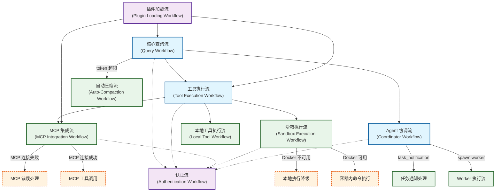
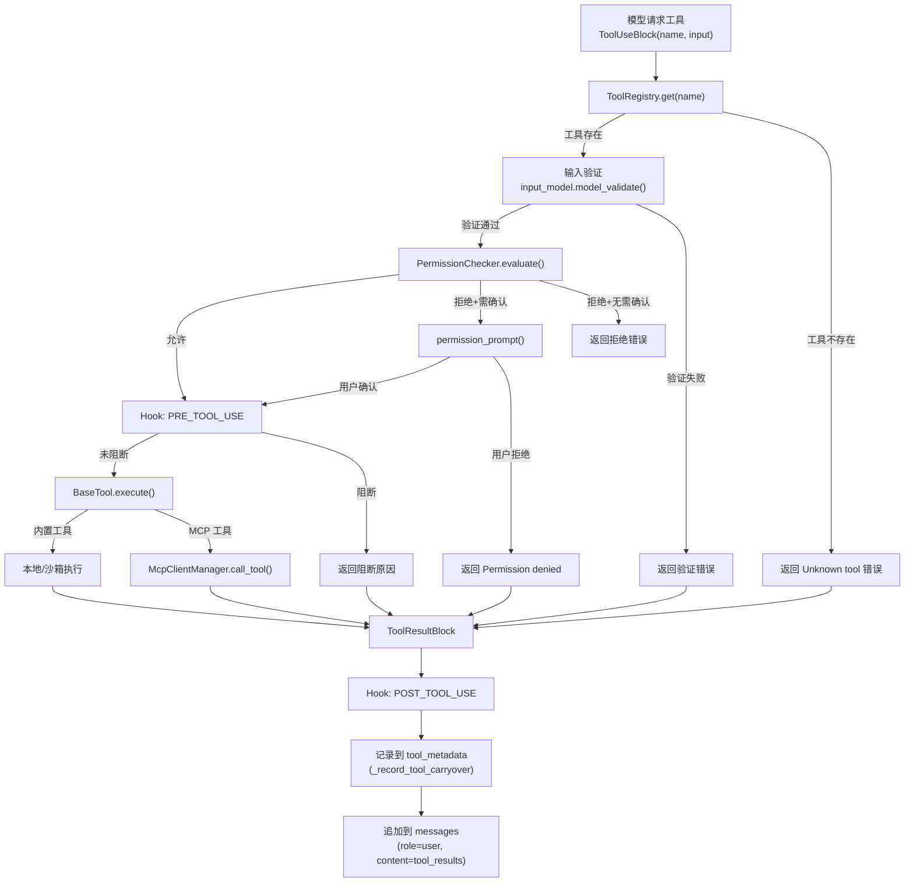
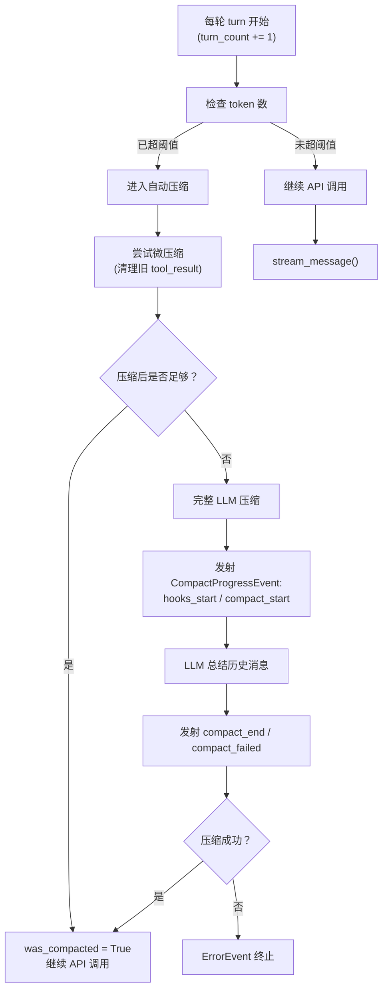
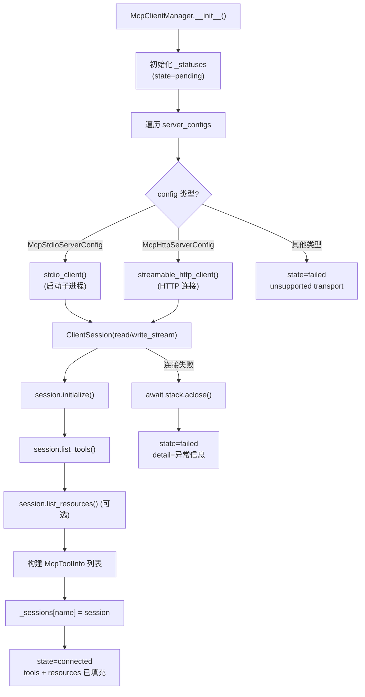

# 工作流地图

## 摘要

本文档通过 Mermaid 图表与详细读图说明，呈现 OpenHarness 的关键工作流体系。工作流地图从业务语义出发，展示核心查询流、工具执行流、Agent 协调流、MCP 集成流、沙箱执行流、认证流与插件加载流之间的关系与触发链条。

## 你将了解

- 7 大类工作流的触发条件、参与者、输出与关键决策点
- 各工作流之间的父子关系与调用链
- Mermaid 总图与子工作流图的完整解读
- 工作流之间的关系网络

## 范围

本文档覆盖 OpenHarness 启动后的所有核心运行时工作流。不涉及 CI/CD 构建流程、文档生成流程及开发环境配置流程。

---

## 关键工作流总览

**图后解释**：总图展示了 7 大类工作流及其关系。核心查询流（Query Workflow）是所有其他工作流的总入口和调度者。工具执行流是核心查询流的直接下游分支，根据工具类型分叉为 MCP 集成流、沙箱执行流或本地工具执行流。认证流（Authentication Workflow）作为横向基础设施，被核心查询流、工具执行流和 MCP 集成流共同依赖。插件加载流在系统启动时触发，提前准备好工具注册表。自动压缩流在核心查询流的每个 turn 边界条件触发。

---

## 工作流详细定义

### 1. 核心查询流（Query Workflow）

**名称**：核心查询流（Query Workflow）

**触发条件**：
- 用户在 CLI/TUI 中输入消息
- 协调者（Coordinator）模式收到 worker 的 `<task-notification>`
- 用户调用 `continue_pending()` 继续中断的对话

**参与者**：
- `QueryEngine` — 会话状态管理器
- `run_query()` — 查询循环核心函数
- `ToolRegistry` — 工具注册表
- `PermissionChecker` — 权限检查器
- `CostTracker` — 用量追踪器

**输出**：
- `AsyncIterator[StreamEvent]` — 文本增量、工具事件、状态事件等
- 更新后的对话历史（`self._messages`）
- 更新后的 `CostTracker` 用量数据

**关键决策点**：

| 决策点 | 条件 | 走向 |
|-------|------|------|
| 自动压缩检查 | token 数 >= `auto_compact_threshold_tokens` | 进入压缩流 |
| 模型响应无工具 | `final_message.tool_uses` 为空 | 正常结束 |
| 模型响应有工具 | `final_message.tool_uses` 非空 | 进入工具执行流 |
| API 错误 | `prompt too long` | 响应式压缩 |
| API 错误 | 网络/认证类 | ErrorEvent 终止 |
| `max_turns` 达到 | `turn_count >= max_turns` | `MaxTurnsExceeded` 终止 |

**证据引用**：`src/openharness/engine/query.py` -> `run_query` (第 396-562 行)

---

### 2. 工具执行流（Tool Execution Workflow）

**名称**：工具执行流（Tool Execution Workflow）

**触发条件**：
- `run_query()` 中模型响应包含 `ToolUseBlock`（工具调用请求）

**参与者**：
- `ToolRegistry.get()` — 查找工具实现
- `_execute_tool_call()` — 执行工具的核心函数
- `PermissionChecker.evaluate()` — 权限评估
- `HookExecutor` — 钩子执行器（pre/post tool use）
- `BaseTool.execute()` — 工具具体实现

**输出**：`ToolResultBlock(tool_use_id, content, is_error)` — 工具执行结果

**关键决策点**：

| 决策点 | 条件 | 走向 |
|-------|------|------|
| 工具查找 | `ToolRegistry.get(name)` 返回 None | 返回 "Unknown tool" 错误 |
| 输入验证 | `tool.input_model.model_validate()` 失败 | 返回验证错误 |
| 权限检查 | `decision.allowed == False` 且需要确认 | 调用 `permission_prompt()` |
| 权限检查 | `decision.allowed == False` 无需确认 | 直接返回拒绝 |
| 预钩子 | `pre_hooks.blocked == True` | 跳过执行，返回阻断原因 |
| 执行结果 | `result.is_error == True` | 错误结果进入对话历史 |

**证据引用**：`src/openharness/engine/query.py` -> `_execute_tool_call` (第 565-676 行)

---

### 3. Agent 协调流（Coordinator Workflow）

**名称**：Agent 协调流（Coordinator Workflow）

**触发条件**：
- 进程环境变量 `CLAUDE_CODE_COORDINATOR_MODE=1`
- 用户通过 `agent` 工具 spawn worker

**参与者**：
- `get_coordinator_system_prompt()` — 注入协调者系统提示
- `get_coordinator_user_context()` — 构建 worker 工具上下文（`workerToolsContext`）
- `get_coordinator_tools()` — 返回协调者专用工具列表
- `format_task_notification()` / `parse_task_notification()` — XML 消息序列化与反序列化
- `send_message` / `task_stop` — 协调者专用工具

**输出**：
- Worker spawned（通过 `agent` 工具）
- `<task-notification>` XML 消息到达协调者
- 协调者决定继续 worker（`send_message`）或停止 worker（`task_stop`）

**关键决策点**：

| 决策点 | 条件 | 走向 |
|-------|------|------|
| Worker 工具列表 | `CLAUDE_CODE_SIMPLE=1` | 仅 `bash`, `file_read`, `file_edit` |
| Worker 工具列表 | 非简单模式 | 完整 `_WORKER_TOOLS` 列表 |
| Worker 完成 | `status="completed"` | 汇总结果，可能继续 worker |
| Worker 失败 | `status="failed"` | `send_message` 继续并传递修正 |
| Worker 被终止 | `status="killed"` | 评估是否需要新 worker |
| Worker 结果格式 | XML `<task-notification>` | 由协调者解析处理 |

**证据引用**：`src/openharness/coordinator/coordinator_mode.py` -> `get_coordinator_system_prompt` (第 251-265 行)
`src/openharness/coordinator/coordinator_mode.py` -> `get_coordinator_user_context` (第 220-248 行)
`src/openharness/coordinator/coordinator_mode.py` -> `parse_task_notification` (第 128-155 行)

---

### 4. MCP 集成流（MCP Integration Workflow）

**名称**：MCP 集成流（MCP Integration Workflow）

**触发条件**：
- 系统启动时配置了 MCP 服务器（`oh config add mcp ...`）
- 用户请求的 `tool_name` 命中某个已连接的 MCP 服务器的工具

**参与者**：
- `McpClientManager` — MCP 连接管理器
- `McpClientManager.connect_all()` — 连接所有配置的 MCP 服务器
- `McpClientManager.reconnect_all()` — 重新连接
- `McpClientManager.call_tool()` — 调用 MCP 工具
- `McpClientManager.read_resource()` — 读取 MCP 资源
- `McpClientManager.list_statuses()` — 查询连接状态

**输出**：MCP 工具调用结果（字符串）

**关键决策点**：

| 决策点 | 条件 | 走向 |
|-------|------|------|
| 传输类型 | `McpStdioServerConfig` | stdio_client 启动子进程 |
| 传输类型 | `McpHttpServerConfig` | `streamable_http_client` 建立 HTTP 连接 |
| 工具调用 | session 存在 | 调用 `session.call_tool()` |
| 工具调用 | session 不存在 | 抛出 `McpServerNotConnectedError` |
| 资源读取 | MCP 服务器支持 | 调用 `session.read_resource()` |
| 连接状态 | `state="connected"` | 工具可用 |
| 连接状态 | `state="failed"` | 返回失败原因，工具不可用 |

**证据引用**：`src/openharness/mcp/client.py` -> `McpClientManager.connect_all` (第 45-59 行)
`src/openharness/mcp/client.py` -> `McpClientManager._connect_stdio` (第 155-184 行)
`src/openharness/mcp/client.py` -> `McpClientManager._connect_http` (第 186-211 行)
`src/openharness/mcp/client.py` -> `McpClientManager.call_tool` (第 104-129 行)

---

### 5. 沙箱执行流（Sandbox Execution Workflow）

**名称**：沙箱执行流（Sandbox Execution Workflow）

**触发条件**：
- 配置了沙箱（`sandbox.enabled=true` 且 `sandbox.backend=docker`）
- 工具需要沙箱保护执行（如非只读的 bash 命令）

**参与者**：
- `DockerSandboxSession` — Docker 沙箱会话管理器
- `DockerSandboxSession.start()` — 创建并启动容器
- `DockerSandboxSession.exec_command()` — 在容器内执行命令
- `DockerSandboxSession.stop()` — 优雅停止容器
- `DockerSandboxSession.stop_sync()` — 同步停止（用于 atexit）
- `get_docker_availability()` — 检查 Docker 可用性

**输出**：`asyncio.subprocess.Process` — 子进程对象

**关键决策点**：

| 决策点 | 条件 | 走向 |
|-------|------|------|
| Docker 可用性 | `docker` CLI 不存在 | `available=False`，提示安装 |
| Docker 可用性 | Docker daemon 未运行 | `docker info` 失败，返回不可用 |
| 平台支持 | 当前平台不支持 Docker 沙箱 | `available=False` |
| 镜像可用性 | 镜像不存在且 `auto_build_image=False` | `SandboxUnavailableError` |
| 镜像可用性 | 镜像不存在且 `auto_build_image=True` | 自动构建镜像 |
| 网络隔离 | `sandbox.network.allowed_domains` 有值 | `--network bridge` |
| 网络隔离 | 无允许域名 | `--network none`（完全隔离）|
| 容器执行 | 容器 `_running=False` | 抛出 `SandboxUnavailableError` |

**证据引用**：`src/openharness/sandbox/docker_backend.py` -> `get_docker_availability` (第 19-58 行)
`src/openharness/sandbox/docker_backend.py` -> `DockerSandboxSession.start` (第 125-153 行)
`src/openharness/sandbox/docker_backend.py` -> `DockerSandboxSession.exec_command` (第 193-227 行)
`src/openharness/sandbox/docker_backend.py` -> `_build_run_argv` (第 82-123 行)

---

### 6. 认证流（Authentication Workflow）

**名称**：认证流（Authentication Workflow）

**触发条件**：
- 系统启动时加载 API 客户端
- API 客户端首次发起请求
- API 返回 401 响应

**参与者**：
- API 密钥/凭证管理模块
- `api_client` — `SupportsStreamingMessages` 接口实现
- 凭证环境变量（`ANTHROPIC_API_KEY` 等）

**输出**：
- 认证成功：API 请求正常发送
- 认证失败：401 错误传播为 `ErrorEvent`

**关键决策点**：

| 决策点 | 条件 | 走向 |
|-------|------|------|
| 凭证存在 | 环境变量有效 | 正常发送请求 |
| 凭证缺失 | 环境变量不存在 | 启动失败或使用默认凭证 |
| 凭证过期 | API 返回 401 | `ErrorEvent` 提示检查凭证 |
| 凭证无效 | API 返回 403 | `ErrorEvent` 提示权限问题 |

---

### 7. 插件加载流（Plugin Loading Workflow）

**名称**：插件加载流（Plugin Loading Workflow）

**触发条件**：
- 系统启动时加载配置文件（`Settings` 初始化）
- 工具注册表初始化时

**参与者**：
- `Settings` — 配置管理
- 工具注册模块
- 插件发现机制

**输出**：
- `ToolRegistry` 中注册了所有可用工具
- MCP 服务器连接建立（`McpClientManager.connect_all()`）

**关键决策点**：

| 决策点 | 条件 | 走向 |
|-------|------|------|
| 插件发现 | 配置文件中有 MCP 服务器 | `McpClientManager.connect_all()` |
| 工具注册 | 工具实现已加载 | `ToolRegistry.register(tool_instance)` |
| 插件失败 | 单个 MCP 服务器连接失败 | 其他服务器继续，不阻塞整体 |

---

## 子工作流图

### 子图 1：工具执行流的内部分支

**图后解释**：此图展示了工具执行流的核心分支逻辑。关键路径为：查找工具 → 验证输入 → 权限检查 → Pre-Hook → 执行 → Post-Hook → 元数据记录 → 结果追加。其中 MCP 工具和内置工具在执行阶段分叉，最终汇合到 `ToolResultBlock` 统一处理。

---

### 子图 2：自动压缩流

**图后解释**：自动压缩流通过两阶段策略控制上下文膨胀：先尝试廉价的微压缩（清理工具结果内容），若仍不足则执行 LLM 压缩。`CompactProgressEvent` 实时通知前端各个压缩阶段，用户可以看到压缩进度条。

---

### 子图 3：MCP 连接建立流

**图后解释**：MCP 连接建立流支持 stdio 和 HTTP 两种传输方式。stdio 模式启动子进程，通过标准输入/输出流通信；HTTP 模式建立持久连接。连接成功后立即获取工具和资源列表，填充到 `McpConnectionStatus` 中供后续查询使用。

---

## 工作流关系矩阵

| 触发者 \下游 | 工具执行流 | MCP 集成流 | 沙箱执行流 | Agent 协调流 | 认证流 | 自动压缩流 |
|------------|-----------|-----------|-----------|------------|-------|----------|
| 核心查询流 | 直接调用 | 分支调用 | 分支调用 | 分支调用 | 依赖 | 条件触发 |
| 工具执行流 | — | 调用（MCP 工具） | 调用（沙箱工具） | — | — | — |
| Agent 协调流 | 调用（spawn worker） | — | — | 子工作流 | — | — |
| 插件加载流 | 准备工具 | 准备连接 | 准备配置 | — | 准备凭证 | — |

---

## 工作流之间关系说明

### 父子关系

1. **核心查询流 → 工具执行流**：父子关系，工具执行流是核心查询流在遇到 `ToolUseBlock` 时的分支路径。
2. **核心查询流 → Agent 协调流**：父子关系，协调者模式下的核心查询流通过 `agent` 工具触发子工作流。
3. **核心查询流 → 自动压缩流**：父子关系，在每个 turn 开始前条件触发。

### 横向依赖

1. **工具执行流 → MCP 集成流**：当工具为 MCP 工具时，工具执行流调用 `McpClientManager.call_tool()`。
2. **工具执行流 → 沙箱执行流**：当工具需要沙箱保护时，工具执行流调用 `DockerSandboxSession.exec_command()`。
3. **核心查询流 → 认证流**：API 调用需要有效的认证凭证。

### 并行关系

1. **核心查询流 ↔ 插件加载流**：插件加载流在系统启动时并行运行，不在查询流的执行路径上。
2. **多个 Worker 工作流**：在协调者模式下，多个 Worker 可并行执行，各自通过 `<task-notification>` 异步汇报结果。

---

## 证据索引

1. `src/openharness/engine/query.py` -> `run_query` (第 396-562 行)
2. `src/openharness/engine/query.py` -> `_execute_tool_call` (第 565-676 行)
3. `src/openharness/engine/query_engine.py` -> `QueryEngine.submit_message` (第 147-182 行)
4. `src/openharness/engine/stream_events.py` -> `CompactProgressEvent` (第 60-78 行)
5. `src/openharness/coordinator/coordinator_mode.py` -> `get_coordinator_system_prompt` (第 251-265 行)
6. `src/openharness/coordinator/coordinator_mode.py` -> `get_coordinator_user_context` (第 220-248 行)
7. `src/openharness/coordinator/coordinator_mode.py` -> `parse_task_notification` (第 128-155 行)
8. `src/openharness/coordinator/coordinator_mode.py` -> `get_coordinator_tools` (第 215-217 行)
9. `src/openharness/mcp/client.py` -> `McpClientManager.connect_all` (第 45-59 行)
10. `src/openharness/mcp/client.py` -> `McpClientManager._connect_stdio` (第 155-184 行)
11. `src/openharness/mcp/client.py` -> `McpClientManager._connect_http` (第 186-211 行)
12. `src/openharness/mcp/client.py` -> `McpClientManager.call_tool` (第 104-129 行)
13. `src/openharness/sandbox/docker_backend.py` -> `get_docker_availability` (第 19-58 行)
14. `src/openharness/sandbox/docker_backend.py` -> `DockerSandboxSession.exec_command` (第 193-227 行)
15. `src/openharness/sandbox/docker_backend.py` -> `_build_run_argv` (第 82-123 行)
16. `src/openharness/tools/base.py` -> `ToolRegistry` 及 `BaseTool.execute` (第 30-75 行)
