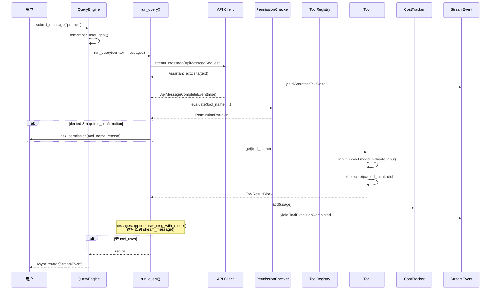
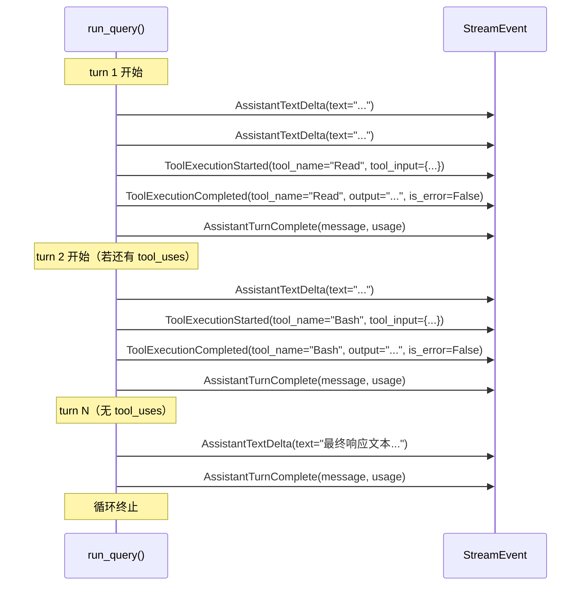

# 核心查询流

## 摘要

核心查询流是 OpenHarness 引擎的主轴——每一条用户消息从进入系统到最终输出结果，都经过 QueryEngine 初始化、消息提交、Query Loop 执行、工具调用、结果收集与 StreamEvent 输出的完整链路。本页深入解析该链路中每一跳的调用点与被调用点、数据流动、副作用、失败模式及恢复策略，完整覆盖 StreamEvent 事件序列、CostTracker 使用量追踪、权限检查时机与方式，以及循环终止条件。

## 你将了解

- QueryEngine 初始化的完整参数及其在 submit_message() 中的传递路径
- run_query() 主循环的单轮内部结构（API 调用 → 工具决策 → 执行 → 结果注入）
- 正常流逐跳解析（12+ 跳，含调用点/被调用点/输入/输出/副作用/失败模式/恢复策略）
- 异常流逐跳解析（2 条完整异常路径）
- StreamEvent 事件序列的完整时序图
- CostTracker 如何追踪 input_tokens 与 output_tokens
- PermissionChecker 的决策树与权限检查时机
- Query Loop 的三种终止条件（max_turns / stop sequence / error）
- 自动压缩（auto-compact）的触发时机与影响

## 范围

涵盖从 `QueryEngine.__init__` 到 StreamEvent 完整输出的全链路。沙箱层异常、Hook 执行、外部 MCP 服务器调用属于协调层与工具层的边界，不在核心查询流本身的范围内（可在 exception-and-recovery.md 中查阅）。

---

## 架构总览



**图后解释**：该序列图展示了从用户提交消息到 StreamEvent 流输出的完整链路。核心循环发生在 `run_query()` 内部：API Client 流式返回增量文本和最终消息；如模型决定调用工具，则经 PermissionChecker 决策后由 ToolRegistry 分发到具体 Tool 实例执行；执行结果以 ToolResultBlock 注入消息历史并追加 usage 数据，然后循环再次调用 API Client，直至模型不再请求工具或达到 max_turns 上限。

---

## QueryEngine 初始化 → submit_message()

### 逐跳解析：初始化与消息提交

**第 1 跳：QueryEngine 构造（调用点：`__init__`，被调用点：外部实例化代码）**

| 字段 | 值 | 作用 |
|------|----|------|
| api_client | `SupportsStreamingMessages` | 持有流式 API 调用能力 |
| tool_registry | `ToolRegistry` | 工具名称到实例的映射 |
| permission_checker | `PermissionChecker` | 工具调用的权限决策器 |
| cwd | `Path` | 工作目录，用于解析相对路径 |
| model | `str` | 模型标识符（如 "claude-opus-4-5"） |
| system_prompt | `str` | 系统提示词 |
| max_turns | `int \| None` | 每轮用户输入的最大 Agent 轮次数（默认 8） |
| permission_prompt | `PermissionPrompt \| None` | 交互式权限确认回调 |
| hook_executor | `HookExecutor \| None` | 钩子执行器 |
| tool_metadata | `dict \| None` | 跨调用携带的状态字典 |

- **输入**：以上所有构造参数，以及内部初始化的 `CostTracker()` 实例
- **输出**：`QueryEngine` 实例，内部 `_messages = []`（空会话历史）
- **副作用**：`_cost_tracker` 被实例化为新对象
- **失败模式**：若 `tool_registry` 为空，则后续所有工具调用均返回 "Unknown tool"
- **恢复策略**：确保注入有效的 ToolRegistry 实例

**证据**：`src/openharness/engine/query_engine.py` -> `QueryEngine.__init__`

**第 2 跳：submit_message() 入口（调用点：外部调用者，被调用点：QueryEngine.submit_message）**

```python
async for event, usage in run_query(context, query_messages):
    if isinstance(event, AssistantTurnComplete):
        self._messages = list(query_messages)
    if usage is not None:
        self._cost_tracker.add(usage)
    yield event
```

- **输入**：`prompt: str \| ConversationMessage`
- **输出**：异步生成器，产出 `AsyncIterator[StreamEvent]`
- **副作用**：
  - 调用 `remember_user_goal()` 将用户目标存入 `tool_metadata`（`src/openharness/engine/query.py` -> `remember_user_goal`）
  - 将用户消息追加到 `_messages` 列表
  - 若处于协调器模式，注入协调器上下文消息
- **失败模式**：
  - 若 `context.max_turns == 0`，立即返回空序列
  - 若 `run_query` 抛出 `MaxTurnsExceeded`，被上层捕获并转为错误事件
- **恢复策略**：调用 `continue_pending()` 恢复被中断的工具循环

**证据**：`src/openharness/engine/query_engine.py` -> `QueryEngine.submit_message`

---

## run_query() 主循环

### 逐跳解析：主循环结构（12 跳正常流）

**第 3 跳：循环初始化与 auto-compact 检查（调用点：run_query 入口，被调用点：auto_compact_if_needed）**

```python
compact_state = AutoCompactState()
async for event, usage in _stream_compaction(trigger="auto"):
    yield event, usage
messages, was_compacted = last_compaction_result
```

- **输入**：`context.auto_compact_threshold_tokens`、当前消息 token 估计数
- **输出**：若超过阈值，流出 `CompactProgressEvent`（phase: "compact_start" / "compact_end" 等）；否则直接通过
- **副作用**：压缩后的消息历史替换原始 `messages` 列表；`tool_metadata["read_file_state"]`、`verified_state` 等保留
- **失败模式**：
  - 压缩失败时流出一系列 `CompactProgressEvent(phase="compact_failed")`，但不中断主循环
  - 压缩本身是幂等的，失败后仍使用原始消息继续
- **恢复策略**：压缩失败时跳过压缩继续执行；可通过 `continue_pending()` 重试

**证据**：`src/openharness/engine/query.py` -> `run_query`（行 396-462）

**第 4 跳：API 调用与增量文本流（调用点：run_query 循环体，被调用点：api_client.stream_message）**

```python
async for event in context.api_client.stream_message(ApiMessageRequest(...)):
    if isinstance(event, ApiTextDeltaEvent):
        yield AssistantTextDelta(text=event.text), None
        continue
```

- **输入**：`ApiMessageRequest(model, messages, system_prompt, max_tokens, tools)`
- **输出**：
  - 每块增量文本输出一个 `AssistantTextDelta`
  - 最终一个 `ApiMessageCompleteEvent`，含 `message` 和 `usage`
- **副作用**：
  - API Client 内部执行重试（`ApiRetryEvent`，含 `delay_seconds` 和 `attempt`）
  - 消耗 input_tokens，产生 output_tokens
- **失败模式**：
  - 网络错误（"connect" / "timeout" / "network"）→ `ErrorEvent(recoverable=True)` 并 return
  - API 429/500/502/503/529 → API Client 内部重试 3 次（指数退避），超出后抛出异常
  - 超出上下文窗口 → 触发 reactive compact 后重试一次（`reactive_compact_attempted` 标志）
  - 消息流意外终止（`final_message is None`）→ 抛出 `RuntimeError`
- **恢复策略**：
  - 网络错误通过 `continue_pending()` 重试
  - 上下文超长触发 reactive compact 后继续
  - 其他异常终止并向上传播

**证据**：
- `src/openharness/engine/query.py` -> `run_query`（行 469-508）
- `src/openharness/api/client.py` -> `MAX_RETRIES = 3`，`BASE_DELAY = 1.0`，`RETRYABLE_STATUS_CODES = {429, 500, 502, 503, 529}`

**第 5 跳：AssistantTurnComplete 产出与消息追加（调用点：run_query 循环体，被调用点：内部）**

```python
messages.append(final_message)
yield AssistantTurnComplete(message=final_message, usage=usage), usage
```

- **输入**：`final_message: ConversationMessage`，`usage: UsageSnapshot`
- **输出**：
  - `AssistantTurnComplete` 事件供外部消费
  - `messages` 列表追加助手消息
- **副作用**：
  - 若检测到协调器系统提示且末尾为协调器上下文消息，弹出并重新追加（保证上下文消息在助手消息之后）
  - `usage` 数据流向 `CostTracker.add()`
- **失败模式**：若 `final_message.tool_uses` 为空，直接 return 退出循环
- **恢复策略**：N/A（正常终止条件）

**证据**：`src/openharness/engine/query.py` -> `run_query`（行 518-525）

**第 6 跳：工具调用的并发分发（调用点：run_query，被调用点：asyncio.gather）**

```python
if len(tool_calls) == 1:
    # 单工具：顺序执行，立即流事件
    yield ToolExecutionStarted(tool_name=tc.name, tool_input=tc.input), None
    result = await _execute_tool_call(context, tc.name, tc.id, tc.input)
    yield ToolExecutionCompleted(...), None
else:
    # 多工具：并发执行
    for tc in tool_calls:
        yield ToolExecutionStarted(tool_name=tc.name, tool_input=tc.input), None
    results = await asyncio.gather(*[_run(tc) for tc in tool_calls])
```

- **输入**：`final_message.tool_uses`（工具调用列表）
- **输出**：
  - 每个工具调用对应一个 `ToolExecutionStarted`
  - 执行完成后对应一个 `ToolExecutionCompleted`
- **副作用**：
  - 单工具时立即流式输出事件；多工具时先发送所有 Started 事件，再并发执行，最后输出所有 Completed 事件
  - 并发执行时，工具结果乱序返回，但通过 `zip(tool_calls, tool_results)` 匹配到正确的 tool_use_id
- **失败模式**：
  - 单工具抛出异常 → 循环中断，向上传播
  - 多工具中一个失败 → `asyncio.gather` 默认传播第一个异常，其余任务继续执行
- **恢复策略**：工具执行结果（含 `is_error=True`）作为 `ToolResultBlock` 注入消息，模型可感知失败并决定后续动作

**证据**：`src/openharness/engine/query.py` -> `run_query`（行 527-558）

**第 7 跳：_execute_tool_call — PRE_TOOL_USE 钩子（调用点：run_query，被调用点：hook_executor.execute）**

```python
pre_hooks = await context.hook_executor.execute(
    HookEvent.PRE_TOOL_USE,
    {"tool_name": tool_name, "tool_input": tool_input, ...}
)
if pre_hooks.blocked:
    return ToolResultBlock(tool_use_id=tool_use_id, content=..., is_error=True)
```

- **输入**：`HookEvent.PRE_TOOL_USE`、工具名和工具输入
- **输出**：若 `blocked=True`，返回错误 `ToolResultBlock`
- **副作用**：钩子可能修改输入、记录日志或阻断执行
- **失败模式**：钩子执行本身抛出异常 → 视为未阻断，继续执行
- **恢复策略**：钩子阻断时返回 `is_error=True`，模型收到反馈后可以继续

**证据**：`src/openharness/engine/query.py` -> `_execute_tool_call`（行 571-581）

**第 8 跳：工具查找与输入验证（调用点：_execute_tool_call，被调用点：tool_registry.get）**

```python
tool = context.tool_registry.get(tool_name)
if tool is None:
    return ToolResultBlock(tool_use_id=tool_use_id, content=f"Unknown tool: {tool_name}", is_error=True)
parsed_input = tool.input_model.model_validate(tool_input)
```

- **输入**：`tool_name: str`，`tool_input: dict`
- **输出**：
  - 找不到工具 → `is_error=True` 的 ToolResultBlock
  - 输入验证失败 → `is_error=True` 的 ToolResultBlock（包含 Pydantic 验证错误文本）
- **副作用**：无
- **失败模式**：
  - `tool is None` → 返回 "Unknown tool" 错误
  - Pydantic 验证异常 → 返回 "Invalid input" 错误
- **恢复策略**：错误结果注入消息历史，模型感知后可尝试更正输入或改用其他工具

**证据**：`src/openharness/engine/query.py` -> `_execute_tool_call`（行 585-602）

**第 9 跳：权限检查（调用点：_execute_tool_call，被调用点：permission_checker.evaluate）**

```python
_file_path = _resolve_permission_file_path(context.cwd, tool_input, parsed_input)
_command = _extract_permission_command(tool_input, parsed_input)
decision = context.permission_checker.evaluate(
    tool_name,
    is_read_only=tool.is_read_only(parsed_input),
    file_path=_file_path,
    command=_command,
)
```

- **输入**：
  - 工具名、是否只读标志
  - 从 `tool_input` 中提取的 `file_path`（经 `cwd` 解析为绝对路径）和 `command`
- **输出**：`PermissionDecision(allowed, requires_confirmation, reason)`
- **副作用**：
  - 绝对路径解析（相对路径拼接 `cwd`）
  - `PermissionChecker` 内部执行 fnmatch 路径模式匹配（`SENSITIVE_PATH_PATTERNS` 包含 `*/.ssh/*`、`*/.aws/credentials` 等）
- **失败模式**：
  - `decision.allowed == False && decision.requires_confirmation == False` → 立即返回权限拒绝
  - `decision.allowed == False && decision.requires_confirmation == True` → 询问用户
  - 用户拒绝 → 返回 "Permission denied" 错误
- **恢复策略**：
  - 敏感路径（`*/.ssh/*` 等）永远被拒绝，无法被覆盖
  - 其他权限通过 `permission_prompt` 回调询问用户
  - `allow_permission_prompts = False` 时，未列举工具自动拒绝

**证据**：
- `src/openharness/engine/query.py` -> `_execute_tool_call`（行 607-634）
- `src/openharness/permissions/checker.py` -> `PermissionChecker.evaluate`

**第 10 跳：工具执行（调用点：_execute_tool_call，被调用点：tool.execute）**

```python
result = await tool.execute(
    parsed_input,
    ToolExecutionContext(
        cwd=context.cwd,
        metadata={"tool_registry": context.tool_registry, "ask_user_prompt": ..., **context.tool_metadata},
    ),
)
```

- **输入**：`parsed_input`（Pydantic 验证后的输入模型）、`ToolExecutionContext`
- **输出**：`ToolExecutionResult(output: str, is_error: bool)`
- **副作用**：
  - 计时：`log.debug("executed %s in %.2fs ...", tool_name, elapsed)`
  - 调用 `_record_tool_carryover()` 更新 `tool_metadata`（读文件历史、已验证状态、工作日志等）
  - 执行 POST_TOOL_USE 钩子
- **失败模式**：工具内部抛出异常 → 由 `_execute_tool_call` 的 try/except 捕获，返回 `is_error=True` 的 ToolResultBlock
- **恢复策略**：错误结果注入消息，模型决定是否重试或换方案

**证据**：`src/openharness/engine/query.py` -> `_execute_tool_call`（行 636-676）

**第 11 跳：工具结果注入（调用点：run_query，被调用点：ConversationMessage.from_tool_results）**

```python
messages.append(ConversationMessage(role="user", content=tool_results))
```

- **输入**：`tool_results: list[ToolResultBlock]`
- **输出**：`messages` 追加含工具结果的用户消息
- **副作用**：此用户消息不含文本（`text == ""`），仅有 `ToolResultBlock` 内容
- **失败模式**：无
- **恢复策略**：N/A

**证据**：`src/openharness/engine/query.py` -> `run_query`（行 558）

**第 12 跳：循环回边与终止条件检查（调用点：run_query，被调用点：while 条件判断）**

```python
while context.max_turns is None or turn_count < context.max_turns:
    turn_count += 1
    # ... 执行一轮 ...
    if not final_message.tool_uses:
        return  # 正常终止：模型不再请求工具
# 循环外：
if context.max_turns is not None:
    raise MaxTurnsExceeded(context.max_turns)
```

- **三种终止条件**：
  1. **`stop sequence`**：模型响应不含 `tool_uses` → 直接 return，正常退出
  2. **`max_turns`**：`turn_count >= context.max_turns` → 抛出 `MaxTurnsExceeded`
  3. **`error`**：API 异常或工具执行异常 → `ErrorEvent` 并 return
- **副作用**：
  - `CostTracker` 在 `submit_message()` 层面累加每轮 usage
  - `has_pending_continuation()` 依赖 `tool_uses` 和 `ToolResultBlock` 检测是否有未完成工具调用
- **恢复策略**：
  - `MaxTurnsExceeded` 可被上层捕获并提示用户手动继续
  - `has_pending_continuation()` 为 True 时可调用 `continue_pending()`

**证据**：`src/openharness/engine/query.py` -> `run_query`（行 457-562）

---

## StreamEvent 事件序列

完整的事件类型及其在正常流中的出现顺序：



**图后解释**：StreamEvent 是完全有序的异步生成器流。`AssistantTextDelta` 事件在单次 turn 内可能出现多次（流式输出），而 `ToolExecutionStarted` / `ToolExecutionCompleted` 在每个工具调用前后各出现一次。若同一轮有多个工具调用，`ToolExecutionStarted` 事件批量发出（先通知），`ToolExecutionCompleted` 事件则由 `asyncio.gather` 并发等待后按声明顺序输出。`ErrorEvent` 可在任何时机插入流中。`AssistantTurnComplete` 出现在 API 响应完整后、工具执行之前。

**所有事件类型**（来源：`src/openharness/engine/stream_events.py`）：

| 事件类型 | 触发时机 | 是否可恢复 |
|---------|---------|-----------|
| `AssistantTextDelta` | API 流式输出增量文本 | N/A |
| `ToolExecutionStarted` | 工具执行前 | N/A |
| `ToolExecutionCompleted` | 工具执行后（无论成功/失败） | N/A |
| `AssistantTurnComplete` | 单轮 API 调用完成 | N/A |
| `ErrorEvent` | API 错误 / 网络错误 / 权限拒绝 | `recoverable=True/False` |
| `StatusEvent` | 重试提示 / 压缩状态 | N/A |
| `CompactProgressEvent` | 自动压缩各阶段 | N/A |

---

## CostTracker 使用量追踪

`CostTracker` 位于引擎层，但其数据来自 API Client 返回的 `UsageSnapshot`：

```python
# src/openharness/engine/query_engine.py -> submit_message()
async for event, usage in run_query(context, query_messages):
    if usage is not None:
        self._cost_tracker.add(usage)  # 累加到 running total
    yield event
```

```python
# src/openharness/engine/cost_tracker.py
class CostTracker:
    def add(self, usage: UsageSnapshot) -> None:
        self._usage = UsageSnapshot(
            input_tokens=self._usage.input_tokens + usage.input_tokens,
            output_tokens=self._usage.output_tokens + usage.output_tokens,
        )
```

**追踪时机**：每轮 `run_query` 产出 `AssistantTurnComplete` 事件时，`usage` 非空则立即 `add()`。

**可查询字段**（通过 `QueryEngine.total_usage`）：
- `input_tokens`：所有轮次的输入 token 总和
- `output_tokens`：所有轮次的输出 token 总和
- `total_tokens`（属性）：前两者之和

**设计取舍 1：聚合层 vs 原始层**
- `CostTracker` 做加法聚合，不存储原始快照；原始 `UsageSnapshot` 来自 API Client
- 取舍：聚合丢失了 per-turn 粒度，但节省内存（`total_usage` 仅两个整数）

**证据**：`src/openharness/engine/cost_tracker.py` -> `CostTracker.add`，`src/openharness/api/usage.py` -> `UsageSnapshot`

---

## 权限检查时机与方式

### 检查时机

权限检查发生在工具执行的**最早阶段**，在以下操作之前：

1. `tool_registry.get(tool_name)`（工具查找）
2. `tool.input_model.model_validate()`（输入验证）
3. `tool.execute()`（实际执行）

这确保了未授权工具无法通过输入混淆或工具别名绕过检查。

### 检查方式：决策树

```
输入: tool_name, is_read_only, file_path, command
  │
  ├─ file_path 非空?
  │    └─ 匹配 SENSITIVE_PATH_PATTERNS?
  │         ├─ 是 → allowed=False (永远拒绝，in `*/.ssh/*`, `*/.aws/credentials` 等)
  │         └─ 否 → 继续
  │
  ├─ tool_name in denied_tools?
  │    ├─ 是 → allowed=False
  │    └─ 否 → 继续
  │
  ├─ tool_name in allowed_tools?
  │    ├─ 是 → allowed=True
  │    └─ 否 → 继续
  │
  ├─ file_path 匹配 path_rules 中的 deny 规则?
  │    ├─ 是 → allowed=False
  │    └─ 否 → 继续
  │
  ├─ command 匹配 denied_commands?
  │    ├─ 是 → allowed=False
  │    └─ 否 → 继续
  │
  ├─ mode == FULL_AUTO?
  │    ├─ 是 → allowed=True
  │    └─ 否 → 继续
  │
  ├─ is_read_only == True?
  │    ├─ 是 → allowed=True (只读工具永远放行)
  │    └─ 否 → 继续
  │
  ├─ mode == PLAN?
  │    ├─ 是 → allowed=False, requires_confirmation=False
  │    └─ 否 → allowed=False, requires_confirmation=True (询问用户)
  └─ 默认：allowed=False, requires_confirmation=True
```

**敏感路径保护**（`src/openharness/permissions/checker.py`）：
```python
SENSITIVE_PATH_PATTERNS = (
    "*/.ssh/*",
    "*/.aws/credentials",
    "*/.config/gcloud/*",
    "*/.azure/*",
    "*/.gnupg/*",
    "*/.docker/config.json",
    "*/.kube/config",
    "*/.openharness/credentials.json",
)
```
这些路径无论权限模式如何设置，均被永久拒绝——即使 `FULL_AUTO` 模式也无法放行。这是针对 LLM 定向访问凭证的纵深防御措施。

**证据**：`src/openharness/permissions/checker.py` -> `PermissionChecker.evaluate`，`src/openharness/engine/query.py` -> `_execute_tool_call`（行 611-634）

---

## 设计取舍

### 取舍 1：串行 vs 并发工具执行

**现状**：单工具串行（立即流事件）；多工具并发（gather 后批量输出）。

```python
if len(tool_calls) == 1:
    yield ToolExecutionStarted(...)
    result = await _execute_tool_call(...)
    yield ToolExecutionCompleted(...)
else:
    for tc in tool_calls:
        yield ToolExecutionStarted(...)
    results = await asyncio.gather(*[_run(tc) for tc in tool_calls])
```

**取舍分析**：
- 串行优点：用户可在第一个工具结果返回后立即感知进度
- 串行缺点：多个独立工具（如 `glob` + `grep`）时，总耗时 = sum(各工具耗时)
- 并发优点：总耗时 = max(各工具耗时)，减少等待时间
- 并发缺点：多工具的 `ToolExecutionCompleted` 乱序输出，对实时追踪不友好

**当前选择**（先通知后执行）是折中：用户先看到"要执行哪些工具"，再等待结果。

### 取舍 2：权限检查在输入验证之后

**现状**：先 `tool.input_model.model_validate()` 再检查权限。

```python
parsed_input = tool.input_model.model_validate(tool_input)
# ...
decision = context.permission_checker.evaluate(...)
```

**取舍分析**：
- 优点：输入验证可提前捕获格式错误，避免无效权限请求
- 缺点：理论上可构造恶意输入绕过验证（但权限检查在执行前，故无实际风险）
- **更好的设计**：权限检查在输入验证之前（避免信息泄露），但 OpenHarness 当前选择优先检测格式错误

### 取舍 3：auto-compact 内嵌在主循环中

**现状**：每个 turn 开始时调用 `_stream_compaction(trigger="auto")`。

```python
while ...:
    turn_count += 1
    async for event, usage in _stream_compaction(trigger="auto"):
        yield event, usage
    messages, was_compacted = last_compaction_result
```

**取舍分析**：
- 优点：压缩与循环紧密耦合，确保 token 估计始终准确
- 缺点：压缩触发时主循环阻塞等待压缩完成（`task.done()` 轮询），增加了 turn 延迟
- **替代方案**：压缩作为独立后台任务（更异步），但需要更复杂的并发协调

---

## 风险

1. **API 密钥泄露风险**：在 subprocess teammate 模式中，`ANTHROPIC_API_KEY` 通过环境变量传递给子进程（`src/openharness/tasks/manager.py` 行 71）。若系统进程列表被窥探，密钥可能暴露。
2. **上下文窗口耗尽风险**：即使有 auto-compact，若任务性质导致压缩效果有限（大量二进制或结构化数据），仍可能在压缩后超出 `context_window_tokens`。
3. **权限检查绕过的潜在路径**：`SENSITIVE_PATH_PATTERNS` 仅保护硬编码路径；若凭证存储在非标准位置（如项目内 `.env.local`），不会触发内置保护。
4. **并发工具执行的结果顺序**：`asyncio.gather` 并发执行工具，但结果通过 `zip(tool_calls, tool_results)` 重新对齐；若工具执行速度差异极大，用户感知的事件顺序与实际执行顺序可能不一致。
5. **`continue_pending()` 的幂等性问题**：若模型已在某工具调用中写入文件后中断，`continue_pending()` 会重放整轮；若文件写入不可幂等，则可能导致数据损坏。
6. **`plan_mode` 阻断所有写操作**：`PermissionChecker.evaluate` 在 PLAN 模式下无差别拒绝所有非只读工具，包括 `file_write` 和 `file_edit`——即使实现逻辑本身是只读的（如生成式写入草稿文件）。

---

## 证据引用

1. `src/openharness/engine/query_engine.py` -> `QueryEngine.__init__`
2. `src/openharness/engine/query_engine.py` -> `QueryEngine.submit_message`
3. `src/openharness/engine/query.py` -> `run_query`（主循环体）
4. `src/openharness/engine/query.py` -> `remember_user_goal`
5. `src/openharness/engine/query.py` -> `_execute_tool_call`
6. `src/openharness/engine/stream_events.py` -> `StreamEvent` 联合类型定义
7. `src/openharness/engine/cost_tracker.py` -> `CostTracker`
8. `src/openharness/api/usage.py` -> `UsageSnapshot`
9. `src/openharness/permissions/checker.py` -> `PermissionChecker.evaluate`
10. `src/openharness/permissions/checker.py` -> `SENSITIVE_PATH_PATTERNS`
11. `src/openharness/api/client.py` -> `MAX_RETRIES`，`BASE_DELAY`，`RETRYABLE_STATUS_CODES`
12. `src/openharness/engine/query.py` -> `MaxTurnsExceeded`，循环终止条件
