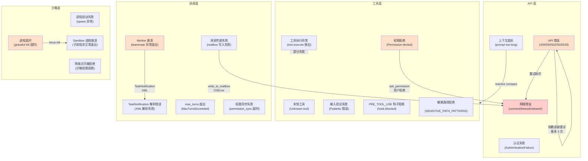

# 异常与恢复

## 摘要

OpenHarness 在四个层次产生异常：API 层（网络与模型交互）、工具层（工具执行与输入验证）、协调层（多 Agent 任务管理与协调器消息传递）、沙箱层（隔离执行环境）。每类异常有各自的出现时机、传播路径与捕获层级，辅以不同的重试策略、回退策略、人工介入路径和补偿操作。本页提供完整的异常分类图、逐类解析，以及 OpenHarness 在各层的容错设计。

## 你将了解

- 四层异常分类及其产生时机与传播路径
- API 层异常（网络错误、API 错误、重试行为）
- 工具层异常（未知工具、输入验证失败、执行异常、权限拒绝）
- 协调层异常（Worker 失败、消息传递失败、TaskNotification 解析错误）
- 沙箱层异常（进程启动失败、超时、沙箱进程崩溃）
- 重试策略（指数退避、最大重试次数、可恢复 vs 不可恢复）
- 回退策略（工具不可用时的 fallback 路径）
- 人工介入路径（哪些异常需要用户确认才能继续）
- 补偿操作（哪些操作需要回滚或撤销）
- 完整的异常流程图与风险分析

## 范围

覆盖 API Client、Query Engine、Tool Execution、Coordinator Mode、Swarm 四个层次的异常处理。Hook 层异常（`HookExecutor` 抛出）属于工具层的子路径，在此处一并覆盖。MCP 客户端异常在工具层中以 MCP 工具执行错误的形态体现。

---

## 异常分类总图



**图后解释**：该流程图展示了四层异常之间的因果关系与传播路径。API 层异常（A1-A4）是最外层的可见错误，向上传播给用户；工具层异常（T1-T6）发生在 Query Loop 内部，通过 `ToolResultBlock.is_error=True` 注入消息历史；协调层异常（C1-C5）通过 TaskNotification XML 消息跨越进程边界；沙箱层异常（S1-S4）发生在隔离子进程中，通过 `TeammateAbortController` 的信号机制传递给上层。值得注意的是，API 429/500 等错误通过指数退避重试后仍然可能降级为网络错误；权限拒绝后用户拒绝继续会向上传播为终止条件；沙箱超时强制 kill 可能导致子进程非正常退出。

---

## API 层异常

### A1：网络错误

**产生时机**：`api_client.stream_message()` 中底层的 `httpx` 或 `anthropic` 客户端抛出 `ConnectError`、`TimeoutException`、`asyncio.TimeoutError`。

**传播路径**：
```
asyncio.TimeoutError / ConnectError
  → run_query() try/except (query.py 行 494-508)
  → if "connect" in msg or "timeout" in msg or "network" in msg:
       yield ErrorEvent(message=f"Network error: {msg}", recoverable=True)
  → return
  → submit_message() 向上传播 ErrorEvent
```

**捕获层级**：`run_query()` 内部的 `except Exception` 块，行 494。

**重试策略**：
- API Client 内部 **不重试** 网络错误（仅重试 429/500/502/503/529）
- 上层（`submit_message()` 调用方）可检测 `recoverable=True` 的 `ErrorEvent` 并调用 `continue_pending()` 重试
- 最大重试次数：**无硬性上限**，由调用方控制

**回退策略**：
- `continue_pending()` 重放整轮消息历史，包括之前成功的工具结果
- 若文件已写入，需确保幂等性（否则可能产生重复写入）

**人工介入路径**：用户可手动中断并重新发起请求；若网络问题持续，用户需检查互联网连接或 VPN 配置。

**证据**：`src/openharness/engine/query.py` -> `run_query`（行 504-508）

---

### A2：API 错误（429/500/502/503/529）

**产生时机**：Anthropic API 返回可重试的 HTTP 状态码。

**传播路径**：
```
API 返回 429/500/502/503/529
  → API Client 内部拦截
  → ApiRetryEvent(attempt=N, delay_seconds=D, max_attempts=3, message=...)
  → yield ApiRetryEvent (上层收到后显示 "retrying in Xs...")
  → 等待 delay_seconds
  → 重试 stream_message()
  → 3 次均失败 → 抛出异常 → run_query() except
```

**捕获层级**：`api/client.py` 内部重试；超出重试次数后向上传播异常到 `run_query()` 的 `except Exception`。

**重试策略（API Client 内部）**：
```python
# src/openharness/api/client.py
MAX_RETRIES = 3
BASE_DELAY = 1.0      # 秒
MAX_DELAY = 30.0
RETRYABLE_STATUS_CODES = {429, 500, 502, 503, 529}
```
指数退避：`delay = min(BASE_DELAY * 2^attempt, MAX_DELAY)`，即 1s → 2s → 4s。

**回退策略**：超出重试次数 → 降级为网络错误处理（`ErrorEvent(recoverable=True)`）。

**补偿操作**：无（HTTP 请求是幂等的，GET 类操作可安全重试；但工具执行结果已注入消息历史，若重试导致重复执行，需检查幂等性）。

**证据**：`src/openharness/api/client.py` -> `MAX_RETRIES`，`BASE_DELAY`，`RETRYABLE_STATUS_CODES`

---

### A3：上下文超长

**产生时机**：API 返回 "prompt too long" / "context length" / "maximum context" 等错误。

**传播路径**：
```
API 抛出上下文超长异常
  → run_query() except (行 494)
  → if _is_prompt_too_long_error(exc):
       reactive_compact_attempted = True
       yield StatusEvent(REACTIVE_COMPACT_STATUS_MESSAGE)
       async for event in _stream_compaction(trigger="reactive", force=True):
           yield event
       if was_compacted: continue  # 重试
  → 压缩失败或仍超长 → ErrorEvent(recoverable=False) 并 return
```

**捕获层级**：`run_query()` 的 `except Exception`（行 494-508）。

**重试策略**：
- **反应式压缩**（reactive compact）：触发 `auto_compact_if_needed(force=True, trigger="reactive")`
- 仅尝试一次；若仍超长 → `recoverable=False`，终止
- 压缩状态机有 phases：`hooks_start` → `context_collapse_start` → `compact_start` → `compact_retry` → `compact_end` 或 `compact_failed`

**回退策略**：
- 压缩后仍超长 → 用户需手动精简对话历史或增大 `context_window_tokens`
- 可通过 `QueryEngine.clear()` 清空历史后重试

**证据**：`src/openharness/engine/query.py` -> `_is_prompt_too_long_error`，`run_query`（行 496-503）

---

### A4：认证失败

**产生时机**：`AuthenticationFailure` 异常（`api/errors.py`），API 返回 401。

**传播路径**：直接由 API Client 抛出，不经重试处理（401 不可重试）。

**捕获层级**：`run_query()` 的 `except Exception` → `ErrorEvent(recoverable=False)` 并 return。

**人工介入路径**：
- 用户需更新 API 密钥（`ANTHROPIC_API_KEY` 环境变量或配置文件）
- 若使用 OAuth 订阅，需检查订阅状态

**证据**：`src/openharness/api/errors.py` -> `AuthenticationFailure`

---

## 工具层异常

### T1：未知工具

**产生时机**：`tool_registry.get(tool_name)` 返回 `None`。

**传播路径**：
```python
tool = context.tool_registry.get(tool_name)
if tool is None:
    return ToolResultBlock(tool_use_id=tool_use_id,
                           content=f"Unknown tool: {tool_name}",
                           is_error=True)
```

**捕获层级**：`_execute_tool_call()` 内部，行 585-592。不向上传播异常，直接返回错误 `ToolResultBlock`。

**恢复策略**：错误结果注入消息 → 模型感知 "Unknown tool" 后可能尝试正确名称重新请求。

**证据**：`src/openharness/engine/query.py` -> `_execute_tool_call`（行 585-592）

---

### T2：输入验证失败

**产生时机**：Pydantic `model_validate()` 抛出 `ValidationError`。

**传播路径**：
```python
try:
    parsed_input = tool.input_model.model_validate(tool_input)
except Exception as exc:
    return ToolResultBlock(tool_use_id=tool_use_id,
                           content=f"Invalid input for {tool_name}: {exc}",
                           is_error=True)
```

**捕获层级**：`_execute_tool_call()` 内部，行 594-602。

**恢复策略**：错误消息包含具体验证错误文本；模型可据此更正输入。

**证据**：`src/openharness/engine/query.py` -> `_execute_tool_call`（行 594-602）

---

### T3：权限拒绝

**产生时机**：`permission_checker.evaluate()` 返回 `allowed=False`。

**传播路径**：
```python
decision = context.permission_checker.evaluate(...)
if not decision.allowed:
    if decision.requires_confirmation and context.permission_prompt is not None:
        confirmed = await context.permission_prompt(tool_name, decision.reason)
        if not confirmed:
            return ToolResultBlock(..., is_error=True)
    else:
        return ToolResultBlock(content=decision.reason, is_error=True)
```

**捕获层级**：`_execute_tool_call()` 内部，行 617-634。

**需要人工介入的路径**：
- `requires_confirmation=True` 时，调用 `permission_prompt(tool_name, reason)` 阻塞等待用户响应
- 用户拒绝（返回 `False`）→ 返回 "Permission denied" 错误，模型感知后可继续

**补偿操作**：无（权限拒绝本身是预防性的，未执行任何副作用）。

**证据**：`src/openharness/engine/query.py` -> `_execute_tool_call`（行 611-634），`src/openharness/permissions/checker.py` -> `PermissionChecker.evaluate`

---

### T4：工具执行异常

**产生时机**：`tool.execute()` 协程内部抛出异常。

**传播路径**：
```python
try:
    result = await tool.execute(parsed_input, ctx)
except Exception:
    return ToolResultBlock(tool_use_id=tool_use_id,
                           content=str(exc),
                           is_error=True)
```

**捕获层级**：`_execute_tool_call()` 内部，行 594（整个 try 块）。注意：`tool.execute()` 是 await 调用，其异常被包含在 try/except 中。

**重试策略**：工具执行异常**不自动重试**（与 API 错误不同）。重试决策由模型做出。

**回退策略**：
- 错误结果注入消息 → 模型可尝试其他工具或更正输入
- 若工具属于多工具并发（`asyncio.gather`），一个工具失败不会影响其他工具

**证据**：`src/openharness/engine/query.py` -> `_execute_tool_call`（行 594-676）

---

### T5：PRE_TOOL_USE 钩子阻断

**产生时机**：`hook_executor.execute(HookEvent.PRE_TOOL_USE)` 返回 `blocked=True`。

**传播路径**：
```python
pre_hooks = await context.hook_executor.execute(HookEvent.PRE_TOOL_USE, ...)
if pre_hooks.blocked:
    return ToolResultBlock(..., is_error=True, content=pre_hooks.reason)
```

**捕获层级**：`_execute_tool_call()` 内部，行 571-581（**在工具查找之前**）。

**人工介入路径**：取决于钩子实现；一般通过日志或 `StatusEvent` 可见。

**补偿操作**：无（钩子阻断发生在执行前）。

**证据**：`src/openharness/engine/query.py` -> `_execute_tool_call`（行 571-581）

---

### T6：敏感路径拒绝

**产生时机**：`file_path` 匹配 `SENSITIVE_PATH_PATTERNS`（`*/.ssh/*`、`*/.aws/credentials` 等）。

**传播路径**：在 `PermissionChecker.evaluate()` 内部，行 88-98，**任何权限模式之前**检查。

**特性**：
- 永远拒绝，无法被覆盖（即使 `FULL_AUTO` 模式）
- 错误信息包含匹配的 glob 模式（如 "matched built-in pattern '*/.ssh/*'"）
- 不触发 `requires_confirmation`，直接 `allowed=False`

**证据**：`src/openharness/permissions/checker.py` -> `SENSITIVE_PATH_PATTERNS`，`PermissionChecker.evaluate`（行 84-98）

---

## 协调层异常

### C1：Worker 崩溃

**产生时机**：subprocess teammate 的 asyncio Task 完成但带异常，或被强制 kill。

**传播路径**：
```
teammate Task done with exception
  → _on_teammate_error(agent_id, exception) 记录日志
  → Task 从 _active 字典移除
  → leader 侧无主动感知（需通过 TaskNotification 轮询）
```

**In-process 后端**：
```python
# src/openharness/swarm/in_process.py
def _on_teammate_error(self, agent_id: str, error: Exception) -> None:
    logger.error("[InProcessBackend] Teammate %s raised unhandled exception ...", agent_id, error)
    self._active.pop(agent_id, None)
```

**subprocess 后端**：
```python
# src/openharness/swarm/subprocess_backend.py
except Exception as exc:
    logger.error("Failed to spawn teammate %s: %s", agent_id, exc)
    return SpawnResult(success=False, error=str(exc))
```

**捕获层级**：Teammate 进程内部（subprocess）或 Task done callback（in-process）。

**重试策略**：Leader 收到失败 TaskNotification 后，通过 `send_message` 继续（若 Worker 有上下文价值）或 `agent` 新建 Worker。

**回退策略**：若 Worker 完全失败，可从零开始新 Worker（但丢失中间状态）。

**证据**：
- `src/openharness/swarm/in_process.py` -> `InProcessBackend._on_teammate_error`
- `src/openharness/swarm/subprocess_backend.py` -> `SubprocessBackend.spawn`

---

### C2：消息传递失败

**产生时机**：`write_to_mailbox()` 或 `TeammateMailbox.write()` 抛出 `OSError`（磁盘满、权限不足等）。

**传播路径**：
```python
# src/openharness/swarm/mailbox.py -> write_to_mailbox
except OSError:
    return False
```
mailbox 写入失败返回 `False`，不抛出异常；调用方（`send_message`）可能静默失败。

**传播层级**：
- SubprocessBackend.send_message：若失败，仅记录 debug 日志，不抛出
- InProcessBackend.send_message：同样写入 mailbox，若失败仅记录

**恢复策略**：Subprocess 模式下，消息通过 stdin pipe 发送；若 task manager 不可用，消息永久丢失（无持久化）。

**补偿操作**：无（消息传递是单向通知，不支持事务）。

**证据**：`src/openharness/swarm/mailbox.py` -> `write_to_mailbox`（行 487-522），`TeammateMailbox.write`（行 126-151）

---

### C3：TaskNotification 解析错误

**产生时机**：Leader 收到 Worker 的 `<task-notification>` XML 但无法解析。

**传播路径**：
```python
# src/openharness/coordinator/coordinator_mode.py -> parse_task_notification
def parse_task_notification(xml: str) -> TaskNotification:
    # 使用正则提取 <task-id>, <status>, <summary>, <result>, <usage>
    # 缺失字段返回空字符串或 None
```

**捕获层级**：协调器内部；若 XML 格式不完整，缺失字段被设为默认值（空字符串 / None）。

**恢复策略**：不完整的 TaskNotification 仍可被 Coordinator 处理（`status` 和 `summary` 字段通常存在）；若有 `<result>` 缺失，Coordinator 感知 Worker 可能崩溃但不知道详情。

**证据**：`src/openharness/coordinator/coordinator_mode.py` -> `parse_task_notification`

---

### C4：max_turns 超出

**产生时机**：`turn_count >= context.max_turns` 且 `final_message.tool_uses` 非空。

**传播路径**：
```python
if context.max_turns is not None:
    raise MaxTurnsExceeded(context.max_turns)
```

**捕获层级**：调用方（`submit_message` 的调用者）。

**恢复策略**：
- 用户可调用 `QueryEngine.continue_pending(max_turns=...)` 继续
- 若 `has_pending_continuation()` 返回 True，表示有未完成的工具调用等待后续处理

**人工介入路径**：`MaxTurnsExceeded` 通常表明任务复杂度过高，用户需决定是否继续。

**证据**：`src/openharness/engine/query.py` -> `MaxTurnsExceeded`（行 70-75），`run_query`（行 560-561）

---

### C5：权限同步失败

**产生时机**：Worker 请求 Leader 审批权限，但 `poll_permission_response()` 超时。

**传播路径**：
```python
# src/openharness/swarm/permission_sync.py -> poll_permission_response
while time.monotonic() < deadline:
    # ...
    await asyncio.sleep(0.5)
return None  # 超时返回 None
```

**超时配置**：默认 `timeout=60.0` 秒。

**捕获层级**：Worker 内部的权限请求循环。

**恢复策略**：超时返回 `None` → Worker 侧认为权限被拒绝，可选择重试或放弃。

**回退策略**：
- `allow_permission_prompts=False` 的 Worker，未列举工具自动拒绝（无需同步）
- 只读工具（`Read`、`Glob`、`Grep` 等）在 Leader 侧自动批准，无需同步

**证据**：`src/openharness/swarm/permission_sync.py` -> `poll_permission_response`（行 1035-1074），`_is_read_only`（行 76-93）

---

## 沙箱层异常

### S1：进程启动失败

**产生时机**：`SubprocessBackend.spawn()` 或 `InProcessBackend.spawn()` 创建失败。

**传播路径**：
```python
# SubprocessBackend
except Exception as exc:
    logger.error("Failed to spawn teammate %s: %s", agent_id, exc)
    return SpawnResult(success=False, error=str(exc))
```

**捕获层级**：Spawn 调用方（`TeamLifecycleManager.spawn_teammate`）。

**回退策略**：`BackendRegistry.mark_in_process_fallback()` 被调用后，后续 `get_executor()` 切换到 in-process 模式。

**证据**：`src/openharness/swarm/subprocess_backend.py` -> `SubprocessBackend.spawn`（行 81-89），`src/openharness/swarm/registry.py` -> `mark_in_process_fallback`

---

### S2：进程超时

**产生时机**：`InProcessBackend.shutdown()` 优雅关闭超时（默认 10 秒）。

**传播路径**：
```python
try:
    await asyncio.wait_for(asyncio.shield(entry.task), timeout=timeout)
except asyncio.TimeoutError:
    logger.warning("... did not exit within %.1fs — forcing cancel")
    entry.abort_controller.request_cancel(reason="timeout — forcing", force=True)
    entry.task.cancel()
```

**捕获层级**：`shutdown()` 方法内部处理。

**恢复策略**：超时后强制 cancel（`task.cancel()`），但被 cancel 的 Task 可能处于不一致状态。

**证据**：`src/openharness/swarm/in_process.py` -> `InProcessBackend.shutdown`（行 529-584）

---

## 重试策略总结

| 层次 | 异常类型 | 最大重试 | 退避策略 | 可恢复? |
|------|---------|--------|--------|--------|
| API 层 | 429/500/502/503/529 | 3 次 | 指数退避 1s→2s→4s | 是 |
| API 层 | 网络错误 | 0（上层控制） | N/A | 是 |
| API 层 | 上下文超长 | 1 次（reactive compact） | N/A | 视压缩效果而定 |
| API 层 | 认证失败 | 0 | N/A | 否 |
| 工具层 | 工具执行异常 | 0 | N/A | 由模型决定 |
| 协调层 | Worker 崩溃 | 0 | N/A | 由 Leader 决定 |
| 协调层 | 权限同步超时 | 0 | N/A | 由 Worker 决定 |

---

## 设计取舍

### 取舍 1：工具层异常不自动重试 vs 自动重试

**现状**：API 层错误（429/5xx）自动重试 3 次；工具执行异常不自动重试。

**分析**：
- API 错误通常瞬时（限流、服务端问题），重试有效
- 工具执行异常通常是逻辑错误（空指针、文件不存在），重试大概率再次失败
- 幂等性问题：某些工具（如 `bash rm`）重复执行可能有破坏性

OpenHarness 选择将工具层重试决策交给模型（通过错误注入消息历史后让模型决策），保持了灵活性但缺少主动保护。

### 取舍 2：权限拒绝不抛出异常 vs 抛出异常

**现状**：权限拒绝返回 `is_error=True` 的 `ToolResultBlock`，不抛出异常。

**分析**：
- 优点：主循环不中断；用户可响应 prompt 后继续
- 缺点：错误结果与正常结果混合，调用方需区分 `ToolResultBlock.is_error`

这一设计符合流式输出的用户体验目标——用户看到"工具被拒绝"的同时，其他工具结果仍可正常输出。

### 取舍 3：沙箱进程超时强制 kill vs 永不 kill

**现状**：`shutdown(force=False)` 默认优雅关闭，10 秒超时后强制 kill。

**分析**：
- 优雅关闭（`cancel_event.set()`）让 Worker 有机会完成当前操作并写入状态
- 强制 kill 快速释放资源，但可能导致数据不一致
- 10 秒超时是合理折中（大多数 Worker 在此时间内可退出）

---

## 风险

1. **API 429 风暴**：多个并发 Worker 同时遇到 429 并各自独立重试，可能导致指数级请求量，最终触发更严格的限流。
2. **权限同步死锁**：若 Leader 被阻塞在某个长时间操作，Worker 的 `poll_permission_response(timeout=60s)` 全部超时，导致所有 Worker 静默放弃权限请求。
3. **TaskNotification 丢失**：Subprocess 后端通过 task manager 管理 stdin/stdout；若 task manager 进程崩溃，TaskNotification 永久丢失，Leader 永远等待该 Worker。
4. **reactive compact 失败后无可用回退**：当上下文超长且 reactive compact 失败后，唯一恢复手段是用户手动清空历史；系统不提供自动降级方案。
5. **多工具并发执行的幂等性问题**：两个工具并发执行，其中一个失败；`asyncio.gather` 继续运行另一个；但消息历史注入顺序取决于 `zip` 对齐——若结果乱序，模型收到的消息历史可能不符合工具声明顺序。
6. **In-process 后端的取消信号竞争**：`TeammateAbortController.cancel_event` 和 `force_cancel` 两个信号在 `shutdown(force=False)` 路径中同时设置（行 92），存在理论上的竞争条件，但通过 asyncio Event 的线程安全实现规避。

---

## 证据引用

1. `src/openharness/engine/query.py` -> `run_query`（行 469-508，API 调用与异常处理）
2. `src/openharness/engine/query.py` -> `_execute_tool_call`（行 571-676，工具层异常处理）
3. `src/openharness/api/client.py` -> `MAX_RETRIES`，`BASE_DELAY`，`RETRYABLE_STATUS_CODES`
4. `src/openharness/engine/query.py` -> `_is_prompt_too_long_error`（上下文超长检测）
5. `src/openharness/permissions/checker.py` -> `SENSITIVE_PATH_PATTERNS`，`PermissionChecker.evaluate`
6. `src/openharness/swarm/in_process.py` -> `InProcessBackend._on_teammate_error`，`shutdown`
7. `src/openharness/swarm/subprocess_backend.py` -> `SubprocessBackend.spawn`（异常处理）
8. `src/openharness/swarm/mailbox.py` -> `write_to_mailbox`，`OSError` 处理
9. `src/openharness/swarm/permission_sync.py` -> `poll_permission_response`（超时行为）
10. `src/openharness/coordinator/coordinator_mode.py` -> `parse_task_notification`
11. `src/openharness/swarm/registry.py` -> `mark_in_process_fallback`
12. `src/openharness/engine/query.py` -> `MaxTurnsExceeded`（行 70-75）
