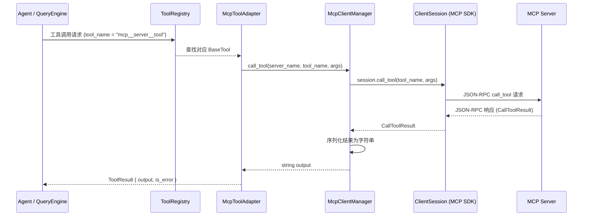

# MCP 集成流

## 摘要

本文档详细解析 OpenHarness 中 Model Context Protocol（MCP）的集成架构与执行路径。MCP 是 Anthropic 提出的标准协议，用于将外部工具服务器接入 AI 代理。OpenHarness 通过 `McpClientManager` 在工具系统中透明暴露 MCP 工具，使 Agent 能够像调用本地工具一样调用远程 MCP 工具。文档覆盖连接生命周期、三种传输类型差异、工具暴露机制、正常与异常路径解析，以及设计取舍与风险。

## 你将了解

- `McpClientManager` 如何管理 stdio / HTTP / WebSocket 三种传输类型的连接生命周期
- MCP 工具调用从 QueryEngine 到 MCP 服务器的完整路径
- MCP 资源读取（list_resources / read_resource）的路径
- `McpToolAdapter` 如何将 MCP 工具桥接为 OpenHarness 的标准 `BaseTool`
- 连接失败与服务器崩溃时的错误处理策略
- 三组设计取舍与三条运行时风险

## 范围

本文档聚焦于 MCP 客户端侧的集成流，不涉及 MCP 服务器的内部实现。传输层仅覆盖 stdio、HTTP Streamable 和 WebSocket 三种协议。工具暴露覆盖 `McpToolAdapter`、`ReadMcpResourceTool` 和 `ListMcpResourcesTool` 三个桥接工具。

---

## 1. MCP 协议与 OpenHarness 的角色

MCP（Model Context Protocol）是一种标准化的工具暴露协议，允许 AI 代理通过统一接口调用外部服务提供的工具与资源。OpenHarness 在整个 Agent 执行流程中扮演 **MCP 客户端** 的角色：接收用户请求 → 调用本地工具或 MCP 工具 → 合并结果返回给 Agent。

在 OpenHarness 架构中，MCP 客户端的生命周期由 `McpClientManager` 统一管理，它负责建立连接、缓存工具元数据，并将 MCP 工具适配为 `BaseTool` 实例注册到 `ToolRegistry` 中，使 Agent 在不知道任何 MCP 内部细节的情况下即可调用这些工具。

---

## 2. McpClientManager 生命周期

`McpClientManager` 实现了标准的连接生命周期：

```
connect_all()  →  使用阶段（call_tool / read_resource）  →  reconnect_all()  →  close()
```

### 2.1 初始化

构造时接收一个 server_configs 字典（键为服务器名称，值为配置对象），为每个服务器初始化一个 `McpConnectionStatus`（初始状态为 `"pending"`）。Session 在此时尚未创建。

`src/openharness/mcp/client.py` -> `McpClientManager.__init__`

```python
self._statuses: dict[str, McpConnectionStatus] = {
    name: McpConnectionStatus(
        name=name,
        state="pending",
        transport=getattr(config, "type", "unknown"),
    )
    for name, config in server_configs.items()
}
self._sessions: dict[str, ClientSession] = {}
self._stacks: dict[str, AsyncExitStack] = {}
```

### 2.2 connect_all()

逐个服务器尝试连接，按传输类型分发到 `_connect_stdio` 或 `_connect_http`。当前构建版本不支持 WebSocket 时会将对应服务器标记为 `"failed"`。成功的服务器在 `_register_connected_session` 中完成以下步骤：

1. 创建 `ClientSession`
2. 调用 `session.initialize()`
3. 调用 `session.list_tools()` 获取工具列表并缓存为 `McpToolInfo`
4. 调用 `session.list_resources()` 获取资源列表并缓存为 `McpResourceInfo`（若服务器不支持则静默跳过 `"Method not found"` 错误）
5. 更新状态为 `"connected"`

`src/openharness/mcp/client.py` -> `McpClientManager.connect_all` / `_register_connected_session`

### 2.3 使用阶段

Agent 调用工具时，系统通过 `ToolRegistry` 找到对应的 `McpToolAdapter` 实例，其 `execute()` 方法调用 `McpClientManager.call_tool(server_name, tool_name, arguments)`。

### 2.4 reconnect_all()

调用 `close()` 清理所有已有 session，然后重新初始化状态并调用 `connect_all()`。常用于 MCP 认证配置更新后（例如通过 `McpAuthTool` 更新了 token）重新建立连接。

`src/openharness/mcp/client.py` -> `McpClientManager.reconnect_all`

### 2.5 close()

遍历所有 `AsyncExitStack` 调用 `aclose()`，清空 `_sessions` 和 `_stacks`。使用 `contextlib.suppress(RuntimeError, asyncio.CancelledError)` 确保清理过程不会因异常中断。

`src/openharness/mcp/client.py` -> `McpClientManager.close`

---

## 3. 三种传输类型的实现差异

### 3.1 stdio（标准输入输出）

MCP 服务器作为子进程启动，通过 stdin/stdout 传递 JSON-RPC 消息。最适合本地部署的 MCP 服务器。

```python
read_stream, write_stream = await stack.enter_async_context(
    stdio_client(
        StdioServerParameters(
            command=config.command,
            args=config.args,
            env=config.env,
            cwd=config.cwd,
        )
    )
)
```

`src/openharness/mcp/client.py` -> `McpClientManager._connect_stdio`

关键特性：
- 环境变量通过 `config.env` 传入，支持认证 token
- 工作目录通过 `config.cwd` 控制
- 服务器崩溃时连接自动断开，下次调用抛出 `McpServerNotConnectedError`

### 3.2 HTTP Streamable

MCP 服务器作为远程 HTTP 服务运行，OpenHarness 使用 `streamable_http_client` 建立长连接。适合云端部署的 MCP 服务器。

```python
http_client = await stack.enter_async_context(
    httpx.AsyncClient(headers=config.headers or None)
)
read_stream, write_stream, _get_session_id = await stack.enter_async_context(
    streamable_http_client(config.url, http_client=http_client)
)
```

`src/openharness/mcp/client.py` -> `McpClientManager._connect_http`

关键特性：
- HTTP 头部通过 `config.headers` 注入认证信息（如 `Authorization: Bearer <token>`）
- `httpx.AsyncClient` 由 `AsyncExitStack` 管理生命周期
- 支持 `McpAuthTool` 更新 HTTP header 后通过 `reconnect_all()` 重新建立连接

### 3.3 WebSocket

WebSocket 配置模型已在 `McpWebSocketServerConfig` 中定义，但当前构建版本中 `_connect_ws` 方法尚未实现，WebSocket 传输的服务器会被标记为 `"failed"` 状态。

`src/openharness/mcp/types.py` -> `McpWebSocketServerConfig`

---

## 4. MCP 工具调用路径

### 4.1 完整序列图



### 4.2 路径解析

**步骤 1：Agent 发起工具调用**

QueryEngine 根据 Agent 返回的 tool_use 调用对应的 BaseTool。工具名称格式为 `mcp__<server_name>__<tool_name>`，例如 `mcp__filesystem__read_file`。

**步骤 2：McpToolAdapter 转发**

`McpToolAdapter.execute()` 调用 `McpClientManager.call_tool()`，传入服务器名称、工具名称和序列化后的参数。

`src/openharness/mcp/client.py` -> `McpClientManager.call_tool`

**步骤 3：Session 调用**

`McpClientManager` 从 `_sessions` 字典中查找对应的 `ClientSession`，然后调用 SDK 的 `session.call_tool(tool_name, arguments)`。

**步骤 4：结果序列化**

MCP 返回 `CallToolResult`，其中包含 `content` 列表。`call_tool` 方法遍历 content，将每个 `TextContent` 的 text 字段提取，非文本内容调用 `model_dump_json()`。若结果为空则返回 `"(no output)"`。

`src/openharness/mcp/client.py` -> `McpClientManager.call_tool`

```python
for item in result.content:
    if getattr(item, "type", None) == "text":
        parts.append(getattr(item, "text", ""))
    else:
        parts.append(item.model_dump_json())
```

---

## 5. MCP 资源读取路径

### 5.1 list_resources()

通过 `McpClientManager.list_resources()` 返回所有已连接 MCP 服务器暴露的资源列表。数据来自连接阶段缓存的 `McpConnectionStatus.resources`。

`src/openharness/mcp/client.py` -> `McpClientManager.list_resources`

### 5.2 read_resource()

```python
result: ReadResourceResult = await session.read_resource(uri)
```

`src/openharness/mcp/client.py` -> `McpClientManager.read_resource`

结果内容遍历与 `call_tool` 类似，文本内容直接提取，二进制 blob 调用 `str()` 转换。

---

## 6. MCP 服务器配置

### 6.1 配置来源

MCP 服务器配置通过 `Settings.mcp_servers` 加载，合并来自以下两个来源：

1. **配置文件**：`~/.openharness/settings.json` 中的 `mcp_servers` 字段
2. **插件**：启用的插件通过 `load_mcp_server_configs()` 将其 MCP 服务器合并到配置字典

`src/openharness/mcp/config.py` -> `load_mcp_server_configs`

```python
servers = dict(settings.mcp_servers)
for plugin in plugins:
    if not plugin.enabled:
        continue
    for name, config in plugin.mcp_servers.items():
        servers.setdefault(f"{plugin.manifest.name}:{name}", config)
```

### 6.2 stdio 配置

`src/openharness/mcp/types.py` -> `McpStdioServerConfig`

- `command`：可执行命令路径
- `args`：命令行参数列表
- `env`：环境变量字典（用于注入 token）
- `cwd`：工作目录

### 6.3 HTTP 配置

`src/openharness/mcp/types.py` -> `McpHttpServerConfig`

- `url`：MCP HTTP 服务器端点
- `headers`：HTTP 请求头（用于认证）

### 6.4 WebSocket 配置

`src/openharness/mcp/types.py` -> `McpWebSocketServerConfig`

- `url`：WebSocket 端点
- `headers`：WebSocket 握手头

---

## 7. MCP 与工具系统的桥接

### 7.1 McpToolAdapter

`McpToolAdapter` 将每个 MCP 工具适配为标准的 `BaseTool` 实例。工具名称通过 `_sanitize_tool_segment` 规范化（将非法字符替换为下划线），最终格式为 `mcp__<服务器名>__<工具名>`。

`src/openharness/tools/mcp_tool.py` -> `McpToolAdapter`

```python
def __init__(self, manager: McpClientManager, tool_info: McpToolInfo) -> None:
    self._manager = manager
    self._tool_info = tool_info
    server_segment = _sanitize_tool_segment(tool_info.server_name)
    tool_segment = _sanitize_tool_segment(tool_info.name)
    self.name = f"mcp__{server_segment}__{tool_segment}"
```

`execute()` 方法将 `BaseModel` 参数序列化为 JSON 字典后调用 `McpClientManager.call_tool()`。

### 7.2 ReadMcpResourceTool

`src/openharness/tools/read_mcp_resource_tool.py` -> `ReadMcpResourceTool`

```python
output = await self._manager.read_resource(arguments.server, arguments.uri)
```

代理对资源的读取请求。

### 7.3 ListMcpResourcesTool

`src/openharness/tools/list_mcp_resources_tool.py` -> `ListMcpResourcesTool`

返回所有已连接 MCP 服务器上可用的资源列表，格式为 `server_name:uri description`。

### 7.4 McpAuthTool

`src/openharness/tools/mcp_auth_tool.py` -> `McpAuthTool`

支持在运行时更新 MCP 服务器的认证配置（stdio 通过 env，HTTP/WebSocket 通过 headers），更新后调用 `mcp_manager.reconnect_all()` 重新建立连接。

---

## 8. 正常流逐跳解析

以一个典型的 Agent 调用 MCP 工具为例：

**第 1 跳：启动阶段**

1. `load_settings()` 读取 `settings.json` 中的 `mcp_servers`
2. `load_mcp_server_configs()` 合并插件提供的 MCP 服务器
3. `McpClientManager.__init__()` 初始化状态为 pending
4. `connect_all()` 依次连接各服务器
5. `_register_connected_session()` 调用 `list_tools()` 和 `list_resources()` 缓存元数据
6. `McpToolAdapter` 实例被创建并注册到 `ToolRegistry`

**第 2 跳：Agent 调用阶段**

7. Agent 决定调用 `mcp__filesystem__read_file` 工具
8. `QueryEngine` 通过 `ToolRegistry.get("mcp__filesystem__read_file")` 找到 `McpToolAdapter`
9. `execute()` 方法被调用，参数被序列化为 `{"path": "/project/file.txt"}`
10. `McpClientManager.call_tool("filesystem", "read_file", {"path": "/project/file.txt"})`
11. SDK `ClientSession.call_tool()` 发送 JSON-RPC 请求
12. MCP 服务器处理并返回 `CallToolResult`（content = [TextContent(text="...")])
13. `call_tool` 提取 text 并拼接为字符串返回
14. `McpToolAdapter.execute()` 将结果包装为 `ToolResult` 返回给 QueryEngine
15. QueryEngine 将结果注入 Agent 的上下文中，Agent 继续执行

---

## 9. 异常流逐跳解析

### 9.1 服务器连接失败

**场景**：MCP 服务器启动时崩溃（例如缺少依赖）。

1. `connect_all()` 调用 `_connect_stdio()`
2. `stdio_client()` 抛出异常（subprocess 启动失败或协议握手超时）
3. `except` 块捕获异常，调用 `stack.aclose()`
4. `self._statuses[name]` 更新为 `McpConnectionStatus(state="failed", detail=str(exc))`
5. `connect_all()` 继续处理下一个服务器（不中断整个流程）

### 9.2 调用时服务器已断开

**场景**：服务器在连接后崩溃。

1. `McpClientManager.call_tool("server", "tool", {})` 被调用
2. `self._sessions.get("server")` 返回 `None`（session 已在服务器崩溃时失效）
3. 抛出 `McpServerNotConnectedError(f"MCP server '{server_name}' is not connected: {detail}")`
4. `McpToolAdapter.execute()` 捕获异常，返回 `ToolResult(is_error=True)`
5. Agent 接收到错误结果，可决定是否尝试其他方案

### 9.3 工具调用超时或返回错误

**场景**：MCP 服务器处理工具时抛出异常（例如参数验证失败）。

1. `session.call_tool()` 抛出异常
2. `except Exception` 块捕获，抛出 `McpServerNotConnectedError(f"MCP server '{server_name}' call failed: {exc}")`
3. 同 9.2 中的步骤 3-5

### 9.4 服务器不支持资源功能

**场景**：MCP 服务器未实现 `list_resources` 方法。

`src/openharness/mcp/client.py` -> `_register_connected_session` 第 226-231 行：

```python
try:
    resource_result = await session.list_resources()
except Exception as exc:
    if "Method not found" not in str(exc):
        raise
```

MCP SDK 在服务器不支持该方法时抛出包含 "Method not found" 的异常，代码静默捕获并继续，此时 `resources` 为空列表而不中断连接。

---

## 10. 设计取舍

### 取舍 1：工具元数据缓存 vs 实时发现

**当前方案**：在 `connect_all()` 阶段一次性调用 `list_tools()` 和 `list_resources()`，将元数据缓存到 `McpConnectionStatus` 中。所有后续工具调用直接使用缓存数据，无需每次都查询服务器。

**替代方案**：每次调用 `list_tools()` 实时发现。

**为何未选替代方案**：MCP 服务器的工具列表通常在会话期间不变，实时发现会增加每次 Agent 决策的延迟（额外的网络往返或进程通信），且大多数 MCP 服务器的工具集是静态的。

**替代方案的代价**：若 MCP 服务器在运行期间动态注册新工具，OpenHarness 需要重启连接才能发现这些工具。当前的 `reconnect_all()` 机制可以缓解此问题，但不支持热更新。

### 取舍 2：Session 生命周期绑定 vs 按需创建

**当前方案**：`connect_all()` 在会话开始时创建所有 `ClientSession`，并在整个会话期间复用，直到 `close()` 被调用。

**替代方案**：每次工具调用时创建临时 Session，调用完成后销毁。

**为何未选替代方案**：MCP Session 的建立涉及协议握手（initialize），对于 stdio 类型还需要 fork 子进程。频繁创建销毁会带来显著的性能开销，特别是当一个 Agent 需要调用同一 MCP 服务器的多个工具时。

**替代方案的代价**：若 MCP 服务器崩溃导致 Session 失效，所有后续调用都会失败，必须手动调用 `reconnect_all()` 恢复。Session 持有期间若 MCP 服务器配置变更（如更换端口），需要显式更新配置并重连。

### 取舍 3：WebSocket 传输延迟实现

**当前方案**：WebSocket 配置模型已定义但 `_connect_ws` 方法未实现，WebSocket 服务器在连接时直接标记为 `"failed"`。

**替代方案**：实现完整的 WebSocket 传输支持。

**为何未选替代方案**：当前 OpenHarness 的主要使用场景集中在 stdio（本地工具服务器）和 HTTP（远程服务）两种传输方式，WebSocket 的优先级较低。延迟实现降低了初期的代码复杂度。

**替代方案的代价**：依赖 WebSocket 传输的 MCP 服务器（例如某些实时数据推送场景）无法使用。

---

## 11. 风险

### 风险 1：MCP 服务器子进程（stdio）泄漏

**描述**：若 stdio MCP 服务器异常退出但 `AsyncExitStack` 未正确清理，子进程可能成为僵尸进程。

**缓解**：`_connect_stdio` 在异常分支中显式调用 `await stack.aclose()`，保证资源释放。

### 风险 2：认证信息明文传输

**描述**：stdio 模式下环境变量中的 token 和 HTTP 模式下的 header 认证信息可能在日志、进程列表或错误消息中暴露。

**缓解**：认证信息仅在必要时注入，不在普通日志路径中输出。生产环境建议使用 HTTPS HTTP MCP 服务器。

### 风险 3：MCP 服务器未响应导致 Agent 阻塞

**描述**：若 MCP 服务器在处理工具调用时无限等待（如网络分区、无限循环），Agent 的整个执行流会被阻塞。

**缓解**：HTTP 传输模式下，`httpx.AsyncClient` 的 timeout 配置应在 MCP 服务器端控制。stdio 模式下进程卡死需要外部进程管理（如 `timeout` 命令）配合。

---

## 12. 证据引用

1. `src/openharness/mcp/client.py` -> `McpClientManager.__init__` — session 与 stack 初始化逻辑
2. `src/openharness/mcp/client.py` -> `McpClientManager.connect_all` — 连接分派逻辑
3. `src/openharness/mcp/client.py` -> `McpClientManager._connect_stdio` — stdio 传输实现
4. `src/openharness/mcp/client.py` -> `McpClientManager._connect_http` — HTTP Streamable 传输实现
5. `src/openharness/mcp/client.py` -> `McpClientManager._register_connected_session` — 工具和资源元数据缓存
6. `src/openharness/mcp/client.py` -> `McpClientManager.call_tool` — 工具调用与结果序列化
7. `src/openharness/mcp/client.py` -> `McpClientManager.read_resource` — 资源读取路径
8. `src/openharness/mcp/client.py` -> `McpClientManager.reconnect_all` — 重连机制
9. `src/openharness/mcp/config.py` -> `load_mcp_server_configs` — 插件配置合并
10. `src/openharness/mcp/types.py` -> `McpConnectionStatus` — 连接状态数据结构
11. `src/openharness/mcp/types.py` -> `McpToolInfo` / `McpResourceInfo` — 元数据结构
12. `src/openharness/tools/mcp_tool.py` -> `McpToolAdapter` — MCP 工具到 BaseTool 的桥接
13. `src/openharness/tools/mcp_tool.py` -> `McpToolAdapter.execute` — 工具执行逻辑
14. `src/openharness/tools/mcp_tool.py` -> `_sanitize_tool_segment` — 工具名称规范化
15. `src/openharness/tools/read_mcp_resource_tool.py` -> `ReadMcpResourceTool.execute` — 资源读取工具
16. `src/openharness/tools/list_mcp_resources_tool.py` -> `ListMcpResourcesTool.execute` — 资源列表工具
17. `src/openharness/tools/mcp_auth_tool.py` -> `McpAuthTool.execute` — 认证更新与重连
18. `src/openharness/config/settings.py` -> `Settings.mcp_servers` — 配置模型定义
