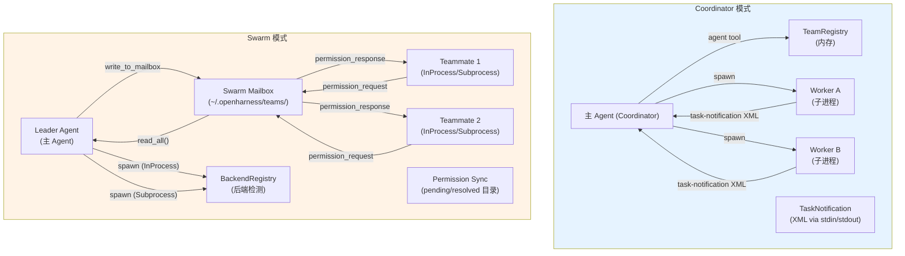

# 多 Agent 协调流

## 摘要

OpenHarness 支持两种多 Agent 协调模式：Coordinator（协调器）模式和 Swarm（蜂群）模式。前者通过一个主 Agent 协调多个 Worker 子进程，消息通过 TaskNotification XML 传递；后者通过文件邮箱（mailbox）实现 Agent 间的去中心化消息传递，支持 In-Process 和 Subprocess 两种执行后端。本页深入解析两种模式的架构差异、Agent 定义系统、消息传递机制、权限同步协议，以及两种模式各自的正常流和异常流逐跳解析。

## 你将了解

- Coordinator 模式与 Swarm 模式的本质区别与适用场景
- Coordinator 模式：TeamRegistry、WorkerConfig、TaskNotification 的协同工作方式
- Swarm 模式：Teammate 生命周期、InProcess vs Subprocess 后端、Pane 管理的完整流程
- Agent 定义系统：AgentDefinition 数据模型、builtin agents、插件 agents 的加载与合并
- 消息传递机制：Swarm mailbox 文件系统布局、MailboxMessage 结构、异步轮询
- 权限在多 Agent 间的同步：permission_sync 的两种协议（文件目录式与邮箱式）
- 两种模式的正常流逐跳解析
- 两种模式的异常流逐跳解析
- 完整的架构图与设计取舍
- 风险分析与证据引用

## 范围

覆盖 Coordinator Mode、Swarm Mode（InProcessBackend、SubprocessBackend）、Agent Definitions、Permission Sync。不覆盖 MCP 服务器间的通信（属于工具层边界）。

---

## 架构总览



**图后解释**：该架构图清晰展示了两条平行路径的核心差异。Coordinator 模式采用内存中的 TeamRegistry 管理 Worker 成员资格，通过 stdin/stdout 传递 XML 格式的 TaskNotification，消息传递是同步的、点对点的。Swarm 模式则采用文件系统中的 mailbox 目录结构（`~/.openharness/teams/<team>/agents/<agent>/inbox/`）作为消息持久化层，Leader 和 Teammate 均通过异步文件轮询收发消息，支持 InProcess（asyncio Task）和 Subprocess（独立进程）两种 Teammate 执行后端。两种模式共享权限同步机制（permission_sync），但 Swarm 模式提供了更丰富的权限委派协议。

---

## Coordinator 模式 vs Swarm 模式

| 维度 | Coordinator 模式 | Swarm 模式 |
|------|----------------|-----------|
| 架构风格 | 中心化（主 Agent 即协调者） | 去中心化（Leader/Teammate 均可主动通信） |
| 执行后端 | 仅 subprocess | InProcess / Subprocess / Tmux / iTerm2 |
| 消息协议 | TaskNotification XML（stdin/stdout） | Swarm mailbox（文件系统 JSON 文件） |
| 权限传递 | Worker 继承主 Agent 权限集 | Leader 审批 + 权限同步委派协议 |
| 任务粒度 | 粗粒度（整个 Worker 进程生命周期） | 细粒度（turn 级别消息注入） |
| 适用场景 | 后台批处理、长期 Worker | 实时协作、需要中间消息交互 |
| 并发模型 | 多 Worker 并行（TaskNotification 事件驱动） | Leader 轮询 mailbox + Teammate 事件循环 |
| 工具可见性 | Worker 工具集由 Coordinator 配置 | Teammate 工具集由 TeammateSpawnConfig 配置 |

**关键关系**：Coordinator 模式是 Swarm 模式的特例（Swarm 的 Leader 在Coordinator 模式下就是主 Agent）。实际上，当 `CLAUDE_CODE_COORDINATOR_MODE=1` 时，系统进入协调器模式；当在 Swarm 团队中运行 Agent 时，系统使用 Swarm mailbox 协议。

**证据**：`src/openharness/coordinator/coordinator_mode.py` -> `is_coordinator_mode()`（行 185-188）

---

## Coordinator 模式：TeamRegistry、WorkerConfig、TaskNotification

### TeamRegistry（内存团队注册表）

**职责**：维护内存中的团队与成员映射，提供轻量级的团队管理能力。

```python
class TeamRegistry:
    _teams: dict[str, TeamRecord]  # name -> TeamRecord
    def create_team(name, description) -> TeamRecord
    def add_agent(team_name, task_id)
    def send_message(team_name, message)
    def list_teams() -> list[TeamRecord]
```

**数据结构**：
```python
@dataclass
class TeamRecord:
    name: str
    description: str = ""
    agents: list[str] = field(default_factory=list)   # task_id 列表
    messages: list[str] = field(default_factory=list) # 团队消息历史
```

**证据**：`src/openharness/coordinator/coordinator_mode.py` -> `TeamRegistry`，`TeamRecord`（行 16-59）

### WorkerConfig（Worker 配置）

```python
@dataclass
class WorkerConfig:
    agent_id: str   # "agentName@teamName" 格式
    name: str       # 人类可读名称
    prompt: str     # Worker 的初始 prompt
    model: Optional[str] = None
    color: Optional[str] = None
    team: Optional[str] = None
```

Worker 的工具集由协调器决定（通过 `get_coordinator_tools()` 获取协调器专用工具：`agent`、`send_message`、`task_stop`），而 Worker 可用的工具由 `get_coordinator_user_context()` 注入。

**证据**：`src/openharness/coordinator/coordinator_mode.py` -> `WorkerConfig`（行 89-98）

### TaskNotification（任务完成通知）

Worker 完成后通过 stdout 输出 XML 格式的 TaskNotification：

```xml
<task-notification>
<task-id>{{agentId}}</task-id>
<status>completed|failed|killed</status>
<summary>{{human-readable status summary}}</summary>
<result>{{agent's final text response}}</result>
<usage>
  <total_tokens>N</total_tokens>
  <tool_uses>N</tool_uses>
  <duration_ms>N</duration_ms>
</usage>
</task-notification>
```

```python
@dataclass
class TaskNotification:
    task_id: str
    status: str
    summary: str
    result: Optional[str] = None
    usage: Optional[dict[str, int]] = None
```

**解析**：协调器收到 `<task-notification>` 标签开头的消息时，调用 `parse_task_notification()` 提取各字段。

**证据**：`src/openharness/coordinator/coordinator_mode.py` -> `TaskNotification`，`parse_task_notification`，`format_task_notification`（行 78-155）

---

## Swarm 模式：Teammate 生命周期

### TeammateIdentity（身份标识）

```python
@dataclass
class TeammateIdentity:
    agent_id: str   # "agentName@teamName"
    name: str       # 人类可读名称
    team: str       # 团队名
    color: Optional[str] = None
    parent_session_id: Optional[str] = None
```

### TeammateSpawnConfig（Spawn 配置）

```python
@dataclass
class TeammateSpawnConfig:
    name: str                    # "researcher"
    team: str                    # "default"
    prompt: str                  # 初始任务描述
    cwd: str                     # 工作目录
    parent_session_id: str       # 用于转录关联
    model: Optional[str] = None
    system_prompt: Optional[str] = None
    color: Optional[str] = None
    color_override: Optional[str] = None
    permissions: list[str] = []  # 授予该 Teammate 的工具权限
    plan_mode_required: bool = False
    allow_permission_prompts: bool = False
    worktree_path: Optional[str] = None
    session_id: Optional[str] = None
    subscriptions: list[str] = []  # 事件订阅主题
```

**证据**：`src/openharness/swarm/types.py` -> `TeammateIdentity`，`TeammateSpawnConfig`，`SpawnResult`（行 237-334）

### 正常流逐跳解析：Swarm Leader spawn 一个 Teammate

**第 1 跳：后端检测（调用点：Leader，被调用点：BackendRegistry.detect_backend）**

```python
registry = BackendRegistry()
backend_type = registry.detect_backend()
# 优先级：in_process_fallback > tmux > subprocess
```

- **输入**：环境变量 `$TMUX`、`$ITERM_SESSION_ID`、tmux/it2 二进制可用性
- **输出**：`BackendType` 字符串（"in_process"、"tmux" 或 "subprocess"）
- **副作用**：结果被缓存，后续 `get_executor()` 复用
- **失败模式**：所有后端均不可用 → 抛出 `RuntimeError`（携带平台安装指南）
- **恢复策略**：用户安装 tmux 或配置 `OPENHARNESS_TEAMMATE_MODE=in_process`

**证据**：`src/openharness/swarm/registry.py` -> `BackendRegistry.detect_backend`（行 128-183）

**第 2 跳：In-Process spawn（调用点：Leader，被调用点：InProcessBackend.spawn）**

```python
agent_id = f"{config.name}@{config.team}"
task_id = f"in_process_{uuid.uuid4().hex[:12]}"
abort_controller = TeammateAbortController()
task = asyncio.create_task(
    start_in_process_teammate(config=config, agent_id=agent_id, abort_controller=abort_controller),
    name=f"teammate-{agent_id}",
)
self._active[agent_id] = _TeammateEntry(task=task, abort_controller=abort_controller, task_id=task_id)
```

- **输入**：`TeammateSpawnConfig`
- **输出**：`SpawnResult(task_id, agent_id, backend_type="in_process")`
- **副作用**：
  - `TeammateContext` 通过 `ContextVar` 绑定到当前 asyncio Task（上下文隔离）
  - 启动 `start_in_process_teammate()` 协程，依次执行 QueryEngine 初始化和 run_query 循环
- **失败模式**：
  - `agent_id` 已存在且 Task 未完成 → 返回 `success=False`
  - Task 中未处理异常 → `done_callback` 调用 `_on_teammate_error()`，从 `_active` 移除
- **恢复策略**：Leader 通过 mailbox 轮询或 idle_notification 感知 Teammate 完成

**证据**：`src/openharness/swarm/in_process.py` -> `InProcessBackend.spawn`（行 436-492）

**第 3 跳：Subprocess spawn（调用点：Leader，被调用点：SubprocessBackend.spawn）**

```python
agent_id = f"{config.name}@{config.team}"
flags = build_inherited_cli_flags(model=..., plan_mode_required=...)
command = f"{env_prefix} python -m openharness --task-worker {flags}"
record = await manager.create_agent_task(
    prompt=config.prompt,
    description=f"Teammate: {agent_id}",
    cwd=config.cwd,
    task_type="in_process_teammate",
    command=command,
)
self._agent_tasks[agent_id] = record.id
return SpawnResult(task_id=record.id, agent_id=agent_id, backend_type="subprocess")
```

- **输入**：`TeammateSpawnConfig`
- **输出**：`SpawnResult(task_id=record.id, agent_id, backend_type="subprocess")`
- **副作用**：
  - 在后台任务管理器中注册 agent task
  - 通过 `write_to_task(prompt)` 将初始 prompt 写入 stdin
  - 继承 `ANTHROPIC_API_KEY` 等环境变量
- **失败模式**：
  - `manager.create_agent_task()` 抛出 → 返回 `success=False`
  - task manager 进程崩溃 → agent task 永久僵死
- **恢复策略**：Leader 轮询 task status；subprocess 通过 task manager 管理生命周期

**证据**：`src/openharness/swarm/subprocess_backend.py` -> `SubprocessBackend.spawn`（行 47-97）

**第 4 跳：消息发送（调用点：Leader，被调用点：InProcessBackend.send_message / SubprocessBackend.send_message）**

**In-Process 模式**：
```python
# 直接写入 mailbox + 注入 message_queue
msg = MailboxMessage(...)
mailbox = TeammateMailbox(team_name, agent_name)
await mailbox.write(msg)
# 若 ctx 可访问，推入 ctx.message_queue
```
消息同时写入文件系统和内存队列（后者提供低延迟）。

**Subprocess 模式**：
```python
payload = {"text": message.text, "from": message.from_agent, "timestamp": ...}
await manager.write_to_task(task_id, json.dumps(payload))
```
通过 task manager 的 stdin pipe 发送 JSON 行。

**证据**：
- `src/openharness/swarm/in_process.py` -> `InProcessBackend.send_message`（行 494-527）
- `src/openharness/swarm/subprocess_backend.py` -> `SubprocessBackend.send_message`（行 99-121）

**第 5 跳：消息接收与处理（调用点：Teammate，被调用点：TeammateMailbox.read_all）**

```python
# _drain_mailbox() 在每个事件循环中被调用
pending = await mailbox.read_all(unread_only=True)
for msg in pending:
    await mailbox.mark_read(msg.id)
    if msg.type == "shutdown":
        abort_controller.request_cancel(reason="shutdown message received")
        return True  # 停止循环
    elif msg.type == "user_message":
        content = msg.payload.get("content", "")
        teammate_msg = TeammateMessage(text=content, from_agent=msg.sender, ...)
        await ctx.message_queue.put(teammate_msg)
```

**证据**：`src/openharness/swarm/in_process.py` -> `_drain_mailbox`（行 295-332）

**第 6 跳：Teammate 退出与 idle_notification（调用点：Teammate，被调用点：create_idle_notification）**

```python
# finally 块中
idle_msg = create_idle_notification(
    sender=agent_id,
    recipient="leader",
    summary=f"{config.name} finished (tools={ctx.tool_use_count}, tokens={ctx.total_tokens})",
)
leader_mailbox = TeammateMailbox(team_name=config.team, agent_id="leader")
await leader_mailbox.write(idle_msg)
```

**证据**：`src/openharness/swarm/in_process.py` -> `start_in_process_teammate`（行 276-285）

---

## Swarm 模式：消息传递机制

### Swarm Mailbox 文件系统布局

```
~/.openharness/teams/<teamName>/
  agents/
    <agentName>/           # 每个 agent 的独立目录
      inbox/
        <timestamp>_<uuid>.json   # 每条消息一个文件（原子写入）
  permissions/
    pending/
      <requestId>.json     # 待处理的权限请求
    resolved/
      <requestId>.json     # 已处理的权限请求
```

**原子写入**：`TeammateMailbox.write()` 先写入 `.tmp` 文件，再 `os.replace()` 到最终路径，确保读取方永远看到完整消息。

**证据**：`src/openharness/swarm/mailbox.py` -> `TeammateMailbox.write`（行 126-151）

### MailboxMessage 结构

```python
@dataclass
class MailboxMessage:
    id: str           # uuid
    type: MessageType  # "user_message" | "permission_request" | "shutdown" | "idle_notification" | ...
    sender: str
    recipient: str
    payload: dict     # 内容字典
    timestamp: float
    read: bool = False
```

**证据**：`src/openharness/swarm/mailbox.py` -> `MailboxMessage`（行 38-75）

---

## Agent 定义系统

### AgentDefinition 数据模型

```python
class AgentDefinition(BaseModel):
    name: str                    # 唯一标识
    description: str             # whenToUse 描述
    system_prompt: Optional[str] = None
    tools: Optional[list[str]] = None  # None = 所有工具; ["Read", "Edit"] = 仅这些
    disallowed_tools: Optional[list[str]] = None
    model: Optional[str] = None  # "inherit" = 继承主 Agent
    permission_mode: Optional[str] = None  # "dontAsk" | "plan" | ...
    max_turns: Optional[int] = None
    skills: list[str] = []
    mcp_servers: Optional[list] = None
    hooks: Optional[dict] = None
    color: Optional[str] = None
    background: bool = False     # 始终作为后台任务启动
    initial_prompt: Optional[str] = None
    memory: Optional[str] = None  # "user" | "project" | "local"
    isolation: Optional[str] = None  # "worktree" | "remote"
    permissions: list[str] = []  # Python-specific 额外权限规则
    subagent_type: str = "general-purpose"  # 路由键
    source: Literal["builtin", "user", "plugin"] = "builtin"
```

**合并优先级**：builtin < user < plugin（后者覆盖前者同名定义）。

**证据**：`src/openharness/coordinator/agent_definitions.py` -> `AgentDefinition`（行 60-134）

### Builtin Agents

| Agent 名称 | 描述 | 工具限制 | 颜色 | 备注 |
|-----------|------|--------|------|------|
| `general-purpose` | 通用 Agent | 全部工具 | 无 | 默认 |
| `worker` | 实现聚焦 Worker | 全部工具 | 无 | Coordinator 模式专用 |
| `Explore` | 快速代码库探索 | 无 Edit/Write | 无 | 只读模式 |
| `Plan` | 架构规划 | 无 Edit/Write | 无 | 只读模式 |
| `verification` | 验证专家 | 无 Edit/Write | 红色 | 需 VERDICT 输出 |
| `statusline-setup` | 状态行配置 | Read, Edit | 橙色 | 专用 |
| `claude-code-guide` | Claude Code 使用指南 | WebFetch, WebSearch | 无 | 小模型 |

**证据**：`src/openharness/coordinator/agent_definitions.py` -> `_BUILTIN_AGENTS`（行 510-620）

### 加载流程

```python
def get_all_agent_definitions():
    # 1. Built-in agents (最低优先级)
    for agent in get_builtin_agent_definitions():
        agent_map[agent.name] = agent
    # 2. User agents (~/.openharness/agents/*.md)
    for agent in load_agents_dir(_get_user_agents_dir()):
        agent_map[agent.name] = agent  # 覆盖 builtin
    # 3. Plugin agents (最高优先级)
    for plugin in load_plugins(settings, cwd):
        for agent_def in plugin.agents:
            agent_map[agent_def.name] = agent_def  # 覆盖 user
```

**证据**：`src/openharness/coordinator/agent_definitions.py` -> `get_all_agent_definitions`（行 905-945）

---

## 权限在多 Agent 间的同步

### 两种同步协议

#### 协议 A：文件目录式（pending/resolved）

```
Worker 调用 write_permission_request()
  → ~/.openharness/teams/<team>/permissions/pending/<id>.json
Leader 调用 read_pending_permissions()
  → 列出所有 pending 请求
Leader 调用 resolve_permission()
  → ~/.openharness/teams/<team>/permissions/resolved/<id>.json
Worker 调用 read_resolved_permission() 或 poll_for_response()
```

#### 协议 B：邮箱式（通过 mailbox 消息）

```
Worker 调用 send_permission_request_via_mailbox()
  → Leader 的 mailbox 写入 permission_request 消息
Leader 轮询 mailbox，调用 send_permission_response_via_mailbox()
  → Worker 的 mailbox 写入 permission_response 消息
Worker 调用 poll_permission_response(timeout=60s)
```

**自动批准规则**：`handle_permission_request()` 对只读工具（`Read`、`Glob`、`Grep`、`WebFetch` 等）自动批准，无需同步。

```python
# src/openharness/swarm/permission_sync.py
_READ_ONLY_TOOLS = frozenset({
    "read_file", "glob", "grep", "web_fetch", "web_search",
    "task_get", "task_list", "task_output", "cron_list",
})
def _is_read_only(tool_name: str) -> bool:
    return tool_name in _READ_ONLY_TOOLS
```

**证据**：
- `src/openharness/swarm/permission_sync.py` -> `handle_permission_request`（行 1082-1128）
- `src/openharness/swarm/permission_sync.py` -> `_is_read_only`（行 76-93）

### 角色检测

```python
def is_team_leader(team_name=None) -> bool:
    # Team leaders 没有 agent_id，或 agent_id == "team-lead"
    return not agent_id or agent_id == "team-lead"

def is_swarm_worker() -> bool:
    # 有 team_name、有 agent_id、且不是 leader
    return bool(team_name) and bool(agent_id) and not is_team_leader()
```

**证据**：`src/openharness/swarm/permission_sync.py` -> `is_team_leader`，`is_swarm_worker`（行 708-724）

---

## 设计取舍

### 取舍 1：In-Process vs Subprocess 执行后端

| 维度 | In-Process | Subprocess |
|------|-----------|-----------|
| 隔离性 | 共享进程内存（通过 ContextVar 隔离） | 进程级隔离 |
| 启动速度 | 极快（asyncio Task 创建） | 较慢（需 fork/exec） |
| 资源隔离 | 无（一个 Teammate 的未捕获异常可影响其他） | 进程级隔离 |
| 调试便利性 | 高（可直接看到堆栈） | 低（需查看子进程日志） |
| 适用场景 | 快速原型、单用户本地 | 生产环境、多租户 |

**当前默认**：`BackendRegistry.detect_backend()` 按 in_process_fallback > tmux > subprocess 的优先级检测。但若在 tmux 外部运行，subprocess 是实际默认（始终可用）。

**证据**：`src/openharness/swarm/registry.py` -> `BackendRegistry.detect_backend`（行 128-183），`src/openharness/swarm/in_process.py` -> `InProcessBackend`（行 413-694）

### 取舍 2：文件邮箱 vs 内存消息队列

**选择文件邮箱的理由**：
- **持久化**：即使主进程重启，消息不丢失
- **跨进程**：Subprocess Teammate 天然通过文件系统与 Leader 通信
- **幂等性**：文件轮询天然去重（文件名含 timestamp+uuid）

**代价**：
- 磁盘 I/O 延迟（0.5s 轮询间隔）
- 文件系统权限与磁盘空间依赖
- 高频消息场景下文件系统成为瓶颈

**替代方案**：若未来引入真正的消息队列（Redis / AMQP），可注册自定义的 TeammateExecutor 并通过 BackendRegistry 注入，无需修改上层代码。

---

## 风险

1. **Mailbox 磁盘空间耗尽**：在高频消息交换场景下，`~/.openharness/teams/<team>/agents/<agent>/inbox/` 目录下的 JSON 文件快速堆积。若磁盘写满，`write()` 抛出 `OSError`，消息丢失但不通知发送方。
2. **权限同步的超时依赖**：`poll_permission_response(timeout=60s)` 依赖 Leader 在 60 秒内处理并响应。若 Leader 本身被阻塞（等待某个长时间操作），Worker 会超时放弃，即使该操作本可被批准。
3. **Subprocess Teammate 的 API Key 传递攻击面**：`build_inherited_env_vars()` 将 `ANTHROPIC_API_KEY` 等环境变量编码到命令行中。若系统进程列表可见（`ps aux`），API Key 可能被窥探。
4. **ContextVar 在 asyncio Task 取消时的状态泄露**：当 `TeammateAbortController.force_cancel` 触发时，asyncio Task 被 cancel，但 `_teammate_context_var` 的 ContextVar 值需要由 GC 回收。若存在循环引用（如 TeammateContext 持有外部引用），可能无法及时清理。
5. **并发 Teammate 的 ContextVar 隔离边界**：`asyncio.create_task()` 通过 Python 的 copy-on-write 复制当前 Context。但若 Teammate 代码通过全局变量共享状态（在 In-Process 模式下），隔离机制会被绕过。
6. **Teammate 的 unhandled 异常静默吞噬**：`_on_teammate_error()` 仅记录日志，不向 Leader 发送通知。Leader 必须通过 idle_notification 或轮询才能感知 Teammate 异常退出，存在检测延迟。

---

## 证据引用

1. `src/openharness/coordinator/coordinator_mode.py` -> `TeamRegistry`，`TeamRecord`，`WorkerConfig`，`TaskNotification`
2. `src/openharness/coordinator/coordinator_mode.py` -> `parse_task_notification`，`format_task_notification`
3. `src/openharness/swarm/types.py` -> `TeammateIdentity`，`TeammateSpawnConfig`，`SpawnResult`，`TeammateMessage`
4. `src/openharness/swarm/in_process.py` -> `InProcessBackend.spawn`，`start_in_process_teammate`
5. `src/openharness/swarm/in_process.py` -> `_drain_mailbox`，`TeammateContext`，`TeammateAbortController`
6. `src/openharness/swarm/subprocess_backend.py` -> `SubprocessBackend.spawn`，`send_message`，`shutdown`
7. `src/openharness/swarm/registry.py` -> `BackendRegistry.detect_backend`，`mark_in_process_fallback`
8. `src/openharness/swarm/mailbox.py` -> `TeammateMailbox.write`，`read_all`，`MessageType`
9. `src/openharness/swarm/mailbox.py` -> `write_to_mailbox`，`create_user_message`，`create_idle_notification`
10. `src/openharness/coordinator/agent_definitions.py` -> `AgentDefinition`，`get_builtin_agent_definitions`，`_BUILTIN_AGENTS`
11. `src/openharness/swarm/permission_sync.py` -> `SwarmPermissionRequest`，`handle_permission_request`，`_is_read_only`
12. `src/openharness/swarm/permission_sync.py` -> `poll_permission_response`，`send_permission_request_via_mailbox`
13. `src/openharness/swarm/permission_sync.py` -> `is_team_leader`，`is_swarm_worker`
14. `src/openharness/tasks/manager.py` -> `BackgroundTaskManager.create_agent_task`（API Key 传递）
