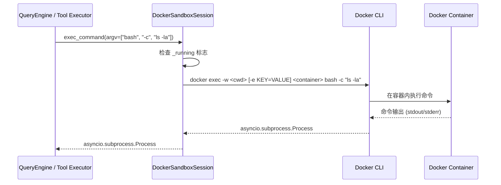

# 沙箱执行流

## 摘要

本文档详细解析 OpenHarness 中沙箱（Sandbox）系统的执行流程与架构设计。沙箱通过隔离代码执行环境来保护宿主机器，防止恶意或意外的有害操作。OpenHarness 支持两种沙箱后端：`srt`（基于 bubblewrap / sandbox-exec 的操作系统级隔离）和 Docker（容器级隔离）。本文档聚焦于 DockerBackend 的启动、执行、清理全生命周期，并对比网络隔离、资源限制、平台兼容性等关键设计决策。

## 你将了解

- 沙箱系统的安全目标与隔离原理
- `DockerSandboxSession` 的完整启动与清理流程
- `exec_command` 如何通过 `docker exec` 在容器内执行命令
- 网络隔离策略（`network: none` vs `bridge`）与 `allowed_domains` 配置
- CPU、内存等资源限制的 Docker flags
- 项目目录挂载（bind mount）的实现方式
- 平台兼容性的判断逻辑与各平台支持情况
- `SandboxSettings` 各配置项的语义与默认值
- Docker 沙箱异常场景的处理方式

## 范围

本文档聚焦于 Docker 后端的沙箱执行流。`srt` 后端的实现细节（bubblewrap / sandbox-exec 包装）仅在对比场景中提及，不深入展开。沙箱配置覆盖 Settings 模型中的 `sandbox` 字段及所有子字段。

---

## 1. 沙箱系统的目的

沙箱（Sandbox）的核心目标是**隔离代码执行环境**，确保工具（如 Bash 工具）执行的命令不会影响宿主系统的安全性和稳定性。具体目标包括：

- **进程隔离**：工具命令运行在受限的子环境中，而非直接继承宿主的所有权限
- **网络隔离**：默认禁用网络访问，通过 `allowed_domains` 白名单按需放行特定域名
- **文件系统隔离**：限制工具对特定目录的读写权限，防止对项目目录之外的敏感文件进行操作
- **资源约束**：防止失控的计算（无限循环、内存泄漏）耗尽宿主的系统资源

在 OpenHarness 中，工具执行前会通过 `wrap_command_for_sandbox()` 检查沙箱是否可用且激活。若激活，则通过 Docker 容器或 srt 运行时包装命令。

`src/openharness/sandbox/adapter.py` -> `wrap_command_for_sandbox` / `get_sandbox_availability`

---

## 2. DockerBackend 启动流程

### 2.1 可用性检查

在启动 Docker 沙箱前，系统通过 `get_docker_availability()` 检查 Docker 是否可用：

1. 检查 `settings.sandbox.enabled` 和 `settings.sandbox.backend == "docker"`
2. 检查当前平台是否支持 Docker 沙箱（`supports_docker_sandbox`）
3. 检查 `docker` CLI 是否在 PATH 中
4. 运行 `docker info` 验证 Docker daemon 是否运行（5 秒超时）

`src/openharness/sandbox/docker_backend.py` -> `get_docker_availability`

```python
subprocess.run(
    [docker, "info"],
    capture_output=True,
    timeout=5,
    check=True,
)
```

若任一检查失败，返回 `SandboxAvailability(available=False, reason=...)`。

### 2.2 镜像可用性检查

在创建容器前，调用 `ensure_image_available()` 检查镜像是否存在：

- 若镜像已存在（`docker image inspect` 返回 0）：直接使用
- 若镜像不存在且 `auto_build_image == True`：使用bundled Dockerfile 构建镜像
- 若镜像不存在且 `auto_build_image == False`：抛出 `SandboxUnavailableError`

`src/openharness/sandbox/docker_image.py` -> `ensure_image_available` / `build_default_image`

默认 Dockerfile 基于 `python:3.11-slim`，安装 ripgrep、bash、git，并创建一个非 root 用户 `ohuser`：

```dockerfile
FROM python:3.11-slim
RUN apt-get update && apt-get install -y --no-install-recommends \
    ripgrep bash git && \
    rm -rf /var/lib/apt/lists/*
RUN useradd -m -s /bin/bash ohuser
USER ohuser
```

`src/openharness/sandbox/docker_image.py` -> `_DOCKERFILE_CONTENT`

### 2.3 DockerSandboxSession.start()

容器启动过程分为构建参数和执行两个子步骤：

**构建 docker run 参数**（`_build_run_argv()`）：

1. 基础命令：`docker run -d --rm --name <container_name>`
2. 网络隔离：根据 `allowed_domains` 决定 `--network none`（完全隔离）或 `--network bridge`（允许 DNS 解析）
3. CPU 限制：若 `cpu_limit > 0`，添加 `--cpus <value>`
4. 内存限制：若 `memory_limit` 非空，添加 `--memory <value>`
5. 项目目录挂载：`-v <cwd>:<cwd>` + `-w <cwd>`
6. 额外挂载：`extra_mounts` 列表中的每一项添加一个 `-v`
7. 环境变量：`extra_env` 字典中的每一项添加一个 `-e`
8. 镜像与命令：`<image> tail -f /dev/null`（守护容器保持运行）

`src/openharness/sandbox/docker_backend.py` -> `DockerSandboxSession._build_run_argv`

**执行 docker run**：

通过 `asyncio.create_subprocess_exec()` 异步执行 `docker run` 命令。stdout 和 stderr 被捕获，若 returncode != 0 则抛出 `SandboxUnavailableError` 并包含 stderr 内容。成功后 `_running` 标志设为 `True`。

`src/openharness/sandbox/docker_backend.py` -> `DockerSandboxSession.start`

---

## 3. 命令执行路径

### 3.1 exec_command()

`DockerSandboxSession.exec_command()` 是沙箱内命令执行的核心方法。它通过 `docker exec` 在已运行的容器内执行命令。



`src/openharness/sandbox/docker_backend.py` -> `DockerSandboxSession.exec_command`

### 3.2 命令构建

`exec_command` 的 `argv` 参数被直接拼接到 `docker exec` 命令后面：

```python
cmd: list[str] = [docker, "exec"]
cmd.extend(["-w", str(Path(cwd).resolve())])
if env:
    for key, value in env.items():
        cmd.extend(["-e", f"{key}={value}"])
cmd.append(self._container_name)
cmd.extend(argv)
```

`src/openharness/sandbox/docker_backend.py` -> `DockerSandboxSession.exec_command`

返回的是 `asyncio.subprocess.Process` 对象，与 `asyncio.create_subprocess_exec()` 返回的接口完全一致。这意味着上层调用方（QueryEngine / Bash 工具）无需感知底层是 Docker 沙箱，可以像使用普通 `asyncio.create_subprocess_exec()` 一样使用它。

---

## 4. 网络隔离

### 4.1 隔离策略

Docker 沙箱的网络隔离策略由 `allowed_domains` 配置决定：

- **`allowed_domains` 为空**（默认）：`--network none`，容器完全无法进行任何网络访问。所有 DNS 解析和出站连接均被阻止。
- **`allowed_domains` 非空**：使用 `--network bridge`，容器可以通过 Docker 网桥访问外部网络。此时 `allowed_domains` 仅作为信息标记（实际的域名过滤由 srt 沙箱处理，Docker bridge 模式下允许所有出站流量）。

`src/openharness/sandbox/docker_backend.py` -> `_build_run_argv` 第 98-102 行：

```python
if sandbox.network.allowed_domains:
    argv.extend(["--network", "bridge"])
else:
    argv.extend(["--network", "none"])
```

### 4.2 配置模型

`src/openharness/config/settings.py` -> `SandboxNetworkSettings`

```python
class SandboxNetworkSettings(BaseModel):
    allowed_domains: list[str] = Field(default_factory=list)
    denied_domains: list[str] = Field(default_factory=list)
```

注意：当前 Docker 后端的网络限制仅支持 `none` vs `bridge` 的二元选择，不支持基于域名的精细过滤。域名白名单/黑名单的实际过滤由 srt 后端实现。

---

## 5. 资源限制

### 5.1 CPU 限制

`src/openharness/config/settings.py` -> `DockerSandboxSettings.cpu_limit`

- 配置字段：`docker.cpu_limit`（浮点数，单位为 CPU 核心数）
- Docker flag：`--cpus <value>`
- 默认值：`0.0`（不限制）

`src/openharness/sandbox/docker_backend.py` -> `_build_run_argv` 第 105-106 行：

```python
if docker_cfg.cpu_limit > 0:
    argv.extend(["--cpus", str(docker_cfg.cpu_limit)])
```

### 5.2 内存限制

`src/openharness/config/settings.py` -> `DockerSandboxSettings.memory_limit`

- 配置字段：`docker.memory_limit`（字符串，如 `"512m"`, `"2g"`）
- Docker flag：`--memory <value>`
- 默认值：`""`（不限制）

`src/openharness/sandbox/docker_backend.py` -> `_build_run_argv` 第 107-108 行：

```python
if docker_cfg.memory_limit:
    argv.extend(["--memory", docker_cfg.memory_limit])
```

### 5.3 额外配置

`src/openharness/config/settings.py` -> `DockerSandboxSettings`

- `extra_mounts`：额外的 bind mount 列表（如 `["/tmp/cache:/cache"]`）
- `extra_env`：额外的环境变量字典

---

## 6. 项目目录挂载

项目目录通过 bind mount 挂载到容器中，确保工具可以在与宿主机相同的路径下操作文件：

```python
cwd_str = str(self.cwd.resolve())
argv.extend(["-v", f"{cwd_str}:{cwd_str}"])
argv.extend(["-w", cwd_str])
```

`src/openharness/sandbox/docker_backend.py` -> `_build_run_argv` 第 110-112 行

- 宿主机工作目录被挂载到容器内相同路径
- 容器的工作目录（`-w`）设置为项目根目录
- 挂载为只读模式未启用（当前默认读写），可扩展

---

## 7. 沙箱清理

### 7.1 异步停止

```python
async def stop(self) -> None:
    process = await asyncio.create_subprocess_exec(
        docker, "stop", "-t", "5", self._container_name, ...
    )
    await asyncio.wait_for(process.communicate(), timeout=15)
    self._running = False
```

`src/openharness/sandbox/docker_backend.py` -> `DockerSandboxSession.stop`

- `docker stop -t 5`：给容器内进程 5 秒的优雅退出时间
- 15 秒整体超时：若 `docker stop` 超过 15 秒，进入 except 分支记录警告
- 无论成功与否，`_running` 标志都会重置

### 7.2 同步停止（atexit）

`sandbox/adapter.py` 在检测到 Docker 后端被激活时，会在 `wrap_command_for_sandbox()` 返回一个命令元组（wrapped command, settings_path）。同步停止路径 `stop_sync()` 用于程序异常退出时的清理：

```python
def stop_sync(self) -> None:
    subprocess.run(
        [docker, "stop", "-t", "3", self._container_name],
        capture_output=True,
        timeout=10,
    )
```

`src/openharness/sandbox/docker_backend.py` -> `DockerSandboxSession.stop_sync`

- 更短的超时（3 秒停止，10 秒整体）
- 用于 atexit 处理器，不阻塞主退出流程

### 7.3 容器自动删除

`docker run` 命令使用了 `--rm` flag，容器停止后自动删除，无需额外清理卷或文件系统残留。

---

## 8. 平台兼容性

### 8.1 平台能力抽象

OpenHarness 通过 `get_platform_capabilities()` 抽象各平台能力：

`src/openharness/sandbox/adapter.py` -> `get_sandbox_availability`

| 平台 | srt 后端支持 | Docker 后端支持 | 额外依赖 |
|------|-------------|----------------|---------|
| Linux | 支持 | 支持 | `bwrap`（bubblewrap） |
| WSL | 支持 | 支持 | `bwrap` |
| macOS | 支持 | **不支持** | `sandbox-exec` |
| Windows | **不支持** | **不支持** | — |
| 其他 | 不支持 | 不支持 | — |

### 8.2 Docker 后端不支持的平台

当 `supports_docker_sandbox` 为 `False` 时，`get_docker_availability()` 返回 `available=False`：

`src/openharness/sandbox/docker_backend.py` -> `get_docker_availability` 第 28-33 行：

```python
if not capabilities.supports_docker_sandbox:
    return SandboxAvailability(
        enabled=True,
        available=False,
        reason=f"Docker sandbox is not supported on platform {platform_name}",
    )
```

Docker 后端在 macOS 上不受支持的原因：Docker Desktop for Mac 使用虚拟机运行 Linux 容器，无法实现与宿主机的无缝目录挂载（性能和数据一致性限制），且在 macOS 上运行 Docker 容器的工具调用会面临路径映射的复杂性。

### 8.3 srt 后端的平台差异

`src/openharness/sandbox/adapter.py` -> `get_sandbox_availability`：

- Linux / WSL：依赖 `bwrap`（bubblewrap），提供内核级 namespace 隔离
- macOS：依赖 `sandbox-exec`，使用 Apple 的 Seatbelt 沙箱机制
- Windows：完全不支持

---

## 9. SandboxSettings 配置项详解

`src/openharness/config/settings.py` -> `SandboxSettings`

| 字段 | 类型 | 默认值 | 说明 |
|------|------|--------|------|
| `enabled` | `bool` | `False` | 是否启用沙箱（需要显式开启） |
| `backend` | `str` | `"srt"` | 沙箱后端：`"srt"` 或 `"docker"` |
| `fail_if_unavailable` | `bool` | `False` | 沙箱不可用时是否抛出异常 |
| `enabled_platforms` | `list[str]` | `[]` | 启用沙箱的平台列表（空=所有平台） |
| `network` | `SandboxNetworkSettings` | 见下 | 网络隔离配置 |
| `filesystem` | `SandboxFilesystemSettings` | 见下 | 文件系统权限配置 |
| `docker` | `DockerSandboxSettings` | 见下 | Docker 后端特定配置 |

**SandboxNetworkSettings**：

| 字段 | 类型 | 默认值 | 说明 |
|------|------|--------|------|
| `allowed_domains` | `list[str]` | `[]` | 允许访问的域名列表（空=完全隔离） |
| `denied_domains` | `list[str]` | `[]` | 禁止访问的域名列表 |

**SandboxFilesystemSettings**：

| 字段 | 类型 | 默认值 | 说明 |
|------|------|--------|------|
| `allow_read` | `list[str]` | `[]` | 允许读取的路径模式列表 |
| `deny_read` | `list[str]` | `[]` | 禁止读取的路径模式列表 |
| `allow_write` | `list[str]` | `["."]` | 允许写入的路径模式列表 |
| `deny_write` | `list[str]` | `[]` | 禁止写入的路径模式列表 |

**DockerSandboxSettings**：

| 字段 | 类型 | 默认值 | 说明 |
|------|------|--------|------|
| `image` | `str` | `"openharness-sandbox:latest"` | Docker 镜像名称 |
| `auto_build_image` | `bool` | `True` | 镜像不存在时自动构建 |
| `cpu_limit` | `float` | `0.0` | CPU 核心数限制（0=不限制） |
| `memory_limit` | `str` | `""` | 内存限制（如 `"512m"`, `"2g"`） |
| `extra_mounts` | `list[str]` | `[]` | 额外 bind mount（如 `["/tmp:/tmp"]`） |
| `extra_env` | `dict[str, str]` | `{}` | 额外环境变量 |

---

## 10. 正常流逐跳解析

**第 1 跳：可用性检查**

1. QueryEngine 或工具执行器调用 `wrap_command_for_sandbox(command=["bash", "-c", "npm install"])`，传入待执行的命令
2. `adapter.py` 检查 `settings.sandbox.backend`，若为 `"docker"`：直接返回原命令（不做 srt 包装）
3. 若为 `"srt"`：调用 `get_sandbox_availability()` 检查 bwrap/sandbox-exec 是否可用
4. 若沙箱可用，构建 srt 命令行并返回

**第 2 跳：Docker 会话启动（仅 Docker 后端）**

5. `DockerSandboxSession.__init__(session_id, cwd)` 创建会话，设置容器名称为 `openharness-sandbox-<session_id>`
6. `DockerSandboxSession.start()` 执行镜像检查 + `docker run`
7. `docker run -d --rm --name openharness-sandbox-xxx --network none -v /project:/project -w /project openharness-sandbox:latest tail -f /dev/null`
8. 容器成功启动，`_running = True`

**第 3 跳：命令执行**

9. 工具执行器调用 `session.exec_command(argv=["bash", "-c", "npm install"], cwd="/project", env={...})`
10. 内部执行 `docker exec -w /project openharness-sandbox-xxx bash -c "npm install"`
11. 返回 `asyncio.subprocess.Process`，调用方通过 `await process.communicate()` 获取输出
12. 工具执行器将输出格式化为 `ToolResult` 返回给 QueryEngine

**第 4 跳：会话清理**

13. 工具执行完成后（或会话结束时），调用 `DockerSandboxSession.stop()`
14. `docker stop -t 5 openharness-sandbox-xxx` 发送 SIGTERM，等待 5 秒后 SIGKILL
15. 容器停止，`--rm` 标志确保容器自动删除
16. `_running = False`

---

## 11. 异常流逐跳解析

### 11.1 Docker daemon 未运行

**场景**：用户未启动 Docker Desktop。

1. `get_docker_availability()` 运行 `docker info`
2. subprocess 抛出 `CalledProcessError` 或 `TimeoutExpired`
3. 返回 `SandboxAvailability(available=False, reason="Docker daemon is not running")`
4. 若 `settings.sandbox.fail_if_unavailable == True`：抛出 `SandboxUnavailableError`
5. 若 `False`（默认）：`wrap_command_for_sandbox()` 返回原命令（降级为无沙箱执行）

### 11.2 镜像不存在且禁止构建

**场景**：`auto_build_image = False`，但本地没有目标镜像。

1. `DockerSandboxSession.start()` 调用 `ensure_image_available(image, auto_build=False)`
2. `_image_exists()` 返回 False，`auto_build = False` 直接返回 False
3. 抛出 `SandboxUnavailableError(f"Docker image {image!r} is not available and auto_build_image is disabled")`

### 11.3 容器启动失败

**场景**：`docker run` 命令返回非零退出码（如镜像拉取失败、权限不足）。

1. `asyncio.create_subprocess_exec()` 返回后，`process.returncode != 0`
2. stderr 被解码并包含在错误消息中
3. 抛出 `SandboxUnavailableError(f"Failed to start Docker sandbox: {msg}")`
4. `_running` 保持 False（不会进入 stop 流程）

### 11.4 exec_command 在未启动的会话上调用

**场景**：开发者忘记调用 `start()`，直接调用 `exec_command()`。

```python
if not self._running:
    raise SandboxUnavailableError("Docker sandbox session is not running")
```

`src/openharness/sandbox/docker_backend.py` -> `DockerSandboxSession.exec_command` 第 208-209 行

### 11.5 容器内命令超时

**场景**：工具在容器内执行的命令超时（如 `npm install` 卡住）。

1. 容器继续运行，`docker exec` 进程由调用方通过 `asyncio.wait_for()` 控制超时
2. OpenHarness 工具层（QueryEngine）负责设置超时
3. 容器本身不执行超时控制——超时的是宿主机上的 `docker exec` 进程

---

## 12. 设计取舍

### 取舍 1：Docker 容器常驻 vs 按需创建销毁

**当前方案**：`DockerSandboxSession.start()` 创建一个长期运行的守护容器（`tail -f /dev/null`），所有工具命令通过 `docker exec` 在同一容器内执行。

**替代方案**：每次工具调用创建一个新容器，执行完成后销毁。

**为何未选替代方案**：
- 容器创建和销毁有显著延迟（镜像拉取、文件系统初始化），影响工具调用的响应速度
- 共享容器避免了每次命令执行的环境重建开销
- 长期容器允许累积工作状态（如已安装的依赖）

**替代方案的代价**：
- 容器内进程状态不会自动清理（如僵尸进程、临时文件），需要显式清理或容器重建
- 若容器内的某个命令将系统置于不可用状态（如磁盘满），后续命令也会失败

### 取舍 2：网络 bridge + 无域名过滤 vs srt 的域名级控制

**当前方案**：Docker 后端仅支持 `--network none`（完全隔离）或 `--network bridge`（完全放行），不支持基于域名的精细网络控制。

**替代方案**：使用 `--network bridge` 并配合 `--dns` 或 iptables 规则实现域名级过滤。

**为何未选替代方案**：
- Docker 本身不提供原生的基于域名的网络过滤能力
- 实现域名过滤需要额外的 sidecar DNS 代理或网络策略控制器，增加了部署复杂度
- 对于大多数沙箱场景，要么完全隔离（`none`），要么完全放行（`bridge`）已经足够

**替代方案的代价**：对于需要精确控制"只能访问 api.github.com"等场景，当前 Docker 后端无法实现，只能使用 srt 后端（其 `allowed_domains` 提供真正的域名级过滤）。

---

## 13. 风险

### 风险 1：Docker Desktop 资源竞争

**描述**：Docker Desktop 在 macOS/Windows 上运行在一个 Linux VM 中，共享宿主机的 CPU 和内存资源。当宿主系统负载高时，容器内的命令执行可能变得缓慢或超时。

**缓解**：配置 `cpu_limit` 和 `memory_limit` 防止容器耗尽 Docker Desktop VM 的资源。

### 风险 2：持久化容器状态导致不可预测行为

**描述**：由于容器常驻，前一个工具调用留下的状态（环境变量、文件更改、工作目录）会影响后续调用。例如，`npm install` 修改了 `node_modules` 权限，后续命令可能以不同权限执行。

**缓解**：定期重建容器（调用 `stop()` + `start()`）清理状态，或使用一次性容器模式（需要接受性能损失）。

### 风险 3：macOS 上 Docker 后端不可用导致降级风险

**描述**：macOS 用户无法使用 Docker 后端，必须使用 srt 后端。srt 后端依赖 `sandbox-exec`（macOS 原生沙箱），其配置灵活性低于 Docker（如不支持资源限制的细粒度控制）。

**缓解**：在 macOS 上推荐显式设置 `enabled_platforms: [linux, wsl]` 以确保用户清楚了解降级行为。

---

## 14. 证据引用

1. `src/openharness/sandbox/docker_backend.py` -> `get_docker_availability` — Docker 可用性检查
2. `src/openharness/sandbox/docker_backend.py` -> `DockerSandboxSession.__post_init__` — 容器名称生成
3. `src/openharness/sandbox/docker_backend.py` -> `DockerSandboxSession._build_run_argv` — docker run 参数构建
4. `src/openharness/sandbox/docker_backend.py` -> `DockerSandboxSession.start` — 容器启动流程
5. `src/openharness/sandbox/docker_backend.py` -> `DockerSandboxSession.exec_command` — docker exec 命令执行
6. `src/openharness/sandbox/docker_backend.py` -> `DockerSandboxSession.stop` — 容器停止流程
7. `src/openharness/sandbox/docker_backend.py` -> `DockerSandboxSession.stop_sync` — 同步停止（atexit）
8. `src/openharness/sandbox/docker_image.py` -> `_DOCKERFILE_CONTENT` — 默认镜像 Dockerfile
9. `src/openharness/sandbox/docker_image.py` -> `ensure_image_available` — 镜像可用性检查与自动构建
10. `src/openharness/sandbox/docker_image.py` -> `build_default_image` — Docker 镜像构建逻辑
11. `src/openharness/sandbox/adapter.py` -> `SandboxAvailability` — 可用性数据结构
12. `src/openharness/sandbox/adapter.py` -> `get_sandbox_availability` — srt 后端可用性检查（含平台判断）
13. `src/openharness/sandbox/adapter.py` -> `wrap_command_for_sandbox` — 沙箱命令包装
14. `src/openharness/sandbox/adapter.py` -> `SandboxUnavailableError` — 异常定义
15. `src/openharness/config/settings.py` -> `SandboxSettings` — 沙箱设置模型
16. `src/openharness/config/settings.py` -> `DockerSandboxSettings` — Docker 专用设置模型
17. `src/openharness/config/settings.py` -> `SandboxNetworkSettings` — 网络设置模型
18. `src/openharness/config/settings.py` -> `SandboxFilesystemSettings` — 文件系统设置模型
